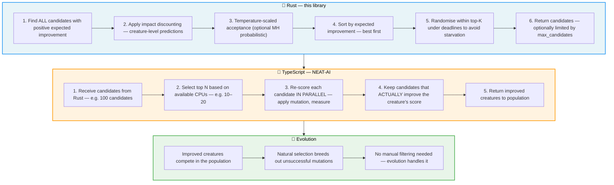
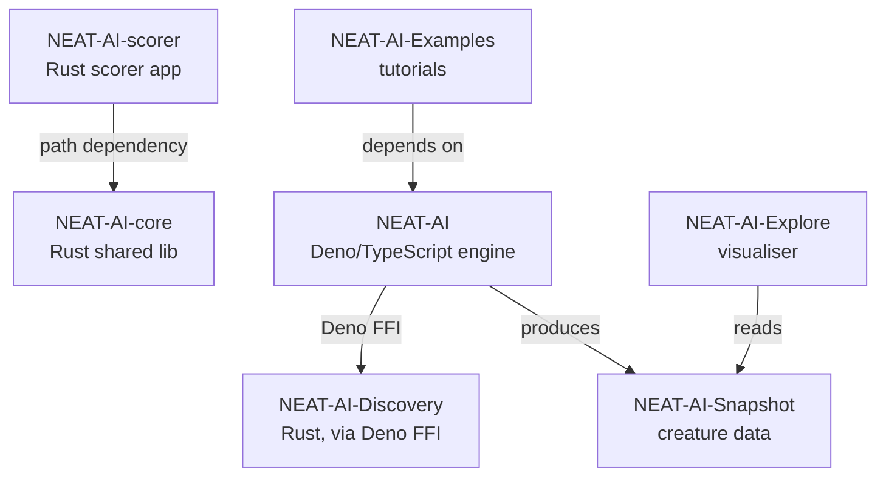

# NEAT-AI-Discovery

A high-performance Rust companion library for
[`stSoftwareAU/NEAT-AI`](https://github.com/stSoftwareAU/NEAT-AI). It records
neuron activations and errors during discovery runs, then analyses the captured
samples to recommend **mutation candidates** (add/remove/modify) that are likely
to improve the creature's score.

**Important**: This library does **not** directly "fix" a creature. It returns
candidates derived from the recorded samples. The NEAT-AI controller performs an
**ablation test** style validation step by cloning the creature, applying a
candidate (for example, disabling or removing a neuron), then re-scoring against
the **full training set**. Only candidates that measurably improve the score are
admitted back into the population, where normal NEAT evolution takes over. This
guided approach helps avoid the slow random-mutation search as creatures grow
larger.

Controllers call into the library via Deno FFI to power `Creature.discoveryDir()`
workflows.

## 🎯 Project Mission

**The sole goal of this library is to discover changes that improve the creature's
score — as fast as possible.**

Everything in this repository serves that objective:

1. **Improve the creature's score.** Only return candidates which are expected to improve the creature's score.
   Every candidate proposed by the analysis pipeline
   must have a positive expected improvement; anything else wastes the controller's
   evaluation budget.

2. **Discover improvements as fast as possible.** We leverage GPU compute shaders
   and SIMD where available so that large creatures (thousands of neurons / synapses)
   can be analysed in seconds rather than minutes. Speed matters because faster
   discovery means more generations per hour and therefore faster evolution.

3. **Minimise changes to the calling programme (NEAT-AI).** New discovery features
   should reuse existing candidate types (`addNeuron`, `removeSynapse`,
   `setBias`, `setWeight`, `coordinatedStructural`, etc.) whenever possible. If
   a new candidate type is truly required it must be documented and a corresponding
   handler added to NEAT-AI.

> **In short:** discover score-improving mutations, use GPU/SIMD to do it quickly,
> and reuse the candidate types that NEAT-AI already understands.

## ⚡ TL;DR

- **This library finds candidates, it does not "auto-fix" creatures**: NEAT-AI validates candidates by rescoring on the full training set.
- **GPU required**: discovery is skipped when no compatible GPU is available (see `check_gpu_available()`).
- **Build/install**: `./scripts/runlib.sh` (installs to `~/.cargo/lib/` with version tracking).
- **Preferred recording API**: streaming (`start_discovery_session` → `append_discovery_records` → `finish_discovery_session`) to avoid JS/V8 string limits.
- **Free FFI results**: every FFI call returning a `char*` must be freed with `free_discovery_result()`.

## 🚀 Quick Start

1. Install prerequisites (`rustup`, `cargo`, build tools, and `jq`). The
   `scripts/runlib.sh` helper will guide you if anything is missing.
2. Build and install the library:

   ```bash
   ./scripts/runlib.sh
   ```

   This script:
   - Installs Rust and Cargo if missing (no sudo required)
   - Builds the library in release mode
   - Installs it to `~/.cargo/lib/` with version tracking
   - Signs it on macOS for FFI compatibility

   **From NEAT-AI directory**, you can call this script directly:

   ```bash
   ../NEAT-AI-Discovery/scripts/runlib.sh
   ```

3. Confirm the artefact exists at `~/.cargo/lib/libneat_ai_discovery.*`.
4. **Always run the quality gate before committing** (CI treats warnings as errors):

   ```bash
   ./quality.sh
   ```

## 🔌 FFI API Summary

The library exposes a Deno FFI-friendly symbol set. The authoritative list lives in
`src/lib.rs` as `#[no_mangle] pub extern "C"` functions.

| Category | Entry Points |
|----------|-------------|
| **GPU probe** | `check_gpu_available()` |
| **Version probe** | `get_library_version()` |
| **Recording (streaming)** | `start_discovery_session`, `append_discovery_records`, `finish_discovery_session`, `cancel_discovery_session` |
| **Recording (single-call)** | `record_discovery` (avoid for large runs) |
| **Analysis** | `rank_focus_neurons`, `analyze_parallel` |
| **Utilities** | `merge_discovery_parquet`, `read_discovery_records_ffi`, `export_visualisation_snapshot` |
| **Memory usage** | `discovery_memory_usage_bytes` |
| **Memory management** | `free_discovery_result` |

For the full JSON interface specification and streaming API details, see
[docs/FFI_API.md](docs/FFI_API.md).

## 🖥️ GPU Requirement

**This library requires a GPU.** There is no CPU fallback. If no compatible GPU is
available, discovery is simply skipped — NEAT-AI continues training without the
discovery phase. This is by design:

- **Simplicity**: One code path means fewer bugs.
- **Performance**: GPU-accelerated analysis is the whole point.
- **Optional feature**: Discovery is an optimisation, not a requirement. NEAT-AI
  works fine without it.

### Minimum System Requirements

| Requirement | Minimum | Reason |
|-------------|---------|--------|
| **Total RAM** | 4 GB | GPU operations require memory for staging buffers |
| **Available RAM** | 1 GB | Prevents hangs from memory pressure/swap thrashing |
| **GPU** | Metal (macOS) or Vulkan (Linux) | Required for compute shaders |

When requirements aren't met, `check_gpu_available()` returns `gpuAvailable: false`
with a descriptive `reason` plus a structured capability verdict — `errorKind`
(`gpu_permanent`, `gpu_transient`, or `memory_exhausted`) and `retryable` — so the
caller can branch on a permanent skip versus a transient retry **before** starting
a pass (Issue #1419). NEAT-AI's evolution process continues normally — only the
discovery optimisation is skipped. There is no CPU fallback: callers must not
advertise one, since a GPU-less host would otherwise run every pass to a
guaranteed `0 candidates` result indistinguishable from genuine search exhaustion.

For GPU performance tuning, troubleshooting, and debugging, see
[docs/GPU_GUIDE.md](docs/GPU_GUIDE.md).

## 🎚️ Supported Cost Functions

NEAT-AI-Discovery is **cost-agnostic by construction** — the analysis pipeline
consumes the per-neuron residuals captured in `DiscoverRecord.errors` and never
references NEAT-AI's configured cost function by name. Every NEAT-AI built-in
cost is supported:

| Cost | Per-output residual semantics | Discovery support |
|------|--------------------------------|-------------------|
| `MSE` | linear residual (`target − output`) | ✅ reference contract |
| `MAE` | linear residual via the `|·|` chain rule | ✅ supported |
| `MAPE` | percentage residual `(target − output)/|target|` | ✅ supported (Issue #1250 gates non-linear-residual sites) |
| `MSLE` | `log(1+target) − log(1+output)` on `target ≥ 0` | ✅ supported (Issue #1250 gates non-linear-residual sites) |
| `HINGE` | `max(0, 1 − y·ŷ) · −y` — zero on margined samples | ⚠️ supported, residual sums under-report neuron error on sparse hinge errors |
| `CROSS_ENTROPY` | soft-max gradient `output − target` (linear) | ✅ supported |
| `CATEGORICAL_ERROR` | quantised misclassification flag `{0, 1}` | ⚠️ supported with degraded distribution stats (Issue #1247 hardening) |

> [!NOTE]
> 📐 Where discovery reports an "expected improvement" it is **sum-of-squared
> residual (SSE) reduction** computed from the per-neuron `errors` slot. SSE
> equals the network's loss reduction exactly only when NEAT-AI's cost is
> `MSE`; under the other six costs it is a useful ranking signal but not the
> configured loss reduction. See [docs/COST_FUNCTION_NOTES.md](docs/COST_FUNCTION_NOTES.md)
> for the per-consumer audit, the cost-agnostic invariants, and the checklist
> for adding a new cost to NEAT-AI.

## 🔬 Discovery → Evolution Pipeline

The discovery process works as follows:



**Key principle**: 🦀 Rust finds structural improvements that reduce error. 📘 TypeScript
validates by measuring actual score. 🧬 Evolution does the rest.

For detailed analysis workflow, coordinated structural discovery, discrete
activation function handling, and detection algorithms, see
[docs/ANALYSIS_DEEP_DIVE.md](docs/ANALYSIS_DEEP_DIVE.md).

## 🗺️ Discovery Scenarios

For a **visual, beginner-friendly overview** of every discovery scenario — with
diagrams, worked examples, and links to research papers — see the
[Discovery Scenarios Guide](docs/discoveries/README.md).

## 🔍 Discovery Types

The library analyses recorded neuron activations and errors to propose mutation
candidates. Detection modules are grouped by concern:

### ⚡ Activation & Neuron State

Modules that detect issues with how neurons process activations.

| Discovery Type | What It Detects | Candidate Operations |
|----------------|----------------|---------------------|
| [Saturated Neuron](docs/DISCOVERY_TYPES.md#saturated-neuron-detection) | Neurons stuck at activation bounds | `changeSquash`, `setBias` |
| [Dead Neuron](docs/DISCOVERY_TYPES.md#dead-neuron-detection) | Neurons with near-zero activation | `removeNeuron` |
| [Oscillating Neuron](docs/DISCOVERY_TYPES.md#oscillating-neuron-detection) | Neurons oscillating between ± values | `changeSquash`, `setBias` |
| [Bimodal Neuron](docs/DISCOVERY_TYPES.md#bimodal-neuron-detection) | Neurons with bimodal pre-activation distribution | `addNeuron` |
| [Restricted Range](docs/DISCOVERY_TYPES.md#restricted-range-detection) | Neurons confined to narrow activation sub-range | `changeSquash`, `setBias`, `setWeight` |
| [Operating Point](docs/DISCOVERY_TYPES.md#operating-point-analysis) | Neurons outside their activation's dynamic zone | `setBias`, `setWeight` |
| [Unbounded Capping](docs/DISCOVERY_TYPES.md#unbounded-capping-detection) | Unbounded activations producing high values | `changeSquash` |
| [Activation Mismatch](docs/DISCOVERY_TYPES.md#activation-mismatch-detection) | Poorly matched activation functions | `changeSquash`, `setBias` |
| [Monotonicity](docs/DISCOVERY_TYPES.md#monotonicity-detection) | Non-monotonic activation-error relationships | `addNeuron`, `changeSquash` |
| [Error Plateau](docs/DISCOVERY_TYPES.md#error-plateau-detection) | Output neurons in error stagnation | `changeSquash`, `setBias` |
| [Output Range Compression](docs/DISCOVERY_TYPES.md#output-range-compression-detection) | Output neurons in compressed activation sub-range | `changeSquash` |
| [Output Squash Mismatch](docs/DISCOVERY_TYPES.md#output-squash-mismatch-detection) | Output activation mismatched to target data range | `changeSquash` |
| [Activation Recommendation](docs/DISCOVERY_TYPES.md#activation-function-recommendation) | Proactive activation function matching | `changeSquash` |
| [Bias Perturbation](docs/DISCOVERY_TYPES.md#bias-perturbation-detection) | Neurons in suboptimal activation regimes | `setBias` |
| [Squash + Weight Rescale](docs/DISCOVERY_TYPES.md#squash-weight-rescale-detection) | Coordinated activation change with weight compensation | `changeSquash`, `setWeight` |
| [High Error Squash Exploration](docs/DISCOVERY_TYPES.md#high-error-squash-exploration) | High-error neurons that benefit from activation change | `changeSquash` |
| [Low-Impact Neuron](docs/DISCOVERY_TYPES.md#low-impact-neuron-detection) | Near-zero neurons between dead and meaningfully active | `removeNeuron` |

### ⚖️ Weight & Synapse

Modules that detect issues with synapse weights and connections.

| Discovery Type | What It Detects | Candidate Operations |
|----------------|----------------|---------------------|
| [Dormant Synapse](docs/DISCOVERY_TYPES.md#dormant-synapse-detection) | Synapses with near-zero weight | `removeSynapse` |
| [Opposing Synapse](docs/DISCOVERY_TYPES.md#opposing-synapse-detection) | Synapses increasing error | `removeSynapse`, `setWeight` |
| [Weight Coherence](docs/DISCOVERY_TYPES.md#weight-coherence-detection) | Incoherent weight ratios and cancellation | `setWeight`, `removeSynapse` |
| [Weight Magnitude Reset](docs/DISCOVERY_TYPES.md#weight-magnitude-reset-detection) | Synapses stuck in local weight minima | `setWeight` |
| [Weight Polarity Flip](docs/DISCOVERY_TYPES.md#weight-polarity-flip-detection) | Gradient–weight sign disagreement | `setWeight` |
| [Noise-to-Signal](docs/DISCOVERY_TYPES.md#noise-to-signal-ratio-detection) | High noise-to-signal neurons and synapses | `removeNeuron`, `removeSynapse`, `setWeight` |
| [Fan-in Polarity Conflict](docs/DISCOVERY_TYPES.md#fan-in-polarity-conflict-detection) | Conflicting positive/negative incoming weights | `addNeuron`, `addSynapse` |
| [Gradient Discovery](docs/DISCOVERY_TYPES.md#gradient-based-synapse-adjustment) | Gradient-directed weight adjustments | `setWeight` |
| [Compound Degradation](docs/DISCOVERY_TYPES.md#compound-degradation-detection) | Coordinated bias+weight degradation | `coordinatedStructural` |

### 🏗️ Structural & Topology

Modules that detect structural and topological issues in the network.

| Discovery Type | What It Detects | Candidate Operations |
|----------------|----------------|---------------------|
| [Bottleneck Neuron](docs/DISCOVERY_TYPES.md#bottleneck-neuron-detection) | Information bottlenecks (high fan-in) | `addNeuron`, `addSynapse` |
| [Correlated Error](docs/DISCOVERY_TYPES.md#correlated-error-pattern-detection) | Outputs with shared error patterns | `addNeuron`, `addSynapse` |
| [Redundant Path](docs/DISCOVERY_TYPES.md#redundant-path-pruning) | Duplicate paths to same target | `removeSynapse`, `setWeight` |
| [Topology Structure](docs/DISCOVERY_TYPES.md#topology-aware-structure-analysis) | Long paths and connectivity imbalance | `addSynapse` |
| [Topology Diversification](docs/DISCOVERY_TYPES.md#topology-diversification-detection) | Overly simple network topology | `addNeuron` |
| [Skip Connection](docs/DISCOVERY_TYPES.md#skip-connection-detection) | Deep neurons with attenuated gradients | `addSynapse` |
| [Symmetry Breaking](docs/DISCOVERY_TYPES.md#symmetry-breaking-detection) | Near-identical weight configurations | `setBias`, `setWeight`, `changeSquash` |
| [Co-Adaptation](docs/DISCOVERY_TYPES.md#co-adaptation-detection) | Redundant neuron pairs with correlated activations | `removeNeuron`, `setWeight` |
| [Output Conflict](docs/DISCOVERY_TYPES.md#output-conflict-detection) | Hidden neurons with conflicting per-output contributions | `addSynapse`, `addNeuron` |
| [Hard Sample Cluster](docs/DISCOVERY_TYPES.md#hard-sample-cluster-detection) | Observation groups consistently high-error | `addNeuron`, `addSynapse` |
| [Multi-Hop](docs/DISCOVERY_TYPES.md#multi-hop-candidate-analysis) | Deeper structural improvements | `addNeuron`, `addSynapse` |
| [Epistatic Pairs](docs/DISCOVERY_TYPES.md#combo-successful) | Complementary neuron pair interactions | `addSynapse` |
| [Fan-in Candidates](docs/DISCOVERY_TYPES.md#fan-in-candidates) | Correlated input pairs converging to hidden neuron | `coordinatedStructural` |
| [Cross-Detection Synthesis](docs/DISCOVERY_TYPES.md#cross-detection-synthesis) | Combined remediation for multi-flagged neurons | `coordinatedStructural` |

### 📊 Range & Input Analysis

Modules that analyse input ranges and gating.

| Discovery Type | What It Detects | Candidate Operations |
|----------------|----------------|---------------------|
| [Bounded Range](docs/DISCOVERY_TYPES.md#bounded-range-detection) | Sentinel value clusters at input boundaries | `addNeuron`, `addSynapse` |
| [Sentinel Gating](docs/DISCOVERY_TYPES.md#sentinel-gating-detection) | Inputs where sentinel values degrade performance | `addNeuron`, `addSynapse` |
| [Observation Utilisation](docs/DISCOVERY_TYPES.md#observation-utilisation-detection) | Underutilised inputs with low effective range | `addNeuron`, `addSynapse` |
| [Input Sensitivity](docs/DISCOVERY_TYPES.md#input-sensitivity-detection) | Excessive input leverage and threshold effects | `setWeight`, `addNeuron`, `setBias` |

### 🏆 Scoring & Recommendation

Modules that score candidate quality and proactively recommend changes.

| Discovery Type | What It Detects | Candidate Operations |
|----------------|----------------|---------------------|
| [Output Bias Drift](docs/DISCOVERY_TYPES.md#output-bias-drift-detection) | Output neurons with systematic bias | `setBias` |
| [Sample-Weighted](docs/DISCOVERY_TYPES.md#sample-weighted-discovery) | High-error samples needing targeted attention | `setBias` |
| [Add Neurons](docs/DISCOVERY_TYPES.md#add-neurons) | Beneficial intermediate neurons | `addNeuron` |
| [Add Synapses](docs/DISCOVERY_TYPES.md#add-synapses) | Beneficial direct connections | `addSynapse` |
| [Remove Low-Impact](docs/DISCOVERY_TYPES.md#remove-low-impact-neurons) | Neurons below cost of growth | `removeNeuron` |
| [Batch-Successful Grouping](docs/DISCOVERY_TYPES.md#batch-successful-grouping) | High-confidence candidates grouped for batch testing | `coordinatedStructural` |

For detection criteria, recommended actions, output format, and production
success rates, see [docs/DISCOVERY_TYPES.md](docs/DISCOVERY_TYPES.md).

For impact calculation details, see
[docs/IMPACT_CALCULATION.md](docs/IMPACT_CALCULATION.md).

## 🎯 Focus Selection

Discovery cannot evaluate *every* neuron within a run's budget, so each run
**focuses** on a small set (about half a dozen, ~6) of selectable neurons. That
focus list started as a *random* pick, moved to an **impact-weighted ranking**
(`rank_focus_neurons*`, `src/focus/`) that scores neurons by their estimated
effect on the output error, and now runs under a **wall-clock budget**
(`NEAT_AI_DISCOVERY_FOCUS_RANKING_BUDGET_MS`, default 120 s). On budget overrun
the crate returns a retryable `Timeout` and the caller falls back to an instant,
**error-guided** local ranking (not a literal random pick).

The full design — rationale, history, performance guard, fallback semantics, and
env knobs — is documented end-to-end in
[docs/FOCUS_SELECTION.md](docs/FOCUS_SELECTION.md).

## ⚙️ Configuration

### 🔧 Environment Variables

| Variable | Default | Description |
|----------|---------|-------------|
| `NEAT_AI_DISCOVERY_LIB_PATH` | `~/.cargo/lib/` | Path to the compiled library |
| `RUST_LOG` | `warn` | Control structured log level (e.g. `neat_ai_discovery=info`) |
| `NEAT_AI_DISCOVERY_VERBOSE` | off | Enable verbose logging |
| `NEAT_AI_DISCOVERY_GPU_BATCH_SIZE` | auto | GPU batch size (64–4096) |
| `NEAT_AI_DISCOVERY_GPU_TIMING` | off | Enable GPU kernel profiling |
| `NEAT_AI_DISCOVERY_QUIET_GPU` | off | Suppress Mesa/libEGL debug output |
| `NEAT_AI_DISCOVERY_MAX_CACHED_BLOCKS` | adaptive | Streaming parquet block cache limit |
| `NEAT_AI_DISCOVERY_PREFETCH_DEPTH` | 2 | Streaming prefetch depth |
| `NEAT_AI_DISCOVERY_PRELOAD_ALL` | off | Force full parquet preload |
| `NEAT_AI_DISCOVERY_BLOCK_SIZE` | 10000 | Streaming block size in records |
| `NEAT_AI_DISCOVERY_OUTLIER_ANALYSIS` | off | Enable outlier-focused analysis |
| `NEAT_AI_DISCOVERY_OUTLIER_PERCENTILE` | 90 | Outlier identification threshold |
| `NEAT_AI_DISCOVERY_NEURON_TARGETS_OUTPUT_ONLY` | off | Force output-only focus targets |
| `NEAT_AI_DISCOVERY_SOURCE_INPUT_INDEX_BIAS` | off | Bias toward newer input indices |
| `NEAT_AI_DISCOVERY_FOCUS_UNUSED_OBSERVATIONS` | off | Prioritise unused input neurons |
| `NEAT_AI_DISCOVERY_CONSTANT_SOURCE_EFFECT_THRESHOLD` | dynamic | Constant-source folding threshold |
| `NEAT_AI_DISCOVERY_MH_TEMPERATURE` | off | Metropolis-Hastings temperature for probabilistic acceptance |
| `NEAT_AI_DISCOVERY_BATCH_SUCCESSFUL` | off | Re-enable disabled batch-successful module (Issue #1059) |
| `NEAT_AI_DISCOVERY_FOCUS_RANKING_MEMORY_BUDGET_MB` | unset | Cap focus-ranking eager pre-load size in MB; lazy mode + structured `info` log when projected size (file × 3) exceeds the budget (Issue #1172) |
| `NEAT_AI_DISCOVERY_FOCUS_RANKING_BUDGET_MS` | 120000 | Wall-clock budget for focus ranking; a run that exceeds it aborts with a structured `Timeout` error so the caller falls back to local ranking. `0` disables the bound; other values clamp to `[1000, 3600000]` (Issue #1375) |
| `NEAT_AI_DISCOVERY_FOCUS_RANKING_PERF_CLIFF_MS` | 60000 | Perf-cliff threshold for a *lazy* focus-ranking pass; a lazy pass at or above this emits one explicit perf-cliff `WARN` naming the neuron count and projected dataset size. Preload never trips it. `0` disables the warning (Issue #1377) |
| `NEAT_AI_DISCOVERY_ANALYSIS_RESERVE_MS` | 60000 | Guaranteed minimum window (ms) reserved for synapse/neuron analysis so focus selection + parquet loading cannot starve it (Issue #1408). Parquet loading is curtailed at `deadline − reserve`; if less than 1s would remain, `analyze_all` fails fast with an actionable error instead of analysing 0/N targets. `0` disables the reserve; other values clamp to `[1, 3600000]` |
| `NEAT_AI_DISCOVERY_ANALYSIS_RESERVE_FRACTION` | 0.5 | Fraction of the remaining discovery window the reserve may claim (Issue #1408). Effective reserve = `min(ANALYSIS_RESERVE_MS, remaining × fraction)`, so tight budgets are split rather than starving loading. Honoured in `(0.0, 0.9]`; invalid values fall back to `0.5` |
| `NEAT_AI_DISCOVERY_WATCHDOG_STALL_SECS` | off | Stall watchdog timeout |
| `NEAT_AI_DISCOVERY_WATCHDOG_ABORT_DELAY_SECS` | 2 | Delay between dump and abort |
| `NEAT_AI_DISCOVERY_DROUGHT_RESET_AFTER_EPOCHS` | unset | Operator escape hatch: force a one-shot reset of failed-candidate cache entries and active target cooldowns after this many consecutive empty discovery passes (Issue #1205). |
| `NEAT_AI_DISCOVERY_MIN_AVAILABLE_MEMORY_GB` | 0.5 macOS / 1.0 Linux | Minimum available memory (GB) below which discovery is gated off (Issue #1420). Lower it (e.g. `0.1`) so a small-but-capable ~8GB host — where the discovery runtime itself already holds most of the RAM — can proceed; `0` disables the available-memory gate. Invalid / out-of-range (`0.0–64.0`) values fall back to the platform default. The 4GB total-memory minimum is unaffected. |

## 🛠️ Troubleshooting

| Problem | Solution |
|---------|----------|
| **Library not found** | Check artefact path, file extension (`.dylib` / `.so`), and `NEAT_AI_DISCOVERY_LIB_PATH` |
| **FFI permission errors** | Launch with `--allow-ffi --allow-env --allow-read --allow-write` |
| **Empty Parquet output** | Confirm caller supplies sampled discovery dataset with aligned observations, activations, and errors |
| **GPU not available** | Check system meets minimum requirements; on Linux check `/dev/dri` permissions |
| **`Memory check failed — discovery disabled` on a capable host** | On an ~8GB host the discovery runtime can hold most of the RAM, leaving free memory below the default floor (0.5GB macOS / 1.0GB Linux) every pass. Lower the floor with `NEAT_AI_DISCOVERY_MIN_AVAILABLE_MEMORY_GB=0.1` (or `0` to disable the gate). If the host is genuinely too small, exclude it at the scheduler rather than aborting every pass (Issue #1420). |
| **Out of memory (exit 137)** | Reduce `--max-old-space-size`; see [docs/GPU_GUIDE.md](docs/GPU_GUIDE.md) |
| **Analysis timeout** | Expected under deadlines; coverage improves over repeated runs |
| **Synapse/neuron starvation** | Grep logs for `GRQ-23` to see the per-cycle deadline-consumption breakdown, and `STARVED` for the curtailed-phase warning with skipped/total counts; the `starved` flag on `synapseMetadata`/`neuronMetadata` exposes the same signal programmatically |
| **GPU timeout errors** | Reduce `NEAT_AI_DISCOVERY_GPU_BATCH_SIZE`; restart if GPU driver hung |
| **Low GPU utilisation** | Often CPU-bound sample building; see [docs/GPU_GUIDE.md](docs/GPU_GUIDE.md) |
| **Deadlock or stuck** | Send `kill -USR1 <pid>` for thread dump; see [docs/GPU_GUIDE.md](docs/GPU_GUIDE.md) |

For detailed troubleshooting steps, see [docs/GPU_GUIDE.md](docs/GPU_GUIDE.md).

## 🔗 Using the Library with NEAT-AI

1. Place the compiled artefact where Deno can load it:
   - Copy `libneat_ai_discovery.*` into `~/.cargo/lib`, **or**
   - Export `NEAT_AI_DISCOVERY_LIB_PATH=/absolute/path/to/libneat_ai_discovery.*`.
2. Grant FFI permissions when running discovery jobs:
   ```bash
   deno run --allow-env --allow-ffi --allow-read your-script.ts
   ```
3. From your controller, guard calls with `isRustDiscoveryEnabled()` so the job
   fails fast if the module cannot be loaded.
4. Follow the end-to-end discovery orchestration documented in the
   [`DiscoveryDir` guide](https://github.com/stSoftwareAU/NEAT-AI/blob/main/docs/DiscoveryDir.md).

### Verifying the Installation

Use the NEAT-AI helper script after copying the library:

```bash
cd /path/to/NEAT-AI
./scripts/check_discovery.ts
```

If the script reports that discovery is enabled, you are ready to schedule
`Creature.discoveryDir()` jobs against your sampled datasets.

## 💻 Development

For prerequisites, building, testing, code style, and the full development
workflow, see [CONTRIBUTING.md](CONTRIBUTING.md).

> **For AI agents**: Machine-readable coding conventions and invariants live in
> [AGENTS.md](AGENTS.md).

**Quick reference:**

```bash
# Build and install
./scripts/runlib.sh

# Quality gate (run before every commit)
./quality.sh

# Run all tests
cargo test --lib --tests --all-features -- --test-threads=2

# Run benchmarks
cargo bench --bench <bench_name>

# Check documentation builds without warnings
./scripts/doc-check.sh

# Run fuzz tests (requires nightly toolchain and cargo-fuzz)
./scripts/fuzz-ci.sh            # 30s per target (default)
./scripts/fuzz-ci.sh 60         # 60s per target
```

### 🔀 Fuzz Testing

The `fuzz/` directory contains [cargo-fuzz](https://rust-fuzz.github.io/book/cargo-fuzz.html)
targets that exercise the FFI JSON boundary with arbitrary inputs. This helps
catch panics from malformed, truncated, or adversarial JSON before they reach
production.

**Prerequisites:**

```bash
# Install cargo-fuzz (one-time setup)
cargo install cargo-fuzz

# Ensure the nightly toolchain is available
rustup toolchain install nightly
```

**Available targets:**

| Target | Description |
|--------|-------------|
| `fuzz_ffi_deserialisation` | Fuzzes `serde_json::from_str` for all FFI input types |
| `fuzz_ffi_entry_points` | Fuzzes the `*_internal` business-logic functions |

**Running:**

```bash
# Run all fuzz targets via the CI helper script (30s each by default)
./scripts/fuzz-ci.sh

# Run with a custom duration (60s per target)
./scripts/fuzz-ci.sh 60

# Run a specific target directly
cargo +nightly fuzz run fuzz_ffi_deserialisation -- -max_total_time=60

# Run with a maximum input length of 4096 bytes
cargo +nightly fuzz run fuzz_ffi_entry_points -- -max_total_time=60 -max_len=4096

# List all available fuzz targets
cargo +nightly fuzz list
```

Crash-reproducing inputs (if any) are saved to `fuzz/artifacts/`. The fuzzer
corpus is stored in `fuzz/corpus/` and grows over successive runs.

## 💡 Why Use This Library?

- **Production-ready discovery** — Handles millions of observations without the
  memory blow-outs that limit the TypeScript implementation.
- **Single-file artefacts** — Writes per-run Parquet files so results are easy to
  transfer, archive, or inspect with standard tooling.
- **Drop-in for NEAT-AI** — Exposes the `libneat_ai_discovery` symbol set expected
  by the TypeScript bindings in `NEAT-AI`.

<details>
<summary>Original project brief and scale targets (kept for contributors)</summary>

### Goal

Record neuron activations and errors during the discovery training phase, then scan
this recorded data to identify **high-quality mutation candidates** that are expected
to improve the creature's score — using GPU/SIMD acceleration.

### Problem Statement

The current DenoJS implementation requires extreme filtering of the training
data (millions of records) to make discovery work in reasonable time. This Rust
library solves the performance/memory problems while maintaining the same
functional behaviour.

**Target Scale:**
- Training records: Millions
- Observations per record: 1,486 (float32 values)
- Neurons: 447
- Synapses: 16,012

### Performance Requirements

- Must handle millions of training records efficiently without memory issues
- Must process significantly more data than DenoJS can handle
- Must be significantly faster than the TypeScript implementation
- Must use minimal memory (avoid loading all data into memory at once)

### Features

- Record neuron activations and errors during discovery training phase
- Single Parquet file format (eliminates many-small-files problem)
- Columnar format excellent for filtering by neuron during analysis
- Viewable with standard tools for debugging
- Cross-platform support (macOS, Ubuntu, AWS Linux)

</details>

## 🌏 Cross-Platform Support

The library must work on:
- **macOS** (primary target)
- Ubuntu
- AWS Linux (x86_64 and ARM64)

All dependencies build automatically on remote, unattended machines.

## 📦 Distributed Build & Versioning

- Versions are managed in `Cargo.toml` and automatically incremented by CI when
  `src/` changes are detected.
- Local and remote runs use a distributed build pattern via `scripts/runlib.sh`:
  the library is installed to `~/.cargo/lib/` and tracked with a version marker at
  `~/.cargo/lib/.neat_ai_discovery.version`.
- Do not manually edit version numbers; CI handles patch bumps.

## 🔗 Related Repositories

The NEAT-AI project is split across seven public repositories. Each focuses on one concern and composes with the others as shown below. This repository is **NEAT-AI-Discovery**.

| Repository | Role |
|------------|------|
| [NEAT-AI](https://github.com/stSoftwareAU/NEAT-AI) | Primary Deno/TypeScript neural-network engine (evolution, training, WASM activation). |
| [NEAT-AI-core](https://github.com/stSoftwareAU/NEAT-AI-core) | Shared native Rust library (`neat-core`) with numerics, topology helpers, and the chunked `.bin` training stream. |
| [NEAT-AI-Discovery](https://github.com/stSoftwareAU/NEAT-AI-Discovery) | Rust discovery module invoked by NEAT-AI via Deno FFI to search architectures and hyper-parameters. |
| [NEAT-AI-Snapshot](https://github.com/stSoftwareAU/NEAT-AI-Snapshot) | Creature/genome snapshot format and fixtures produced by NEAT-AI and consumed by downstream tools. |
| [NEAT-AI-scorer](https://github.com/stSoftwareAU/NEAT-AI-scorer) | Production forward-only scoring application built on `neat-core` via a path dependency. |
| [NEAT-AI-Explore](https://github.com/stSoftwareAU/NEAT-AI-Explore) | Visualiser for creatures that reads NEAT-AI-Snapshot data. |
| [NEAT-AI-Examples](https://github.com/stSoftwareAU/NEAT-AI-Examples) | Worked examples and tutorials that depend on NEAT-AI. |

### Dependency graph



## 📚 Additional Documentation

| Document | Description |
|----------|-------------|
| [docs/discoveries/](docs/discoveries/README.md) | Visual discovery scenario guides with diagrams and examples |
| [CONTRIBUTING.md](CONTRIBUTING.md) | Development guidelines for contributors |
| [CHANGELOG.md](CHANGELOG.md) | Version-by-version history of changes |
| [AGENTS.md](AGENTS.md) | Coding guidelines and invariants for AI agents |
| [docs/DISCOVERY_TYPES.md](docs/DISCOVERY_TYPES.md) | All discovery types with success/failure rates |
| [docs/IMPACT_CALCULATION.md](docs/IMPACT_CALCULATION.md) | Neuron impact calculation details |
| [docs/FOCUS_SELECTION.md](docs/FOCUS_SELECTION.md) | Focus-selection design end-to-end: why ~6 neurons, random → impact-weighted ranking, the wall-clock budget guard, and the error-guided fallback |
| [docs/ANALYSIS_DEEP_DIVE.md](docs/ANALYSIS_DEEP_DIVE.md) | Detailed analysis workflow and detection algorithms |
| [docs/GPU_GUIDE.md](docs/GPU_GUIDE.md) | GPU performance tuning, troubleshooting, and debugging |
| [docs/FFI_API.md](docs/FFI_API.md) | Full FFI API reference and JSON interface |
| [docs/COST_FUNCTION_NOTES.md](docs/COST_FUNCTION_NOTES.md) | Cost-agnostic invariants, per-cost behaviour catalogue, and per-consumer audit |
| [docs/STREAMING_GUIDE.md](docs/STREAMING_GUIDE.md) | Step-by-step streaming recording API guide with TypeScript examples |
| [docs/CACHE_TUNING.md](docs/CACHE_TUNING.md) | Cache tier tuning, diagnostics, and example configurations |
| [docs/BENCHMARKS.md](docs/BENCHMARKS.md) | Benchmark regression tracking and comparison workflow |
| [docs/CANDIDATE_PIPELINE_MCMC_AUDIT.md](docs/CANDIDATE_PIPELINE_MCMC_AUDIT.md) | MCMC applicability audit for candidate selection pipeline |
| [docs/DROUGHT_PLAYBOOK.md](docs/DROUGHT_PLAYBOOK.md) | Operator playbook for diagnosing "no successful candidates" droughts (suppression layers, regimes, env vars) |
| [CodeWiki](https://codewiki.google/github.com/stsoftwareau/neat-ai-discovery) | AI-powered documentation and code exploration |

## 📄 Licence

This project is licensed under the terms of the Apache License 2.0. For the full
license text, please see [LICENSE](./LICENSE).
