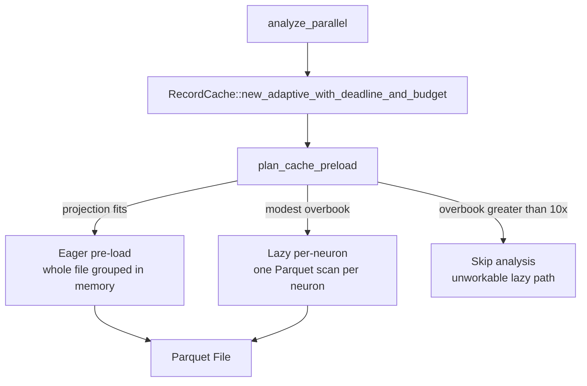

# Cache Tuning Guide

This guide explains how the record cache works during the analysis phase, how
to tune it for your deployment, and how to diagnose cache-related performance
issues.

For the streaming recording API (which writes the Parquet files that the cache
reads), see [STREAMING_GUIDE.md](STREAMING_GUIDE.md).

> **Scope (Issue #1987).** Everything above the appendix describes the code path
> `analyze_parallel` actually runs. The three-tier cache (LRU, compressed LRU,
> block streaming) and the four `NEAT_AI_DISCOVERY_*` streaming knobs are
> **constructed only by tests and benches** — they are kept in
> [the appendix](#appendix--tiered-cache-test-and-bench-only) so nobody tunes
> them during an incident and watches nothing happen.

---

## Overview

After recording, the analysis phase loads neuron records from a Parquet file.
The record cache sits between the analysis engine and the Parquet file. It
chooses once when the cache is built:



| | Eager pre-load | Lazy per-neuron | Skip (unworkable) |
|---|---|---|---|
| **Speed** | Fastest — all data in memory | Slower — one Parquet scan per neuron | Immediate return |
| **Memory** | Highest — whole dataset resident | Minimal — one neuron's records at a time | None |
| **I/O** | Single bulk read at startup | On-demand per `get(neuron_uuid)` | None |
| **Log line** | `pre-loaded neurons from parquet` (verbose only) | `using lazy-loading mode for parquet file` | `skipping analysis as unworkable` |

---

## Cache Modes

### Eager pre-load

The whole Parquet file is decoded in one pass and grouped by neuron UUID.
Each group is `Arc`-shared, so subsequent `get(neuron_uuid)` calls return the
`Arc` with no I/O. The decode reuses the grouped result the focus-selection
phase produced for the same file this cycle (Issue #1406), so no second scan
occurs on a cache hit.

The decode itself is bounded: every materialised record is charged against the
caller's `max_analysis_memory_mb`, so a file that decodes far larger than its
compressed size projected aborts part-way with a typed memory-exhaustion error
rather than exhausting the host (Issue #1869).

### Lazy per-neuron

Records are loaded on demand, one neuron per Parquet scan, and memoised in the
cache as they arrive. This is the memory-constrained fallback for a **modest**
overbook. Its per-neuron loads poll the shared analysis deadline (Issue #2013)
and emit a periodic INFO heartbeat every 60 s, so a legitimately slow lazy pass
is curtailed rather than hanging in silence past the host's logical stop.

### Skip unworkable (Issue #2013)

When the projected pre-load exceeds the supplied budget by more than 10×
(e.g. 85 GB projected against a 4 GB budget), lazy mode cannot finish inside
the step budget. The phase is skipped with a structured WARN
(`reason="unworkable"`) instead of entering that path.

---

## Preload Decision Logic

The decision is made by `plan_cache_preload` (`src/analysis/cache/mod.rs`) from a
projected decoded size and a single bound. Since Issue #1869 the projection is
read from the Parquet **footer** — the exact decompressed row count and error
value count — with the old `file_size × 3` compression heuristic kept only as a
floor, because dictionary and RLE encodings routinely beat 3:1 on this schema.

```text
projected = max(footer_rows × per_record_bytes + error_values × 4,
                file_size_bytes × 3)

if max_analysis_memory_mb was supplied:
    budget is first clamped to host-reported total memory
    projected <= clamped_budget               → eager pre-load
      (unless available − margin cannot hold it → lazy, reason = "memory_pressure")
    projected <= clamped_budget × 10         → lazy   (reason = "budget")
    projected >  clamped_budget × 10          → skip   (reason = "unworkable")

else:
    projected <= available − margin → eager pre-load
    otherwise                       → lazy   (reason = "no_budget")
```

`available` is the corrected OS-available accounting from `get_memory_info`
(Issue #3173) and `margin` is
`NEAT_AI_DISCOVERY_FOCUS_RANKING_MEMORY_MARGIN_MB` — the **same** primitive
focus ranking uses, so both phases treat a host identically (Issue #3176). The
old divergent 50%-of-total-RAM cap is gone (Issue #3170).

The projection remains an estimate. The enforced bound is the cumulative decode
budget the reader charges per record (see
`NEAT_AI_DISCOVERY_MAX_PARQUET_DECODE_MB` in
[CONFIGURATION.md](CONFIGURATION.md)), which aborts a decode mid-flight rather
than discovering the overrun afterwards.

### Examples

Projections use the `file_size × 3` floor; a footer-derived projection may be
larger. Margin is the 1 GB default.

| File size | Budget | Available RAM | Projected | Mode |
|-----------|--------|---------------|-----------|------|
| 10 MB | unset | 8 GB | 30 MB | Eager pre-load |
| 500 MB | unset | 8 GB | 1.5 GB | Eager pre-load |
| 500 MB | 1024 MB | 8 GB | 1.5 GB | Lazy (`budget`) |
| 4 GB | unset | 8 GB | 12 GB | Lazy (`no_budget`) |
| 100 MB | unset | 1 GB | 300 MB | Lazy (`no_budget`) |

---

## Operator Levers That Reach the Analysis Cache

Only three levers change what the analysis cache does. All are documented in the
single authoritative reference,
[docs/CONFIGURATION.md](CONFIGURATION.md).

| Lever | Where set | Effect on the cache |
|-------|-----------|---------------------|
| `max_analysis_memory_mb` | `analyze_parallel` input JSON | The budget the projection is compared against. Lower it to force lazy mode; raise it to permit eager pre-load. |
| `NEAT_AI_DISCOVERY_FOCUS_RANKING_MEMORY_MARGIN_MB` | environment | Safety margin reserved from OS-available memory on the auto-detect path. Raise it to bias towards lazy. |
| `NEAT_AI_DISCOVERY_MAX_PARQUET_DECODE_MB` | environment | Hard ceiling on records decoded from one file, charged inside the reader's batch loop. Bounds the paths that carry no caller budget, including the streaming block loader (Issue #2005). |

### Levers that do **not** reach it

`NEAT_AI_DISCOVERY_PRELOAD_ALL`, `NEAT_AI_DISCOVERY_MAX_CACHED_BLOCKS`,
`NEAT_AI_DISCOVERY_PREFETCH_DEPTH` and `NEAT_AI_DISCOVERY_BLOCK_SIZE` are parsed
correctly but are never consumed by `analyze_parallel` — they configure the
tiered/streaming caches in [the appendix](#appendix--tiered-cache-test-and-bench-only).
Their reach is recorded in
[docs/CONFIGURATION.md § Streaming & Parquet](CONFIGURATION.md#streaming--parquet).
Setting them during an incident changes nothing; use the three levers above
instead.

---

## How `max_analysis_memory_mb` Interacts with Cache Selection

`max_analysis_memory_mb` sets a memory budget for the entire analysis phase, and
it is also the bound the cache pre-load decision uses (Issue #3176). The
interaction is:

1. **The pre-load mode is chosen** by comparing the projection against the
   budget, or — when no budget is supplied — against OS-available memory minus
   the margin.
2. **The decode is charged against the budget** record by record, so an
   under-projected file aborts mid-decode.
3. **The budget is re-checked** before GPU work submission and after Parquet
   loading.
4. **If the budget is exceeded**, analysis returns early with
   `memory_budget_exceeded: true` and whatever candidates have been found so
   far.

### Practical guidance

- **If analysis frequently hits the memory budget**, consider reducing the
  Parquet file size (record fewer training samples) or increasing the budget.
- **Lowering `max_analysis_memory_mb` forces lazy mode**, which is slower but
  survives on a constrained host — this is the intended trade.
- **On memory-constrained systems** (e.g. 4 GB RAM), set
  `max_analysis_memory_mb` to 50–75% of available RAM to leave headroom for
  V8 and the OS.

---

## Diagnosing Cache-Related Performance Issues

### Symptom: Analysis is slow despite having enough RAM

**Possible cause:** The cache fell back to lazy per-neuron loading.

**Diagnosis:**

1. Enable verbose logging: `NEAT_AI_DISCOVERY_VERBOSE=1`
2. Look for either of the two lines the lazy path emits:
   - the structured WARN `insufficient memory for pre-loading` — it carries
     `reason` (`budget`, `no_budget`, or `memory_pressure`), `projected_mb`, `budget_mb`,
     `available_mb` and `margin_mb`, so the trade-off is visible at the decision
     point;
   - the INFO line `using lazy-loading mode for parquet file`.
3. Compare the logged `projected_mb` against `budget_mb` / `available_mb` to see
   which bound was hit.

**Fix:** If `reason` is `budget`, raise `max_analysis_memory_mb`. If it is
`no_budget`, forward the caller budget as `maxAnalysisMemoryMb`. If it is
`memory_pressure`, free memory or lower
`NEAT_AI_DISCOVERY_FOCUS_RANKING_MEMORY_MARGIN_MB`.

### Symptom: Out of memory (exit code 137 / OOM killer)

**Possible cause:** Eager pre-load was chosen for a dataset that decodes larger
than projected, or the memory budget was set too high.

**Diagnosis:**

1. Check the Parquet file size: `ls -lh discovery_data.parquet`
2. Estimate the expanded size — the footer-derived projection, floored at
   `file_size × 3` (Issue #1869)
3. Compare against available RAM: `free -h` (Linux) or Activity Monitor (macOS)

**Fix:**

- Reduce the number of training samples recorded.
- Lower `max_analysis_memory_mb` to cap Rust-side memory usage and push the
  decision towards lazy mode.
- Lower `NEAT_AI_DISCOVERY_MAX_PARQUET_DECODE_MB` so an under-projected file
  aborts sooner.
- Ensure other processes are not consuming excessive memory.

### Symptom: Analysis returns `memory_budget_exceeded: true`

**Possible cause:** The memory budget in `max_analysis_memory_mb` is too low
for the dataset size.

**Diagnosis:**

1. Check the `memory_budget_exceeded` field in the analysis output.
2. Use `discovery_memory_usage_bytes()` to monitor Rust-side memory usage
   during analysis.

**Fix:**

- Increase `max_analysis_memory_mb`.
- Reduce the number of training samples.
- Analysis returns partial results when the budget is exceeded — coverage
  improves over repeated runs.

### Symptom: Parquet file is missing or analysis fails to load records

**Possible cause:** The Parquet file was deleted while analysis was still
reading from it.

**Diagnosis:**

1. Check whether `is_analysis_active()` returns `1` — if so, analysis is
   still in flight.
2. On Unix, deleting the file path while a handle is open does not destroy
   the data (the inode stays alive). However, recreation at the same path
   will not contain the original data.

**Fix:**

- Follow the recommended shutdown sequence documented in
  [docs/FFI_API.md](FFI_API.md#analysis-lifecycle-guard-issue-1048) — cancel, wait
  for the FFI call to return, poll `is_analysis_active()` until idle, then delete
  the temp directory.

---

## Example Configurations

### Development (macOS, 16 GB RAM)

No configuration needed. The defaults work well: the projection fits available
memory for small-to-medium datasets, so eager pre-load is chosen.

### Production Server (Linux, 8 GB RAM, shared with NEAT-AI)

```bash
# Cap Rust-side memory at 4 GB (leave 4 GB for V8 and the OS).
# Set via analyze_parallel input: max_analysis_memory_mb: 4096
#
# A projection above 4 GB then falls back to lazy per-neuron loading with a
# WARN naming reason=budget.
```

### Memory-Constrained (4 GB RAM)

```bash
# Conservative memory budget — biases the cache towards lazy mode.
# Set via analyze_parallel input: max_analysis_memory_mb: 2048

# Abort an under-projected decode sooner rather than exhausting the host.
export NEAT_AI_DISCOVERY_MAX_PARQUET_DECODE_MB=1536
```

### Large Dataset (multi-GB Parquet files)

```bash
# Nothing to set. A projection that exceeds the budget (or OS-available memory
# minus the margin) selects lazy per-neuron loading automatically.

# Reserve more headroom on a busy host so eager pre-load is not attempted.
export NEAT_AI_DISCOVERY_FOCUS_RANKING_MEMORY_MARGIN_MB=2048
```

---

## Appendix — Tiered Cache (test and bench only)

**Nothing in this appendix runs in production.** `RecordCache::new_tiered` has
no caller in `src/`; `TieredRecordCache`, `LruRecordCache`,
`CompressedLruRecordCache` and `StreamingRecordCache` are constructed only by
the test suite and by `benches/`. The four streaming environment variables
configure these types alone. It is documented here because the code is still
compiled and benchmarked — not because it is a tuning surface (Issue #1987).

The tiered cache selects one of three strategies from the file size and
available system memory, via `select_loading_strategy`:

```text
estimated_expanded = file_size_bytes × 3

if estimated_expanded < available_memory / 4:
    → PreloadAll

elif estimated_expanded < available_memory:
    → LruCache (capacity = available_memory / 2)

else:
    → Streaming
```

| File Size | Available RAM | Estimated Expanded | Strategy |
|-----------|---------------|-------------------|----------|
| 10 MB | 8 GB | 30 MB | PreloadAll |
| 500 MB | 8 GB | 1.5 GB | PreloadAll |
| 1 GB | 8 GB | 3 GB | LruCache |
| 4 GB | 8 GB | 12 GB | Streaming |
| 100 MB | 1 GB | 300 MB | LruCache |
| 500 MB | 1 GB | 1.5 GB | Streaming |

- **`LruRecordCache`** keeps hot neurons in a bounded pool and evicts the
  least-recently-used entry when the pool is full.
- **`CompressedLruRecordCache`** compresses records with LZ4 before caching.
  Nothing selects it automatically; construct it explicitly.
- **`StreamingRecordCache`** loads Parquet row groups as fixed-size blocks with
  LRU block eviction and background prefetch. Its sole in-tree construction site
  passes `None, None`, so `NEAT_AI_DISCOVERY_PREFETCH_DEPTH` and
  `NEAT_AI_DISCOVERY_MAX_CACHED_BLOCKS` never take effect even there.

`new_tiered` is also the only emitter of the `tiered loading strategy selected`
log line, which is why that line never appears in a production log.

**There is no environment variable to force LRU or Streaming** in either the
tiered cache or production — and `NEAT_AI_DISCOVERY_PRELOAD_ALL` does not reach
the production decision at all.

---

## Related Documentation

- [STREAMING_GUIDE.md](STREAMING_GUIDE.md) — Streaming recording API guide
- [FFI_API.md](FFI_API.md) — Full FFI API reference and JSON schemas
- [GPU_GUIDE.md](GPU_GUIDE.md) — GPU performance tuning and troubleshooting
- [README.md](../README.md) — Project overview and quick start
