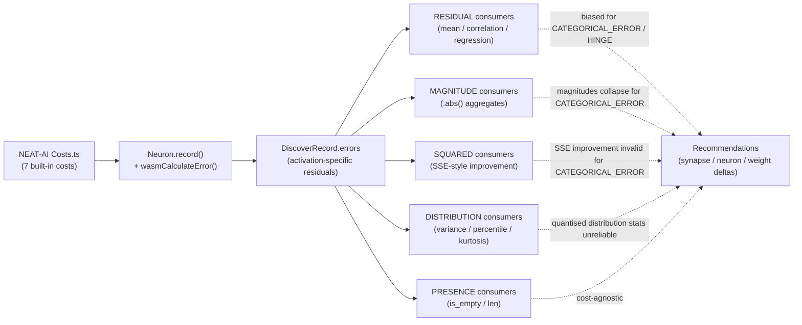

# Cost-Function Notes — Discovery's Implicit Assumptions

**Status**: Audit completed for Issue #1245 (parent: #1244).
**Last reviewed**: 2026-08-03 (Issue #1942 — premise and site references
re-verified against the source).
**Scope**: every consumer of `DiscoverRecord.errors` under `src/analysis/`.

---

## 1. Background

NEAT-AI exposes seven built-in cost functions:

| Cost | Per-output residual semantics (`errors[i]`) | Sign? | Range |
|------|---------------------------------------------|-------|-------|
| `MSE` | linear residual (`target − output`) | signed | ℝ |
| `MAE` | linear residual (sign preserved by the chain rule even though loss is `|·|`) | signed | ℝ |
| `MAPE` | percentage residual `(target − output)/|target|` | signed | ℝ |
| `MSLE` | `log(1+target) − log(1+output)` on `target ≥ 0` | signed | ℝ |
| `HINGE` | `max(0, 1 − y·ŷ) · −y` (zero when correctly margined) | signed, sparse | ℝ, often `0` |
| `CROSS_ENTROPY` | `output − target` from the soft-max gradient (linear) | signed | `[-1, 1]` typical |
| `CATEGORICAL_ERROR` | quantised misclassification flag `{0, 1}` on the predicted class | unsigned | `{0, 1}` |

The discovery pipeline records one error per output neuron per observation via
`DiscoverRecord.errors: Vec<f32>` (`src/types.rs`, field `errors`). NEAT-AI
populates the vector — discovery is the consumer.

Cost **names** do reach this crate. Running

```bash
grep -rn "MSE\|MAE\|MAPE\|MSLE\|HINGE\|CROSS_ENTROPY\|CATEGORICAL_ERROR" src/
```

returns hits. Every one of them is a match arm in one of two name mappers, a
test or doc comment that exercises or describes those mappers, or a
human-readable log message — never a branch inside an analysis consumer. The
two mappers are:

- `analysis::cost_function_hint::CostFunctionHint::from_name` — maps a cost
  name onto `LinearResidual` / `NonLinearResidual` / `Unknown`, which gates the
  two `activation + error ≈ target` reconstruction sites (Issue #1250).
- `analysis::task_descriptor::TaskDescriptor::from_name` — maps a cost name
  onto a target topology, target range, and output-squash family.

Both translate a name into *residual semantics* at the crate boundary and then
discard it. **No consumer catalogued in §3 branches on the configured cost**:
each one reads `DiscoverRecord.errors` and nothing else. That — not an absence
of cost names in `src/` — is the cost-agnostic invariant this document is
about. The caller-facing summary of the same plumbing lives in
[DISCOVERY_TYPES.md](DISCOVERY_TYPES.md).

So discovery is **cost-agnostic over its consumers** — but a number of those
analysers assume linear-residual semantics in places. This document records
each assumption, classifies how each consumer interprets the errors, and lists
the invariants that any future cost function must preserve.

---

## 2. Cost-Agnostic Invariants

Discovery relies on the following contract. **A new NEAT-AI cost function MUST
preserve every item below or discovery may emit misleading recommendations.**

1. **One error slot per output neuron.** `errors.len()` equals the number of
   output neurons of the network for output records, and is otherwise empty.
2. **Finite errors mean "this observation contributed to the loss."** A
   non-finite (`NaN`/`±∞`) entry is treated as "skip this observation" by every
   consumer (`is_finite()` is checked everywhere).
3. **Zero error means "perfect prediction at this sample."** Consumers that
   sum or square errors assume `0` carries no information.
4. **Magnitude is monotonically related to "how wrong" the network was.**
   Bigger `|error|` ⇒ worse prediction. This holds for every built-in cost.
5. **`errors[i]` is well-defined for the i-th output neuron and only that
   neuron.** Cross-output indexing is not supported.

The following are **NOT guaranteed** by every cost — and the per-consumer
catalogue below records who relies on each:

- **Sign of `error` is the sign of (target − output).** Holds for `MSE`,
  `MAE`, `MAPE`, `MSLE`, `CROSS_ENTROPY` (linear residual). For `HINGE`, sign
  is meaningful but the value is zero on correctly-margined samples. For
  `CATEGORICAL_ERROR`, the value is unsigned `{0, 1}`.
- **`error` is approximately continuous / Gaussian-tailed.** Holds for
  `MSE`/`MAE`-style residuals on smooth targets. Fails for
  `CATEGORICAL_ERROR` (Bernoulli `{0, 1}`) and partially for `HINGE` (mass at
  0).
- **Least-squares regression `w = Σ(e·a)/Σ(a²)` minimises the network's loss.**
  Holds exactly for `MSE`; an approximation for `MAE` and `MSLE`; a poor
  approximation for `CATEGORICAL_ERROR` because the residual is not the
  network's actual gradient signal.

---

## 3. Per-Consumer Catalogue

For each module the table records the **operation**, its **classification**,
and the **per-cost validity**:

- ✅ correct semantics under this cost
- ⚠️ correct but degraded signal (e.g., sparse, biased magnitude)
- ❌ likely misleading — flagged for follow-up

Sites are cited as `<file>.rs::<function>`, never `<file>.rs:<line>` — a 400-line
catalogue of line numbers rots on every refactor, and this one rotted once
already (Issue #1942). Several rows share a symbol; the **Operation** column
distinguishes them.

Classifications:

- **RESIDUAL** — raw signed value used (mean, sum, correlation, gradient).
- **MAGNITUDE** — `.abs()` only.
- **SQUARED** — `e * e` (SSE-style).
- **PRESENCE** — only `errors.is_empty()` / `errors.len()`.
- **DISTRIBUTION** — variance / std-dev / percentile / mode.

### 3.1 `src/analysis/detection/`

| Site | Operation | Class | MSE | MAE | MAPE | MSLE | HINGE | CE | CAT_ERR |
|------|-----------|-------|-----|-----|------|------|-------|----|---------|
| `compound_degradation.rs::detect_bias_corrections` | `errors.sum / n` | RESIDUAL | ✅ | ✅ | ✅ | ✅ | ⚠️ | ✅ | ❌ |
| `compound_degradation.rs::detect_weight_corrections` | `r.errors.first()` per obs | RESIDUAL | ✅ | ✅ | ✅ | ✅ | ⚠️ | ✅ | ⚠️ |
| `compound_degradation.rs::detect_weight_corrections` | `Σ e²` (baseline SSE) | SQUARED | ✅ | ⚠️ | ⚠️ | ⚠️ | ⚠️ | ✅ | ⚠️ gated (#1249) |
| `compound_degradation.rs::detect_weight_corrections` | `(err − Δw·act)²` corrected SSE | SQUARED | ✅ | ⚠️ | ⚠️ | ⚠️ | ⚠️ | ✅ | ⚠️ gated (#1249) |
| `correlated_error.rs::detect_correlated_error_patterns` | `!errors.is_empty()` | PRESENCE | ✅ | ✅ | ✅ | ✅ | ✅ | ✅ | ✅ |
| `correlated_error.rs::detect_correlated_error_patterns` | `errors.first()` for correlation | RESIDUAL | ✅ | ✅ | ✅ | ✅ | ⚠️ | ✅ | ❌ |
| `error_plateau.rs::compute_bias_adjustment` | `errors.first()` raw | RESIDUAL | ✅ | ✅ | ✅ | ✅ | ⚠️ | ✅ | ⚠️ |
| `error_plateau.rs::detect_error_plateaus` | `errors.first().abs()` | MAGNITUDE | ✅ | ✅ | ✅ | ✅ | ⚠️ | ✅ | ⚠️ |
| `hard_sample_cluster.rs::aggregate_obs_errors` | presence check | PRESENCE | ✅ | ✅ | ✅ | ✅ | ✅ | ✅ | ✅ |
| `hard_sample_cluster.rs::aggregate_obs_errors` | `Σ |e| / n` | MAGNITUDE | ✅ | ✅ | ✅ | ✅ | ⚠️ | ✅ | ⚠️ |
| `monotonicity.rs::detect_non_monotonic_neurons` | `errors.first()` series | RESIDUAL | ✅ | ✅ | ✅ | ✅ | ⚠️ | ✅ | ❌ |
| `monotonicity.rs::detect_non_monotonic_neurons` | `.abs()` of series | MAGNITUDE | ✅ | ✅ | ✅ | ✅ | ⚠️ | ✅ | ❌ |
| `noise_signal.rs::detect_noisy_neurons` | `errors.first()` | RESIDUAL | ✅ | ✅ | ✅ | ✅ | ⚠️ | ✅ | ⚠️ |
| `noise_signal.rs::detect_noisy_synapses` | (obs, err) for noise stats | RESIDUAL | ✅ | ✅ | ✅ | ✅ | ⚠️ | ✅ | ⚠️ |
| `observation_range.rs::analyse_observation_range` | presence | PRESENCE | ✅ | ✅ | ✅ | ✅ | ✅ | ✅ | ✅ |
| `observation_range.rs::analyse_observation_range` | `errors[0]` raw | RESIDUAL | ✅ | ✅ | ✅ | ✅ | ⚠️ | ✅ | ⚠️ |
| `output_conflict.rs::detect_output_conflict_neurons` | presence | PRESENCE | ✅ | ✅ | ✅ | ✅ | ✅ | ✅ | ✅ |
| `output_conflict.rs::detect_output_conflict_neurons` | length check vs output count | PRESENCE | ✅ | ✅ | ✅ | ✅ | ✅ | ✅ | ✅ |
| `output_conflict.rs::detect_output_conflict_neurons` | per-output residual accumulator | RESIDUAL | ✅ | ✅ | ✅ | ✅ | ⚠️ | ✅ | ❌ |
| `output_squash_mismatch.rs::compute_bound_error_ratio` | `errors.first().abs()` | MAGNITUDE | ✅ | ✅ | ✅ | ✅ | ⚠️ | ✅ | ⚠️ |
| `output_squash_mismatch.rs::evaluate_alternative_squashes` | `activation − errors.first()` (≈target) | RESIDUAL | ✅ | ✅ | ⚠️ | ⚠️ | ❌ | ⚠️ | ❌ |
| `output_squash_mismatch.rs::detect_output_squash_mismatches_with_cost_hint` | `.abs()` filter | MAGNITUDE | ✅ | ✅ | ✅ | ✅ | ⚠️ | ✅ | ⚠️ |
| `output_squash_mismatch.rs::detect_output_squash_mismatches_with_cost_hint` | `|err| > mean_error` | MAGNITUDE | ✅ | ✅ | ✅ | ✅ | ⚠️ | ✅ | ⚠️ |
| `output_squash_mismatch.rs::detect_output_squash_mismatches_with_cost_hint` | `.abs()` | MAGNITUDE | ✅ | ✅ | ✅ | ✅ | ⚠️ | ✅ | ⚠️ |
| `bias_perturbation.rs::detect_bias_perturbation_candidates` | `errors.first().abs()` | MAGNITUDE | ✅ | ✅ | ✅ | ✅ | ⚠️ | ✅ | ⚠️ |
| `bottleneck.rs::detect_bottleneck_neurons` | `Σ |e|` over neuron | MAGNITUDE | ✅ | ✅ | ✅ | ✅ | ⚠️ | ✅ | ⚠️ |
| `bottleneck.rs::detect_bottleneck_neurons` | `Σ |e|` aggregate | MAGNITUDE | ✅ | ✅ | ✅ | ✅ | ⚠️ | ✅ | ⚠️ |
| `topology.rs::detect_topology_issues` | `Σ |e|` + length | MAGNITUDE | ✅ | ✅ | ✅ | ✅ | ⚠️ | ✅ | ⚠️ |
| `topology_diversification.rs::has_unhealthy_intermediates` | `Σ |e|` | MAGNITUDE | ✅ | ✅ | ✅ | ✅ | ⚠️ | ✅ | ⚠️ |
| `topology_diversification.rs::detect_topology_diversification_candidates` | `Σ |e|` | MAGNITUDE | ✅ | ✅ | ✅ | ✅ | ⚠️ | ✅ | ⚠️ |
| `squash_weight_rescale.rs::evaluate_squash_errors` | `errors.first()` raw | RESIDUAL | ✅ | ✅ | ✅ | ✅ | ⚠️ | ✅ | ❌ |
| `squash_weight_rescale.rs::detect_squash_weight_rescale_candidates` | `.abs()` | MAGNITUDE | ✅ | ✅ | ✅ | ✅ | ⚠️ | ✅ | ⚠️ |
| `skip_connection.rs::detect_skip_connection_candidates` | `Σ |e|` + length | MAGNITUDE | ✅ | ✅ | ✅ | ✅ | ⚠️ | ✅ | ⚠️ |
| `weight_magnitude_reset.rs::detect_stuck_synapse_weight_resets` | `errors.first().abs()` | MAGNITUDE | ✅ | ✅ | ✅ | ✅ | ⚠️ | ✅ | ⚠️ |
| `sentinel_gating.rs::analyse_observation_for_sentinel` | presence + `errors[0]` | RESIDUAL | ✅ | ✅ | ✅ | ✅ | ⚠️ | ✅ | ❌ |
| `opposing_synapse.rs::detect_opposing_synapses` | `errors.first()` | RESIDUAL | ✅ | ✅ | ✅ | ✅ | ⚠️ | ✅ | ❌ |
| `weight_polarity_flip.rs::detect_weight_polarity_flip_candidates` | `errors.first().is_finite()` | RESIDUAL | ✅ | ✅ | ✅ | ✅ | ⚠️ | ✅ | ❌ |
| `high_error_squash_exploration.rs::evaluate_neuron` | `act + err` ≈ implied target | RESIDUAL | ✅ | ✅ | ⚠️ | ⚠️ | ❌ | ⚠️ | ❌ |

### 3.2 `src/analysis/recommendation/`

| Site | Operation | Class | MSE | MAE | MAPE | MSLE | HINGE | CE | CAT_ERR |
|------|-----------|-------|-----|-----|------|------|-------|----|---------|
| `fan_in.rs::detect_fan_in_candidates` | presence | PRESENCE | ✅ | ✅ | ✅ | ✅ | ✅ | ✅ | ✅ |
| `fan_in.rs::detect_fan_in_candidates` | obs→error map | RESIDUAL | ✅ | ✅ | ✅ | ✅ | ⚠️ | ✅ | ❌ |
| `fan_in.rs::compute_least_squares_improvement` | `original_sse = Σ e²` | SQUARED | ✅ | ⚠️ | ⚠️ | ⚠️ | ⚠️ | ✅ | ⚠️ gated (#1249) |
| `fan_in.rs::compute_least_squares_improvement` | residual SSE post-fit | SQUARED | ✅ | ⚠️ | ⚠️ | ⚠️ | ⚠️ | ✅ | ⚠️ gated (#1249) |
| `sample_weighted.rs::compute_sample_weights` | mean error per record, then `.abs()` | RESIDUAL→MAGNITUDE | ✅ | ✅ | ✅ | ✅ | ⚠️ | ✅ | ⚠️ |
| `sample_weighted.rs::stratify_samples` | same pattern, median easy/hard split | RESIDUAL→MAGNITUDE | ✅ | ✅ | ✅ | ✅ | ⚠️ | ✅ | ⚠️ |
| `sample_weighted.rs::detect_high_error_neurons` | same pattern, weighted mean | RESIDUAL→MAGNITUDE | ✅ | ✅ | ✅ | ✅ | ⚠️ | ✅ | ⚠️ |
| `gradient_discovery.rs::compute_synapse_gradient` | `(obs, err)` map | RESIDUAL | ✅ | ✅ | ✅ | ✅ | ⚠️ | ✅ | ❌ |
| `gradient_discovery.rs::compute_synapse_gradient` | `∂L/∂w ≈ source_act × target_err` | RESIDUAL | ✅ | ⚠️ | ⚠️ | ⚠️ | ⚠️ | ✅ | ❌ |
| `gradient_discovery.rs::detect_gradient_candidates` | filtered `(obs, err)` map | RESIDUAL | ✅ | ✅ | ✅ | ✅ | ⚠️ | ✅ | ❌ |
| `multi_hop.rs::detect_multi_hop_candidates` | `errors.first()` for chain propagation | RESIDUAL | ✅ | ✅ | ⚠️ | ⚠️ | ❌ | ⚠️ | ❌ |
| `output_bias_drift.rs::detect_output_bias_drift` | `errors.first()` mean drift | RESIDUAL | ✅ | ✅ | ✅ | ✅ | ⚠️ | ✅ | ❌ |
| `batch_successful/detection.rs::detect_individually_successful` | presence | PRESENCE | ✅ | ✅ | ✅ | ✅ | ✅ | ✅ | ✅ |
| `batch_successful/detection.rs::detect_individually_successful` | obs→error map | RESIDUAL | ✅ | ✅ | ✅ | ✅ | ⚠️ | ✅ | ❌ |
| `batch_successful/detection.rs::evaluate_individual` | `original_sse = Σ e²` | SQUARED | ✅ | ⚠️ | ⚠️ | ⚠️ | ⚠️ | ✅ | ⚠️ gated (#1249) |
| `batch_successful/detection.rs::evaluate_individual` | `improvement = 1 − residual_sse/original_sse` | SQUARED | ✅ | ⚠️ | ⚠️ | ⚠️ | ⚠️ | ✅ | ⚠️ gated (#1249) |

### 3.3 `src/analysis/scoring/`

| Site | Operation | Class | MSE | MAE | MAPE | MSLE | HINGE | CE | CAT_ERR |
|------|-----------|-------|-----|-----|------|------|-------|----|---------|
| `confidence.rs::compute_error_variance` | `Var = Σe²/n − (Σe/n)²` over `HelpfulSample.avg_error` | DISTRIBUTION | ✅ | ✅ | ✅ | ✅ | ⚠️ | ✅ | ⚠️ |
| `error_distribution.rs::from_samples` | percentiles / skew / kurtosis on `avg_error` | DISTRIBUTION | ✅ | ✅ | ✅ | ✅ | ⚠️ | ✅ | ❌ |
| `error_distribution.rs::from_errors` | second invocation on raw error series | DISTRIBUTION | ✅ | ✅ | ✅ | ✅ | ⚠️ | ✅ | ❌ |
| `weights/calculation.rs::calculate_optimal_outgoing_weight` | `w = Σ(e·a)/Σ(a²)` consumed from `HelpfulSample.avg_error` | RESIDUAL | ✅ | ⚠️ | ⚠️ | ⚠️ | ⚠️ | ✅ | ❌ |

`scoring/` does not touch `DiscoverRecord.errors` directly — it consumes the
pre-aggregated `HelpfulSample.avg_error` field. That averaging happens in
`diagnostics/target_data.rs::from_records` (signed sum / count) and
`samples/statistics.rs::from_records` (same). Per-cost validity therefore
propagates through the averaging step.

### 3.4 `src/analysis/synapse/`

| Site | Operation | Class | MSE | MAE | MAPE | MSLE | HINGE | CE | CAT_ERR |
|------|-----------|-------|-----|-----|------|------|-------|----|---------|
| `synapse/target_analysis/mod.rs::analyse_single_target` | filter finite, copy | RESIDUAL | ✅ | ✅ | ✅ | ✅ | ⚠️ | ✅ | ⚠️ |
| `synapse/post_processing.rs::compute_neuron_error_sq_map` | `Σ e²` per target neuron | SQUARED | ✅ | ⚠️ | ⚠️ | ⚠️ | ⚠️ | ✅ | ❌ |

### 3.5 `src/analysis/neuron/`

| Site | Operation | Class | MSE | MAE | MAPE | MSLE | HINGE | CE | CAT_ERR |
|------|-----------|-------|-----|-----|------|------|-------|----|---------|
| `neuron/mod.rs::analyze_neurons_with_cache_and_gpu_queue` | filtered copy of errors | RESIDUAL | ✅ | ✅ | ✅ | ✅ | ⚠️ | ✅ | ⚠️ |
| `neuron/mod.rs::analyze_neurons_with_cache_and_gpu_queue` | presence | PRESENCE | ✅ | ✅ | ✅ | ✅ | ✅ | ✅ | ✅ |

### 3.6 `src/analysis/samples/`

| Site | Operation | Class | MSE | MAE | MAPE | MSLE | HINGE | CE | CAT_ERR |
|------|-----------|-------|-----|-----|------|------|-------|----|---------|
| `samples/statistics.rs::from_records` | presence | PRESENCE | ✅ | ✅ | ✅ | ✅ | ✅ | ✅ | ✅ |
| `samples/statistics.rs::from_records` | signed average | RESIDUAL | ✅ | ✅ | ✅ | ✅ | ⚠️ | ✅ | ⚠️ |
| `samples/statistics.rs::from_samples` | `error_sq_sum += avg²` (variance via `HelpfulSample`) | DISTRIBUTION | ✅ | ✅ | ✅ | ✅ | ⚠️ | ✅ | ⚠️ |

### 3.7 `src/analysis/diagnostics/`

| Site | Operation | Class | MSE | MAE | MAPE | MSLE | HINGE | CE | CAT_ERR |
|------|-----------|-------|-----|-----|------|------|-------|----|---------|
| `target_data.rs::from_records` | presence | PRESENCE | ✅ | ✅ | ✅ | ✅ | ✅ | ✅ | ✅ |
| `target_data.rs::from_records` | signed average per obs | RESIDUAL | ✅ | ✅ | ✅ | ✅ | ⚠️ | ✅ | ⚠️ |

---

## 4. Per-Cost Behaviour Summary

### 4.1 `MSE` (de facto baseline)

Every consumer is exact: residuals are linear, magnitudes scale with squared
loss, SSE-based improvements directly equal the network's loss reduction.
**Treat MSE as the reference contract.**

### 4.2 `MAE`

- `RESIDUAL`/`MAGNITUDE` consumers: ✅ correct — the chain rule still emits
  signed residuals from the `|·|` derivative.
- `SQUARED` consumers (SSE-based improvements like
  `fan_in.rs::compute_least_squares_improvement`,
  `batch_successful/detection.rs::evaluate_individual`,
  `compound_degradation.rs::detect_weight_corrections`,
  `synapse/post_processing.rs::compute_neuron_error_sq_map`): ⚠️ overestimate
  the improvement when errors are heavy-tailed because squaring weights
  outliers more than MAE does. Ranking remains broadly correct; absolute
  "expected improvement" values are inflated.

### 4.3 `MAPE`

Same as MAE plus a percentage scale. `RESIDUAL` consumers are unaffected (mean
of percentages is a percentage). The `act + err` reconstruction in
`output_squash_mismatch.rs::evaluate_alternative_squashes` and
`high_error_squash_exploration.rs::evaluate_neuron` becomes
`act + (target − output)/|target|` which is *not* the target — ⚠️ degraded.

**Fixed in Issue #1250.** Both sites now accept a `CostFunctionHint`
(see `src/analysis/cost_function_hint.rs`). When the caller declares
`MAPE`, Strategy 4 of `detect_output_squash_mismatches` is skipped and
`detect_high_error_squash_candidates` returns an empty list. The
unhinted entry points keep their pre-fix behaviour for backwards
compatibility.

### 4.4 `MSLE`

The signed residual is `log(1+target) − log(1+output)`, which only makes sense
on non-negative targets. Behaviour mirrors MAPE: ✅ for RESIDUAL/MAGNITUDE,
⚠️ for SSE-style improvements, ⚠️ for "implied target = activation + error"
reconstructions.

**Fixed in Issue #1250.** Same gating as MAPE — the implied-target
sites accept a `CostFunctionHint::NonLinearResidual` and skip the
affected code paths.

### 4.5 `HINGE`

- Hinge residuals are zero on correctly-margined samples. Mean residual is
  biased towards zero even when the network is imperfect, so any RESIDUAL
  consumer that averages errors (e.g.,
  `sample_weighted.rs::compute_sample_weights`,
  `target_data.rs::from_records`) ⚠️ under-reports neuron error.
- SSE-based "improvement = 1 − residual_sse/original_sse" still works for
  ranking because both numerator and denominator share the sparsity bias.
- `act + err = implied target`
  (`output_squash_mismatch.rs::evaluate_alternative_squashes`,
  `high_error_squash_exploration.rs::evaluate_neuron`) is ❌ — the relationship
  is not linear under hinge. **Fixed in Issue #1250** by gating the affected
  code paths off when the caller passes `CostFunctionHint::from_name("HINGE")`.

### 4.6 `CROSS_ENTROPY`

NEAT-AI's `CROSS_ENTROPY` exposes the soft-max gradient `output − target`,
which is a linear residual. Behaviour matches `MSE` for every consumer:
✅ across the board. The slight wrinkle is that `errors[i]` lies in
`[-1, 1]` rather than ℝ, so SSE numbers are smaller — but ranking is
preserved.

### 4.7 `CATEGORICAL_ERROR` (new, NEAT-AI PR #2739)

This is the most disruptive cost for discovery:

- `errors[i] ∈ {0, 1}` — quantised misclassification flag.
- Sign carries no information.
- The "least-squares" weight `w = Σ(e·a)/Σ(a²)` is **not** the gradient of
  the cost — it is a regression of misclassification flags onto activations.
- SSE-based "improvement" values double-count because `e² = e` when
  `e ∈ {0, 1}` (so `original_sse = Σe = error_count`). The ratio
  `residual_sse / original_sse` no longer means "loss reduction."

Concretely:

- ❌ **All SQUARED consumers**
  (`fan_in.rs::compute_least_squares_improvement`,
  `batch_successful/detection.rs::evaluate_individual`,
  `compound_degradation.rs::detect_weight_corrections`,
  `synapse/post_processing.rs::compute_neuron_error_sq_map`) produce numbers
  that do not correspond to NEAT-AI's loss. **Fixed in Issue #1249** for the
  three sites whose output is interpreted as "expected loss reduction": the fan-in
  least-squares improvement, the batch-successful
  `1 − residual_sse/original_sse` ratio, and the compound-degradation
  weight correction all now invoke
  `crate::analysis::quantised_error::is_quantised_zero_one` on the
  target's recorded errors and gate the SSE-improvement code path off
  when the regime is detected.
  `synapse/post_processing.rs::compute_neuron_error_sq_map` is retained —
  under `CATEGORICAL_ERROR` it collapses to "fraction of network
  misclassifications attributable to this neuron", which is
  still a sensible cost-agnostic impact-scaling factor and gating it
  off would silence the entire discovery pipeline.
- ❌ **All RESIDUAL consumers used in correlation/regression**
  (`gradient_discovery.rs::compute_synapse_gradient`,
  `compound_degradation.rs::detect_weight_corrections`,
  `correlated_error.rs::detect_correlated_error_patterns`,
  `monotonicity.rs::detect_non_monotonic_neurons`,
  `weight_polarity_flip.rs::detect_weight_polarity_flip_candidates`,
  `opposing_synapse.rs::detect_opposing_synapses`,
  `sentinel_gating.rs::analyse_observation_for_sentinel`,
  `output_conflict.rs::detect_output_conflict_neurons`,
  `multi_hop.rs::detect_multi_hop_candidates`,
  `output_bias_drift.rs::detect_output_bias_drift`) are biased — the
  regression slope no longer matches the gradient.
- ❌ **`activation + error = implied target`** patterns are wrong (target is
  not bounded by the activation range). **Fixed in Issue #1250** —
  `CostFunctionHint::from_name("CATEGORICAL_ERROR")` gates both sites off.
- ⚠️ **MAGNITUDE consumers** still rank "high error neurons" correctly
  (because `|e| = e ∈ {0, 1}`), but their numeric scale (`mean_abs_error ∈
  [0, 1]`) collapses against thresholds tuned for continuous residuals.
- ✅ **PRESENCE consumers** remain valid.

See §6 for the follow-up issue that proposes either guarding these
consumers behind a `cost_function` hint passed from NEAT-AI, or adding an
explicit "is the error a linear residual?" capability flag to
`DiscoverRecord`.

---

## 5. Checklist — Adding a New Cost to NEAT-AI

Before NEAT-AI ships a new cost, walk this list against discovery:

- [ ] **Linear residual?** If yes, no discovery changes are needed.
- [ ] **Signed?** If sign carries no information (e.g., `CATEGORICAL_ERROR`),
      every RESIDUAL site in §3 must be reviewed. Prefer adding a
      `linear_residual: bool` flag to the cost so discovery can gate
      least-squares fits and gradient estimates.
- [ ] **Range bounded to a small set (e.g., `{0, 1}`, `{-1, 0, 1}`)?** If yes,
      DISTRIBUTION consumers (`scoring/error_distribution.rs`,
      `confidence.rs::compute_error_variance`) will report misleading
      skew/kurtosis — flag for review.
- [ ] **Sparsity (mass at exactly zero)?** Hinge-style. RESIDUAL means will be
      biased. Document the bias rather than fixing every consumer.
- [ ] **`activation + error ≈ target`?** Only true for `MSE`/`MAE`/`CE`. If
      not, audit `output_squash_mismatch.rs::evaluate_alternative_squashes` and
      `high_error_squash_exploration.rs::evaluate_neuron`.
- [ ] **Add a test** under `tests/cost_invariants/` (to be created — see
      follow-up #1244-family) that records a known network under the new
      cost and asserts ranking stability for each detector listed in §3.

---

## 6. Concrete Bugs Surfaced (follow-up issues)

The audit surfaced the following concrete defects, all triggered by
`CATEGORICAL_ERROR`. Each is filed as a separate follow-up so this audit
remains a documentation deliverable:

1. **#1249 — `improvement = 1 − residual_sse/original_sse` collapses for
   `{0, 1}` errors** — affects
   `fan_in.rs::compute_least_squares_improvement`,
   `batch_successful/detection.rs::evaluate_individual`,
   `compound_degradation.rs::detect_weight_corrections`,
   `synapse/post_processing.rs::compute_neuron_error_sq_map`.
   **Resolved**: the three sites whose output is treated as "expected
   loss reduction" by the downstream candidate ranker
   (`fan_in::compute_least_squares_improvement` /
   `compute_two_input_regression`,
   `batch_successful::detection::evaluate_individual`,
   `compound_degradation::detect_weight_corrections`) now call
   `analysis::quantised_error::is_quantised_zero_one` on the target
   error series and gate the SSE-improvement code path off. The fourth
   site (`synapse::post_processing::compute_neuron_error_sq_map`)
   degrades cleanly to "fraction of network misclassifications" under
   the regime, which is still a usable cost-agnostic scaling factor —
   gating it off would silence the discovery pipeline, so the SSE-sum
   path is retained with a documented degraded-but-well-formed
   semantics. Regression tests live in
   `tests/recommendation/issue_1249_categorical_error_sse_gating.rs`
   and `tests/detection/issue_1249_categorical_error_sse_gating.rs`.
   See also **#1247** — hardened the distribution-sensitive detectors
   (`scoring/error_distribution.rs`, `detection/bimodal_neuron.rs`,
   `recommendation/sample_weighted.rs`, `recommendation/fan_in.rs`,
   `detection/monotonicity.rs`) for the quantised `{0, 1}` regime.
   `monotonicity.rs` now skips affected neurons via the new
   `analysis::quantised_error::is_quantised_zero_one` helper; the
   remaining modules document degraded-but-well-formed behaviour and
   carry regression tests under
   `tests/{detection,recommendation,scoring}/issue_1247_*`.
2. **#1250 — `activation + error = implied target` is invalid for
   non-linear-residual costs** — affects
   `output_squash_mismatch.rs::evaluate_alternative_squashes` and
   `high_error_squash_exploration.rs::evaluate_neuron`. **Resolved**: both
   sites now expose a `_with_cost_hint` overload that accepts a
   `CostFunctionHint`. Non-linear-residual costs gate the affected code
   paths off. Backwards-compatible unhinted entry points remain for
   callers that have not been migrated.
3. **#1251 — `docs/discoveries/add-neuron.md` claimed "Expected
   improvement = reduction in MSE"** — **Resolved**: the flowchart node now
   reads "Expected improvement = SSE reduction (exact for MSE; ranking signal
   for other costs)".

A `negative-result` follow-up will be raised on #1249 if no fix proves
better than gating SSE-improvement scoring off for `CATEGORICAL_ERROR`.

---

## 7. Data Flow Diagram



---

## 8. Audit Provenance

- **Issue**: #1245 (parent #1244).
- **Method**: exhaustive `rg`-driven crawl over `src/analysis/**` for `.errors`
  field accesses and downstream `Vec<f32>` consumption, cross-checked against
  the field's definition (`DiscoverRecord::errors` in `src/types.rs`) and the
  FFI shape (`DiscoverRecordJson::errors` in
  `src/ffi_types/responses/export.rs`).
- **Test files exercising the affected paths** (skipped from the catalogue but
  recorded for traceability):
  - `src/analysis/implementation_tests/diagnostics_tests.rs`
  - `src/analysis/implementation_tests/sample_matching_tests.rs`
  - `src/analysis/implementation_tests/synapse_analysis_tests.rs`
  - `src/analysis/synapse/scoring/tests.rs`

Re-run the audit by re-executing the grep in §1 and walking §3 against the
current code. The audit is intended to be cheap to refresh after any cost
change in NEAT-AI.

`tests/issue_1942_cost_function_notes_contract.rs` pins the parts of this
document a refactor can silently falsify: the §1 premise, and the existence of
every symbol §3 and §4–§6 cite.

---

## 9. Repeated Selection on One Corpus — the Multiple-Comparisons Exposure

§1–§8 cover *which residual semantics* the SSE proxy assumes. This section
covers the other half of the statistical exposure: **how many times that proxy
is queried against the same data** (Issue #2025).

Around fifty detectors propose candidates against **one** recorded corpus, and
each proposal is admitted on a measured improvement computed from that same
corpus. That is a large **multiple-comparisons** surface: with enough
proposals, the best-looking measured gain is partly the largest noise draw
rather than the largest real effect. The exposure compounds because selection
is **adaptive** — failure caches, per-type discounting and threshold
calibration all feed the previous rounds' outcomes back into what gets proposed
next, so the corpus is not queried once but repeatedly, by a process that has
already seen its answers. That is exactly the regime analysed by the reusable
holdout (Dwork et al. 2015) and the Ladder (Blum & Hardt 2015); see
[PRIOR_ART.md § 8](PRIOR_ART.md#8-statistical-exposure).

### What we do about it

| Defence | Where | What it actually covers |
|---------|-------|-------------------------|
| Controller ablation test | NEAT-AI clones the creature, applies the candidate, re-scores the **full training set** | The strongest filter — a candidate must improve a real score, not just the SSE proxy. But it re-scores against the **same corpus** every time, so it does not escape adaptive overfitting, it only raises the bar |
| Per-candidate hold-out split | `src/analysis/synapse/holdout_validation.rs` (Issue #893) | Selection bias from the 9-variant weight grid **within one candidate**, when ≥ `HOLDOUT_MIN_SAMPLE_COUNT` (20) samples exist. It says nothing about selection **across** detectors or candidates |
| Pessimism discounting and gain floors | `src/analysis/synapse/scoring/discounting.rs`, the per-op noise floors (Issue #1272) | Shrinks optimistic predictions and rejects small measured gains — a blunt but real reduction in the number of noise-sized proposals that reach evaluation |
| Success/failure caches | Caller-supplied `failureCache` | Stops re-proposing what already failed. Note this is itself *adaptive* — it is part of the exposure as well as a mitigation |

### What we do not do

Stated plainly, because silence here reads as a claim:

- There is **no fresh-corpus validation**. No candidate is ever re-checked
  against data that had no part in proposing it.
- There is **no query budget** against the corpus, and no
  differential-privacy-style noise on reported improvements — the two
  mechanisms Dwork et al. 2015 and Blum & Hardt 2015 use to keep an adaptively
  reused holdout valid.
- There is **no family-wise or false-discovery-rate correction** across the
  ~50 detectors proposing per pass.

The practical consequence: production success rates measured on the same corpus
that produced the candidates are **upper bounds**, and a detector's apparent
gain can be partly selection effect. Evolution is the backstop — a candidate
that only fitted the scorer stops paying off in later generations and is bred
out — but that is a slow, indirect correction, not a statistical guarantee.
