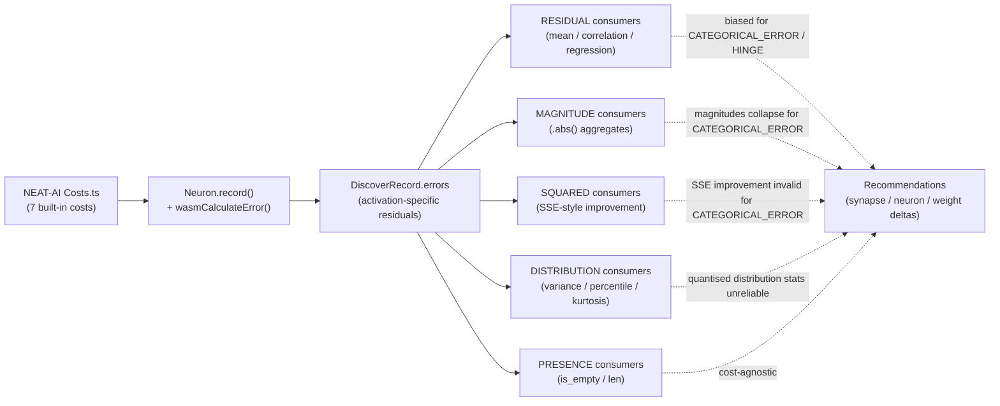

# Cost-Function Notes — Discovery's Implicit Assumptions

**Status**: Audit completed for Issue #1245 (parent: #1244).
**Last reviewed**: 2026-05-23.
**Scope**: every consumer of `DiscoverRecord.errors` under `src/analysis/`.

---

## 1. Background

NEAT-AI exposes seven built-in cost functions:

| Cost | Per-output residual semantics (`errors[i]`) | Sign? | Range |
|------|---------------------------------------------|-------|-------|
| `MSE` | linear residual (`target − output`) | signed | ℝ |
| `MAE` | linear residual (sign preserved by the chain rule even though loss is `|·|`) | signed | ℝ |
| `MAPE` | percentage residual `(target − output)/|target|` | signed | ℝ |
| `MSLE` | `log(1+target) − log(1+output)` on `target ≥ 0` | signed | ℝ |
| `HINGE` | `max(0, 1 − y·ŷ) · −y` (zero when correctly margined) | signed, sparse | ℝ, often `0` |
| `CROSS_ENTROPY` | `output − target` from the soft-max gradient (linear) | signed | `[-1, 1]` typical |
| `CATEGORICAL_ERROR` | quantised misclassification flag `{0, 1}` on the predicted class | unsigned | `{0, 1}` |

The discovery pipeline records one error per output neuron per observation via
`DiscoverRecord.errors: Vec<f32>` (`src/types.rs:18`). NEAT-AI populates the
vector — discovery is the consumer.

Today there are **zero references to any cost name in `src/` of this crate**:

```bash
grep -rn "MSE\|MAE\|MAPE\|MSLE\|HINGE\|CROSS_ENTROPY\|CATEGORICAL_ERROR" src/
```

So discovery is **claimed to be cost-agnostic** — but a number of analysers
assume linear-residual semantics in places. This document records each
assumption, classifies how each consumer interprets the errors, and lists the
invariants that any future cost function must preserve.

---

## 2. Cost-Agnostic Invariants

Discovery relies on the following contract. **A new NEAT-AI cost function MUST
preserve every item below or discovery may emit misleading recommendations.**

1. **One error slot per output neuron.** `errors.len()` equals the number of
   output neurons of the network for output records, and is otherwise empty.
2. **Finite errors mean "this observation contributed to the loss."** A
   non-finite (`NaN`/`±∞`) entry is treated as "skip this observation" by every
   consumer (`is_finite()` is checked everywhere).
3. **Zero error means "perfect prediction at this sample."** Consumers that
   sum or square errors assume `0` carries no information.
4. **Magnitude is monotonically related to "how wrong" the network was.**
   Bigger `|error|` ⇒ worse prediction. This holds for every built-in cost.
5. **`errors[i]` is well-defined for the i-th output neuron and only that
   neuron.** Cross-output indexing is not supported.

The following are **NOT guaranteed** by every cost — and the per-consumer
catalogue below records who relies on each:

- **Sign of `error` is the sign of (target − output).** Holds for `MSE`,
  `MAE`, `MAPE`, `MSLE`, `CROSS_ENTROPY` (linear residual). For `HINGE`, sign
  is meaningful but the value is zero on correctly-margined samples. For
  `CATEGORICAL_ERROR`, the value is unsigned `{0, 1}`.
- **`error` is approximately continuous / Gaussian-tailed.** Holds for
  `MSE`/`MAE`-style residuals on smooth targets. Fails for
  `CATEGORICAL_ERROR` (Bernoulli `{0, 1}`) and partially for `HINGE` (mass at
  0).
- **Least-squares regression `w = Σ(e·a)/Σ(a²)` minimises the network's loss.**
  Holds exactly for `MSE`; an approximation for `MAE` and `MSLE`; a poor
  approximation for `CATEGORICAL_ERROR` because the residual is not the
  network's actual gradient signal.

---

## 3. Per-Consumer Catalogue

For each module the table records the **operation**, its **classification**,
and the **per-cost validity**:

- ✅ correct semantics under this cost
- ⚠️ correct but degraded signal (e.g., sparse, biased magnitude)
- ❌ likely misleading — flagged for follow-up

Classifications:

- **RESIDUAL** — raw signed value used (mean, sum, correlation, gradient).
- **MAGNITUDE** — `.abs()` only.
- **SQUARED** — `e * e` (SSE-style).
- **PRESENCE** — only `errors.is_empty()` / `errors.len()`.
- **DISTRIBUTION** — variance / std-dev / percentile / mode.

### 3.1 `src/analysis/detection/`

| File:line | Operation | Class | MSE | MAE | MAPE | MSLE | HINGE | CE | CAT_ERR |
|-----------|-----------|-------|-----|-----|------|------|-------|----|---------|
| `compound_degradation.rs:171` | `errors.sum / n` | RESIDUAL | ✅ | ✅ | ✅ | ✅ | ⚠️ | ✅ | ❌ |
| `compound_degradation.rs:248` | `r.errors.first()` per obs | RESIDUAL | ✅ | ✅ | ✅ | ✅ | ⚠️ | ✅ | ⚠️ |
| `compound_degradation.rs:277` | `Σ e²` (baseline SSE) | SQUARED | ✅ | ⚠️ | ⚠️ | ⚠️ | ⚠️ | ✅ | ❌ |
| `compound_degradation.rs:282` | `(err − Δw·act)²` corrected SSE | SQUARED | ✅ | ⚠️ | ⚠️ | ⚠️ | ⚠️ | ✅ | ❌ |
| `correlated_error.rs:110` | `!errors.is_empty()` | PRESENCE | ✅ | ✅ | ✅ | ✅ | ✅ | ✅ | ✅ |
| `correlated_error.rs:128` | `errors.first()` for correlation | RESIDUAL | ✅ | ✅ | ✅ | ✅ | ⚠️ | ✅ | ❌ |
| `error_plateau.rs:124` | `errors.first()` raw | RESIDUAL | ✅ | ✅ | ✅ | ✅ | ⚠️ | ✅ | ⚠️ |
| `error_plateau.rs:160` | `errors.first().abs()` | MAGNITUDE | ✅ | ✅ | ✅ | ✅ | ⚠️ | ✅ | ⚠️ |
| `hard_sample_cluster.rs:240` | presence check | PRESENCE | ✅ | ✅ | ✅ | ✅ | ✅ | ✅ | ✅ |
| `hard_sample_cluster.rs:244` | `Σ |e| / n` | MAGNITUDE | ✅ | ✅ | ✅ | ✅ | ⚠️ | ✅ | ⚠️ |
| `monotonicity.rs:92` | `errors.first()` series | RESIDUAL | ✅ | ✅ | ✅ | ✅ | ⚠️ | ✅ | ❌ |
| `monotonicity.rs:105` | `.abs()` of series | MAGNITUDE | ✅ | ✅ | ✅ | ✅ | ⚠️ | ✅ | ❌ |
| `noise_signal.rs:142` | `errors.first()` | RESIDUAL | ✅ | ✅ | ✅ | ✅ | ⚠️ | ✅ | ⚠️ |
| `noise_signal.rs:237` | (obs, err) for noise stats | RESIDUAL | ✅ | ✅ | ✅ | ✅ | ⚠️ | ✅ | ⚠️ |
| `observation_range.rs:115` | presence | PRESENCE | ✅ | ✅ | ✅ | ✅ | ✅ | ✅ | ✅ |
| `observation_range.rs:118` | `errors[0]` raw | RESIDUAL | ✅ | ✅ | ✅ | ✅ | ⚠️ | ✅ | ⚠️ |
| `output_conflict.rs:115` | presence | PRESENCE | ✅ | ✅ | ✅ | ✅ | ✅ | ✅ | ✅ |
| `output_conflict.rs:130` | length check vs output count | PRESENCE | ✅ | ✅ | ✅ | ✅ | ✅ | ✅ | ✅ |
| `output_conflict.rs:131` | per-output residual accumulator | RESIDUAL | ✅ | ✅ | ✅ | ✅ | ⚠️ | ✅ | ❌ |
| `output_squash_mismatch.rs:133` | `errors.first().abs()` | MAGNITUDE | ✅ | ✅ | ✅ | ✅ | ⚠️ | ✅ | ⚠️ |
| `output_squash_mismatch.rs:221` | `activation − errors.first()` (≈target) | RESIDUAL | ✅ | ✅ | ⚠️ | ⚠️ | ❌ | ⚠️ | ❌ |
| `output_squash_mismatch.rs:301` | `.abs()` filter | MAGNITUDE | ✅ | ✅ | ✅ | ✅ | ⚠️ | ✅ | ⚠️ |
| `output_squash_mismatch.rs:382` | `|err| > mean_error` | MAGNITUDE | ✅ | ✅ | ✅ | ✅ | ⚠️ | ✅ | ⚠️ |
| `output_squash_mismatch.rs:424` | `.abs()` | MAGNITUDE | ✅ | ✅ | ✅ | ✅ | ⚠️ | ✅ | ⚠️ |
| `bias_perturbation.rs:177` | `errors.first().abs()` | MAGNITUDE | ✅ | ✅ | ✅ | ✅ | ⚠️ | ✅ | ⚠️ |
| `bottleneck.rs:102-103` | `Σ |e|` over neuron | MAGNITUDE | ✅ | ✅ | ✅ | ✅ | ⚠️ | ✅ | ⚠️ |
| `bottleneck.rs:140-141` | `Σ |e|` aggregate | MAGNITUDE | ✅ | ✅ | ✅ | ✅ | ⚠️ | ✅ | ⚠️ |
| `topology.rs:171-174` | `Σ |e|` + length | MAGNITUDE | ✅ | ✅ | ✅ | ✅ | ⚠️ | ✅ | ⚠️ |
| `topology_diversification.rs:255-256` | `Σ |e|` | MAGNITUDE | ✅ | ✅ | ✅ | ✅ | ⚠️ | ✅ | ⚠️ |
| `topology_diversification.rs:322-323` | `Σ |e|` | MAGNITUDE | ✅ | ✅ | ✅ | ✅ | ⚠️ | ✅ | ⚠️ |
| `squash_weight_rescale.rs:115` | `errors.first()` raw | RESIDUAL | ✅ | ✅ | ✅ | ✅ | ⚠️ | ✅ | ❌ |
| `squash_weight_rescale.rs:204` | `.abs()` | MAGNITUDE | ✅ | ✅ | ✅ | ✅ | ⚠️ | ✅ | ⚠️ |
| `skip_connection.rs:156-159` | `Σ |e|` + length | MAGNITUDE | ✅ | ✅ | ✅ | ✅ | ⚠️ | ✅ | ⚠️ |
| `weight_magnitude_reset.rs:169` | `errors.first().abs()` | MAGNITUDE | ✅ | ✅ | ✅ | ✅ | ⚠️ | ✅ | ⚠️ |
| `sentinel_gating.rs:122-125` | presence + `errors[0]` | RESIDUAL | ✅ | ✅ | ✅ | ✅ | ⚠️ | ✅ | ❌ |
| `opposing_synapse.rs:132` | `errors.first()` | RESIDUAL | ✅ | ✅ | ✅ | ✅ | ⚠️ | ✅ | ❌ |
| `weight_polarity_flip.rs:100` | `errors.first().is_finite()` | RESIDUAL | ✅ | ✅ | ✅ | ✅ | ⚠️ | ✅ | ❌ |
| `high_error_squash_exploration.rs:140-141` | `act + err` ≈ implied target | RESIDUAL | ✅ | ✅ | ⚠️ | ⚠️ | ❌ | ⚠️ | ❌ |

### 3.2 `src/analysis/recommendation/`

| File:line | Operation | Class | MSE | MAE | MAPE | MSLE | HINGE | CE | CAT_ERR |
|-----------|-----------|-------|-----|-----|------|------|-------|----|---------|
| `fan_in.rs:139` | presence | PRESENCE | ✅ | ✅ | ✅ | ✅ | ✅ | ✅ | ✅ |
| `fan_in.rs:156-157` | obs→error map | RESIDUAL | ✅ | ✅ | ✅ | ✅ | ⚠️ | ✅ | ❌ |
| `fan_in.rs:372` | `original_sse = Σ e²` | SQUARED | ✅ | ⚠️ | ⚠️ | ⚠️ | ⚠️ | ✅ | ❌ |
| `fan_in.rs:373-382` | residual SSE post-fit | SQUARED | ✅ | ⚠️ | ⚠️ | ⚠️ | ⚠️ | ✅ | ❌ |
| `sample_weighted.rs:111-114` | mean error per record | RESIDUAL | ✅ | ✅ | ✅ | ✅ | ⚠️ | ✅ | ❌ |
| `sample_weighted.rs:155-159` | mean error, then `.abs()` | RESIDUAL→MAGNITUDE | ✅ | ✅ | ✅ | ✅ | ⚠️ | ✅ | ⚠️ |
| `sample_weighted.rs:258-262` | same pattern | RESIDUAL→MAGNITUDE | ✅ | ✅ | ✅ | ✅ | ⚠️ | ✅ | ⚠️ |
| `gradient_discovery.rs:99` | `(obs, err)` map | RESIDUAL | ✅ | ✅ | ✅ | ✅ | ⚠️ | ✅ | ❌ |
| `gradient_discovery.rs:115` | `∂L/∂w ≈ source_act × target_err` | RESIDUAL | ✅ | ⚠️ | ⚠️ | ⚠️ | ⚠️ | ✅ | ❌ |
| `gradient_discovery.rs:162-165` | filtered `(obs, err)` map | RESIDUAL | ✅ | ✅ | ✅ | ✅ | ⚠️ | ✅ | ❌ |
| `multi_hop.rs:121` | `errors.first()` for chain propagation | RESIDUAL | ✅ | ✅ | ⚠️ | ⚠️ | ❌ | ⚠️ | ❌ |
| `output_bias_drift.rs:105` | `errors.first()` mean drift | RESIDUAL | ✅ | ✅ | ✅ | ✅ | ⚠️ | ✅ | ❌ |
| `batch_successful/detection.rs:70` | presence | PRESENCE | ✅ | ✅ | ✅ | ✅ | ✅ | ✅ | ✅ |
| `batch_successful/detection.rs:100-101` | obs→error map | RESIDUAL | ✅ | ✅ | ✅ | ✅ | ⚠️ | ✅ | ❌ |
| `batch_successful/detection.rs:189` | `original_sse = Σ e²` | SQUARED | ✅ | ⚠️ | ⚠️ | ⚠️ | ⚠️ | ✅ | ❌ |
| `batch_successful/detection.rs:194-203` | `improvement = 1 − residual_sse/original_sse` | SQUARED | ✅ | ⚠️ | ⚠️ | ⚠️ | ⚠️ | ✅ | ❌ |

### 3.3 `src/analysis/scoring/`

| File:line | Operation | Class | MSE | MAE | MAPE | MSLE | HINGE | CE | CAT_ERR |
|-----------|-----------|-------|-----|-----|------|------|-------|----|---------|
| `confidence.rs:272-291` | `Var = Σe²/n − (Σe/n)²` over `HelpfulSample.avg_error` | DISTRIBUTION | ✅ | ✅ | ✅ | ✅ | ⚠️ | ✅ | ⚠️ |
| `error_distribution.rs:71-92` | percentiles / skew / kurtosis on `avg_error` | DISTRIBUTION | ✅ | ✅ | ✅ | ✅ | ⚠️ | ✅ | ❌ |
| `error_distribution.rs:280-300` | second invocation on raw error series | DISTRIBUTION | ✅ | ✅ | ✅ | ✅ | ⚠️ | ✅ | ❌ |
| `weights/calculation.rs` (all of `calculate_optimal_outgoing_weight`) | `w = Σ(e·a)/Σ(a²)` consumed from `HelpfulSample.avg_error` | RESIDUAL | ✅ | ⚠️ | ⚠️ | ⚠️ | ⚠️ | ✅ | ❌ |

`scoring/` does not touch `DiscoverRecord.errors` directly — it consumes the
pre-aggregated `HelpfulSample.avg_error` field. That averaging happens in
`diagnostics/target_data.rs:43` (signed sum / count) and
`samples/statistics.rs:37` (same). Per-cost validity therefore propagates
through the averaging step.

### 3.4 `src/analysis/synapse/`

| File:line | Operation | Class | MSE | MAE | MAPE | MSLE | HINGE | CE | CAT_ERR |
|-----------|-----------|-------|-----|-----|------|------|-------|----|---------|
| `target_analysis/mod.rs:175-177` | filter finite, copy | RESIDUAL | ✅ | ✅ | ✅ | ✅ | ⚠️ | ✅ | ⚠️ |
| `post_processing.rs:131-138` | `Σ e²` per target neuron | SQUARED | ✅ | ⚠️ | ⚠️ | ⚠️ | ⚠️ | ✅ | ❌ |

### 3.5 `src/analysis/neuron/`

| File:line | Operation | Class | MSE | MAE | MAPE | MSLE | HINGE | CE | CAT_ERR |
|-----------|-----------|-------|-----|-----|------|------|-------|----|---------|
| `mod.rs:239-241` | filtered copy of errors | RESIDUAL | ✅ | ✅ | ✅ | ✅ | ⚠️ | ✅ | ⚠️ |
| `mod.rs:252` | presence | PRESENCE | ✅ | ✅ | ✅ | ✅ | ✅ | ✅ | ✅ |

### 3.6 `src/analysis/samples/`

| File:line | Operation | Class | MSE | MAE | MAPE | MSLE | HINGE | CE | CAT_ERR |
|-----------|-----------|-------|-----|-----|------|------|-------|----|---------|
| `statistics.rs:31` | presence | PRESENCE | ✅ | ✅ | ✅ | ✅ | ✅ | ✅ | ✅ |
| `statistics.rs:37-44` | signed average | RESIDUAL | ✅ | ✅ | ✅ | ✅ | ⚠️ | ✅ | ⚠️ |
| `statistics.rs:87` | `error_sq_sum += avg²` (variance via `HelpfulSample`) | DISTRIBUTION | ✅ | ✅ | ✅ | ✅ | ⚠️ | ✅ | ⚠️ |

### 3.7 `src/analysis/diagnostics/`

| File:line | Operation | Class | MSE | MAE | MAPE | MSLE | HINGE | CE | CAT_ERR |
|-----------|-----------|-------|-----|-----|------|------|-------|----|---------|
| `target_data.rs:38` | presence | PRESENCE | ✅ | ✅ | ✅ | ✅ | ✅ | ✅ | ✅ |
| `target_data.rs:43-45` | signed average per obs | RESIDUAL | ✅ | ✅ | ✅ | ✅ | ⚠️ | ✅ | ⚠️ |

---

## 4. Per-Cost Behaviour Summary

### 4.1 `MSE` (de facto baseline)

Every consumer is exact: residuals are linear, magnitudes scale with squared
loss, SSE-based improvements directly equal the network's loss reduction.
**Treat MSE as the reference contract.**

### 4.2 `MAE`

- `RESIDUAL`/`MAGNITUDE` consumers: ✅ correct — the chain rule still emits
  signed residuals from the `|·|` derivative.
- `SQUARED` consumers (SSE-based improvements like `fan_in.rs:372`,
  `batch_successful/detection.rs:189`, `compound_degradation.rs:277`,
  `synapse/post_processing.rs:135`): ⚠️ overestimate the improvement when
  errors are heavy-tailed because squaring weights outliers more than MAE
  does. Ranking remains broadly correct; absolute "expected improvement"
  values are inflated.

### 4.3 `MAPE`

Same as MAE plus a percentage scale. `RESIDUAL` consumers are unaffected (mean
of percentages is a percentage). The `act + err` reconstruction in
`output_squash_mismatch.rs:221` and `high_error_squash_exploration.rs:141`
becomes `act + (target − output)/|target|` which is *not* the target —
⚠️ degraded.

### 4.4 `MSLE`

The signed residual is `log(1+target) − log(1+output)`, which only makes sense
on non-negative targets. Behaviour mirrors MAPE: ✅ for RESIDUAL/MAGNITUDE,
⚠️ for SSE-style improvements, ⚠️ for "implied target = activation + error"
reconstructions.

### 4.5 `HINGE`

- Hinge residuals are zero on correctly-margined samples. Mean residual is
  biased toward zero even when the network is imperfect, so any RESIDUAL
  consumer that averages errors (e.g., `sample_weighted.rs:114`,
  `target_data.rs:43`) ⚠️ under-reports neuron error.
- SSE-based "improvement = 1 − residual_sse/original_sse" still works for
  ranking because both numerator and denominator share the sparsity bias.
- `act + err = implied target` (`output_squash_mismatch.rs:221`,
  `high_error_squash_exploration.rs:141`) is ❌ — the relationship is not
  linear under hinge.

### 4.6 `CROSS_ENTROPY`

NEAT-AI's `CROSS_ENTROPY` exposes the soft-max gradient `output − target`,
which is a linear residual. Behaviour matches `MSE` for every consumer:
✅ across the board. The slight wrinkle is that `errors[i]` lies in
`[-1, 1]` rather than ℝ, so SSE numbers are smaller — but ranking is
preserved.

### 4.7 `CATEGORICAL_ERROR` (new, NEAT-AI PR #2739)

This is the most disruptive cost for discovery:

- `errors[i] ∈ {0, 1}` — quantised misclassification flag.
- Sign carries no information.
- The "least-squares" weight `w = Σ(e·a)/Σ(a²)` is **not** the gradient of
  the cost — it is a regression of misclassification flags onto activations.
- SSE-based "improvement" values double-count because `e² = e` when
  `e ∈ {0, 1}` (so `original_sse = Σe = error_count`). The ratio
  `residual_sse / original_sse` no longer means "loss reduction."

Concretely:

- ❌ **All SQUARED consumers** (`fan_in.rs:372`,
  `batch_successful/detection.rs:189`, `compound_degradation.rs:277`,
  `synapse/post_processing.rs:135`) produce numbers that do not correspond
  to NEAT-AI's loss.
- ❌ **All RESIDUAL consumers used in correlation/regression**
  (`gradient_discovery.rs:115`, `compound_degradation.rs`,
  `correlated_error.rs:128`, `monotonicity.rs:92`, `weight_polarity_flip.rs`,
  `opposing_synapse.rs`, `sentinel_gating.rs`, `output_conflict.rs:131`,
  `multi_hop.rs:121`, `output_bias_drift.rs:105`) are biased — the
  regression slope no longer matches the gradient.
- ❌ **`activation + error = implied target`** patterns are wrong (target is
  not bounded by the activation range).
- ⚠️ **MAGNITUDE consumers** still rank "high error neurons" correctly
  (because `|e| = e ∈ {0, 1}`), but their numeric scale (`mean_abs_error ∈
  [0, 1]`) collapses against thresholds tuned for continuous residuals.
- ✅ **PRESENCE consumers** remain valid.

See §6 for the follow-up issue that proposes either guarding these
consumers behind a `cost_function` hint passed from NEAT-AI, or adding an
explicit "is the error a linear residual?" capability flag to
`DiscoverRecord`.

---

## 5. Checklist — Adding a New Cost to NEAT-AI

Before NEAT-AI ships a new cost, walk this list against discovery:

- [ ] **Linear residual?** If yes, no discovery changes are needed.
- [ ] **Signed?** If sign carries no information (e.g., `CATEGORICAL_ERROR`),
      every RESIDUAL site in §3 must be reviewed. Prefer adding a
      `linear_residual: bool` flag to the cost so discovery can gate
      least-squares fits and gradient estimates.
- [ ] **Range bounded to a small set (e.g., `{0, 1}`, `{-1, 0, 1}`)?** If yes,
      DISTRIBUTION consumers (`scoring/error_distribution.rs`,
      `confidence.rs::compute_error_variance`) will report misleading
      skew/kurtosis — flag for review.
- [ ] **Sparsity (mass at exactly zero)?** Hinge-style. RESIDUAL means will be
      biased. Document the bias rather than fixing every consumer.
- [ ] **`activation + error ≈ target`?** Only true for `MSE`/`MAE`/`CE`. If
      not, audit `output_squash_mismatch.rs:221` and
      `high_error_squash_exploration.rs:141`.
- [ ] **Add a test** under `tests/cost_invariants/` (to be created — see
      follow-up #1244-family) that records a known network under the new
      cost and asserts ranking stability for each detector listed in §3.

---

## 6. Concrete Bugs Surfaced (follow-up issues)

The audit surfaced the following concrete defects, all triggered by
`CATEGORICAL_ERROR`. Each is filed as a separate follow-up so this audit
remains a documentation deliverable:

1. **#1249 — `improvement = 1 − residual_sse/original_sse` collapses for
   `{0, 1}` errors** — affects `fan_in.rs:372-382`,
   `batch_successful/detection.rs:189-203`,
   `compound_degradation.rs:277-288`,
   `synapse/post_processing.rs:131-138`.
2. **#1250 — `activation + error = implied target` is invalid for
   non-linear-residual costs** — affects `output_squash_mismatch.rs:221`
   and `high_error_squash_exploration.rs:141`.
3. **#1251 — `docs/discoveries/add-neuron.md:56` claims "Expected
   improvement = reduction in MSE"** — should be reworded to
   "Expected improvement = SSE reduction (exact for MSE, a ranking signal
   for other costs)". Tracked as a doc-only follow-up so this audit can
   land independently of the doc edit.

A `negative-result` follow-up will be raised on #1249 if no fix proves
better than gating SSE-improvement scoring off for `CATEGORICAL_ERROR`.

---

## 7. Data Flow Diagram



---

## 8. Audit Provenance

- **Issue**: #1245 (parent #1244).
- **Method**: exhaustive `rg`-driven crawl over `src/analysis/**` for `.errors`
  field accesses and downstream `Vec<f32>` consumption, cross-checked against
  the field's definition in `src/types.rs:18` and the FFI shape in
  `src/ffi_types/responses/export.rs:90`.
- **Test files exercising the affected paths** (skipped from the catalogue but
  recorded for traceability):
  - `src/analysis/implementation_tests/diagnostics_tests.rs`
  - `src/analysis/implementation_tests/sample_matching_tests.rs`
  - `src/analysis/implementation_tests/synapse_analysis_tests.rs`
  - `src/analysis/synapse/scoring/tests.rs`

Re-run the audit by re-executing the grep in §1 and walking §3 against the
current code. The audit is intended to be cheap to refresh after any cost
change in NEAT-AI.
