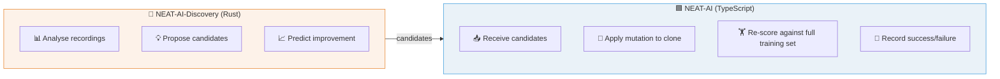
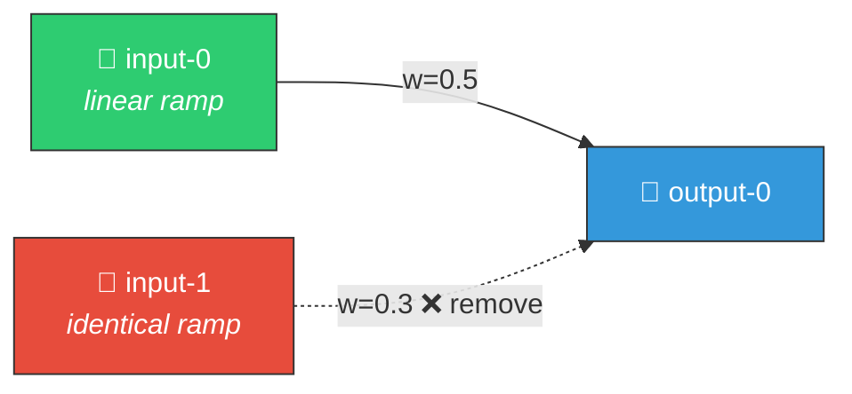

# 🧬 Discovery Types

This document is the **single source of truth** for all discovery types used by
NEAT-AI-Discovery. It covers detection criteria, recommended actions, candidate
output format, and production success/failure rates.

> **Last updated**: 20 Mar 2026

## 📑 Table of Contents

- [Overview](#overview)
- [Discovery Type Summary](#discovery-type-summary)
- [Detailed Descriptions](#detailed-descriptions)
  - Activation & Neuron State
    - [Saturated Neuron Detection](#saturated-neuron-detection)
    - [Dead Neuron Detection](#dead-neuron-detection)
    - [Oscillating Neuron Detection](#oscillating-neuron-detection)
    - [Bimodal Neuron Detection](#bimodal-neuron-detection)
    - [Restricted Range Detection](#restricted-range-detection)
    - [Operating Point Analysis](#operating-point-analysis)
    - [Unbounded Capping Detection](#unbounded-capping-detection)
    - [Activation Mismatch Detection](#activation-mismatch-detection)
    - [Monotonicity Detection](#monotonicity-detection)
    - [Error Plateau Detection](#error-plateau-detection)
    - [Output Range Compression Detection](#output-range-compression-detection)
    - [Output Squash Mismatch Detection](#output-squash-mismatch-detection)
    - [Activation Function Recommendation](#activation-function-recommendation)
    - [Bias Perturbation Detection](#bias-perturbation-detection)
    - [Squash + Weight Rescale Detection](#squash-weight-rescale-detection)
    - [High Error Squash Exploration](#high-error-squash-exploration)
    - [Low-Impact Neuron Detection](#low-impact-neuron-detection)
  - Weight & Synapse
    - [Dormant Synapse Detection](#dormant-synapse-detection)
    - [Opposing Synapse Detection](#opposing-synapse-detection)
    - [Weight Coherence Detection](#weight-coherence-detection)
    - [Weight Magnitude Reset Detection](#weight-magnitude-reset-detection)
    - [Weight Polarity Flip Detection](#weight-polarity-flip-detection)
    - [Noise-to-Signal Ratio Detection](#noise-to-signal-ratio-detection)
    - [Fan-in Polarity Conflict Detection](#fan-in-polarity-conflict-detection)
    - [Gradient-Based Synapse Adjustment](#gradient-based-synapse-adjustment)
  - Structural & Topology
    - [Bottleneck Neuron Detection](#bottleneck-neuron-detection)
    - [Correlated Error Pattern Detection](#correlated-error-pattern-detection)
    - [Redundant Path Pruning](#redundant-path-pruning)
    - [Topology-Aware Structure Analysis](#topology-aware-structure-analysis)
    - [Topology Diversification Detection](#topology-diversification-detection)
    - [Skip Connection Detection](#skip-connection-detection)
    - [Symmetry Breaking Detection](#symmetry-breaking-detection)
    - [Co-Adaptation Detection](#co-adaptation-detection)
    - [Output Conflict Detection](#output-conflict-detection)
    - [Hard Sample Cluster Detection](#hard-sample-cluster-detection)
    - [Multi-Hop Candidate Analysis](#multi-hop-candidate-analysis)
    - [Combo Successful](#combo-successful)
  - Range & Input Analysis
    - [Bounded Range Detection](#bounded-range-detection)
    - [Sentinel Gating Detection](#sentinel-gating-detection)
    - [Observation Utilisation Detection](#observation-utilisation-detection)
    - [Input Sensitivity Detection](#input-sensitivity-detection)
  - Scoring & Recommendation
    - [Output Bias Drift Detection](#output-bias-drift-detection)
    - [Sample-Weighted Discovery](#sample-weighted-discovery)
    - [Add Neurons](#add-neurons)
    - [Add Synapses](#add-synapses)
    - [Remove Low-Impact Neurons](#remove-low-impact-neurons)
    - [Remove Harmful Synapse](#remove-harmful-synapse)
    - [Remove Neuron (High Error)](#remove-neuron-high-error)
- [Coordinated Structural Candidates](#coordinated-structural-candidates)
- [Production Success Rates](#production-success-rates)
- [Analysis and Recommendations](#analysis-and-recommendations)
- [Related Documentation](#related-documentation)

---

## 🔍 Overview

Discovery types represent different mutation strategies that NEAT-AI-Discovery
suggests to improve a creature's score. The Rust library analyses recorded neuron
activations and errors to propose candidates, which are then validated by NEAT-AI
through ablation testing.

The workflow is:



---

## 📋 Discovery Type Summary

### 🧠 Activation & Neuron State

| Discovery Type | Source Module | Issue | Candidate Operations | Status |
|----------------|--------------|-------|---------------------|--------|
| [Saturated Neuron](#saturated-neuron-detection) | `detection/saturation.rs` | #342 | `changeSquash`, `setBias` | 🟢 Active |
| [Dead Neuron](#dead-neuron-detection) | `detection/dead_neuron.rs` | #341 | `removeNeuron` | 🟢 Active |
| [Oscillating Neuron](#oscillating-neuron-detection) | `detection/oscillating_neuron.rs` | #358 | `changeSquash`, `setBias` | 🟢 Active |
| [Bimodal Neuron](#bimodal-neuron-detection) | `detection/bimodal_neuron.rs` | #640 | `addNeuron` | 🟢 Active |
| [Restricted Range](#restricted-range-detection) | `detection/restricted_range.rs` | #399 | `changeSquash`, `setBias`, `setWeight` | 🟢 Active |
| [Operating Point](#operating-point-analysis) | `detection/operating_point.rs` | #401 | `setBias`, `setWeight` | 🟢 Active |
| [Unbounded Capping](#unbounded-capping-detection) | `detection/unbounded_capping.rs` | #441 | `changeSquash` | 🟢 Active |
| [Activation Mismatch](#activation-mismatch-detection) | `detection/activation_mismatch.rs` | #543 | `changeSquash`, `setBias` | 🟢 Active |
| [Monotonicity](#monotonicity-detection) | `detection/monotonicity.rs` | #643 | `addNeuron`, `changeSquash` | 🟢 Active |
| [Error Plateau](#error-plateau-detection) | `detection/error_plateau.rs` | #545 | `changeSquash`, `setBias` | 🟢 Active |
| [Output Range Compression](#output-range-compression-detection) | `detection/output_range_compression.rs` | #645 | `changeSquash` | 🟢 Active |
| [Output Squash Mismatch](#output-squash-mismatch-detection) | `detection/output_squash_mismatch.rs` | #545 | `changeSquash` | 🟢 Active |
| [Activation Recommendation](#activation-function-recommendation) | `recommendation/activation_recommendation.rs` | #431 | `changeSquash` | 🟢 Active |
| [Bias Perturbation](#bias-perturbation-detection) | `detection/bias_perturbation.rs` | #551 | `setBias` | 🟢 Active |
| [Squash + Weight Rescale](#squash-weight-rescale-detection) | `detection/squash_weight_rescale.rs` | #548 | `changeSquash`, `setWeight` | 🟢 Active |
| [High Error Squash Exploration](#high-error-squash-exploration) | `detection/high_error_squash_exploration.rs` | #788 | `changeSquash` | 🟢 Active |
| [Low-Impact Neuron](#low-impact-neuron-detection) | `detection/low_impact_neuron.rs` | #793 | `removeNeuron` | 🟢 Active |

### ⚖️ Weight & Synapse

| Discovery Type | Source Module | Issue | Candidate Operations | Status |
|----------------|--------------|-------|---------------------|--------|
| [Dormant Synapse](#dormant-synapse-detection) | `detection/dormant_synapse.rs` | #359 | `removeSynapse` | 🟢 Active |
| [Opposing Synapse](#opposing-synapse-detection) | `detection/opposing_synapse.rs` | #360 | `removeSynapse`, `setWeight` | 🟢 Active |
| [Weight Coherence](#weight-coherence-detection) | `detection/weight_coherence.rs` | #437 | `setWeight`, `removeSynapse` | 🟢 Active |
| [Weight Magnitude Reset](#weight-magnitude-reset-detection) | `detection/weight_magnitude_reset.rs` | #550 | `setWeight` | 🟢 Active |
| [Weight Polarity Flip](#weight-polarity-flip-detection) | `detection/weight_polarity_flip.rs` | #644 | `setWeight` | 🟢 Active |
| [Noise-to-Signal](#noise-to-signal-ratio-detection) | `detection/noise_signal.rs` | #434 | `removeNeuron`, `removeSynapse`, `setWeight` | 🟢 Active |
| [Fan-in Polarity Conflict](#fan-in-polarity-conflict-detection) | `detection/fanin_polarity_conflict.rs` | #641 | `addNeuron`, `addSynapse` | 🟢 Active |
| [Gradient Discovery](#gradient-based-synapse-adjustment) | `recommendation/gradient_discovery.rs` | #421 | `setWeight` | 🟢 Active |

### 🏗️ Structural & Topology

| Discovery Type | Source Module | Issue | Candidate Operations | Status |
|----------------|--------------|-------|---------------------|--------|
| [Bottleneck Neuron](#bottleneck-neuron-detection) | `detection/bottleneck.rs` | #343 | `addNeuron`, `addSynapse` | 🟢 Active |
| [Correlated Error](#correlated-error-pattern-detection) | `detection/correlated_error.rs` | #344 | `addNeuron`, `addSynapse` | 🟢 Active |
| [Redundant Path](#redundant-path-pruning) | `detection/redundant_path.rs` | #164 | `removeSynapse`, `setWeight` | 🟢 Active |
| [Topology Structure](#topology-aware-structure-analysis) | `detection/topology.rs` | #422 | `addSynapse` | 🟢 Active |
| [Topology Diversification](#topology-diversification-detection) | `detection/topology_diversification.rs` | #549 | `addNeuron` | 🟢 Active |
| [Skip Connection](#skip-connection-detection) | `detection/skip_connection.rs` | #570 | `addSynapse` | 🟢 Active |
| [Symmetry Breaking](#symmetry-breaking-detection) | `detection/symmetry_breaking.rs` | #569 | `setBias`, `setWeight`, `changeSquash` | 🟢 Active |
| [Co-Adaptation](#co-adaptation-detection) | `detection/co_adaptation.rs` | #571 | `removeNeuron`, `setWeight` | 🟢 Active |
| [Output Conflict](#output-conflict-detection) | `detection/output_conflict.rs` | #639 | `addSynapse`, `addNeuron` | 🟢 Active |
| [Hard Sample Cluster](#hard-sample-cluster-detection) | `detection/hard_sample_cluster.rs` | #642 | `addNeuron`, `addSynapse` | 🟢 Active |
| [Multi-Hop](#multi-hop-candidate-analysis) | `recommendation/multi_hop.rs` | #230 | `addNeuron`, `addSynapse` | 🟢 Active |
| [Combo Successful](#combo-successful) | `recommendation/epistatic/` | #415 | Multiple | 🟡 Fixed |

### 📐 Range & Input Analysis

| Discovery Type | Source Module | Issue | Candidate Operations | Status |
|----------------|--------------|-------|---------------------|--------|
| [Bounded Range](#bounded-range-detection) | `detection/bounded_range.rs` | #395 | `addNeuron`, `addSynapse` | 🟢 Active |
| [Sentinel Gating](#sentinel-gating-detection) | `detection/sentinel_gating.rs` | #400 | `addNeuron`, `addSynapse` | 🟢 Active |
| [Observation Utilisation](#observation-utilisation-detection) | `detection/observation_utilisation.rs` | #543 | `addNeuron`, `addSynapse` | 🟢 Active |
| [Input Sensitivity](#input-sensitivity-detection) | `detection/input_sensitivity.rs` | #435 | `setWeight`, `addNeuron`, `setBias` | 🟢 Active |

### 💡 Scoring & Recommendation

| Discovery Type | Source Module | Issue | Candidate Operations | Status |
|----------------|--------------|-------|---------------------|--------|
| [Output Bias Drift](#output-bias-drift-detection) | `recommendation/output_bias_drift.rs` | #361 | `setBias` | 🟢 Active |
| [Sample-Weighted](#sample-weighted-discovery) | `recommendation/sample_weighted.rs` | #423 | `setBias` | 🟢 Active |
| [Add Neurons](#add-neurons) | `neuron/` | — | `addNeuron` | 🟢 Active |
| [Add Synapses](#add-synapses) | `synapse/` | #413 | `addSynapse` | 🟡 Fixed |
| [Remove Low-Impact](#remove-low-impact-neurons) | `neuron/` | — | `removeNeuron` | 🟢 Active |
| [Remove Harmful Synapse](#remove-harmful-synapse) | `synapse/` | #416 | `removeSynapse` | 🟢 Active |
| [Remove Neuron (Error)](#remove-neuron-high-error) | `focus/` | #414 | `removeNeuron` | ⛔ Disabled |

### 🏷️ Status Legend

| Status | Meaning |
|--------|---------|
| 🟢 Active | Working and producing results |
| 🟡 Fixed | Issue addressed, awaiting production validation |
| 🟠 Not tested | Rust produces candidates but NEAT-AI does not test them yet |
| ⚠️ Low volume | Working but rarely suggested |
| 🔴 Not working | Being tested but 0% success rate |
| ⛔ Disabled | Permanently disabled due to fundamental flaw |

---

## 📖 Detailed Descriptions

### Saturated Neuron Detection

**Source**: `src/analysis/saturation.rs` (Issue #342)

**Purpose**: Identifies neurons that are permanently saturated (stuck at
activation ceiling or floor) and recommends activation function changes or bias
adjustments. Saturated neurons pass no gradient information and block learning
in their region of the network.

**Detection criteria**:

1. **Activation near bounds**: For TANH, mean activation > 0.85 or < −0.85
   across samples (Issue #417: lowered from 0.95 to catch near-saturated
   neurons earlier). For LOGISTIC, mean activation > 0.90 or < 0.10
   (lowered from 0.95/0.05). For HARD_TANH, mean activation > 0.95
   (lowered from 0.99).
2. **Low relative variance**: Input varies but output does not (activation
   function is squashing all variation). Maximum std dev: 0.08 (Issue #417:
   raised from 0.05 to accommodate near-saturated neurons).
3. **Uses a bounded activation**: Only bounded activations (TANH, LOGISTIC,
   HARD_TANH, etc.) can saturate. Unbounded activations (RELU, IDENTITY) are
   excluded, except RELU dead-zone detection (all activations at zero).

**Recommended actions**:

1. **Change activation function**: Switch from TANH to IDENTITY to restore
   signal flow.
2. **Adjust bias**: Shift bias to move the neuron's operating point away from
   saturation.

**Output**: Emitted as `coordinatedStructuralCandidates` with `changeSquash`
and/or `setBias` operations.

---

### Bottleneck Neuron Detection

**Source**: `src/analysis/bottleneck.rs` (Issue #343)

**Purpose**: Identifies hidden neurons that form information bottlenecks —
single points where many input signals converge through one neuron before
reaching outputs. A bottleneck limits the network's ability to represent
complex input combinations because one neuron's activation range must encode
all upstream information.

**Detection criteria**:

1. **High fan-in**: Many incoming connections (≥ `MIN_FAN_IN_FOR_BOTTLENECK`).
2. **High fan-in / fan-out ratio**: Significantly more inputs than outputs.
3. **Error concentration**: The neuron carries a disproportionate share of
   output error.
4. **Not an output neuron**: Output neurons are natural convergence points
   and are excluded.

**Recommended actions**:

1. **Add parallel neuron**: Create a new hidden neuron sharing a subset of
   inputs/outputs to increase capacity at the bottleneck.
2. **Add bypass synapse**: Add a direct connection from an upstream neuron
   to a downstream neuron, reducing dependency on the bottleneck.

**Output**: Emitted as `coordinatedStructuralCandidates` with `addNeuron`
and/or `addSynapse` operations.

---

### Dead Neuron Detection

**Source**: `src/analysis/dead_neuron.rs` (Issue #341)

**Purpose**: Identifies neurons that have become effectively dead (always
outputting zero or near-zero activation) and recommends their removal. Dead
neurons waste computation without contributing to the network's output.

**Detection criteria**:

1. **Near-zero activation**: Mean absolute activation < 1e-6 across all
   samples.
2. **Zero variance**: Standard deviation of activation ≈ 0 (always outputs
   the same value).
3. **Fewer than 1% active samples**: Less than 1% of samples show activation
   above 0.01.
4. **Minimum 20 samples**: Required for statistical reliability.
5. **Hidden neurons only**: Output and input neurons are excluded.

**Removal confidence** combines activation proximity to zero (40%), variance
proximity to zero (40%), and sample count (20%, plateaus at 1000 samples).

**Recommended actions**:

1. **Remove the neuron**: Dead neurons consume GPU resources during both
   training and inference without contributing useful information.

**Output**: Emitted as `coordinatedStructuralCandidates` with `removeNeuron`
operations.

---

### Dormant Synapse Detection

**Source**: `src/analysis/dormant_synapse.rs` (Issue #359)

**Purpose**: Identifies synapses with near-zero weights that contribute
negligible signal to their target neuron. Dormant synapses waste computation
during both forward pass and discovery analysis without providing meaningful
information flow.

**Detection criteria**:

1. **Near-zero weight**: The absolute weight is below a threshold (e.g.,
   1e-4).
2. **Low contribution**: The product of source activation and synapse weight
   is negligible relative to other inputs to the target neuron.
3. **Not the sole connection**: The target neuron has other incoming synapses
   (removing the only input would be destructive).

**Recommended actions**:

1. **Remove the synapse**: Reduces network complexity and may allow the
   controller to allocate evaluation budget to more promising candidates.

**Output**: Emitted as `coordinatedStructuralCandidates` with `removeSynapse`
operations.

---

### Opposing Synapse Detection

**Source**: `src/analysis/opposing_synapse.rs` (Issue #360)

**Purpose**: Identifies synapses whose contribution consistently works against
error reduction. When a synapse's activation–error correlation is strongly
positive (meaning the synapse increases the output when the error is already
positive, or decreases it when the error is already negative), the synapse is
actively hindering performance.

**Detection criteria**:

1. **Positive contribution–error correlation**: The Pearson correlation between
   `weight × source_activation` and the target neuron's error is strongly
   positive (≥ threshold).
2. **Meaningful contribution**: The synapse has a non-negligible mean absolute
   contribution (distinguishing from dormant synapses).
3. **Sufficient samples**: Enough recorded samples for statistical reliability.

**Recommended actions**:

1. **Remove the synapse**: If the opposition is strong, removing the synapse
   eliminates the harmful contribution.
2. **Flip the weight sign**: If the synapse carries useful magnitude but the
   wrong direction, negating the weight may help.

**Output**: Emitted as `coordinatedStructuralCandidates` with `removeSynapse`
or `setWeight` operations.

---

### Output Bias Drift Detection

**Source**: `src/analysis/output_bias_drift.rs` (Issue #361)

**Purpose**: Identifies output neurons with a consistent error sign bias —
neurons whose errors are predominantly positive (predicting too low) or
predominantly negative (predicting too high) across training samples. This
systematic bias indicates the neuron's bias parameter needs adjustment.

**Detection criteria**:

1. **Consistent error sign**: More than a threshold fraction of errors share
   the same sign (e.g., > 70% positive or > 70% negative).
2. **Meaningful mean error**: The absolute mean error is above a minimum
   threshold (not just noise).
3. **Sufficient samples**: Enough recorded samples for statistical reliability.
4. **Output neurons only**: Hidden and input neurons are excluded (their errors
   are indirect).

**Recommended actions**:

1. **Set bias**: Adjust the output neuron's bias by the negative of the mean
   error to centre the predictions.

**Output**: Emitted as `coordinatedStructuralCandidates` with a `setBias`
operation.

---

### Oscillating Neuron Detection

**Source**: `src/analysis/oscillating_neuron.rs` (Issue #358)

**Purpose**: Identifies hidden neurons whose activations oscillate between
positive and negative values across training samples, indicating the neuron
is fighting between two contradictory functions. Oscillating neurons may
benefit from an activation function change or bias adjustment to stabilise
their output.

**Detection criteria**:

1. **Sign changes**: The activation crosses zero frequently (more than 15%
   of consecutive sample pairs show sign changes; Issue #417: lowered from
   30% to catch mildly oscillating neurons).
2. **Balanced signs**: Both positive and negative activations appear in
   at least 10% of samples (Issue #417: lowered from 20% to catch more
   oscillating neurons).
3. **Meaningful magnitude**: The mean absolute activation is above a minimum
   threshold (distinguishing from dead neurons).
4. **Hidden neurons only**: Input and output neurons are excluded.

**Recommended actions**:

1. **Change activation function**: Switch to ABSOLUTE or RELU to stabilise
   sign.
2. **Adjust bias**: Shift the operating point to favour the dominant sign.

**Output**: Emitted as `coordinatedStructuralCandidates` with `changeSquash`
and/or `setBias` operations.

---

### Bimodal Neuron Detection

**Source**: `src/analysis/detection/bimodal_neuron.rs` (Issue #640)

**Purpose**: Detects hidden neurons whose pre-activation distribution is
bimodal or multimodal. Such neurons effectively serve two distinct input
regimes within a single neuron, limiting representational capacity. Splitting
into separate neurons allows each to specialise on one regime.

**Detection criteria**:

1. **Bimodal distribution**: The pre-activation values cluster into two or
   more distinct modes (detected via histogram analysis).
2. **Sufficient separation**: The modes are well-separated relative to their
   widths.
3. **Minimum samples**: At least 20 samples for statistical reliability.
4. **Hidden neurons only**: Input and output neurons are excluded.

**Recommended actions**:

1. **Add neuron**: Split the bimodal neuron by adding a new hidden neuron to
   handle one of the two activation regimes.

**Output**: Emitted as `coordinatedStructuralCandidates` with `addNeuron`
operations.

---

### Restricted Range Detection

**Source**: `src/analysis/detection/restricted_range.rs` (Issue #399)

**Purpose**: Detects hidden neurons confined to a narrow sub-range of their
activation function's output domain. A neuron using TANH but only producing
values in [0.2, 0.4] wastes most of its representational capacity.

**Detection criteria**:

1. **Narrow output range**: The neuron's activation range uses less than a
   configured fraction of the activation function's full output domain.
2. **Consistent confinement**: The restriction holds across the majority of
   training samples.
3. **Hidden neurons only**: Input and output neurons are excluded.

**Recommended actions**:

1. **Change activation function**: Switch to a function whose output domain
   better matches the observed operating range.
2. **Adjust bias**: Shift the operating point to utilise more of the range.
3. **Adjust weight**: Scale incoming weights to spread the input across the
   active zone.

**Output**: Emitted as `coordinatedStructuralCandidates` with `changeSquash`,
`setBias`, or `setWeight` operations.

---

### Operating Point Analysis

**Source**: `src/analysis/detection/operating_point.rs` (Issue #401)

**Purpose**: Analyses hidden neuron pre-activation distributions against the
squash function's active zone. Detects neurons whose operating point is
shifted away from the dynamic region of their activation function, resulting
in underutilisation of the function's gradient capacity.

**Detection criteria**:

1. **Off-centre operating point**: The mean pre-activation value is
   significantly offset from the activation function's optimal region.
2. **Low dynamic range utilisation**: The neuron operates in a flat region
   of the activation curve.
3. **Hidden neurons only**: Input and output neurons are excluded.

**Recommended actions**:

1. **Adjust bias**: Shift the neuron's operating point toward the dynamic
   zone of its activation function.
2. **Adjust incoming weights**: Scale weights to move the pre-activation
   distribution into the active zone.

**Output**: Emitted as `coordinatedStructuralCandidates` with `setBias` or
`setWeight` operations.

---

### Unbounded Capping Detection

**Source**: `src/analysis/unbounded_capping.rs` (Issue #441)

**Purpose**: Identifies neurons with unbounded activation functions (RELU,
IDENTITY, LEAKYRELU, etc.) that are producing high activations ("spiking")
and recommends capping them with a bounded version (e.g., RELU → RELU6).
High activations from unbounded functions can introduce noise into the
network.

**Detection criteria**:

1. **Uses an unbounded activation**: RELU, IDENTITY, LEAKYRELU, SOFTPLUS,
   ELU, SELU, SWISH, MISH, GELU, EXPONENTIAL, SQUARE, CUBE.
2. **High activations**: Maximum activation exceeds the capping threshold
   (e.g., > 6.0 for RELU → RELU6).
3. **Consistent spiking**: At least 30% of samples exceed the threshold
   (not just occasional spikes).
4. **Hidden neurons only**: Output neurons are excluded.

**Recommended actions**:

1. **Change RELU → RELU6**: Cap activations at 6.0 to reduce noise.
2. **Change LEAKYRELU → RELU6**: Cap positive activations (loses negative
   leak, but caps the positive side).
3. **Change IDENTITY → HARD_TANH or RELU6**: For high positive activations,
   use RELU6; for mixed activations, use HARD_TANH.

**Output**: Emitted as `coordinatedStructuralCandidates` with `changeSquash`
operations.

---

### Activation Mismatch Detection

**Source**: `src/analysis/detection/activation_mismatch.rs` (Issue #543)

**Purpose**: Detects neurons with poorly matched activation functions that
waste information. Examples include RELU neurons with negative bias (gating
out useful signal) or bounded activations that are underutilised.

**Detection criteria**:

1. **RELU with negative bias**: The neuron's bias pushes most inputs into the
   dead zone, wasting the neuron's capacity.
2. **Bounded activation underutilised**: The neuron uses a bounded function
   (TANH, LOGISTIC) but its inputs never reach the active region.
3. **Hidden neurons only**: Input and output neurons are excluded.
4. **Minimum samples**: At least 20 samples for reliable analysis.

**Recommended actions**:

1. **Change activation function**: Switch to a function that better matches
   the observed input distribution.
2. **Adjust bias**: Correct bias offset to restore useful signal flow.

**Output**: Emitted as `coordinatedStructuralCandidates` with `changeSquash`
and/or `setBias` operations.

---

### Monotonicity Detection

**Source**: `src/analysis/detection/monotonicity.rs` (Issue #643)

**Purpose**: Detects hidden neurons with non-monotonic activation–error
relationships. When a neuron's activation increases but the error both
improves and worsens depending on the region, the neuron is trying to serve
conflicting purposes and may benefit from being split or having its activation
changed.

**Detection criteria**:

1. **Non-monotonic relationship**: The activation–error curve reverses
   direction (positive correlation in some regions, negative in others).
2. **Sufficient samples**: Enough data points to establish the relationship
   reliably.
3. **Hidden neurons only**: Input and output neurons are excluded.

**Recommended actions**:

1. **Add neuron**: Split the neuron to handle different activation regions
   separately.
2. **Change activation function**: Switch to a function better suited to the
   observed relationship.

**Output**: Emitted as `coordinatedStructuralCandidates` with `addNeuron` or
`changeSquash` operations.

---

### Error Plateau Detection

**Source**: `src/analysis/detection/error_plateau.rs` (Issue #545)

**Purpose**: Detects output neurons stuck in error stagnation — high mean
error combined with low error variance — indicating a local minimum plateau.
The neuron is consistently wrong by a similar amount but unable to improve
through normal weight adjustments.

**Detection criteria**:

1. **High mean error**: The output neuron has significant average error.
2. **Low error variance**: Error is consistent across samples (not noisy).
3. **Output neurons only**: Only output neurons with direct error
   measurements are analysed.
4. **Minimum samples**: At least 20 samples for reliability.

**Recommended actions**:

1. **Change activation function**: Escape the local minimum by changing the
   output function, altering the error surface.
2. **Adjust bias**: Shift the operating point to explore different regions.

**Output**: Emitted as `coordinatedStructuralCandidates` with `changeSquash`
and/or `setBias` operations.

---

### Output Range Compression Detection

**Source**: `src/analysis/detection/output_range_compression.rs` (Issue #645)

**Purpose**: Detects output neurons operating in a compressed sub-range of
their activation function's domain, reducing dynamic resolution. An output
using TANH but only producing values in [0.1, 0.3] is wasting most of its
output precision.

**Detection criteria**:

1. **Compressed output range**: The neuron's actual output range is a small
   fraction of the activation function's theoretical range.
2. **Output neurons only**: Only output neurons are analysed.
3. **Minimum samples**: At least 20 samples for reliability.

**Recommended actions**:

1. **Change activation function**: Switch to a function whose range better
   matches the observed output distribution.

**Output**: Emitted as `coordinatedStructuralCandidates` with `changeSquash`
operations.

---

### Output Squash Mismatch Detection

**Source**: `src/analysis/detection/output_squash_mismatch.rs` (Issue #545)

**Purpose**: Detects when output neurons use activation functions mismatched
to their target data range. For example, using HARD_TANH (output range
[-1, 1]) when the target data lies in [0, 1] (better suited to LOGISTIC).

**Detection criteria**:

1. **Range mismatch**: The activation function's output range does not match
   the observed target data distribution.
2. **Output neurons only**: Only output neurons are analysed.
3. **Minimum samples**: At least 20 samples for reliable distribution
   analysis.

**Recommended actions**:

1. **Change activation function**: Switch to a function whose output range
   matches the target data range.

**Output**: Emitted as `coordinatedStructuralCandidates` with `changeSquash`
operations.

---

### Activation Function Recommendation

**Source**: `src/analysis/activation_recommendation.rs` (Issue #431)

**Purpose**: Provides **proactive** activation function recommendations based
on input distribution analysis. Unlike reactive `changeSquash` candidates
triggered by saturation or oscillation detection, this module analyses input
patterns BEFORE problems occur and suggests activations that match the data
characteristics.

**Input distribution matching**:

1. **Gaussian inputs → TANH or SOFTPLUS**: Bell-curve distributed inputs work
   well with smooth, symmetric activations that map the full range.
2. **Sparse inputs → RELU variants**: Inputs with many zeros benefit from
   activations that preserve the sparsity pattern.
3. **Bounded inputs → LOGISTIC or HARD_TANH**: Inputs constrained to a tight
   range (e.g., [0,1]) match bounded activations.
4. **Uniform inputs**: Evenly distributed inputs are flexible; smooth
   activations like TANH, IDENTITY, or GELU work well.

**Output range analysis**:

1. **Binary outputs**: Recommend LOGISTIC, STEP, or BIPOLAR.
2. **Unit interval [0,1]**: Recommend LOGISTIC.
3. **Symmetric unit [-1,1]**: Recommend TANH or HARD_TANH.
4. **Unbounded**: Recommend IDENTITY or RELU.

**Gradient flow analysis**:

The module also considers gradient flow risk:
- Penalises TANH/LOGISTIC if inputs would cause saturation.
- Penalises RELU if many inputs are negative (information loss).

**Detection criteria**:

1. **Minimum 20 samples**: Required for reliable distribution analysis.
2. **Classification possible**: Input distribution must be classifiable.
3. **Significant improvement**: Recommended activation must score higher than
   current activation by at least 0.001.
4. **Different activation**: Does not recommend the same activation currently
   in use.

**Recommended actions**:

1. **Change activation function**: Switch to an activation that better matches
   the observed input distribution pattern.

**Output**: Emitted as `coordinatedStructuralCandidates` with `changeSquash`
operations.

**Expected improvement**: 20% reduction in saturation/oscillation issues
through proactive matching of activation to data characteristics.

---

### Bias Perturbation Detection

**Source**: `src/analysis/detection/bias_perturbation.rs` (Issue #551)

**Purpose**: Identifies neurons in suboptimal activation regimes and
recommends large bias shifts to escape local minima. Unlike small
gradient-based bias adjustments, this module proposes regime-shifting
perturbations that move the neuron's operating point to a fundamentally
different part of its activation function.

**Detection criteria**:

1. **Suboptimal regime**: The neuron operates in a region of its activation
   function where the gradient is too small (e.g., deep saturation) or the
   output is dominated by bias rather than input.
2. **High error despite stable activation**: The neuron has consistent
   activation but is contributing to significant error.
3. **Hidden neurons only**: Input and output neurons are excluded.
4. **Minimum samples**: At least 20 samples for reliability.

**Recommended actions**:

1. **Set bias**: Apply a large bias shift to move the neuron to a different
   activation regime (e.g., from saturated to linear region).

**Output**: Emitted as `coordinatedStructuralCandidates` with `setBias`
operations.

---

### Squash + Weight Rescale Detection

**Source**: `src/analysis/detection/squash_weight_rescale.rs` (Issue #548)

**Purpose**: Coordinates activation function changes with compensating
weight adjustments to preserve the neuron's operating point. When changing
a neuron's squash function (e.g., TANH → RELU), the downstream weights
must be rescaled to maintain equivalent signal magnitude, preventing
disruptive output changes.

**Detection criteria**:

1. **Better activation available**: A different activation function would
   improve the neuron's signal processing (detected by other modules).
2. **Downstream synapses exist**: The neuron has outgoing connections that
   need weight compensation.
3. **Hidden neurons only**: Input and output neurons are excluded.

**Recommended actions**:

1. **Change activation + adjust weights**: Atomically change the squash
   function and rescale all downstream synapse weights to preserve the
   operating point.

**Output**: Emitted as `coordinatedStructuralCandidates` with `changeSquash`
and `setWeight` operations applied atomically.

---

### High Error Squash Exploration

**Source**: `src/analysis/detection/high_error_squash_exploration.rs` (Issue #788)

**Purpose**: Proactively explores alternative activation functions for hidden
neurons that exhibit high prediction error. Unlike reactive modules (saturation,
mismatch), this module triggers on **error magnitude** — if a neuron's mean
absolute error is above a threshold, it simulates what each candidate activation
function would produce from the neuron's pre-activation values and recommends
the one that best reduces error.

This increases `changeSquash` candidate volume for a candidate type that
enjoys a high success rate (~65% in production).

**Detection criteria**:

1. **Pre-activation data available**: At least `MIN_SAMPLES` records with
   pre-activation (`value`) data.
2. **High mean absolute error**: Mean absolute error ≥ 0.10.
3. **Error reduction achievable**: At least one alternative activation
   function reduces error by ≥ 15% relative to the current activation.
4. **Not already linear**: Neurons with `IDENTITY` activation are excluded
   (they are already the most flexible).

**Recommended actions**:

1. **Change activation**: Replace the current squash function with the
   candidate that achieves the largest error reduction.

**Output**: Emitted as `coordinatedStructuralCandidates` with `changeSquash`
operations.

---

### Low-Impact Neuron Detection

**Source**: `src/analysis/detection/low_impact_neuron.rs` (Issue #793)

**Purpose**: Identifies hidden neurons whose activations are consistently
near-zero but above the dead-neuron threshold. These neurons sit in the
"twilight zone" between truly dead (< 1e-6) and meaningfully active (> 1e-3)
— they contribute virtually nothing to the network's output yet still consume
complexity budget. Removing them simplifies the creature without meaningful
accuracy loss.

This module complements `dead_neuron.rs` by broadening the removal pool
with a tiered confidence approach.

**Detection criteria**:

1. **Mean absolute activation** between the dead threshold (1e-6) and
   the low-impact ceiling (1e-3).
2. **Low activation variance**: The neuron is consistently near-zero, not
   sporadically spiking.
3. **Hidden neurons only**: Output and input neurons are excluded.
4. **Sufficient samples**: At least `MIN_DISCOVERY_SAMPLE_COUNT` records.

**Confidence scoring**:

- **Activation proximity**: Lower mean absolute activation = higher confidence.
- **Variance consistency**: Lower standard deviation relative to mean = higher confidence.
- **Sample sufficiency**: More samples = higher confidence (plateaus at 500).

**Output**: Emitted as `coordinatedStructuralCandidates` with `removeNeuron`
operations.

---

### Noise-to-Signal Ratio Detection

**Source**: `src/analysis/noise_signal.rs` (Issue #434)

**Purpose**: Part of the "Brilliant but Brittle" initiative (Issue #432). This
module identifies neurons and synapses with high noise-to-signal ratios that
contribute to brittle predictions when bad or missing observations wildly
affect outputs.

**Detection criteria for noisy neurons**:

1. **Low activation variance**: The neuron's activation varies little across
   samples, indicating it doesn't respond to meaningful input patterns.
2. **High error variance**: The neuron's error varies significantly, indicating
   unpredictable contribution to network output.
3. **Poor correlation**: Activation changes don't correlate with error reduction.
4. **Noise-to-signal ratio > threshold**: The ratio of error variance to
   activation variance exceeds the configurable threshold (default: 2.0).
5. **Hidden neurons only**: Input and output neurons are excluded.
6. **Minimum 20 samples**: Required for statistical reliability.

**Detection criteria for noisy synapses**:

1. **Large weight**: Amplifies variance from upstream neurons (≥ 0.1).
2. **Noisy source**: Source neuron has high variance but poor error correlation
   with the target.
3. **Low signal contribution**: The synapse contributes more noise (variance)
   than signal (error reduction).
4. **Noise exceeds signal by 2×**: Noise contribution is at least twice the
   signal contribution.

**Environment variable**:

- `NEAT_AI_DISCOVERY_NOISE_SIGNAL_THRESHOLD`: Configure the noise-to-signal
  ratio threshold for neuron detection (default: 2.0).

**Recommended actions**:

1. **Remove noisy neurons**: Hidden neurons with poor signal-to-noise are
   candidates for removal via `removeNeuron`.
2. **Remove noisy synapses**: Synapses that amplify noise without signal benefit
   can be removed via `removeSynapse`.
3. **Reduce synapse weight**: For synapses with some signal contribution,
   `setWeight` reduces the weight by 50% to dampen noise while preserving
   some signal.

**Output**: Emitted as `coordinatedStructuralCandidates` with `removeNeuron`,
`removeSynapse`, or `setWeight` operations.

---

### Weight Coherence Detection

**Source**: `src/analysis/detection/weight_coherence.rs` (Issue #437)

**Purpose**: Part of the "Brilliant but Brittle" initiative. Validates weight
configurations for coherence across three sub-detectors: incoherent weight
ratios, near-constant output paths, and symmetric weight cancellation.

**Detection criteria — Incoherent weight ratios**:

1. **Extreme ratio**: The ratio between a neuron's largest and smallest
   incoming weight magnitudes exceeds a threshold, meaning some inputs are
   effectively ignored while others dominate.
2. **Hidden neurons only**: Input and output neurons are excluded.

**Detection criteria — Near-constant paths**:

1. **Tiny combined weight**: The product of incoming and outgoing weights
   is so small that the neuron contributes a near-constant signal regardless
   of input variation.

**Detection criteria — Symmetric cancellation**:

1. **Opposing weights**: Two synapses with nearly equal magnitude but
   opposite signs feed the same target, cancelling each other's contribution.

**Recommended actions**:

1. **Adjust weights**: Rebalance incoherent weight ratios via `setWeight`.
2. **Remove synapses**: Prune near-constant or cancelling paths via
   `removeSynapse`.

**Output**: Emitted as `coordinatedStructuralCandidates` with `setWeight`
or `removeSynapse` operations.

---

### Weight Magnitude Reset Detection

**Source**: `src/analysis/detection/weight_magnitude_reset.rs` (Issue #550)

**Purpose**: Identifies synapses stuck in local weight minima — weights that
are suboptimal but where small gradient steps cannot escape the current
basin. Generates exploratory `setWeight` candidates with large magnitude
changes to jump to a different region of the loss surface.

**Detection criteria**:

1. **Stuck weight**: The synapse weight has not changed significantly across
   recent training iterations despite ongoing error.
2. **Persistent error**: The synapse's target neuron still has meaningful
   error that could benefit from weight change.
3. **Sufficient samples**: At least 20 samples for reliability.

**Recommended actions**:

1. **Reset weight magnitude**: Apply a large weight change to escape the
   local minimum (e.g., double, halve, or negate the current weight).

**Output**: Emitted as `coordinatedStructuralCandidates` with `setWeight`
operations.

---

### Weight Polarity Flip Detection

**Source**: `src/analysis/detection/weight_polarity_flip.rs` (Issue #644)

**Purpose**: Detects synapses where the gradient sign is consistently
opposite to the weight sign, indicating the weight should be negated.
Rather than waiting for many small gradient descent steps to cross zero,
this module recommends a direct sign inversion.

**Detection criteria**:

1. **Gradient–weight sign disagreement**: The computed gradient consistently
   indicates the weight should move in the opposite direction (toward sign
   reversal).
2. **Sufficient consistency**: The sign disagreement holds across a majority
   of training samples.
3. **Meaningful magnitude**: The gradient and weight both have non-trivial
   magnitude.

**Recommended actions**:

1. **Flip weight polarity**: Negate the synapse weight to align with the
   gradient direction.

**Output**: Emitted as `coordinatedStructuralCandidates` with `setWeight`
operations.

---

### Fan-in Polarity Conflict Detection

**Source**: `src/analysis/detection/fanin_polarity_conflict.rs` (Issue #641)

**Purpose**: Identifies hidden neurons receiving incoming synapses with
conflicting polarities — a mix of strong positive and strong negative
weights that partially cancel each other. This wastes representational
capacity as the neuron tries to combine contradictory signals.

**Detection criteria**:

1. **Mixed polarity fan-in**: The neuron has incoming synapses with both
   significant positive and significant negative weights.
2. **Partial cancellation**: The positive and negative contributions
   substantially offset each other.
3. **Hidden neurons only**: Input and output neurons are excluded.

**Recommended actions**:

1. **Add neuron**: Split the conflicting inputs by routing positive-weight
   and negative-weight paths through separate neurons.
2. **Add synapse**: Add bypass connections for the dominant polarity group.

**Output**: Emitted as `coordinatedStructuralCandidates` with `addNeuron`
and/or `addSynapse` operations.

---

### Correlated Error Pattern Detection

**Source**: `src/analysis/correlated_error.rs` (Issue #344)

**Purpose**: Identifies groups of output neurons that exhibit correlated error
patterns across samples, suggesting they share a common missing cause.
Recommends structural changes that address the shared cause rather than
treating each output independently.

**Detection method**:

1. **Compute error correlation matrix**: For each pair of output neurons,
   compute the Pearson correlation of their per-sample errors.
2. **Cluster correlated outputs**: Group outputs with correlation > threshold
   (0.7).
3. **Identify shared error samples**: Find samples where all neurons in a
   cluster err in the same direction.
4. **Find predictive inputs**: Identify which input neuron activations predict
   the shared error pattern.

**Recommended actions**:

1. **Add shared hidden neuron**: A new neuron connecting predictive inputs to
   all outputs in the correlated group, addressing the shared missing cause.

**Output**: Emitted as `coordinatedStructuralCandidates` with `addNeuron` and
`addSynapse` operations.

---

### Multi-Hop Candidate Analysis

**Source**: `src/analysis/multi_hop.rs` (Issue #230)

**Purpose**: Current discovery only considers single-hop improvements (adding
one synapse or neuron). For deep networks, multi-hop improvements (adding a
path of 2–3 connections) may be more effective. This module analyses
intermediate neurons to find deeper structural improvements.

**Detection method**:

1. **Identify target neurons with errors**: Focus on output and hidden neurons
   that have recorded errors.
2. **Find correlated intermediates**: For each target, find neurons whose
   activation correlates with the target's error but are not directly
   connected.
3. **Build multi-hop paths**: Chain source → intermediate(s) → target paths
   where each hop has a correlation-based improvement estimate.
4. **Prune aggressively**: Limit depth to 3 hops max, filter by correlation
   threshold, and skip already-connected pairs.

**Recommended actions**:

1. **Add bypass synapse**: Connect the best source directly to the target
   (2-hop path).
2. **Add relay neuron**: Insert a new hidden neuron along the path to relay
   information (3-hop path).

**Output**: Emitted as `coordinatedStructuralCandidates` with `addNeuron`
and/or `addSynapse` operations.

---

### Redundant Path Pruning

**Source**: `src/analysis/redundant_path.rs` (Issue #164)

**Discovery type**: `COORDINATED_PRUNE_AND_REWEIGHT`

**Purpose**: Detect that two existing paths feeding the same output compute
the same thing, prune the redundant path, and renormalise the survivor's
weight.

**Detection criteria**:

1. **Highly correlated activations**: Pearson correlation ≥ 0.85 between the
   two sources' activation patterns.
2. **Anti-correlated error gradients**: Both paths push the error in the same
   direction (strengthens redundancy case).
3. **Shared downstream synapses**: Both sources feed into the same target
   neuron.

**How it works**:

1. For each target neuron, collect all existing synapse sources with recorded
   activation samples.
2. For each pair of existing sources, compute the Pearson activation
   correlation.
3. If correlation ≥ 0.85, the weaker synapse (by absolute weight) is a prune
   candidate.
4. The survivor's weight is renormalised to `keep_weight + prune_weight` (sum
   of both weights).

**Example scenario**:


> **Detected**: correlation = 0.99 → redundant
> **Result**: `removeSynapse(input-1 → output-0)` + `setWeight(input-0 → output-0, weight=0.8)`

**Output**: Emitted as `coordinatedStructuralCandidates` with `removeSynapse`
and `setWeight` operations.

---

### Topology-Aware Structure Analysis

**Source**: `src/analysis/topology.rs` (Issue #422)

**Purpose**: Analyses overall network structure to identify topology-based
improvements. Unlike per-neuron detectors (saturation, dead neuron), this
module takes a holistic view of path lengths and connectivity balance to
suggest structural changes that improve information flow.

**Detection criteria — Long path**:

1. **Shortest path to output > 3 hops**: Uses reverse BFS from all outputs
   to compute shortest path length for each hidden neuron.
2. **Sufficient samples**: At least 20 recorded samples for the neuron.
3. **Positive error**: The neuron carries meaningful error (no improvement
   expected if error is zero).
4. **No existing shortcut**: Only suggests skip connections where one does
   not already exist.

**Detection criteria — Connectivity imbalance**:

1. **Fan-in ratio ≥ 3.0**: The most-connected hidden neuron has at least
   3× the fan-in of the least-connected hidden neuron.
2. **Starved neurons flagged**: Neurons with fan-in below the imbalance
   threshold are candidates for additional connections.
3. **Sufficient samples**: At least 20 recorded samples.

**Recommended actions**:

1. **Add skip connection** (long path): Connect a distant hidden neuron
   directly to an output, shortening the effective path and reducing
   gradient attenuation.
2. **Add input connection** (connectivity imbalance): Connect an unused
   input to a starved hidden neuron to balance information flow.

**Output**: Emitted as `coordinatedStructuralCandidates` with `addSynapse`
operations.

**Expected improvement**: 10–15% success rate for topology-based suggestions,
complementing existing activation-based discovery.

---

### Topology Diversification Detection

**Source**: `src/analysis/detection/topology_diversification.rs` (Issue #549)

**Purpose**: Detects when the network topology is too simple for the
problem complexity and recommends adding neurons to increase the
dimensionality of the solution space. Unlike bottleneck detection (which
finds local convergence points), this module assesses global network
capacity.

**Detection criteria**:

1. **Low topological complexity**: The network has fewer hidden neurons
   than the problem dimensionality suggests.
2. **Persistent error**: The network has significant remaining error that
   cannot be reduced with existing structure.
3. **Sufficient samples**: At least 20 samples for analysis.

**Recommended actions**:

1. **Add neuron**: Insert a new hidden neuron to increase the network's
   representational capacity.

**Output**: Emitted as `coordinatedStructuralCandidates` with `addNeuron`
operations.

---

### Skip Connection Detection

**Source**: `src/analysis/detection/skip_connection.rs` (Issue #570)

**Purpose**: Analyses topological depth and gradient attenuation to identify
deep hidden neurons that would benefit from residual-style skip connections.
Deep neurons suffer from vanishing gradient effects; a skip connection
provides a shorter gradient path.

**Detection criteria**:

1. **Deep topology**: The neuron is several hops away from the nearest
   output neuron.
2. **Gradient attenuation**: The effective gradient reaching the neuron is
   significantly reduced by the depth of the path.
3. **Positive error**: The neuron carries meaningful error worth improving.
4. **No existing shortcut**: A direct connection to the output does not
   already exist.

**Recommended actions**:

1. **Add skip synapse**: Connect the deep hidden neuron directly to an
   output, providing an unattenuated gradient path.

**Output**: Emitted as `coordinatedStructuralCandidates` with `addSynapse`
operations.

---

### Symmetry Breaking Detection

**Source**: `src/analysis/detection/symmetry_breaking.rs` (Issue #569)

**Purpose**: Identifies pairs of hidden neurons with near-identical weight
configurations and activation functions. Symmetric neurons waste network
capacity by computing effectively the same function. Breaking the symmetry
allows each neuron to specialise.

**Detection criteria**:

1. **Near-identical weights**: Both neurons have very similar incoming and
   outgoing synapse weights.
2. **Same activation**: Both neurons use the same squash function.
3. **High activation correlation**: Activation patterns are highly
   correlated across training samples.
4. **At least 2 hidden neurons**: Cannot detect symmetry with fewer.

**Recommended actions**:

1. **Adjust bias**: Shift one neuron's bias to break the symmetry.
2. **Adjust weight**: Modify one neuron's incoming weight to differentiate.
3. **Change activation**: Give one neuron a different squash function.

**Output**: Emitted as `coordinatedStructuralCandidates` with `setBias`,
`setWeight`, or `changeSquash` operations.

---

### Co-Adaptation Detection

**Source**: `src/analysis/detection/co_adaptation.rs` (Issue #571)

**Purpose**: Identifies pairs of hidden neurons with highly correlated
activations, indicating they have co-adapted to compute redundant
representations. Unlike symmetry breaking (which detects identical weights),
co-adaptation detects functional redundancy even when weight configurations
differ.

**Detection criteria**:

1. **High activation correlation**: Pearson correlation ≥ 0.9 between the
   two neurons' activation patterns across training samples.
2. **Both hidden neurons**: Only hidden-to-hidden pairs are considered.
3. **Sufficient samples**: At least 20 samples for statistical reliability.

**Recommended actions**:

1. **Remove neuron**: Remove the weaker of the two co-adapted neurons.
2. **Adjust weight**: Rescale the survivor's outgoing weights to compensate.

**Output**: Emitted as `coordinatedStructuralCandidates` with `removeNeuron`
and/or `setWeight` operations.

---

### Output Conflict Detection

**Source**: `src/analysis/detection/output_conflict.rs` (Issue #639)

**Purpose**: Identifies hidden neurons whose per-output error contributions
conflict — the neuron helps reduce error for some output neurons while
simultaneously increasing error for others. Such neurons are serving
contradictory purposes and should be specialised.

**Detection criteria**:

1. **Conflicting contributions**: The neuron's activation reduces error for
   some outputs but increases error for others.
2. **Multiple outputs**: At least 2 output neurons must exist for conflict
   to be detected.
3. **Hidden neurons only**: Only hidden neurons are analysed.

**Recommended actions**:

1. **Add synapse**: Add targeted connections to help the conflicted neuron
   specialise for specific outputs.
2. **Add neuron**: Split the neuron so each copy can serve different outputs.

**Output**: Emitted as `coordinatedStructuralCandidates` with `addSynapse`
and/or `addNeuron` operations.

---

### Hard Sample Cluster Detection

**Source**: `src/analysis/detection/hard_sample_cluster.rs` (Issue #642)

**Purpose**: Identifies observation groups that are consistently high-error
across all output neurons. These "hard samples" represent input patterns
that the network has not learned to handle. The module finds which input
features discriminate hard samples from easy ones and recommends structural
changes to improve performance on those patterns.

**Detection criteria**:

1. **Consistently high error**: The observation has above-average error
   across all (or most) output neurons.
2. **Clustered**: Multiple hard observations share similar input feature
   patterns.
3. **Discriminative inputs**: Input neuron activations that distinguish hard
   from easy observations can be identified.

**Recommended actions**:

1. **Add neuron**: Insert a new hidden neuron targeting the discriminative
   input features.
2. **Add synapse**: Connect discriminative inputs to existing neurons that
   handle the problematic output.

**Output**: Emitted as `coordinatedStructuralCandidates` with `addNeuron`
and/or `addSynapse` operations.

---

### Gradient-Based Synapse Adjustment

**Source**: `src/analysis/gradient_discovery.rs` (Issue #421)

**Purpose**: Computes local gradients (∂error/∂weight) for each synapse and
proposes weight adjustments in the error-reducing direction. Unlike
correlation-based methods that measure association strength, gradient-based
discovery provides directional information about which way to adjust weights
for maximum error reduction.

**Detection criteria**:

1. **High gradient magnitude**: The absolute mean gradient exceeds a minimum
   threshold (0.01), indicating the synapse has significant error-reduction
   potential through weight adjustment.
2. **Sufficient samples**: At least 10 recorded samples for statistical
   reliability.
3. **Gradient consistency**: The ratio of mean gradient magnitude to standard
   deviation exceeds 0.3, ensuring the gradient direction is reliable rather
   than noise-driven.

**Gradient computation**:

For each synapse (source → target), the local gradient is computed as:

```
∂error/∂weight ≈ mean(source_activation × target_error)
```

This approximates how much the target error would change for a small weight
perturbation, using the chain rule of differentiation.

**Recommended actions**:

- **SetWeight**: Adjust the weight by a small step in the gradient descent
  direction: `new_weight = old_weight - learning_rate × gradient`.
  The learning rate is conservative (0.1) since NEAT-AI validates via ablation.

**Output**: Emitted as `coordinatedStructuralCandidates` with `setWeight`
operations.

**Expected improvement**: 25–30% success rate for weight adjustment candidates,
more accurate than correlation-based methods for predicting improvement direction.

---

### Bounded Range Detection

**Source**: `src/analysis/detection/bounded_range.rs` (Issue #395)

**Purpose**: Detects input and hidden neurons with sentinel value clusters at
their activation boundaries. Many real-world datasets use special values
(e.g., -1, 0, NaN-replacements) to indicate missing or invalid data. These
sentinel values distort the neuron's effective operating range and should be
gated out.

**Detection criteria**:

1. **Boundary clusters**: A significant fraction of activation values are
   clustered at the minimum or maximum of the observed range.
2. **Bimodal distribution**: The activation distribution splits into a
   sentinel cluster and a data cluster.
3. **Input or hidden neurons**: Both input and hidden neurons are analysed.
4. **Minimum samples**: At least 20 samples for reliability.

**Recommended actions**:

1. **Add gating neuron**: Insert a STEP-gated neuron that suppresses the
   sentinel region, passing through only the data region.
2. **Add synapse**: Connect the gating neuron to downstream targets.

**Output**: Emitted as `coordinatedStructuralCandidates` with `addNeuron`
and `addSynapse` operations.

---

### Sentinel Gating Detection

**Source**: `src/analysis/detection/sentinel_gating.rs` (Issue #400)

**Purpose**: Detects input neurons where sentinel values actively degrade
network performance. When sentinel values (e.g., -1 for "missing data") are
processed as normal inputs, they introduce systematic error. This module
proposes gated neuron structures using STEP activation to mask sentinel
regions.

**Detection criteria**:

1. **Sentinel value presence**: The input has a distinct cluster of values
   at a boundary (e.g., exactly -1 or 0).
2. **Error correlation**: Samples with sentinel values have higher error
   than samples with data values.
3. **Input neurons only**: Only input neurons are analysed.
4. **Minimum samples**: At least 20 samples for reliability.

**Recommended actions**:

1. **Add gating neuron**: Insert a STEP neuron that outputs 0 for sentinel
   values and 1 for data values.
2. **Add synapse**: Connect the gate to the downstream path, effectively
   multiplying the input by the gate output.

**Output**: Emitted as `coordinatedStructuralCandidates` with `addNeuron`
and `addSynapse` operations.

---

### Observation Utilisation Detection

**Source**: `src/analysis/detection/observation_utilisation.rs` (Issue #543)

**Purpose**: Builds on observation range analysis to detect underutilised
input neurons. Inputs with low effective range (most values clustered in a
tiny region) are not contributing meaningful information to the network.
Proposes gating neurons to improve their utilisation.

**Detection criteria**:

1. **Low effective range**: The input neuron's non-sentinel values span a
   very narrow range relative to the theoretical range.
2. **Low utilisation score**: The ratio of effective range to total observed
   range is below a threshold.
3. **Input neurons only**: Only input neurons are analysed.

**Recommended actions**:

1. **Add gating neuron**: Insert a neuron that normalises or gates the
   underutilised input.
2. **Add synapse**: Connect the processed input to downstream targets.

**Output**: Emitted as `coordinatedStructuralCandidates` with `addNeuron`
and `addSynapse` operations.

---

### Input Sensitivity Detection

**Source**: `src/analysis/detection/input_sensitivity.rs` (Issue #435)

**Purpose**: Part of the "Brilliant but Brittle" initiative. Analyses how
sensitive predictions are to input changes. Detects two problems: dominant
inputs with excessive leverage over outputs, and threshold effects where
small input changes cause disproportionate output swings.

**Detection criteria — Dominant inputs**:

1. **High leverage**: A single input's weight-times-activation accounts for
   a large fraction of the output neuron's total input.
2. **Disproportionate influence**: The input's contribution variance is
   much larger than other inputs.

**Detection criteria — Threshold effects**:

1. **Discontinuous response**: Small input changes near a threshold cause
   large output changes (e.g., near a STEP function's boundary).
2. **High local gradient**: The effective gradient at the operating point is
   much larger than the average gradient.

**Recommended actions**:

1. **Reduce weight**: Dampen dominant inputs via `setWeight`.
2. **Add neuron**: Insert a smoothing neuron to reduce threshold effects.
3. **Adjust bias**: Shift the operating point away from thresholds.

**Output**: Emitted as `coordinatedStructuralCandidates` with `setWeight`,
`addNeuron`, or `setBias` operations.

---

### Sample-Weighted Discovery

**Source**: `src/analysis/recommendation/sample_weighted.rs` (Issue #423)

**Purpose**: Prioritises high-error samples during discovery analysis by
weighting each sample proportionally to its absolute error magnitude. This
ensures that difficult samples receive more attention during candidate
evaluation, rather than being averaged away by easy samples.

**Detection criteria**:

1. **Error-weighted analysis**: Samples with higher absolute error receive
   proportionally more weight in the analysis.
2. **Stratification**: Separates easy (low-error) from hard (high-error)
   samples to identify neurons that disproportionately affect hard samples.
3. **Minimum samples**: At least 20 samples for reliable stratification.

**Recommended actions**:

1. **Adjust bias**: Apply bias correction proportional to the weighted mean
   error (bias_adjustment = -weighted_mean_error × 0.1).

**Output**: Emitted as `coordinatedStructuralCandidates` with `setBias`
operations.

---

### Add Neurons

**Source**: `src/analysis/neuron.rs`

**Purpose**: Add a new hidden neuron by inserting it between a source and
target neuron.

**How it works**:

1. Rust analyses which (source → target) pairs would benefit from an
   intermediate computation.
2. Suggests a new hidden neuron with:
   - Incoming synapse from source neuron
   - Outgoing synapse to target neuron
   - Squash function (activation function) from a candidate set
   - Bias value to shift the activation

**Example success**:
```json
{
  "changeType": "add-neurons",
  "scoreDelta": 9.92e-7,
  "rustRequest": {
    "neuronCandidate": {
      "incomingWeight": 0.35,
      "outgoingWeight": 0.01,
      "bias": 10,
      "squash": "ABSOLUTE",
      "expectedCreatureScoreGain": 0.000010214326
    }
  }
}
```

**Output**: Emitted as `neuronCandidates` in the analysis result with
`addNeuron` operations.

---

### Add Synapses

**Source**: `src/analysis/synapse.rs` (Issue #413)

**Purpose**: Add a new synapse connection between existing neurons.

**How it works**:

1. Rust analyses which neuron pairs would benefit from a direct connection.
2. Suggests a weight for the new synapse based on correlation analysis.
3. Target neurons get signals from the source that can reduce their error.

**Issue #413 Fix**: Predictions were inverting for targets with saturating
activation functions (HARD_TANH, TANH, LOGISTIC, etc.). The synapse weight was
computed using a linear least-squares model but evaluated against a
saturation-aware model. When the target neuron operates near saturation, the
linear-model weight overshoots into the saturated region, causing inverted
predictions (expected +0.00016, actual −0.00015).

**Root cause**: Linear vs saturation model mismatch. The add-neuron path already
handled this by searching over multiple weight candidates, but the add-synapse
path used only the single linear-model weight.

**Fix**: For saturating target activations, the add-synapse path now searches
over 9 weight candidates (scaled versions of the linear-model weight), matching
the approach used by add-neuron candidates. The candidate with the best
predicted improvement is selected.

**Current status**: 🟡 Fixed (Issue #413) — awaiting production validation.
Target: 15–20% success rate (up from 10%).

**Output**: Emitted as `helpfulSynapses` in the analysis result with
`addSynapse` operations.

---

### Remove Low-Impact Neurons

**Source**: `src/analysis/neuron.rs`

**Purpose**: Remove neurons that contribute less than the cost of their
complexity.

**How it works**:

1. Rust computes each neuron's `activation_weighted_impact`.
2. Neurons with impact < `costOfGrowth` (default: 1e-7) are candidates.
3. Removing these neurons reduces complexity without meaningful accuracy loss.

**Example success**:
```json
{
  "changeType": "remove-low-impact",
  "scoreDelta": 1.3e-7,
  "rustRequest": {
    "removalCandidate": {
      "impact": 1.1132797e-10,
      "reason": "Impact 2.14e-11 < costOfGrowth (1.00e-7), 2 synapses, saves 1.20e-7"
    }
  }
}
```

**Output**: Emitted as `removalCandidates` in the analysis result with
`removeNeuron` operations.

---

### Remove Harmful Synapse

**Source**: `src/analysis/implementation.rs`

**Purpose**: Remove existing synapses that are actively increasing creature
error.

**How it works**:

1. For each existing synapse targeting a focus neuron, Rust evaluates the
   synapse using GPU-accelerated batch processing.
2. The GPU shader (`harmful.wgsl`) counts samples where the synapse contribution
   (activation × weight) has the **same sign** as the error (harmful) versus
   **opposite sign** (helpful).
3. A synapse is considered harmful when removing it would improve the score:
   `expected_improvement = (harmful_count - helpful_count) / total_count > 0`
4. Only synapses with positive expected improvement are returned in
   `harmful_synapses`.

**Detection criteria**:

1. **Same-sign contribution**: The synapse's contribution (source_activation ×
   weight) has the same sign as the target neuron's error on a significant
   fraction of samples.
2. **Positive expected improvement**: The proportion of harmful samples exceeds
   the proportion of helpful samples.
3. **Minimum samples**: At least one sample must exist for evaluation.

**Issue #416 Fix**: Previously, all existing synapses were returned in
`harmful_synapses` regardless of whether they were actually harmful. This
resulted in candidates with negative `expected_creature_score_gain` being
included, which NEAT-AI correctly filtered out on its side. The fix adds a
threshold check (`neuron_error_improvement > 0.0`) to only include truly
harmful synapses.

**Current status**: 🟢 Active (Issue #416 fixed)

**Output**: Emitted as `harmfulSynapses` in the analysis result with
`removeSynapse` operations.

---

### Remove Neuron (High Error)

**Source**: `src/focus.rs` (previously active, now disabled)

**Purpose**: Remove neurons with extremely high error magnitude (harmful
neurons).

**How it worked**:

1. Rust identified neurons with raw_error ≥ 10× max_output_error.
2. These neurons were presumed to be destabilising the network.
3. Removing them was predicted to improve the overall score.

**Current status**: 🔴 **DISABLED** (Issue #414)

Production data showed a 0% success rate (0 successes from 2 attempts). The
fundamental assumption was flawed:

**Root cause: High error ≠ harmful neuron**

A neuron with high recorded error is often:
1. **Handling difficult samples**: It's the only computation path for hard cases
2. **Receiving bad inputs**: The error is a symptom, not a cause
3. **Fighting incorrect biases**: It's compensating for problems elsewhere

Removing such neurons typically makes performance **worse** because:
- Difficult samples lose their only computation path
- The network loses the only neuron attempting to handle a specific pattern

Error magnitude measures how **wrong** the neuron's output is, not how
**harmful** the neuron is to the network's overall score. This is why predicted
improvements (based on error magnitude) did not match actual outcomes.

**Resolution**: This discovery type has been disabled. The legitimate
"remove-low-impact" discovery (based on activation_weighted_impact < costOfGrowth)
remains active with a 17.6% success rate.

**Output**: No longer emitted (disabled).

---

### Combo Successful

**Purpose**: Apply multiple individually-successful changes together for
compounding gains.

**How it works**:

1. Multiple candidates that passed individual ablation tests are combined.
2. The combined mutation is applied and re-scored.
3. If synergistic, the combo should improve score more than individual changes.

**Issue #415 Fix**: Interference detection was added to filter out incompatible
candidate pairs before they're proposed as coordinated candidates. The following
interference patterns are now detected and filtered:

1. **Conflicting Weights**: Two candidates targeting the same synapse with
   opposite sign weights (cancelling each other out).

2. **Saturation Risk**: Combined contributions that would push a target neuron
   into activation saturation, making the combined effect sub-additive.

3. **Redundant Contribution**: Two candidates with highly correlated activation
   patterns (≥90% correlation). These are redundant — adding both is no better
   than adding one with adjusted weight.

**Interference Detection Algorithm**:
- For each pair of candidate sources, compute Pearson correlation of activations
- If correlation ≥ 0.9, mark as redundant and filter out
- For saturating activation functions, check if combined contribution exceeds
  the saturation threshold (1.5×)
- Filter conflicting weight candidates (same source, opposite signs)

**Current status**: 🟡 Fixed — Interference filtering now prevents incompatible
combinations. The combo-successful discovery should only propose pairs that have
a reasonable chance of success (complementary activation patterns, no redundancy,
no saturation risk).

**Note**: The fix is in the Rust library's epistatic detection module. NEAT-AI
(TypeScript) may still need to be updated to take advantage of the improved
candidate filtering.

---

## 🧬 Coordinated Structural Candidates

Most discovery types emit their candidates as `coordinatedStructuralCandidates`,
which group dependent edits into a single atomic candidate. NEAT-AI evaluates
the entire group in one ablation test.

**Operation vocabulary** (as of 1 Feb 2026):

| Operation | Parameters | Description |
|-----------|-----------|-------------|
| `removeSynapse` | `fromNeuronUuid`, `toNeuronUuid` | Remove a connection |
| `addSynapse` | `fromNeuronUuid`, `toNeuronUuid`, `weight` | Add a connection |
| `addNeuron` | `neuronUuid`, `neuronType`, `squash`, `bias`, `insertBeforeNeuronUuid?` | Add a hidden neuron |
| `removeNeuron` | `neuronUuid` | Remove a neuron |
| `changeSquash` | `neuronUuid`, `squash` | Change activation function |
| `setBias` | `neuronUuid`, `bias` | Adjust bias |
| `setWeight` | `fromNeuronUuid`, `toNeuronUuid`, `weight` | Adjust weight |

All 7 operation types are implemented in NEAT-AI's
`ApplyCoordinatedStructuralCandidate.ts` (verified Issue #337).

**Example** (redundant path pruning):
```json
{
  "coordinatedStructuralCandidates": [
    {
      "expectedCreatureScoreGain": 0.001,
      "comment": "Redundant path pruning: activation correlation 0.99",
      "operations": [
        { "type": "removeSynapse", "fromNeuronUuid": "input-1", "toNeuronUuid": "output-0" },
        { "type": "setWeight", "fromNeuronUuid": "input-0", "toNeuronUuid": "output-0", "weight": 0.8 }
      ]
    }
  ]
}
```

**Forward-only note**: For forward-only creatures,
`addNeuron.insertBeforeNeuronUuid` is used to place the neuron in the
`neurons[]` array before the target neuron so subsequent
`addSynapse(newNeuron → target)` respects the forward-only ordering constraint.

---

## 📊 Production Success Rates

| Discovery Type | Successes | Failures | Success Rate | Status |
|----------------|-----------|----------|--------------|--------|
| **add-neurons** | 556 | 8,944 | 5.9% | 🟢 Active |
| **add-synapses** | 1 | 9 | 10.0% | 🟡 Fixed (#413) |
| **coordinated-structural** | — | — | — | 🟢 Active |
| **change-squash** | 2 | 9 | 18.2% | 🟡 Fixed (#417) |
| **remove-low-impact** | 65 | 304 | 17.6% | 🟢 Active |
| **remove-harmful-synapse** | — | — | — | 🟢 Active (#416) |
| **remove-neuron (high error)** | 0 | 2 | 0.0% | ⛔ Disabled (#414) |
| **dead-neuron-removal** | — | — | — | 🟢 Active |
| **redundant-path-pruning** | — | — | — | 🟢 Active |
| **combo-successful** | 0 | 8 | 0.0% | 🟡 Fixed (#415) |

**Total**: 624 successes / 9,276 failures (6.3% overall success rate)

---

## 🔬 Analysis and Recommendations

### ✅ What is Working

1. **add-neurons** (5.9% success rate, 556 successes) — Our primary source of
   successful discoveries. The gentle nudge variants with tight outgoing weights
   perform well.

2. **remove-low-impact** (17.6% success rate, 65 successes) — Reliable way to
   reduce complexity. Impact-weighted predictions are reasonably accurate.

3. **change-squash** (18.2% success rate when suggested) — High success rate
   but previously very rarely suggested. Issue #417 addressed this by lowering
   detection thresholds and integrating proactive activation recommendations.

### 🔍 What Needs Investigation

1. *(None currently — previous items addressed by Issues #413–#417.)*

### ❌ What is Not Working

1. **remove-neuron (high error)** — ⛔ **DISABLED (Issue #414)**. High error
   neurons are often handling difficult samples, not causing harm. Error
   magnitude does not translate to score impact.

### 🔧 What Was Fixed

1. **combo-successful** — 🟡 **FIXED (Issue #415)**. Interference detection was
   added to filter out incompatible candidate pairs before proposing them as
   coordinated candidates. The fix detects three interference patterns:
   - Conflicting weights (opposite sign weights on same synapse)
   - Saturation risk (combined contributions exceeding activation bounds)
   - Redundant contribution (≥90% activation correlation)

2. **add-synapses** — 🟡 **FIXED (Issue #413)**. Predictions were inverting for
   targets with saturating activations. The weight was computed using a linear
   model but evaluated against a saturation-aware model, causing overshoot into
   the saturated region. The fix searches over multiple weight candidates for
   saturating targets, matching the approach already used by add-neuron
   candidates.

3. **remove-harmful-synapse** — 🟢 **FIXED (Issue #416)**. The harmful synapse
   detection was including ALL existing synapses without filtering, resulting
   in candidates with negative `expected_creature_score_gain`. NEAT-AI correctly
   filtered these out, but no candidates with positive expected gain were being
   generated because truly harmful synapses are relatively rare.

   **Root cause**: Missing threshold check in `src/analysis/implementation.rs`.
   The code was creating candidates for every synapse without checking if
   `neuron_error_improvement > 0.0`.

   **Fix**: Added a threshold check to only include candidates where removing
   the synapse would actually improve the score (positive expected gain).

4. **change-squash** — 🟡 **FIXED (Issue #417)**. The change-squash discovery
   type had an 18.2% success rate (highest among active types) but very low
   volume — only 11 total samples across all experiments.

   **Root cause**: Detection thresholds were too conservative. Saturation
   threshold (TANH) was 0.95, oscillation sign-change threshold was 0.30,
   and the proactive activation recommendation engine was not integrated.

   **Fix**: Three changes to increase candidate volume:
   - Lowered saturation thresholds (TANH: 0.95→0.85, LOGISTIC: 0.95/0.05→0.90/0.10,
     HARD_TANH: 0.99→0.95) to catch neurons approaching saturation
   - Lowered oscillation thresholds (sign change fraction: 0.30→0.15,
     minority sign fraction: 0.20→0.10) to catch milder oscillation
   - Integrated proactive activation recommendation engine (Issue #431) into
     the analysis pipeline to recommend activation changes based on input
     distribution analysis before problems occur

### 🎯 Recommended Actions

| Priority | Action | Rationale |
|----------|--------|-----------|
| Done | Verify coordinated-structural implementation (Issue #337) | NEAT-AI implements all 7 operation types |
| Done | Disable remove-neuron (high error) (Issue #414) | 0% success rate; fundamental assumption flawed |
| Done | Add interference detection (Issue #415) | Filter incompatible pairs before combo-successful |
| Done | Fix harmful synapse threshold filtering (Issue #416) | Candidates with non-positive expected gain were included |
| Done | Fix add-synapses prediction inversion (Issue #413) | Saturation-aware weight search for bounded targets |
| Done | Increase change-squash suggestion rate (Issue #417) | Lowered thresholds, integrated proactive recommendations |
| Low | Optimise add-neurons variants | Already working, but room for improvement |

---

## 📚 Related Documentation

- [Impact Calculation](IMPACT_CALCULATION.md) — How neuron impact is computed
- [Analysis Deep Dive](ANALYSIS_DEEP_DIVE.md) — Detailed analysis workflow and
  detection algorithms
- [README](../README.md) — Main project documentation
