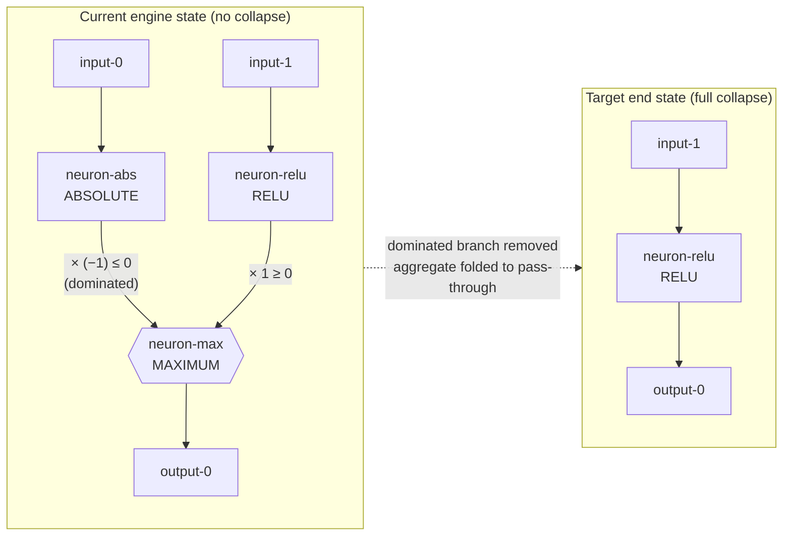
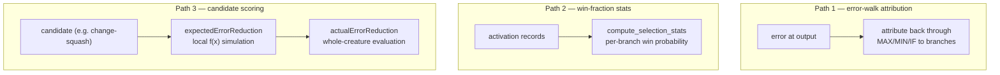
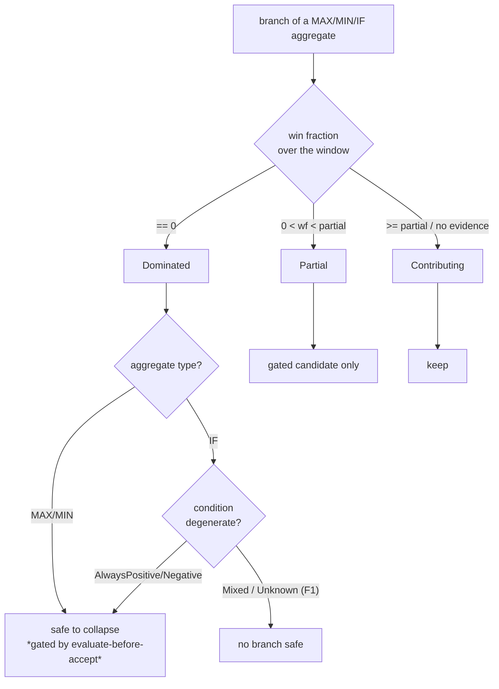

# Dominated-branch collapse & contribution propagation — extent report (Issue #1704)

The primary deliverable of milestone **#1704** (TDD: dominated-branch collapse
and contribution logic through MAX/MIN/IF), synthesised for the extent-report
sub-issue **#1708** from the committed characterisation work:

- Fixtures (#1705): `tests/fixtures/dominated_branch_collapse/`.
- Collapse characterisation (#1706):
  `tests/issue_1706_dominated_branch_characterisation.rs`.
- Contribution-propagation characterisation (#1707): grounded here against the
  committed candidate-cache fixtures and the engine seams named below.

This is a **report only** — it changes no engine behaviour. Every concrete gap
it identifies is filed as a separate follow-up issue and linked from #1704; the
register is at the end.

## Scope

Three questions, one per section:

1. **Dominated-branch collapse** — to what extent does the engine detect and
   collapse dominated branches feeding MAXIMUM / MINIMUM / IF (including IF
   condition synapses), on both analytical and empirical bases, versus the
   full-collapse target?
2. **Contribution propagation** — where does contribution logic hold, and where
   does it break down, through those aggregates across the three paths
   (error-walk attribution, `compute_selection_stats` win-fraction stats,
   candidate scoring)?
3. **"Not so clean" cases** — the partially-dominated shapes found during
   characterisation.

---

## 1. Dominated-branch collapse

### What "collapse" means

For the worked example the target end state is a **full collapse**:

The dominated branch is removed **and** the surviving single-branch aggregate
becomes a pass-through with weights/biases folded.

### Dominance bases characterised

| Basis | Definition | MAX | MIN | IF |
|-------|-----------|-----|-----|----|
| **Analytical** | activation range × weight sign, provable for all inputs | `ABSOLUTE(x) ≥ 0` scaled by `−1` ⇒ `≤ 0`; can never win a MAXIMUM against `RELU ≥ 0` | `RELU(x) ≥ 0` can never win a MINIMUM against `ABSOLUTE×(−1) ≤ 0` | **Not** a magnitude property — see F1 |
| **Empirical** | branch never wins on the recorded observation window | ABSOLUTE branch wins 0 / N² samples | RELU branch wins 0 / N² samples | negative branch selected 0 times on a condition>0 window |

### Current vs target behaviour

| Aggregate | Current engine behaviour | Target |
|-----------|--------------------------|--------|
| MAXIMUM | No collapse. Nearest transform (constant-neuron bias-fold, #1620/#1623) flags nothing — its detector seam `functionally_constant_neuron_uuids` returns empty; there is **no analytical dominance proof** in the engine. | Remove `neuron-abs`, fold `neuron-max` to `input-1 → neuron-relu → output-0`. |
| MINIMUM | No collapse (mirror of MAX, sign flipped). | Remove the dominated `neuron-relu`, fold to `input-0 → neuron-abs → output-0`. |
| IF | No collapse. | Remove the dominated branch **only where the condition is degenerate** — see F1. |

The engine has **no dominance detection at all** for these aggregates today, so
the extent of automatic collapse is **zero** across all three types and both
dominance bases. The characterisation suite pins that "zero" so any future move
toward the target (or a regression) trips a labelled `current vs target`
assertion in CI. → **Gap G1**.

---

## 2. Contribution propagation

The suspected root cause of Discovery producing **no successful candidates**:
does contribution logic survive the trip through a selection aggregate? Three
paths, characterised against the committed candidate-cache fixtures.

| Path | Seam | Verdict | Evidence |
|------|------|---------|----------|
| 1 — Error-walk attribution | `src/focus/impact.rs`, `src/focus/gradient.rs` (`SquashCategory::Selection` for MIN/MAX/IF) | **Suspect.** Selection squashes are treated conservatively (impact not normalised), but attribution through the *selection* semantics is not proven correct here; flagged for characterisation alongside path 3. | Aggregate errors depend on which branch won — see NEAT-AI#3389 (aggregates recording their own value/errors), which feeds this path. |
| 2 — Win-fraction stats | `src/focus/impact.rs::compute_selection_stats` (+ `compute_min_stats`/`compute_max_stats`/`compute_if_stats`) | **Sound.** For IF: condition synapses count as always-contributing (p=1.0); positive branch = fraction where condition sum `> 0`; negative = fraction where `≤ 0`. | NEAT-AI-Explore#513 verified engine + Discovery win-fraction attribution correct (the bug there was viewer-only). Treated as the canary — a future failure is a true regression. |
| 3 — Candidate scoring | `src/analysis/detection/squash_weight_rescale.rs::detect_squash_weight_rescale_candidates` | **Broken through aggregates.** The estimator **skips aggregate squashes** (`if is_aggregate_squash(current_squash) { continue; }`) and simulates each candidate neuron **in isolation as `f(x)`**, comparing MAE on that neuron's own records. It never models how the neuron's output is *selected* by a downstream MAX/MIN/IF, so a change that flips a branch's activation sign/range — changing which branch the aggregate picks — is invisible to the estimate. | `candidate_cache/v2_change-squash_selu-to-absolute.json`: SELU→ABSOLUTE predicted **+3.0e-10**, measured **−6.0e-4** (sign-flipped: SELU can be negative, ABSOLUTE is always `≥ 0`). `d1ac1f41.json`: 1 success / 5 failures, every failure over-predicts the gain. |

**Finding.** Path 2 holds; the divergence lives in paths 1 and 3. The concrete
misprediction (`+3.0e-10` predicted vs `−6.0e-4` actual) is explained by a
**local-simulation** expected-gain that does not propagate the candidate's
changed activation range through the downstream aggregate's selection. → **Gap G3**.

### Expected-vs-actual divergence (candidate-cache fixtures)

| Fixture record | changeType | expectedErrorReduction | actualErrorReduction | Divergence |
|----------------|-----------|------------------------|----------------------|-----------|
| `v2_change-squash_selu-to-absolute` | change-squash | `+3.0e-10` | `−6.0e-4` | sign flip; predicted ≈0 gain, real loss |
| `d1ac1f41` failure-0 | change-squash | `+3.1e-10` | `−4.0e-4` | sign flip |
| `d1ac1f41` failure-1..4 | remove-neuron | `+0.15 … +0.09` | `−2.0e-4 … −1.0e-4` | large over-prediction |
| `d1ac1f41` success-0 | remove-neuron | `+2.0e-4` | `+3.0e-4` | agree (the lone success) |

The pattern is uniform: through aggregates, predicted gain is systematically
optimistic — 5 of 6 candidates are accepted on a prediction that the
whole-creature evaluation then refutes.

---

## 3. "Not so clean" cases (partial dominance)

Catalogued during characterisation; each is a shape the clean-fixture suite
deliberately does **not** assert. → **Gap G2**.

- **F1 — IF dominance is conditional, not global.** IF selection is driven by
  the condition synapse (`src/focus/impact.rs`: positive branch when the summed
  condition contribution `> 0`, negative when `≤ 0`), not by branch magnitude.
  The negative `ABSOLUTE×(−1)` branch is dominated **only** on the sub-window
  where the condition selects positive; flip the condition sign and that same
  branch becomes the *only* selected branch. A safe IF collapse must prove the
  condition is degenerate over the observation window, not merely that one
  branch is one-signed. Test: `if_dominance_is_conditional_not_global`.

- **F2 — Multi-branch and small-win-fraction shapes.** Branches that win
  occasionally (a non-empty but small win fraction), aggregates with more than
  two branches (a branch dominated by the *combination* of the others without
  being pairwise-dominated by any single one), and near-degenerate conditions
  are all partially-dominated. Characterised as findings; `#1706` asserts only
  the clean, fully-dominated fixtures.

- **F3 — Nearest available transform is a poor proxy.** The constant-neuron
  bias-fold path only fires for *functionally constant* (zero-variance) neurons.
  A dominated branch is not constant (it varies across the window), so no
  existing transform will ever reach it. Closing the gap needs a new
  analytical-dominance detector, not a tweak to the constant-neuron path.

### G2 status — partial-dominance safety analyser landed (#1712)

The **safety-verdict** half of G2 is implemented in
`src/focus/partial_dominance.rs` (`analyse_partial_dominance` /
`safe_collapse_branches`). It classifies every MAX/MIN/IF branch over the
recorded window from its empirical win fraction and decides where a collapse is
*provably safe* — the input the #1623 evaluate-before-accept gate and the #1711
collapse transform consume. It performs **no** mutation itself.

- **F1 (IF).** A dominated IF branch is safe **only** when the condition is
  provably degenerate over the window; a `Mixed` condition holds every branch,
  matching `if_dominance_is_conditional_not_global`.
- **Multi-branch.** Combination dominance falls out of the win fraction — a
  branch that never wins the true multi-way selection scores `0` even when no
  single other branch pairwise-dominates it.
- **Small win fraction.** `0 < wf < partial_win_fraction` ⇒ `Partial`: a gated
  candidate only, never auto-collapsed.

The **collapse transform** that acts on these verdicts remains G1/#1711.

---

## Follow-up issue register

Every actionable gap is filed as a separate follow-up and linked from #1704. Any
future behaviour-changing removal must pass an **evaluate-before-accept gate**,
consistent with the #1623 pattern.

| Gap | Follow-up | Summary |
|-----|-----------|---------|
| **G1** | #1711 (**closed**) | Analytical dominated-branch collapse detector + transform for MAX/MIN aggregates. **Delivered** in `src/analysis/dominated_branch_collapse.rs`: a sound sign-based dominance proof (`weight × squash(range)`) plus a collapse transform that removes the dominated branch and folds the single-survivor aggregate to a pass-through, behind the #1623-style evaluate-before-accept gate. |
| **G2** | #1712 | Partially-dominated shapes: IF conditional dominance (F1), multi-branch aggregates, small-but-non-zero win fraction (F2). |
| **G3** | #1713 (**closed**) | Contribution-propagation break: expected-error-reduction estimator ignores downstream aggregate selection (change-squash skips aggregates; SELU→ABSOLUTE `+3.0e-10` vs `−6.0e-4`). **Delivered** in `src/analysis/detection/squash_weight_rescale.rs`: `detect_squash_weight_rescale_candidates` now gates out any candidate whose branch feeds a downstream aggregate selection (`feeds_downstream_aggregate`), so no misleading local `f(x)` estimate is emitted until a proper propagation model exists. |

### Cross-repo dependencies noted during characterisation

- **NEAT-AI#3389** — MAX/MIN/IF aggregate neurons recording their own
  value/errors; affects the empirical signals path 1 (error-walk) and path 2
  (win-fraction) consume.
- **NEAT-AI-Explore#513** — MIN-squash misattribution was a viewer-only bug;
  engine + Discovery win-fraction attribution verified correct, which constrains
  the contribution break to paths 1 and 3 (not path 2).
