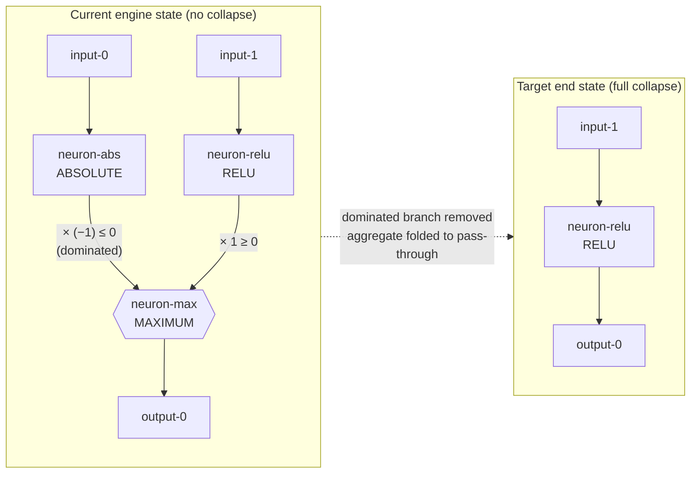

# Dominated-branch collapse — extent report (Issue #1706)

Characterisation findings on the **extent** to which dominated branches feeding
selection aggregates (MAXIMUM, MINIMUM, IF) are detected and could collapse in
the Rust discovery engine today. This report accompanies the characterisation
suite `tests/issue_1706_dominated_branch_characterisation.rs` and feeds the
extent-report sub-issue **#1708**. Partial-dominance findings recorded here are
follow-up material for #1708 — they are *not* handled in #1706.

## What "collapse" means

For the worked example the target end state is a **full collapse**:

The dominated branch is removed **and** the surviving single-branch aggregate
becomes a pass-through with weights/biases folded.

## Dominance bases characterised

| Basis | Definition | MAX | MIN | IF |
|-------|-----------|-----|-----|----|
| **Analytical** | activation range × weight sign, provable for all inputs | `ABSOLUTE(x) ≥ 0` scaled by `−1` ⇒ `≤ 0`; can never win a MAXIMUM against `RELU ≥ 0` | `RELU(x) ≥ 0` can never win a MINIMUM against `ABSOLUTE×(−1) ≤ 0` | **Not** a magnitude property — see below |
| **Empirical** | branch never wins on the recorded observation window | ABSOLUTE branch wins 0 / N² samples | RELU branch wins 0 / N² samples | negative branch selected 0 times on a condition>0 window |

## Current vs target behaviour

| Aggregate | Current engine behaviour | Target |
|-----------|--------------------------|--------|
| MAXIMUM | No collapse. Nearest transform (constant-neuron bias-fold, #1620/#1623) flags nothing — its detector seam `functionally_constant_neuron_uuids` returns empty; there is **no analytical dominance proof** in the engine. | Remove `neuron-abs`, fold `neuron-max` to `input-1 → neuron-relu → output-0`. |
| MINIMUM | No collapse (mirror of MAX, sign flipped). | Remove the dominated `neuron-relu`, fold to `input-0 → neuron-abs → output-0`. |
| IF | No collapse. | Remove the dominated branch **only where the condition is degenerate** — see finding F1. |

The engine has **no dominance detection at all** for these aggregates today, so
the extent of automatic collapse is **zero** across all three types and both
dominance bases. The characterisation suite pins that "zero" so any future move
toward the target (or a regression) trips a labelled `current vs target`
assertion in CI.

## Findings for the extent report (#1708)

- **F1 — IF dominance is conditional, not global (partially-dominated).** Unlike
  MAX/MIN, IF selection is driven by the condition synapse
  (`src/focus/impact.rs`: positive branch when the summed condition contribution
  `> 0`, negative when `≤ 0`), not by branch magnitude. The negative
  `ABSOLUTE×(−1)` branch is dominated **only** on the sub-window where the
  condition selects positive; flip the condition sign and that same branch
  becomes the *only* selected branch. A safe IF collapse must therefore prove
  the condition is degenerate over the observation window, not merely that one
  branch is one-signed. Test:
  `if_dominance_is_conditional_not_global`.

- **F2 — "Not so clean" partial dominance is out of scope for #1706.** Branches
  that win occasionally (a non-empty but small win fraction), aggregates with
  more than two branches, and near-degenerate conditions are all
  partially-dominated cases. They are characterised as findings here and left
  for #1708 to prioritise; #1706 asserts only the clean, fully-dominated
  fixtures.

- **F3 — Nearest available transform is a poor proxy.** The constant-neuron
  bias-fold path only fires for *functionally constant* (zero-variance) neurons.
  A dominated branch is not constant (it varies across the window), so no
  existing transform will ever reach it. Closing the gap needs a new
  analytical-dominance detector, not a tweak to the constant-neuron path.
