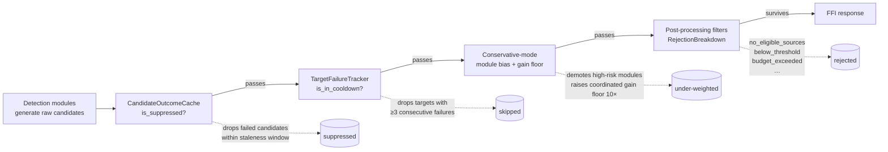
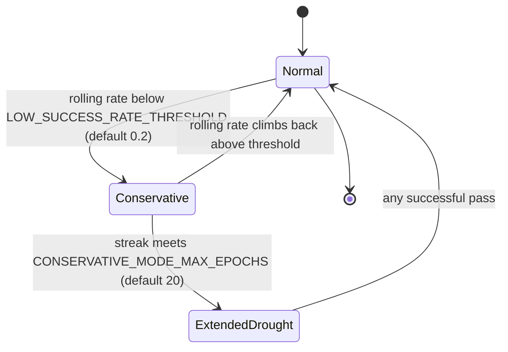

# Discovery Drought Playbook

When NEAT-AI-Discovery reports "no successful candidates for a while", four
suppression layers interact: the candidate outcome cache, the per-target
cooldown tracker, conservative-mode module bias, and post-processing rejection
filters. This playbook explains how to diagnose and respond without reading
source.

It is the operator companion to:

- Issue #1132 — creature-level discovery mode (Normal / Conservative).
- Issue #1130 — target cooldown tracker.
- Issue #465 — candidate outcome cache and source-type stats.
- Issue #1202 — drought diagnostic (`droughtDiagnostic`).
- Issue #1203 — adaptive staleness window.
- Issue #1205 — operator escape hatch (forced reset).
- Issue #1274 — dominant-failure-pattern enrichment of the diagnostic.

## Symptoms

A discovery drought presents as one or more of:

- **Empty `analyze_parallel` responses** — no candidates returned for several
  consecutive passes (typically ≥ 5).
- **`tracing::warn!` event** from `src/analysis/drought_diagnostic.rs`:

  ```text
  WARN Issue #1202: discovery drought — no successful candidates for N
  consecutive passes
      consecutive_failures=N rolling_success_rate=0.0
      discovery_mode="conservative" candidate_cache_size=…
      candidate_cache_suppressed_count=…  target_cooldown_active_count=…
      target_cooldown_skipped=…  dominant_rejection_reason="…"
      dominant_rejection_count=…  total_candidates_considered=…
      total_candidates_rejected=…  drought_threshold=5
  ```

- **`droughtDiagnostic` populated on FFI metadata**. Both
  `synapseMetadata.droughtDiagnostic` and `neuronMetadata.droughtDiagnostic`
  carry the same JSON shape:

  ```json
  {
    "consecutiveFailures": 7,
    "rollingSuccessRate": 0.0,
    "discoveryMode": "conservative",
    "candidateCacheSize": 412,
    "candidateCacheSuppressedCount": 138,
    "targetCooldownActiveCount": 24,
    "targetCooldownSkipped": 3,
    "dominantRejectionReason": "no_eligible_sources",
    "dominantRejectionCount": 91,
    "totalCandidatesConsidered": 91,
    "totalCandidatesRejected": 91,
    "dominantFailedModule": "coordinated-structural",
    "dominantFailedModuleShare": 0.91,
    "dominantFailedTargetUuid": "533d8616-…",
    "dominantFailedTargetShare": 0.96,
    "dominantOperationCount": 4,
    "predictedVsActualGapP50": -1000.0
  }
  ```

  The final six fields (Issue #1274) summarise the **shape** of recent
  failures: which module / target / op count dominates and how badly the
  predicted gain compared with the measured one. They populate once the
  rolling per-creature failure window holds at least five entries; below
  that the dominant fields are `null` / `0.0`.

- **`discovery_mode` flips to `"conservative"`** in FFI metadata (Issue #1132)
  once the rolling success rate over the last 10 passes drops below the
  threshold.

## Environmentally-disabled passes vs genuine exhaustion (Issue #1421)

Not every empty pass is a drought. When a pass is gated by the memory budget,
CRITICAL memory pressure, or a missing GPU adapter, the analysis **never
evaluated the creature** — it returns 0 candidates for the same reason a search
that found nothing does, but it carries no search-exhaustion signal. Counting
such passes as failures conflates *"this host can't run discovery"* with *"the
creature has no improving move"* and corrupts every downstream mitigation.

The FFI response distinguishes the two:

- `environmentallyDisabled` on `AnalyzeParallelOutput` is set to
  `"memoryGated"`, `"memoryPressure"`, or `"gpuUnavailable"` when the pass was
  gated. It is **absent** for a genuine pass (including a genuine empty one).
- A distinct `tracing::warn!` fires — `Issue #1421: discovery pass
  environmentally disabled` with a `reason=` field — separate from the
  `Issue #1202` drought warn.


**Operator action:** when `environmentallyDisabled` is set, do **not** append
the pass to the discovery outcome log as a failure and do **not** record a
per-target / per-module failure. The Rust helpers enforce this:

- `DiscoveryOutcomeLog::record_outcome` skips gated passes (bumping the
  `environmentallyDisabledPasses` counter instead of the trailing streak).
- `TargetFailureTracker::record_failure_unless_disabled`,
  `ModuleStarvationTracker::record_failure_unless_disabled`, and
  `CandidateOutcomeCache::record_unless_disabled` no-op on a gated pass and
  return `false`.

Repeated `environmentallyDisabled` passes point at the **host**, not the
creature — chase the memory-gate / GPU-fallback follow-ups, not the drought
levers below.

## Suppression Layers

Four mechanisms can independently suppress candidate emission. They run in
sequence; each one passes its survivors to the next.



| Layer | Source file | Records into the diagnostic as |
|-------|-------------|-------------------------------|
| Candidate cache | `src/analysis/candidate_cache.rs` | `candidateCacheSize`, `candidateCacheSuppressedCount` |
| Target cooldown | `src/analysis/target_failure_tracker.rs` | `targetCooldownActiveCount`, `targetCooldownSkipped` |
| Conservative bias | `src/analysis/discovery_mode.rs` | `discoveryMode`, indirectly via lowered acceptance |
| Post-processing | `src/analysis/diagnostics/rejection.rs` | `dominantRejectionReason`, `dominantRejectionCount`, `totalCandidates*` |

Notes:

- **Candidate cache** suppresses a candidate when the same
  `(source, target, operation)` triple failed within the **effective**
  staleness window (Issue #1203 — see below).
- **Target cooldown** drops a target after
  `NEAT_AI_DISCOVERY_TARGET_COOLDOWN_FAILURES` consecutive failures and keeps
  it out for `NEAT_AI_DISCOVERY_TARGET_COOLDOWN_EPOCHS` epochs.
- **Conservative mode** is creature-level: the same module set is biased, the
  coordinated-structural gain floor is tightened by
  `NEAT_AI_DISCOVERY_CONSERVATIVE_GAIN_MULTIPLIER`× (default 10×), and high-risk
  modules (`add-neurons`, `coordinated-structural`, …) are penalised.
- **Post-processing rejection** is the source of `dominantRejectionReason`. The
  reason name tells you which lever to investigate first.

## Diagnostic Walkthrough

When you see the warn log or a populated `droughtDiagnostic`, read it
top-to-bottom and follow the lever each field points at.

| Field | Meaning | Lever to investigate |
|-------|---------|----------------------|
| `consecutiveFailures` | Trailing empty-pass streak. Threshold for emission: `NEAT_AI_DISCOVERY_DROUGHT_LOG_THRESHOLD` (default 5). | If unexpectedly large, also check `DROUGHT_RESET_AFTER_EPOCHS`. |
| `rollingSuccessRate` | Successes in last 10 passes / 10. Below `LOW_SUCCESS_RATE_THRESHOLD` (default 0.2) drives Conservative mode. | If at or near 0.0, every suppression layer is operating at full strength — look for the dominant rejection reason. |
| `discoveryMode` | `"normal"` or `"conservative"`. | If `conservative` and the rate is still falling, conservative mode is not helping — tune `CONSERVATIVE_GAIN_MULTIPLIER` or wait for the `CONSERVATIVE_MODE_MAX_EPOCHS` cooldown exit. |
| `candidateCacheSize` | Total cache entries (successes + failures). | A very large cache (>10k) with high suppression suggests the staleness window is too long for this run. |
| `candidateCacheSuppressedCount` | Failed entries inside the **effective** staleness window — actively suppressing candidates. | If this dominates the diagnostic, the staleness window is the culprit. Conservative mode already halves it (Issue #1203); extended drought quarters it. If still too large, the operator reset (`DROUGHT_RESET_AFTER_EPOCHS`, Issue #1205) is the next lever. |
| `targetCooldownActiveCount` | Targets in cooldown right now. | Compare to total focus targets. If most targets are in cooldown, lower `TARGET_COOLDOWN_FAILURES` is unsafe — raise `LOW_SUCCESS_RATE_THRESHOLD` instead so Conservative mode triggers earlier. |
| `targetCooldownSkipped` | Targets dropped by the cooldown filter on **this** pass. | If 0 with a large `targetCooldownActiveCount`, the focus set never included those targets — pre-screening is filtering before cooldown. |
| `dominantRejectionReason` | Most-frequent post-processing reject reason. | Each reason maps to a different mechanism: see the table below. |
| `dominantRejectionCount` | Hits for that reason on the current pass. | Compare to `totalCandidatesRejected` to gauge how dominant it is. |
| `totalCandidatesConsidered` | Returned + rejected. | If 0, no candidates reached post-processing — the cache and cooldown ate them. Reach for `DROUGHT_RESET_AFTER_EPOCHS`. |
| `totalCandidatesRejected` | Rejected across all reasons. | High counts with `totalCandidatesConsidered == totalCandidatesRejected` mean every candidate failed a filter — read `dominantRejectionReason` first. |
| `dominantFailedModule` | Discovery module responsible for most recent failures (e.g. `"coordinated-structural"`). `null` until ≥ 5 failures are recorded. | If one module dominates, its scoring / gain-floor settings are the first lever (e.g. `NEAT_AI_DISCOVERY_CONSERVATIVE_GAIN_MULTIPLIER` for coordinated-structural). |
| `dominantFailedModuleShare` | Share (0.0–1.0) of recent failures from `dominantFailedModule`. | A share > 0.8 means the pipeline is essentially failing on one module — investigate that module's recommendation logic. |
| `dominantFailedTargetUuid` | Target neuron UUID that absorbs the most recent failures. `null` until ≥ 5 failures are recorded. | A single dominant target usually means the cooldown tracker has not engaged yet, or the target is structurally unfit for new attachments. Compare with `targetCooldownActiveCount`. |
| `dominantFailedTargetShare` | Share (0.0–1.0) of recent failures targeting `dominantFailedTargetUuid`. | A share at 1.0 means every recent failure hit the same neuron — almost certainly an output saturation or sink-neuron problem. |
| `dominantOperationCount` | Most common operation count (e.g. `4` for 4-op coordinated-structural collapses). `null` until ≥ 5 failures are recorded. | High values (≥ 4) with a coordinated-structural dominant module point at collapse-variant overfitting. |
| `predictedVsActualGapP50` | Median ratio of `actualErrorReduction / expectedCreatureScoreGain`. Negative means the candidates moved error the wrong way. `0.0` when the window is below the 5-failure floor or every prediction was zero. | Large magnitude (≥ 100 either way) means the scorer is mis-calibrated for the dominant module — bump the calibration prior (`NEAT_AI_DISCOVERY_RISKY_SQUASH_PRIOR`) or shrink the conservative-mode gain multiplier. |

Common `dominantRejectionReason` values and the lever each implies:

| Reason | Implication |
|--------|-------------|
| `no_eligible_sources` | Source pre-screening (sample variance, range checks) eliminated every source. Often a sign that the creature has converged structurally. |
| `below_threshold` | Candidates were generated but their expected gain failed the coordinated-structural floor. Conservative mode raises this floor 10×; consider lowering `CONSERVATIVE_GAIN_MULTIPLIER` or waiting for cooldown exit. |
| `budget_exceeded` | Module budget allocation is leaving no headroom. Inspect `module_weights` snapshot. |
| `cooldown_skipped` | Targets eliminated by `TargetFailureTracker`. Cross-check `targetCooldownActiveCount`. |
| `duplicate` / `redundant_path` | Deduplication is eating the candidate pool — the creature is in a flat region of the search space. |

## Adaptive Responses

The library applies two automatic relaxation mechanisms before any operator
action is required.

### Three regimes



| Regime | Trigger | Cache effective window | Module bias | Coordinated gain floor |
|--------|---------|------------------------|-------------|------------------------|
| **Normal** | Default | `staleness_window` (default 100 epochs) | unchanged | 1× |
| **Conservative** | Rolling success rate &lt; `LOW_SUCCESS_RATE_THRESHOLD` and streak ≤ `CONSERVATIVE_MODE_MAX_EPOCHS` | `staleness_window / STALENESS_CONSERVATIVE_DIVISOR` (default 100 / 2 = 50), floor 5 | low-risk modules boosted 1.5×, high-risk penalised 1/1.5× | `CONSERVATIVE_GAIN_MULTIPLIER`× (default 10×) |
| **Extended Drought** | Streak ≥ `CONSERVATIVE_MODE_MAX_EPOCHS` | `staleness_window / STALENESS_EXTENDED_DROUGHT_DIVISOR` (default 100 / 4 = 25), floor 5 | reverts to Normal — the bias did not help | reverts to 1× |

Notes:

- The Cache effective window is recomputed on every `is_suppressed` call. A
  transition emits a single `tracing::info!` event so the operator sees the
  window change without re-running under debug logging.
- After Extended Drought reverts to Normal, the **operator escape hatch**
  (Issue #1205, env var `NEAT_AI_DISCOVERY_DROUGHT_RESET_AFTER_EPOCHS`) can
  clear failed cache entries and active cooldowns in one shot. A successful
  pass re-arms the lever.
- Adaptive target-cooldown relaxation is tracked under **Issue #1204** and is
  not yet shipped. Until it lands the target cooldown thresholds remain
  static (`TARGET_COOLDOWN_FAILURES`, `TARGET_COOLDOWN_EPOCHS`); the operator
  reset path covers the worst case.

## Operator Levers

Every relevant environment variable, its default, valid range, and when an
operator should change it. All variables are read at runtime so they can be
flipped between runs without recompilation.

| Env var | Type | Default | Range | When to change |
|---------|------|---------|-------|----------------|
| `NEAT_AI_DISCOVERY_DROUGHT_LOG_THRESHOLD` | u32 | 5 | ≥ 1 | Lower to surface droughts earlier in noisy environments; raise to suppress the warn log when short droughts are expected. |
| `NEAT_AI_DISCOVERY_STALENESS_CONSERVATIVE_DIVISOR` | u64 | 2 | 1–64 (clamped) | Larger value (e.g. 4) shrinks the Conservative-mode cache window further, re-enabling failed candidates sooner. Use only when conservative bias plus halved window is not freeing candidates. |
| `NEAT_AI_DISCOVERY_STALENESS_EXTENDED_DROUGHT_DIVISOR` | u64 | 4 | 1–64 (clamped) | Larger value (e.g. 8) shrinks the Extended-Drought cache window further. Effective window has a hard floor of 5 epochs regardless of divisor. |
| `NEAT_AI_DISCOVERY_DROUGHT_RESET_AFTER_EPOCHS` | u32 | unset (off) | ≥ 1 | Enable the operator escape hatch. Set to e.g. 30 to force a one-shot cache + cooldown reset after a 30-pass drought. Most operators leave this off and intervene manually. |
| `NEAT_AI_DISCOVERY_LOW_SUCCESS_RATE_THRESHOLD` | f32 | 0.2 | (0.0, 1.0] | Raise to enter Conservative mode earlier (e.g. 0.3 if 30 % success is too low for this workload). Values outside the range are ignored. |
| `NEAT_AI_DISCOVERY_CONSERVATIVE_MODE_MAX_EPOCHS` | u32 | 20 | ≥ 1 | Lower to revert to Normal sooner when bias is not helping; raise to give Conservative mode more time before it gives up. |
| `NEAT_AI_DISCOVERY_CONSERVATIVE_GAIN_MULTIPLIER` | f32 | 10.0 | ≥ 1.0 (values < 1 clamped) | Lower (e.g. 3.0) when 10× is starving the pipeline of coordinated-structural candidates. The floor never relaxes below the base constant. |
| `NEAT_AI_DISCOVERY_TARGET_COOLDOWN_FAILURES` | u32 | 3 | ≥ 1 | Raise to make the cooldown less aggressive when many targets are in cooldown simultaneously. |
| `NEAT_AI_DISCOVERY_TARGET_COOLDOWN_EPOCHS` | u64 | 10 | ≥ 1 | Lower to free targets faster after a failure streak. |
| `NEAT_AI_DISCOVERY_MH_TEMPERATURE` | f32 | unset (uses calibration default) | 0.01–5.0 | Raise to accept lower-gain candidates during a drought, lower to be stricter. Values outside the range are ignored with a warn log. |

## Worked Example — 30-epoch Drought

A creature reaches epoch 50 in Normal mode with a healthy 0.6 rolling success
rate, then starts producing empty passes. This example uses the defaults.

| Epoch | Streak | Rolling rate | Regime | What happens | Diagnostic / log to look at |
|-------|--------|--------------|--------|--------------|----------------------------|
| 51 | 1 | 0.5 | Normal | Empty pass. No diagnostic. | — |
| 52–54 | 2–4 | 0.4 → 0.2 | Normal | Three more empty passes. Streak < `DROUGHT_LOG_THRESHOLD`. | — |
| 55 | 5 | 0.1 | Normal | Streak hits the log threshold. `tracing::warn!` fires once, `droughtDiagnostic` populated. Rolling rate (0.1) is below `LOW_SUCCESS_RATE_THRESHOLD` (0.2) → mode flips. | `dominantRejectionReason` — likely `below_threshold` or `no_eligible_sources`. |
| 56 | 6 | 0.0 | **Conservative** | `discoveryMode="conservative"` in FFI metadata. Cache effective window halves to 50 (Issue #1203 `info!` log). High-risk modules penalised, coordinated gain floor × 10. | `info!` log: `effective_staleness_window=50 prior=100`. |
| 57–69 | 7–19 | 0.0 | Conservative | Conservative mode persists. `candidateCacheSuppressedCount` declines as the halved window re-enables candidates that failed > 50 epochs ago. | Watch `candidateCacheSuppressedCount` ramp down. |
| 70 | 20 | 0.0 | Conservative→**Extended Drought** | Streak crosses `CONSERVATIVE_MODE_MAX_EPOCHS`. Conservative bias drops; cache window quarters to 25 (floor still 5). | `info!` log: `effective_staleness_window=25 prior=50`. Mode in metadata flips back to `"normal"`; the drought diagnostic still fires every pass. |
| 71–79 | 21–29 | 0.0 | Extended Drought | Window is at 25 epochs. Any candidate that failed before epoch 46 is re-eligible. If `DROUGHT_RESET_AFTER_EPOCHS` is set (e.g. 25), the operator reset fires here. | Look for the one-shot `info!`: `Drought reset cleared N failed cache entries, M target cooldowns`. |
| 80 | 30 | 0.0 | Extended Drought | A new candidate finally succeeds. Streak collapses to 0; tombstone clears; cache window jumps back to 100 on next call. | `info!` log: `effective_staleness_window=100 prior=25`. Mode resumes Normal on the next pass. |

What an operator should look at, in order:

1. The first `droughtDiagnostic` payload at epoch 55 — confirm
   `dominantRejectionReason`.
2. Whether the rolling rate is climbing across epochs 56–69 — if yes,
   conservative bias is helping; if no, it is not and the pipeline will
   self-exit at epoch 70.
3. If the streak reaches 20 with no improvement, decide whether to enable
   `DROUGHT_RESET_AFTER_EPOCHS` for the next run.
4. If the streak passes 30 with no improvement, that is a structural
   problem (the creature has saturated the search space) — escalate to a
   human reviewer with the most recent `droughtDiagnostic` attached.

## See Also

- `src/analysis/discovery_mode.rs` — mode decision and bias logic.
- `src/analysis/candidate_cache.rs` — adaptive staleness window.
- `src/analysis/target_failure_tracker.rs` — per-target cooldown.
- `src/analysis/drought_diagnostic.rs` — `DroughtDiagnostic` schema and
  emission rule.
- [docs/CACHE_TUNING.md](CACHE_TUNING.md) — cache tier configuration.
- [docs/ANALYSIS_DEEP_DIVE.md](ANALYSIS_DEEP_DIVE.md) — overall analysis flow.
- [docs/FFI_API.md](FFI_API.md) — full FFI metadata reference.
