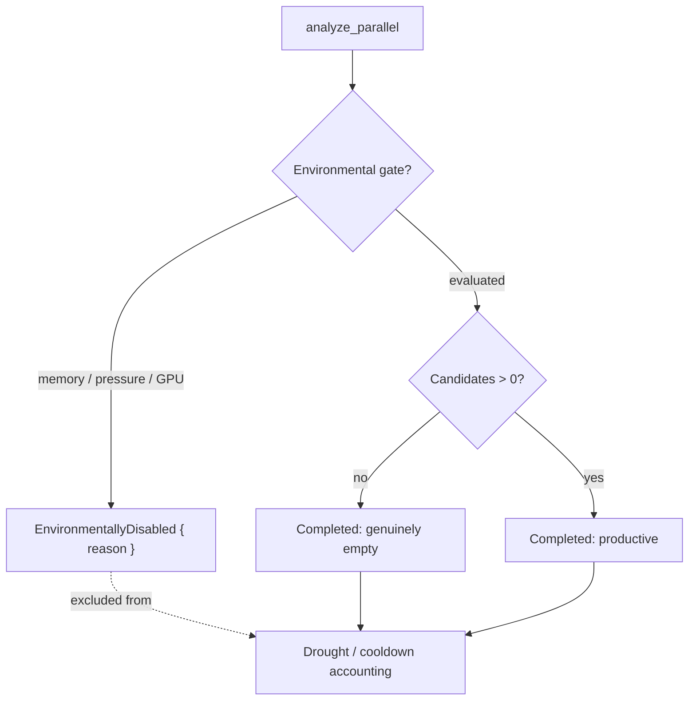
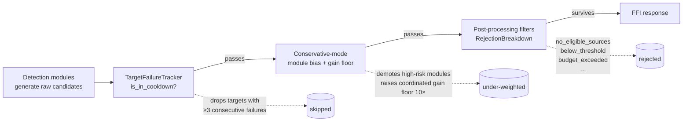
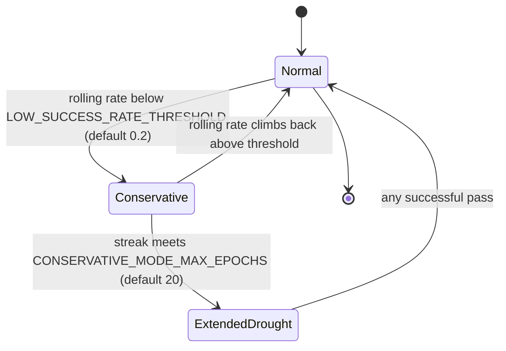

# Discovery Drought Playbook

When NEAT-AI-Discovery reports "no successful candidates for a while", four
suppression layers interact: the candidate outcome cache, the per-target
cooldown tracker, conservative-mode module bias, and post-processing rejection
filters. This playbook explains how to diagnose and respond without reading
source.

It is the operator companion to:

- Issue #1132 — creature-level discovery mode (Normal / Conservative).
- Issue #1130 — target cooldown tracker.
- Issue #465 — candidate outcome cache and source-type stats.
- Issue #1202 — drought diagnostic (`droughtDiagnostic`).
- Issue #1203 — adaptive staleness window.
- Issue #1205 — operator escape hatch (forced reset).
- Issue #1274 — dominant-failure-pattern enrichment of the diagnostic.
- Issue #1422 — escape hatch armed by default + startup config log line.
- Issue #1424 — creature-level drought alarm (`creatureDroughtAlarm`).

## Effective config at startup

Since Issue #1422 the library logs the effective value of every
drought-mitigation lever once at startup, so a drought is diagnosable from a
single log line without reading source:

```text
INFO Issue #1422: effective drought-mitigation config
    drought_reset_after_epochs="50" drought_log_threshold=5
    low_success_rate_threshold=0.2 conservative_mode_max_epochs=20
    conservative_gain_multiplier=10 target_cooldown_failures=3
    target_cooldown_epochs=10 staleness_conservative_divisor=2
    staleness_extended_drought_divisor=4 drought_alarm_epochs="100"
```

`drought_reset_after_epochs` renders as `"disabled"` when the operator has set
`NEAT_AI_DISCOVERY_DROUGHT_RESET_AFTER_EPOCHS=0`; `drought_alarm_epochs`
renders as `"disabled"` when `NEAT_AI_DISCOVERY_DROUGHT_ALARM_EPOCHS=0`.

## Creature-level drought alarm (Issue #1424)

The `droughtDiagnostic` above fires per pass once the *short* trailing-empty
streak crosses `NEAT_AI_DISCOVERY_DROUGHT_LOG_THRESHOLD` (default 5). It does
not, on its own, surface a creature that has gone *weeks* with no accepted
candidate — that case (Issue #1418) was previously only found by hand.

The creature-level **drought alarm** closes that gap. When a creature's
epochs-since-last-accepted-candidate crosses
`NEAT_AI_DISCOVERY_DROUGHT_ALARM_EPOCHS` (default 100) the library emits a
single, durable alarm — once per drought, on the crossing pass:

```text
WARN Issue #1424: creature-level discovery drought — no accepted candidate
for 100 epochs (search_exhaustion)
    creature_uuid="…" epochs_since_last_accepted=100
    genuinely_empty_passes=100 environmentally_disabled_passes=0
    classification="search_exhaustion" alarm_threshold=100
```

The same payload is attached to both `synapseMetadata.creatureDroughtAlarm`
and `neuronMetadata.creatureDroughtAlarm` so the surrounding automation can
raise an alert/issue without scraping logs:

```json
{
  "creatureUuid": "…",
  "epochsSinceLastAccepted": 100,
  "genuinelyEmptyPasses": 100,
  "environmentallyDisabledPasses": 0,
  "classification": "search_exhaustion"
}
```

`classification` reuses the Issue #1421 disambiguation:

- `"environmental"` — the drought is dominated by passes the host could not
  evaluate (memory budget, memory pressure, missing GPU). **Fix the host.**
- `"search_exhaustion"` — the drought is dominated by passes that evaluated
  the creature and found no improving move. **Escalate the creature.**

## Symptoms

A discovery drought presents as one or more of:

- **Empty `analyze_parallel` responses** — no candidates returned for several
  consecutive passes (typically ≥ 5).
- **`tracing::warn!` event** from `src/analysis/drought_diagnostic.rs`:

  ```text
  WARN Issue #1202: discovery drought — no successful candidates for N
  consecutive passes
      consecutive_failures=N rolling_success_rate=0.0
      discovery_mode="conservative" target_cooldown_active_count=…
      target_cooldown_skipped=…  dominant_rejection_reason="…"
      dominant_rejection_count=…  total_candidates_considered=…
      total_candidates_rejected=…  drought_threshold=5
  ```

- **`droughtDiagnostic` populated on FFI metadata**. Both
  `synapseMetadata.droughtDiagnostic` and `neuronMetadata.droughtDiagnostic`
  carry the same JSON shape:

  ```json
  {
    "consecutiveFailures": 7,
    "rollingSuccessRate": 0.0,
    "discoveryMode": "conservative",
    "targetCooldownActiveCount": 24,
    "targetCooldownSkipped": 3,
    "dominantRejectionReason": "no_eligible_sources",
    "dominantRejectionCount": 91,
    "totalCandidatesConsidered": 91,
    "totalCandidatesRejected": 91,
    "dominantFailedModule": "coordinated-structural",
    "dominantFailedModuleShare": 0.91,
    "dominantFailedTargetUuid": "533d8616-…",
    "dominantFailedTargetShare": 0.96,
    "dominantOperationCount": 4,
    "predictedVsActualGapP50": -1000.0
  }
  ```

  The final six fields (Issue #1274) summarise the **shape** of recent
  failures: which module / target / op count dominates and how badly the
  predicted gain compared with the measured one. They populate once the
  rolling per-creature failure window holds at least five entries; below
  that the dominant fields are `null` / `0.0`.

- **`discovery_mode` flips to `"conservative"`** in FFI metadata (Issue #1132)
  once the rolling success rate over the last 10 passes drops below the
  threshold.

## Environmentally-disabled passes vs genuine exhaustion (Issue #1421)

Not every empty pass is a drought. When a pass is gated by the memory budget,
CRITICAL memory pressure, or a missing GPU adapter, the analysis **never
evaluated the creature** — it returns 0 candidates for the same reason a search
that found nothing does, but it carries no search-exhaustion signal. Counting
such passes as failures conflates *"this host can't run discovery"* with *"the
creature has no improving move"* and corrupts every downstream mitigation.

The FFI response distinguishes the two:

- `environmentallyDisabled` on `AnalyzeParallelOutput` is set to
  `"memoryGated"`, `"memoryPressure"`, or `"gpuUnavailable"` when the pass was
  gated. It is **absent** for a genuine pass (including a genuine empty one).
- A distinct `tracing::warn!` fires — `Issue #1421: discovery pass
  environmentally disabled` with a `reason=` field — separate from the
  `Issue #1202` drought warn.



**Operator action:** when `environmentallyDisabled` is set, do **not** append
the pass to the discovery outcome log as a failure and do **not** record a
per-target / per-module failure. The Rust helpers enforce this:

- `DiscoveryOutcomeLog::record_outcome` skips gated passes (bumping the
  `environmentallyDisabledPasses` counter instead of the trailing streak).
- `TargetFailureTracker::record_failure_unless_disabled` and
  `ModuleStarvationTracker::record_failure_unless_disabled` no-op on a gated
  pass and return `false`.

Repeated `environmentallyDisabled` passes point at the **host**, not the
creature — chase the memory-gate / GPU-fallback follow-ups, not the drought
levers below.

## Suppression Layers

Three mechanisms can independently suppress candidate emission. They run in
sequence; each one passes its survivors to the next.

> **Issue #1792** — a fourth layer, `CandidateOutcomeCache`, used to be
> documented here. It was never constructed outside tests, so it suppressed
> nothing in production and its `candidateCacheSize` /
> `candidateCacheSuppressedCount` counters were structurally always `0`. The
> cache and both counters have been deleted. Candidate-identity suppression
> lives entirely in NEAT-AI's own failure-cache filter, which Discovery
> observes through `failureCacheSuppressedCount` / `noveltyEscalationActive`.



| Layer | Source file | Records into the diagnostic as |
|-------|-------------|-------------------------------|
| Target cooldown | `src/analysis/target_failure_tracker.rs` | `targetCooldownActiveCount`, `targetCooldownSkipped` |
| Conservative bias | `src/analysis/discovery_mode.rs` | `discoveryMode`, indirectly via lowered acceptance |
| Post-processing | `src/analysis/diagnostics/rejection.rs` | `dominantRejectionReason`, `dominantRejectionCount`, `totalCandidates*` |

Notes:

- **Candidate cache** suppresses a candidate when the same
  `(source, target, operation)` triple failed within the **effective**
  staleness window (Issue #1203 — see below).
- **Target cooldown** drops a target after
  `NEAT_AI_DISCOVERY_TARGET_COOLDOWN_FAILURES` consecutive failures and keeps
  it out for `NEAT_AI_DISCOVERY_TARGET_COOLDOWN_EPOCHS` epochs. The cooldown
  clock is the tracker's own epoch counter, advanced exactly once per discovery
  pass at the head of `analyze_all` (Issue #1790), so both the neuron and
  synapse cooldown filters see one consistent epoch per pass.
- **Conservative mode** is creature-level: the same module set is biased, the
  coordinated-structural gain floor is tightened by
  `NEAT_AI_DISCOVERY_CONSERVATIVE_GAIN_MULTIPLIER`× (default 10×), and high-risk
  modules (`add-neurons`, `coordinated-structural`, …) are penalised.
- **Post-processing rejection** is the source of `dominantRejectionReason`. The
  reason name tells you which lever to investigate first.

## Diagnostic Walkthrough

When you see the warn log or a populated `droughtDiagnostic`, read it
top-to-bottom and follow the lever each field points at. The authoritative field
schema and JSON shape live in
[docs/FFI_API.md § droughtDiagnostic](FFI_API.md#drought-diagnostic-metadata-issue-1202);
the table below adds the **operator lever to investigate** for each field.

| Field | Lever to investigate |
|-------|----------------------|
| `consecutiveFailures` | If unexpectedly large, also check `DROUGHT_RESET_AFTER_EPOCHS`. |
| `rollingSuccessRate` | If at or near 0.0, every suppression layer is operating at full strength — look for the dominant rejection reason. |
| `discoveryMode` | If `conservative` and the rate is still falling, conservative mode is not helping — tune `CONSERVATIVE_GAIN_MULTIPLIER` or wait for the `CONSERVATIVE_MODE_MAX_EPOCHS` cooldown exit. |
| `targetCooldownActiveCount` | Compare to total focus targets. If most targets are in cooldown, lowering `TARGET_COOLDOWN_FAILURES` is unsafe — raise `LOW_SUCCESS_RATE_THRESHOLD` instead so Conservative mode triggers earlier. |
| `targetCooldownSkipped` | If 0 with a large `targetCooldownActiveCount`, the focus set never included those targets — pre-screening is filtering before cooldown. |
| `dominantRejectionReason` | Each reason maps to a different mechanism: see the table below. |
| `dominantRejectionCount` | Compare to `totalCandidatesRejected` to gauge how dominant it is. |
| `totalCandidatesConsidered` | If 0, no candidates reached post-processing — the cache and cooldown ate them. Reach for `DROUGHT_RESET_AFTER_EPOCHS`. |
| `totalCandidatesRejected` | High counts with `totalCandidatesConsidered == totalCandidatesRejected` mean every candidate failed a filter — read `dominantRejectionReason` first. |
| `dominantFailedModule` | If one module dominates, its scoring / gain-floor settings are the first lever (e.g. `NEAT_AI_DISCOVERY_CONSERVATIVE_GAIN_MULTIPLIER` for coordinated-structural). |
| `dominantFailedModuleShare` | A share > 0.8 means the pipeline is essentially failing on one module — investigate that module's recommendation logic. |
| `dominantFailedTargetUuid` | A single dominant target usually means the cooldown tracker has not engaged yet, or the target is structurally unfit for new attachments. Compare with `targetCooldownActiveCount`. |
| `dominantFailedTargetShare` | A share at 1.0 means every recent failure hit the same neuron — almost certainly an output saturation or sink-neuron problem. |
| `dominantOperationCount` | High values (≥ 4) with a coordinated-structural dominant module point at collapse-variant overfitting. |
| `predictedVsActualGapP50` | Large magnitude (≥ 100 either way) means the scorer is mis-calibrated for the dominant module — bump the calibration prior (`NEAT_AI_DISCOVERY_RISKY_SQUASH_PRIOR`) or shrink the conservative-mode gain multiplier. |

Common `dominantRejectionReason` values and the lever each implies:

| Reason | Implication |
|--------|-------------|
| `no_eligible_sources` | Source pre-screening (sample variance, range checks) eliminated every source. Often a sign that the creature has converged structurally. |
| `below_threshold` | Candidates were generated but their expected gain failed the coordinated-structural floor. Conservative mode raises this floor 10×; consider lowering `CONSERVATIVE_GAIN_MULTIPLIER` or waiting for cooldown exit. |
| `budget_exceeded` | Module budget allocation is leaving no headroom. Inspect `module_weights` snapshot. |
| `cooldown_skipped` | Targets eliminated by `TargetFailureTracker`. Cross-check `targetCooldownActiveCount`. |
| `duplicate` / `redundant_path` | Deduplication is eating the candidate pool — the creature is in a flat region of the search space. |

## Adaptive Responses

The library applies two automatic relaxation mechanisms before any operator
action is required.

### Three regimes



| Regime | Trigger | Cache effective window | Module bias | Coordinated gain floor |
|--------|---------|------------------------|-------------|------------------------|
| **Normal** | Default | `staleness_window` (default 100 epochs) | unchanged | 1× |
| **Conservative** | Rolling success rate &lt; `LOW_SUCCESS_RATE_THRESHOLD` and streak ≤ `CONSERVATIVE_MODE_MAX_EPOCHS` | `staleness_window / STALENESS_CONSERVATIVE_DIVISOR` (default 100 / 2 = 50), floor 5 | low-risk modules boosted 1.5×, high-risk penalised 1/1.5× | `CONSERVATIVE_GAIN_MULTIPLIER`× (default 10×) |
| **Extended Drought** | Streak ≥ `CONSERVATIVE_MODE_MAX_EPOCHS` | `staleness_window / STALENESS_EXTENDED_DROUGHT_DIVISOR` (default 100 / 4 = 25), floor 5 | reverts to Normal — the bias did not help | reverts to 1× |

Notes:

- The Cache effective window is recomputed on every `is_suppressed` call. A
  transition emits a single `tracing::info!` event so the operator sees the
  window change without re-running under debug logging.
- After Extended Drought reverts to Normal, the **operator escape hatch**
  (Issue #1205, env var `NEAT_AI_DISCOVERY_DROUGHT_RESET_AFTER_EPOCHS`) can
  clear failed cache entries and active cooldowns in one shot. A successful
  pass re-arms the lever.
- Adaptive target-cooldown relaxation is tracked under **Issue #1204** and is
  not yet shipped. Until it lands the target cooldown thresholds remain
  static (`TARGET_COOLDOWN_FAILURES`, `TARGET_COOLDOWN_EPOCHS`); the operator
  reset path covers the worst case.

## Operator Levers

Every relevant environment variable and when an operator should change it. All
variables are read at runtime so they can be flipped between runs without
recompilation. **Defaults, valid ranges, and types are documented once** in the
single authoritative reference,
[docs/CONFIGURATION.md](CONFIGURATION.md) — this table carries only the
operator's "when to change" guidance so the two cannot drift apart.

| Env var | When to change |
|---------|----------------|
| `NEAT_AI_DISCOVERY_DROUGHT_LOG_THRESHOLD` | Lower to surface droughts earlier in noisy environments; raise to suppress the warn log when short droughts are expected. |
| `NEAT_AI_DISCOVERY_STALENESS_CONSERVATIVE_DIVISOR` | Larger value (e.g. 4) shrinks the Conservative-mode cache window further, re-enabling failed candidates sooner. Use only when conservative bias plus halved window is not freeing candidates. |
| `NEAT_AI_DISCOVERY_STALENESS_EXTENDED_DROUGHT_DIVISOR` | Larger value (e.g. 8) shrinks the Extended-Drought cache window further. Effective window has a hard floor of 5 epochs regardless of divisor. |
| `NEAT_AI_DISCOVERY_DROUGHT_RESET_AFTER_EPOCHS` | The operator escape hatch is **armed by default** (Issue #1422) so the one-shot cache + cooldown reset fires without operator action during a sustained drought. Lower (e.g. 30) to intervene sooner, or set to `0` to deliberately disable and intervene manually. |
| `NEAT_AI_DISCOVERY_LOW_SUCCESS_RATE_THRESHOLD` | Raise to enter Conservative mode earlier (e.g. 0.3 if 30 % success is too low for this workload). Values outside the range are ignored. |
| `NEAT_AI_DISCOVERY_CONSERVATIVE_MODE_MAX_EPOCHS` | Lower to revert to Normal sooner when bias is not helping; raise to give Conservative mode more time before it gives up. |
| `NEAT_AI_DISCOVERY_CONSERVATIVE_GAIN_MULTIPLIER` | Lower (e.g. 3.0) when 10× is starving the pipeline of coordinated-structural candidates. The floor never relaxes below the base constant. |
| `NEAT_AI_DISCOVERY_TARGET_COOLDOWN_FAILURES` | Raise to make the cooldown less aggressive when many targets are in cooldown simultaneously. |
| `NEAT_AI_DISCOVERY_TARGET_COOLDOWN_EPOCHS` | Lower to free targets faster after a failure streak. |
| `NEAT_AI_DISCOVERY_MH_TEMPERATURE` | Raise to accept lower-gain candidates during a drought, lower to be stricter. Values outside the range are ignored with a warn log. |
| `NEAT_AI_DISCOVERY_MODULE_TIERING_HIDDEN_THRESHOLD` | Hidden-neuron count above which **expensive**-tier discovery modules are skipped at dispatch on non-escalation passes (Issue #1547). Lower it to tier out sooner on mid-size creatures; set `0` to always run every module. Skipping is suppressed whenever the creature is in Conservative discovery mode, so the full set is re-enabled during a drought. |

## Module tiering during drought (Issue #1547)

On a **large** creature (`hidden_neuron_count` above
`NEAT_AI_DISCOVERY_MODULE_TIERING_HIDDEN_THRESHOLD`, default 1000) the expensive
discovery modules — multi-hop analysis, topology structure / diversification,
co-adaptation, weight-coherence, skip-connection scans — are skipped at dispatch
to protect the post-processing budget, because their cost grows super-linearly
with the hidden-neuron count.

**Escalation re-enables the full set.** The moment the creature enters
Conservative discovery mode (`discoveryMode="conservative"`, the same
low-rolling-success-rate signal that drives novelty escalation #1423 and the
drought escape hatch #1422), tiering is suppressed and every module runs again so
the escalation pass can try everything. That re-enable is logged:

```text
Issue #1547: drought/novelty escalation active — full discovery module set re-enabled on large creature
```

**Diagnostic signal:** during a drought pass on a large creature, the absence of
that re-enable line means tiering wrongly suppressed modules — the expected
first symptom is a falling accepted-candidate rate and the creature drought alarm
(#1424) firing more often. On a non-escalation pass the complementary line

```text
Issue #1547: creature-scale tiering — expensive discovery modules skipped on large creature (no escalation active)
```

names exactly which modules were skipped.

## Worked Example — 30-epoch Drought

A creature reaches epoch 50 in Normal mode with a healthy 0.6 rolling success
rate, then starts producing empty passes. This example uses the defaults.

| Epoch | Streak | Rolling rate | Regime | What happens | Diagnostic / log to look at |
|-------|--------|--------------|--------|--------------|----------------------------|
| 51 | 1 | 0.5 | Normal | Empty pass. No diagnostic. | — |
| 52–54 | 2–4 | 0.4 → 0.2 | Normal | Three more empty passes. Streak < `DROUGHT_LOG_THRESHOLD`. | — |
| 55 | 5 | 0.1 | Normal | Streak hits the log threshold. `tracing::warn!` fires once, `droughtDiagnostic` populated. Rolling rate (0.1) is below `LOW_SUCCESS_RATE_THRESHOLD` (0.2) → mode flips. | `dominantRejectionReason` — likely `below_threshold` or `no_eligible_sources`. |
| 56 | 6 | 0.0 | **Conservative** | `discoveryMode="conservative"` in FFI metadata. High-risk modules penalised, coordinated gain floor × 10. The target-cooldown window also relaxes (Issue #1204). | `discoveryMode` in the FFI metadata. |
| 57–69 | 7–19 | 0.0 | Conservative | Conservative mode persists. `targetCooldownActiveCount` declines as the relaxed cooldown window re-enables targets. | Watch `targetCooldownActiveCount` ramp down. |
| 70 | 20 | 0.0 | Conservative→**Extended Drought** | Streak crosses `CONSERVATIVE_MODE_MAX_EPOCHS`. Conservative bias drops. | Mode in metadata flips back to `"normal"`; the drought diagnostic still fires every pass. |
| 71–79 | 21–29 | 0.0 | Extended Drought | If the streak crosses `DROUGHT_RESET_AFTER_EPOCHS` (default 50, Issue #1422), the one-shot operator reset fires here. | Look for the one-shot `warn!`: `drought escape hatch fired — cleared N active target cooldowns`. |
| 80 | 30 | 0.0 | Extended Drought | A new candidate finally succeeds. Streak collapses to 0 and the reset tombstone clears, re-arming the lever. | Mode resumes Normal on the next pass. |

What an operator should look at, in order:

1. The first `droughtDiagnostic` payload at epoch 55 — confirm
   `dominantRejectionReason`.
2. Whether the rolling rate is climbing across epochs 56–69 — if yes,
   conservative bias is helping; if no, it is not and the pipeline will
   self-exit at epoch 70.
3. If the streak reaches 20 with no improvement, decide whether to enable
   `DROUGHT_RESET_AFTER_EPOCHS` for the next run.
4. If the streak passes 30 with no improvement, that is a structural
   problem (the creature has saturated the search space) — escalate to a
   human reviewer with the most recent `droughtDiagnostic` attached.

## See Also

- `src/analysis/discovery_mode.rs` — mode decision and bias logic.
- `src/analysis/module_tiering.rs` — creature-scale expensive-module tiering
  (Issue #1547) and its escalation re-enable.
- `src/analysis/target_failure_tracker.rs` — per-target cooldown.
- `src/analysis/drought_diagnostic.rs` — `DroughtDiagnostic` schema and
  emission rule.
- [docs/CACHE_TUNING.md](CACHE_TUNING.md) — cache tier configuration.
- [docs/ANALYSIS_DEEP_DIVE.md](ANALYSIS_DEEP_DIVE.md) — overall analysis flow.
- [docs/FFI_API.md](FFI_API.md) — full FFI metadata reference.
