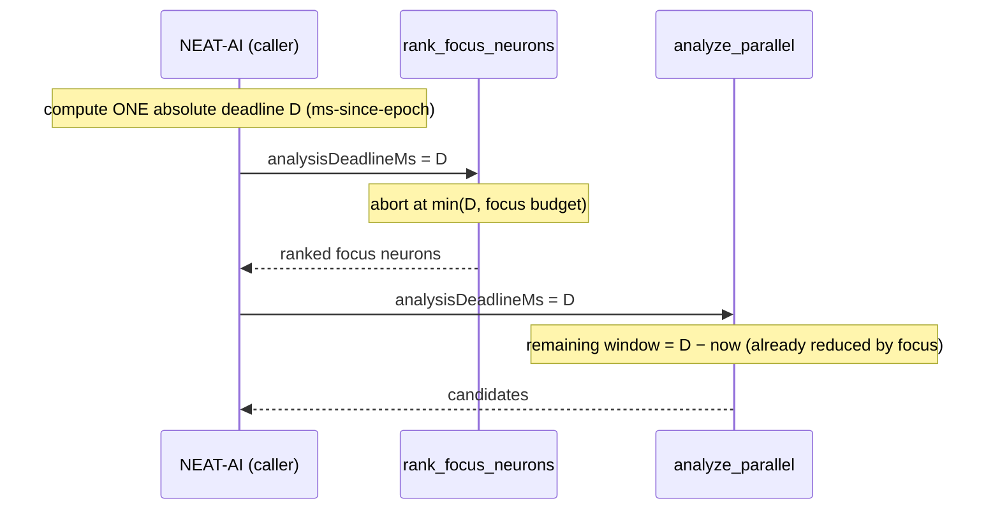
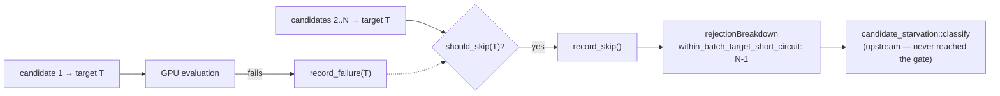
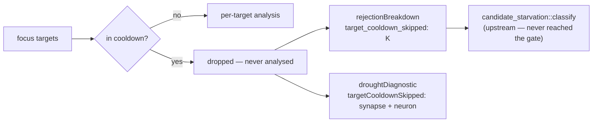
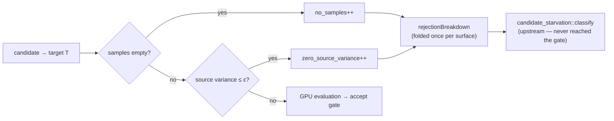

# 🔌 FFI API Reference

This document contains the detailed FFI API reference, JSON interface specifications,
and streaming recording API for NEAT-AI-Discovery. For a high-level overview, see
[README.md](../README.md).

---

## 📦 Exported Symbols

The library exposes a Deno FFI-friendly symbol set. The authoritative list of exported
symbols lives in `src/lib.rs` as `#[no_mangle] pub extern "C"` functions.

The most commonly used entry points are:

- **GPU probe**: `check_gpu_available()` (returns JSON)
- **Version probe**: `get_library_version()` (returns JSON)
- **Recording**:
  - Streaming: `start_discovery_session`, `append_discovery_records`, `finish_discovery_session`, `cancel_discovery_session`
  - Single-call: `record_discovery` (avoid for large runs; prefer streaming to prevent JS/V8 string limits)
- **Analysis**: `rank_focus_neurons`, `analyze_parallel`, `cancel_analysis`, `cancel_analysis_memory_pressure`, `reset_cancellation`, `is_analysis_active`
- **Utilities**: `merge_discovery_parquet`, `read_discovery_records_ffi`, `export_visualisation_snapshot`
- **Calibration**: `get_calibration_summary` (returns JSON)
- **Lifecycle / cleanup**: `cleanup_discovery_lib` (call before process exit), `cleanup_discovery_dir`, `clean_orphaned_discovery_dirs`
- **Memory usage**: `discovery_memory_usage_bytes()` (returns `u64`)
- **Memory management**: `free_discovery_result`

---

## 🧠 Rust-side Memory Usage (Issue #1027)

The Rust library allocates memory outside V8's heap, making it invisible to
Deno-side memory monitors. Use `discovery_memory_usage_bytes()` to query the
current Rust allocator usage and combine it with `Deno.memoryUsage().heapUsed`
for accurate total-process memory monitoring.

- **Symbol**: `discovery_memory_usage_bytes`
- **Input**: no arguments
- **Output**: `u64` — current Rust heap allocation in bytes
- **Overhead**: reads a single atomic counter; suitable for polling every 5–30 seconds
- **Panic safety**: catches panics and returns `0` on failure

### Example (Deno FFI)

```typescript
const lib = Deno.dlopen("libneat_ai_discovery.dylib", {
  discovery_memory_usage_bytes: { parameters: [], result: "u64" },
});

const rustBytes = lib.symbols.discovery_memory_usage_bytes();
const v8Bytes = Deno.memoryUsage().heapUsed;
const totalBytes = rustBytes + BigInt(v8Bytes);
```

---

## ⚡ Analysis Parameters (Issue #1028, #1029, #1020)

The `analyze_parallel` input accepts additional parameters to control resource
usage and candidate selection behaviour:

### Memory Budget (`max_analysis_memory_mb`)

Limits the Rust-side memory consumption during the analysis phase. When the
allocated memory exceeds the budget, analysis returns early with
`memory_budget_exceeded: true` in the output. For guidance on how this
interacts with cache tier selection, see
[CACHE_TUNING.md](CACHE_TUNING.md).

- **Field**: `max_analysis_memory_mb` (optional `u64`)
- **Default**: no limit
- **Checkpoints**: before GPU work submission and after parquet loading
- **Output field**: `memory_budget_exceeded` (`bool`) — `true` if analysis
  aborted due to exceeding the budget

### Analysis Deadline (`analysis_deadline_ms`)

Sets a wall-clock deadline for the analysis phase. Detection modules abort
early when the deadline is reached, returning whatever candidates have been
found so far. Coverage improves over repeated runs.

- **Field**: `analysis_deadline_ms` (optional `u64`)
- **Default**: no deadline
- **Behaviour**: deadline is passed to the record cache and detection dispatch

#### Shared across focus selection (Issue #1407)

Focus selection (`rank_focus_neurons`) runs as a **separate** FFI call before
`analyze_parallel`. To stop the two phases opening independent time windows,
`rank_focus_neurons` now also accepts `analysisDeadlineMs` — pass the **same
absolute** discovery deadline (ms-since-epoch) to both calls. Focus selection
then bills against that one deadline and aborts at whichever is sooner: the
shared deadline or the `NEAT_AI_DISCOVERY_FOCUS_RANKING_BUDGET_MS` wall-clock
budget.

Because the deadline is absolute, time consumed by focus selection (plus its
parquet load) naturally shrinks the window left for synapse/neuron analysis —
the later phase sees the remaining budget, not a fresh full window. When
`analysisDeadlineMs` is omitted from the focus call, the legacy budget-only
behaviour applies (backwards compatible).



### Wall-Clock Cap (`maxDiscoveryWallClockMinutes`) — Issue #1098

Caps the total elapsed time from discovery start (recording + analysis),
regardless of how recording and analysis budgets are split. The analysis
deadline is clamped to `min(analysis_deadline, discovery_start + wall_clock_cap)`.

- **Field**: `maxDiscoveryWallClockMinutes` (optional `u64`, minutes)
- **Default**: no cap (backwards compatible)
- **Behaviour**: when set, `refreshAnalysisTimeout()` (TypeScript side) and
  the Rust analysis engine both respect the overall wall-clock limit,
  preventing total discovery time from exceeding the configured cap

### Temperature (`temperature`)

Controls the exploration-exploitation balance during candidate selection.
Higher temperatures encourage exploration of more diverse candidates; lower
temperatures focus on the highest-scoring candidates.

- **Field**: `temperature` (`f32`)
- **Default**: `1.0` (neutral — no effect on thresholds)
- **Range**: `0.01` to `5.0`
- **Cooling**: callers can implement cooling schedules (linear or exponential)
  by decreasing this value across generations

When `NEAT_AI_DISCOVERY_MH_TEMPERATURE` is also set, Metropolis-Hastings
probabilistic acceptance is applied to synapse candidates, allowing
occasionally weaker candidates through to maintain search diversity.

### Phase Gating (`includeSynapseAnalysis` / `includeNeuronAnalysis`)

`analyze_parallel` runs two independent analysis phases — synapse discovery and
neuron discovery. Each phase can be switched off so a caller can run
neuron-only or synapse-only discovery (for example, to spend the full time
budget on one phase, or to skip a phase that is not relevant to the current
generation).

- **Field**: `includeSynapseAnalysis` (optional `bool`)
- **Field**: `includeNeuronAnalysis` (optional `bool`)
- **Default**: `true` for both — when the field is absent the corresponding
  phase runs, preserving existing behaviour.
- **Behaviour when `false`**: the corresponding phase is skipped entirely (no
  GPU work is submitted for it) and **its output fields are omitted from the
  response JSON** rather than emitted as empty values.

When `includeSynapseAnalysis` is `false`, the following fields are absent from
the output:

- `helpfulSynapses`
- `harmfulSynapses`
- `synapseDiagnostics`
- `synapseGpuUsed`
- `synapseMetadata`
- `synapseWeightUpdates`
- `coordinatedStructuralCandidates`
- `candidateClusters`

When `includeNeuronAnalysis` is `false`, the following fields are absent:

- `helpfulNeurons`
- `neuronDiagnostics`
- `neuronGpuUsed`
- `neuronMetadata`

When **both** are `false`, both phases are skipped and the call returns early
with `success: true` and none of the phase-specific fields above. Callers must
therefore treat a missing field as "phase not run", not as "phase ran and found
nothing" — the absence of, say, `helpfulSynapses` means synapse analysis was
disabled, whereas an empty `helpfulSynapses: []` means it ran and produced no
candidates.

### Cancellation Signal (Issue #1047)

Allows the host process to request graceful shutdown of in-flight analysis
(e.g. when SIGTERM arrives due to `max-task-hours exceeded`).

- **Symbol**: `cancel_analysis` — sets a global `AtomicBool` flag
  - **Input**: no arguments
  - **Output**: no return value
  - **Thread safety**: safe to call from any thread at any time
- **Symbol**: `cancel_analysis_memory_pressure` — cancel due to CRITICAL memory
  pressure (Issue #1099)
  - **Input**: no arguments
  - **Output**: no return value
  - **Behaviour**: sets **both** the general cancellation flag and a
    memory-pressure-specific flag, so the pipeline can report the specific
    reason (`environmentalGates.memoryPressureCancelled: true`) and the host can
    take additional recovery actions (e.g. clearing WASM caches, evicting
    discovery buffers). Call this instead of `cancel_analysis` when the memory
    monitor detects CRITICAL pressure (e.g. ≥85% heap usage).
  - **Thread safety**: safe to call from any thread at any time
- **Symbol**: `reset_cancellation` — clears the flag before a new analysis run
  - Called automatically at the start of `analyze_all`, but can also be
    called explicitly by the host
- **Behaviour**: the analysis pipeline checks the flag at every
  `deadline_passed()` call site and at parquet batch boundaries. When
  cancelled, the pipeline returns a partial result with
  `cancelled: true` instead of an error.
- **Output field**: `cancelled` (`bool`) — `true` when the host requested
  shutdown via `cancel_analysis()`; results are partial but valid.
  The `error_kind` is `"cancelled"` (not retryable).

### Analysis Lifecycle Guard (Issue #1048)

Prevents the host from deleting the parquet temp directory while analysis is
still reading from it.

- **Symbol**: `is_analysis_active` — returns `1` if any analysis invocation is
  in-flight, `0` otherwise
  - **Input**: no arguments
  - **Output**: `i32` (`1` = active, `0` = idle)
  - **Thread safety**: safe to call from any thread at any time
- **Recommended shutdown sequence**:
  1. Call `cancel_analysis()` when SIGTERM arrives
  2. Wait for `analyze_parallel` / `rank_focus_neurons` FFI call to return
  3. Optionally poll `is_analysis_active()` until it returns `0`
  4. Delete the `.discovery/<uuid>/` temp directory
- **Rust-side guard**: the `RecordCache`, `LruRecordCache`, and
  `CompressedLruRecordCache` hold an open file handle to the parquet file.
  On Unix, this keeps the inode alive even if the path is unlinked, so
  in-flight reads succeed even under a race condition.

---

## 📈 Calibration Summary (Issue #605)

Query the per-module prediction-calibration summary accumulated in a
`DiscoveryHistory`. Controllers use it to inspect how well each module's
predicted gains have matched observed outcomes.

- **Symbol**: `get_calibration_summary`
- **Input**: JSON string carrying the serialised discovery history:

  ```json
  {
    "discoveryHistory": "<serialised DiscoveryHistory JSON string>"
  }
  ```

- **Output**: JSON string:

  ```json
  {
    "success": true,
    "calibrationSummary": [
      {
        "moduleName": "saturation",
        "candidateType": "addSynapse",
        "sampleCount": 10,
        "meanAbsoluteError": 0.02,
        "bias": 0.01,
        "calibrationFactor": 0.95
      }
    ]
  }
  ```

- **Errors**: on failure, `success` is `false`, `calibrationSummary` is empty,
  and `error` / `errorKind` / `retryable` describe the failure.
- **Memory**: the returned pointer **must** be freed with `free_discovery_result`.

---

## 🧹 Library Lifecycle & Directory Cleanup

### Library Shutdown (`cleanup_discovery_lib`, Issue #994)

Shut down the background threads (deadlock-detector and signal-handler) spawned
by the library. **The host must call this before process exit** — without it,
those threads may keep the host process alive after all FFI work has finished.

- **Symbol**: `cleanup_discovery_lib`
- **Input**: no arguments
- **Output**: no return value
- **Idempotent**: safe to call multiple times and from any thread.

### Discovery Directory Cleanup (`cleanup_discovery_dir`, Issue #1100)

Atomically remove a single discovery temp directory tree in one recursive call,
so the lock file is never absent while the directory still exists.

- **Symbol**: `cleanup_discovery_dir`
- **Input**: JSON string:

  ```json
  { "tempDir": "/path/to/.discovery/abc123" }
  ```

- **Output**: JSON string. When another actor already removed the directory,
  `alreadyGone` is `true` with `success: true` (no error):

  ```json
  { "success": true, "alreadyGone": false }
  ```

- **Memory**: the returned pointer **must** be freed with `free_discovery_result`.

### Orphaned Directory Sweep (`clean_orphaned_discovery_dirs`, Issue #1100)

Scan a base directory for orphaned discovery directories (subdirectories with no
`discovery.lock` file) and remove them. `NotFound` races are suppressed because
the async cleanup actor may have removed a directory between the orphan check and
the removal call.

- **Symbol**: `clean_orphaned_discovery_dirs`
- **Input**: JSON string:

  ```json
  { "baseDir": "/path/to/.discovery" }
  ```

- **Output**: JSON string:

  ```json
  { "success": true, "removed": 2, "alreadyGone": 0, "removalErrors": [] }
  ```

- **Memory**: the returned pointer **must** be freed with `free_discovery_result`.

---

## 🖥️ Checking for a Usable GPU

Discovery **requires a GPU** — there is no CPU fallback. On machines without a
suitable GPU, controllers must disable discovery entirely.

- **Symbol**: `check_gpu_available`
- **Input**: no arguments
- **Output**: JSON string:

  ```json
  {
    "success": true,
    "gpuAvailable": true,
    "reason": null
  }
  ```

  When GPU is unavailable (Issue #1419):

  ```json
  {
    "success": true,
    "gpuAvailable": false,
    "reason": "No GPU adapter found. Discovery disabled on this machine...",
    "errorKind": "gpu_permanent",
    "retryable": false
  }
  ```

- When `"gpuAvailable"` is `false`, controllers should treat discovery as disabled.
  Discovery hard-requires a GPU — running a pass on a GPU-less host produces a
  guaranteed `0 candidates` result that is indistinguishable from genuine search
  exhaustion, so controllers must branch on this verdict **before** scheduling a
  pass. There is no CPU fallback; do not advertise one.
- When `"gpuAvailable"` is `true`, controllers may safely schedule discovery jobs.
- **Capability verdict (Issue #1419)**: when `"gpuAvailable"` is `false`, the
  response also carries a structured `errorKind`/`retryable` pair so controllers
  can distinguish a permanent skip from a transient retry without scraping the
  `reason` text:
  - `"errorKind": "gpu_permanent"`, `"retryable": false` — no usable GPU on this
    host. Skip discovery cleanly with a logged reason; do not retry.
  - `"errorKind": "gpu_transient"`, `"retryable": true` — a transient GPU failure
    (device lost, creation failure). Retrying may succeed.
  - `"errorKind": "memory_exhausted"`, `"retryable": true` — minimum system
    memory was not met; retry after freeing resources.

### 🌏 Platform-specific GPU behaviour

- **macOS**: GPU (Metal) should always be available. If `gpuAvailable` is `false`,
  this is treated as an error (`success: false`).
- **Linux**: GPU may not be available on headless servers without GPU hardware
  or without proper permissions to access `/dev/dri` devices. If `gpuAvailable`
  is `false`, this is **not** an error (`success: true`) — discovery is simply
  disabled on that machine.

  **Note:** On Linux, the library only probes the Vulkan backend (not OpenGL/EGL)
  to avoid panics from EGL initialisation errors on systems without proper GPU
  drivers.

---

## 📋 JSON Interface

### Input Format (record_discovery)

```json
{
  "creature": {
    "neurons": [
      {
        "uuid": "hidden-1",
        "type": "hidden",
        "squash": "TANH",
        "bias": 0.0
      }
    ],
    "synapses": [
      {
        "from_uuid": "input-0",
        "to_uuid": "hidden-1",
        "weight": 0.5
      }
    ],
    "input": 20,
    "output": 2
  },
  "training_data": [
    {"input": [0.1, 0.2, "..."], "output": [0.5, 0.3]},
    "..."
  ],
  "temp_dir": ".discovery/abc123_456789",
  "binary_file_path": "/path/to/binary.bin",
  "record_indices": [0, 5, 10, "..."],
  "timeout_seconds": 300
}
```

### Output Format

All discovery responses include a `schemaVersion` field (Issue #952) so callers can
reject stale cached payloads instead of guessing compatibility.

Success:
```json
{
  "success": true,
  "schemaVersion": "2",
  "tempDir": ".discovery/abc123_456789",
  "file": "discovery_data.parquet"
}
```

Error:
```json
{
  "success": false,
  "schemaVersion": "2",
  "error": "Error message here",
  "errorKind": "data_validation",
  "retryable": false
}
```

### Drought Diagnostic Metadata (Issue #1202)

When the rolling discovery outcome log shows a sustained run of empty passes
the analysis response carries a `droughtDiagnostic` payload on both
`synapseMetadata` and `neuronMetadata`. The diagnostic consolidates every
suppression layer (candidate cache, per-target cooldown, rejection breakdown)
into a single structured object so operators can root-cause "no successful
candidates for a while" without re-running analysis under elevated logging.

**Trigger:** the payload is populated when
`consecutive_trailing_failures >= NEAT_AI_DISCOVERY_DROUGHT_LOG_THRESHOLD`
(default `5`). When the threshold is not crossed the field is omitted from the
JSON entirely.

A single `tracing::warn!` event with the same fields is emitted at most once
per `analyze_all` invocation when the diagnostic fires.

```json
{
  "synapseMetadata": {
    "droughtDiagnostic": {
      "consecutiveFailures": 6,
      "rollingSuccessRate": 0.0,
      "discoveryMode": "conservative",
      "targetCooldownActiveCount": 3,
      "targetCooldownSkipped": 5,
      "dominantRejectionReason": "no_eligible_sources",
      "dominantRejectionCount": 17,
      "totalCandidatesConsidered": 124,
      "totalCandidatesRejected": 124
    }
  },
  "neuronMetadata": {
    "droughtDiagnostic": { "...": "same shape and values" }
  }
}
```

| Field | Description |
|-------|-------------|
| `consecutiveFailures` | Trailing-failure streak from the caller-supplied `discoveryOutcomeLog`. |
| `rollingSuccessRate` | Rolling success rate over the most recent window (0.0–1.0). |
| `discoveryMode` | `"normal"` or `"conservative"` (Issue #1132). |
| `targetCooldownActiveCount` | Targets currently in cooldown via the per-target failure tracker (Issue #1130). |
| `targetCooldownSkipped` | Targets dropped by the cooldown filter on the most recent run (best-effort, `0` when not tracked). |
| `dominantRejectionReason` | Stable name of the rejection reason with the highest count (or `null` when nothing was rejected). |
| `dominantRejectionCount` | Count for `dominantRejectionReason`. |
| `totalCandidatesConsidered` | `totalCandidatesRejected + candidatesReturned`. |
| `totalCandidatesRejected` | Sum across the rejection breakdown. |
| `dominantFailedModule` | Discovery module responsible for the most recent failures (e.g. `"coordinated-structural"`). `null` until ≥ 5 failures are recorded. |
| `dominantFailedModuleShare` | Share (0.0–1.0) of recent failures attributed to `dominantFailedModule`. |
| `dominantFailedTargetUuid` | Target neuron UUID absorbing the most recent failures. `null` until ≥ 5 failures are recorded. |
| `dominantFailedTargetShare` | Share (0.0–1.0) of recent failures targeting `dominantFailedTargetUuid`. |
| `dominantOperationCount` | Most common operation count among recent failures (e.g. `4` for 4-op coordinated-structural collapses). `null` until ≥ 5 failures are recorded. |
| `predictedVsActualGapP50` | Median ratio of `actualErrorReduction / expectedCreatureScoreGain` over the recent-failure window; negative means candidates moved error the wrong way. `0.0` when the window is below the 5-failure floor or every prediction was zero. |

### Failure-Cache Handshake (Issue #1447)

Rust proposes candidates; NEAT-AI (`CandidateFiltering.ts`) then **drops every
candidate whose identity matches the per-creature failure cache before Phase-1
evaluation**. When a plateaued creature re-proposes only cache-suppressed
edits, every built candidate is filtered out and the operator sees
`Built 0 candidates` — the drought persists even though Rust returned a full
batch. To close this cross-stack gap, every analysis response carries two
always-present fields on both `synapseMetadata` and `neuronMetadata`:

```json
{
  "synapseMetadata": {
    "failureCacheSuppressedCount": 2,
    "noveltyEscalationActive": true,
    "rejectionBreakdown": { "duplicate_of_failure_cache": 2 }
  },
  "neuronMetadata": {
    "failureCacheSuppressedCount": 0,
    "noveltyEscalationActive": true
  }
}
```

| Field | Description |
|-------|-------------|
| `failureCacheSuppressedCount` | Number of **returned** candidates on this surface whose identity (`changeType` + target neuron + squash) matches a `failureCache` entry — i.e. how many NEAT-AI will drop. Always present (`0` when none). |
| `noveltyEscalationActive` | Creature-level flag: `true` when the creature is plateaued (`rollingSuccessRate < NEAT_AI_DISCOVERY_LOW_SUCCESS_RATE_THRESHOLD`) **and** the failure cache suppresses at least `NEAT_AI_DISCOVERY_NOVELTY_SUPPRESSION_RATIO` (default `0.8`) of the returned candidates. Identical on both surfaces. |

The suppressed count is also wired into `rejectionBreakdown` under the stable
reason `duplicate_of_failure_cache`, so duplicate suppression is no longer
invisible in the Rust-side rejection stats.

**Handshake contract.** When `noveltyEscalationActive` is `true`, the NEAT-AI
consumer should **skip its failure-cache filter for the top-K candidates** of
this pass (mirroring the Issue #1423 novelty-escalation intent) so at least one
candidate reaches Phase-1 evaluation instead of being suppressed as a known
failure. When `false`, the failure-cache filter applies as normal. Identity
matching uses the same tuple NEAT-AI keys on (`changeType`, `targetUuid`,
`targetSquash`), bounded by the entry's age — see below. The TypeScript-side
filter bypass is tracked as a separate NEAT-AI change.

#### Failure-Cache Entry Expiry (Issue #1781)

The cache is persisted by the host and re-supplied on every call, so without an
age Rust cannot tell a failure recorded moments ago from one recorded hundreds
of passes back. Each `failureCache` entry therefore accepts an optional
`ageEpochs` field (alias `epochsSinceRecorded`) — the entry's age in discovery
passes:

```json
{
  "failureCache": [
    {
      "changeType": "coordinated-structural",
      "expectedErrorReduction": 0.12,
      "actualErrorReduction": -0.004,
      "targetUuid": "neuron-17",
      "ageEpochs": 3
    }
  ]
}
```

Matching rules, in order:

| Entry age | Behaviour |
|-----------|-----------|
| `< 5` passes | Full matching, including wildcard reach: an unset `targetUuid` / `targetSquash` suppresses any candidate of that `changeType`. |
| `5` – `19` passes | Exact matching only. A coarse entry no longer stands in for every target of its change type; it still suppresses an equally target-agnostic candidate. |
| `≥ 20` passes | Expired — the entry suppresses nothing. |
| absent (`ageEpochs` omitted) | Never expires, but cannot demonstrate freshness, so it matches exactly and gets **no** wildcard reach. |

Before this, one target-agnostic `coordinated-structural` entry suppressed every
coordinated candidate for the lifetime of the creature. Hosts that do not send
`ageEpochs` should prune their own cache; Rust's suppressed count is now
deliberately narrower than an unbounded host-side filter would drop.

#### Fingerprint-Skip Escape Hatch (Issue #1781)

`previousNeuronFingerprints` (Issue #490) skips focus neurons whose structural
fingerprint is unchanged. During a drought the topology by definition does not
change, so the cache used to skip **every** focus neuron pass after pass —
returning no candidates, no rejection breakdown and no diagnostic, regardless of
freshly recorded data.

Two changes make that path safe:

- **Escape hatch** — once `discoveryOutcomeLog` shows 3 consecutive empty
  passes, `previousNeuronFingerprints` is ignored and the full focus set is
  re-analysed against the new recordings. A `tracing::warn!` names the bypass.
- **Visible drop** — when every focus neuron is skipped, the pass records one
  `fingerprint_unchanged` rejection per skipped neuron. The count reaches the
  operator through `zeroCandidateSummary.rejectionBreakdown` (there is no
  synapse / neuron metadata on that path) and feeds the starvation classifier.

#### Within-Batch Same-Target Short-Circuit (Issue #1796)

When a candidate targeting neuron T fails within a batch, every remaining
same-target candidate in that batch is short-circuited (Issue #1164). The limit
is `1` by default (`NEAT_AI_DISCOVERY_BATCH_TARGET_FAILURE_LIMIT`), so a single
failure suppresses all the rest — previously without incrementing any counter,
so the classifier could not see the drop.

Each surface now folds its aggregate skip count into `rejectionBreakdown` under
the stable reason `within_batch_target_short_circuit`:

```json
{
  "synapseMetadata": {
    "rejectionBreakdown": { "within_batch_target_short_circuit": 3 }
  }
}
```



The count is folded once per surface from that surface's own tracker, so it
always equals the `within_batch_skipped` value in the aggregate skip log and
cannot be double counted across the neuron and synapse surfaces. It is
classified as an **upstream** rejection: the suppressed candidates were never
evaluated, so none reached the accept gate.

#### Target-Cooldown Skips (Issue #1797)

A focus target that has failed on too many consecutive passes is dropped by the
per-target cooldown filter (Issue #1130) **before** any per-target analysis cost
is incurred — the whole target leaves the focus order, so none of its candidates
are generated or evaluated. The count was previously logged only, and the
drought diagnostic hard-coded `targetCooldownSkipped: 0`.

Each surface now folds its own `apply_target_cooldown` return value into
`rejectionBreakdown` under the stable reason `target_cooldown_skipped`, and the
drought diagnostic reports the real per-pass total (synapse + neuron):

```json
{
  "synapseMetadata": {
    "rejectionBreakdown": { "target_cooldown_skipped": 3 },
    "droughtDiagnostic": { "targetCooldownSkipped": 5 }
  }
}
```



Each surface folds only its own count, so the two surfaces cannot double count,
and each breakdown value equals the `cooldown_skipped` value in that phase's
cooldown filter log. It is classified as an **upstream** rejection: the target
was never analysed, so no proposal could reach the accept gate. Cooldown
filtering behaviour itself is unchanged — this is observability only.

#### Evaluation Drop Sites (Issue #1798)

Three per-candidate drop sites inside the evaluation loops discarded candidates
without incrementing any counter, so the drops were invisible to the starvation
classifier:

| Surface | Condition | Stable reason |
|---------|-----------|---------------|
| neuron | sample building produced no samples for the source | `no_samples` |
| neuron | the source activation carries no variance (constant source) | `zero_source_variance` |
| synapse | the GPU work item had no samples | `no_samples` |

`zero_source_variance` is a **distinct** cause from `no_samples`: the source
exists and *was* sampled, it just carries no signal, so no weight fitted to it
is meaningful.

```json
{
  "neuronMetadata": {
    "rejectionBreakdown": { "no_samples": 3, "zero_source_variance": 2 }
  }
}
```



Counts accumulate in per-batch integer counters and are folded into the
breakdown once per surface, so the per-candidate loop stays allocation-free and
the neuron and synapse surfaces cannot double count. Both reasons are
classified as **upstream** rejections: the candidate never reached the accept
gate. Drop behaviour itself is unchanged — this is observability only.

### Zero-Candidate Summary (Issue #1446)

When a discovery pass produces **no candidates of any kind** (no helpful or
harmful synapses, no helpful neurons, no synapse weight updates, and no
coordinated structural candidates), `analyze_parallel` attaches a single
`zeroCandidateSummary` object to the top-level response. It consolidates the
diagnostics already populated elsewhere (#1129 rejection breakdown, #1202
drought diagnostic, #1424 creature drought alarm) plus the #1421 environmental
gate flags so operators can root-cause "Built 0 candidates" without opening
`.discovery/` JSON sidecars or enabling verbose Rust logging.

**Trigger:** present only when the pass returned zero candidates. When the pass
produced at least one candidate the field is omitted from the JSON entirely. It
is attached for both genuinely-empty passes (true search exhaustion) and
environmentally-gated passes — `environmentalGates` tells the two apart.

For a genuinely-empty pass (not environmentally gated) a single
`tracing::warn!` event is emitted naming the dominant rejection reason and the
drought streak, so the outcome is visible in logs as well as in the response.

```json
{
  "zeroCandidateSummary": {
    "dominantRejectionReason": "no_target_records",
    "rejectionBreakdown": {
      "no_target_records": 4,
      "no_samples": 2
    },
    "droughtDiagnostic": { "...": "present only when in drought (Issue #1202)" },
    "creatureDroughtAlarm": { "...": "present only on the alarm-crossing pass (Issue #1424)" },
    "environmentalGates": {
      "memoryBudgetExceeded": false,
      "memoryPressureCancelled": false,
      "cancelled": false,
      "environmentallyDisabled": null
    }
  }
}
```

| Field | Description |
|-------|-------------|
| `dominantRejectionReason` | Stable name of the most-frequent rejection reason merged across synapse and neuron analysis. Omitted when no rejections were recorded (e.g. an environmentally-gated pass). |
| `rejectionBreakdown` | Merged synapse + neuron rejection counts keyed by stable reason name. Omitted when empty. |
| `droughtDiagnostic` | Same shape as `synapseMetadata.droughtDiagnostic` (Issue #1202). Present only while in drought. |
| `creatureDroughtAlarm` | Same shape as `synapseMetadata.creatureDroughtAlarm` (Issue #1424). Present only on the alarm-crossing pass. |
| `environmentalGates` | Host-environment gate flags for this pass (see below). |
| `environmentalGates.memoryBudgetExceeded` | `true` when the Rust-side memory budget (`maxAnalysisMemoryMb`) was exceeded. |
| `environmentalGates.memoryPressureCancelled` | `true` when analysis was cancelled under CRITICAL system memory pressure. |
| `environmentalGates.cancelled` | `true` when the host requested graceful cancellation via `cancel_analysis()`. |
| `environmentalGates.environmentallyDisabled` | `"memoryGated"`, `"memoryPressure"`, or `"gpuUnavailable"` when the pass was gated before evaluating the creature (Issue #1421); omitted otherwise. A gated pass is **not** evidence of search exhaustion. |

### Neuron Identity Contract (Issue #952)

All neuron and synapse identity fields in FFI JSON payloads must use **stable UUID
strings**. Purely numeric integer IDs (e.g. `"0"`, `"42"`, `"999999"`) are rejected
at the FFI boundary with a `data_validation` error.

Accepted formats:
- RFC 4122 UUIDs: `"550e8400-e29b-41d4-a716-446655440000"`
- Input neuron identifiers: `"input-0"`, `"input-1"`
- Descriptive identifiers: `"hidden-layer1-node0"`, `"output-main"`

Numeric integer IDs are an internal optimisation detail and must never cross the
FFI boundary.

---

## 🔄 Streaming Recording API (v0.2.8+)

> **For a step-by-step guide** with TypeScript code examples, error handling
> patterns, and best practices, see
> [STREAMING_GUIDE.md](STREAMING_GUIDE.md).

The streaming API solves the JavaScript "Invalid string length" error that occurs when
trying to serialise large datasets (6+ minutes of recording) into a single JSON string.
Instead of one monolithic `record_discovery` call, data is streamed incrementally.

**Why this matters**: JavaScript/V8 has a maximum string length (~2^28 chars). When
TypeScript accumulated 6+ minutes of discovery data and tried to JSON.stringify it all
at once for the FFI call, it hit this limit. The streaming API keeps each FFI call small.

### ⚙️ FFI Functions

The exported symbols and their session lifecycle (start → append → finish, or
cancel to abort):

| Symbol | Purpose | Validates `CreatureJson` |
|--------|---------|--------------------------|
| `start_discovery_session` | Start a new recording session; returns a `sessionId`. | yes (Issue #1188) |
| `append_discovery_records` | Append a batch of observations to an open session; returns `recordsWritten`. | no — session captured at start |
| `finish_discovery_session` | Finalise and close the Parquet file; returns `tempDir`, `file`, `totalRecords`. | no |
| `cancel_discovery_session` | Cancel a session, cleaning up without finalising. | no |

The full request/response JSON shapes for each function, the workflow sequence
diagram, the batch-size estimation snippet (flush near 50 MB), and the
TypeScript error-handling patterns are documented once in the
[Streaming API Guide](STREAMING_GUIDE.md) — this section is the FFI-symbol
reference only.

### ✅ Benefits

- **No string length limits**: Each batch is small enough to serialise
- **Unlimited sample sizes**: Can record for hours without memory issues
- **Fail-safe**: If process crashes, already-written data is preserved in the Parquet file
- **Reduced memory pressure**: TypeScript can discard batches after flushing

---

## 🚨 Critical Requirements

### ⚛️ Atomic Record Writes

**For each discovery record, all data (observations, activations, errors) MUST come from the same training record.** This is essential because:
- The analysis phase matches records by index
- When evaluating synapse candidates, records must align
- If observations, activations, and errors don't line up, analysis will be incorrect

**Implementation Requirements:**
- **Atomic writes**: For each training record, activate creature, collect ALL neuron data, then write ALL neuron rows together
- **Parallelisation allowed**: Since training dataset is already randomised, we CAN process different training records in parallel
- **Per-record atomicity**: Each parallel task must process one complete training record
- **Cross-neuron alignment**: Records with the same `obs_index` across different neurons correspond to the same training record
- **No mixing**: Never mix data from different training records within a single discovery record write
- **Matching by obs_index**: TypeScript matches records across neurons by `obs_index` (not by array position)

### 🎚️ Cost-Agnostic Error Contract

The `errors` array on each recorded neuron row is the **per-neuron residual**
that NEAT-AI's cost function produced for that output neuron on that training
record. Discovery is **cost-agnostic by construction** — it consumes the
residuals and never inspects which cost function NEAT-AI is using. All seven
built-in NEAT-AI costs are supported:

- `MSE`, `MAE`, `MAPE`, `MSLE`, `HINGE`, `CROSS_ENTROPY`, `CATEGORICAL_ERROR`

A new NEAT-AI cost is compatible with discovery as long as it preserves these
invariants:

1. **One error slot per output neuron.** `errors.len()` equals the number of
   output neurons of the network for output records, and is otherwise empty.
2. **Finite errors mean "this observation contributed to the loss."** A
   non-finite (`NaN`/`±∞`) entry is treated as "skip this observation" by every
   consumer.
3. **Zero error means "perfect prediction at this sample."** Consumers that
   sum or square errors assume `0` carries no information.
4. **Magnitude is monotonically related to "how wrong" the network was.**
   Bigger `|error|` ⇒ worse prediction.
5. **`errors[i]` is well-defined for the i-th output neuron and only that
   neuron.** Cross-output indexing is not supported.

Per-cost caveats — these are well-understood and have callouts in the relevant
modules:

- `CATEGORICAL_ERROR` carries no sign information and quantises `errors[i]` to
  `{0, 1}`; SSE-based "expected improvement" values are valid for ranking but
  not for absolute loss reduction (Issue #1247 hardening; see `monotonicity.rs`
  for the explicit `is_quantised_zero_one` gate).
- `HINGE` is sparse at zero on correctly-margined samples — mean residual
  consumers under-report neuron error.
- `MAPE` and `MSLE` are non-linear residuals; the two `activation + error ≈
  target` sites are gated off when callers pass a
  `CostFunctionHint::NonLinearResidual` (Issue #1250).

See [COST_FUNCTION_NOTES.md](COST_FUNCTION_NOTES.md) for the per-consumer
audit, the per-cost validity matrix, and the checklist for adding a new cost
to NEAT-AI.

### ➡️ Forward-only Activation Order (no feedback)

Discovery assumes **forward-only** networks (no recurrent feedback). This is critical for both recording and for applying discovery candidates:

- **Evaluation order matters**: A neuron may only read activations from **earlier** neurons in the creature's evaluation order.
- **Synapse direction constraint**: For feed-forward creatures, synapses must point from an **earlier** neuron to a **later** neuron.
- **Discovered neurons must be inserted, not appended**: When applying an add-neuron candidate, the new neuron must be inserted at the correct index.
- **No "remembering" across samples**: Discovery explicitly does **not** support recurrent connections.

---

## 📁 File Format

### Single Parquet File

File location: `.discovery/{creature_uuid}_{random}/discovery_data.parquet`

Schema:
- `obs_index: u32` — Observation index (training record index) for ordering
- `neuron_uuid: string` — Neuron identifier
- `value: f32` — Neuron value (optional, can be null)
- `activation: f32` — Neuron activation
- `errors: list<f32>` — Array of error values

**Benefits:**
- Single file handle (eliminates small-file problems)
- Columnar format excellent for filtering by neuron during analysis
- Viewable with standard tools for debugging

### 🔍 Debugging Parquet Files

**Python:**
```python
import pandas as pd
df = pd.read_parquet('discovery_data.parquet')
print(df.head())
```

**DuckDB:**
```sql
SELECT * FROM 'discovery_data.parquet' LIMIT 10;
```

**Command-line:**
- `parquet-tools` (Java-based)
- `parquet-cli` (Rust-based)
