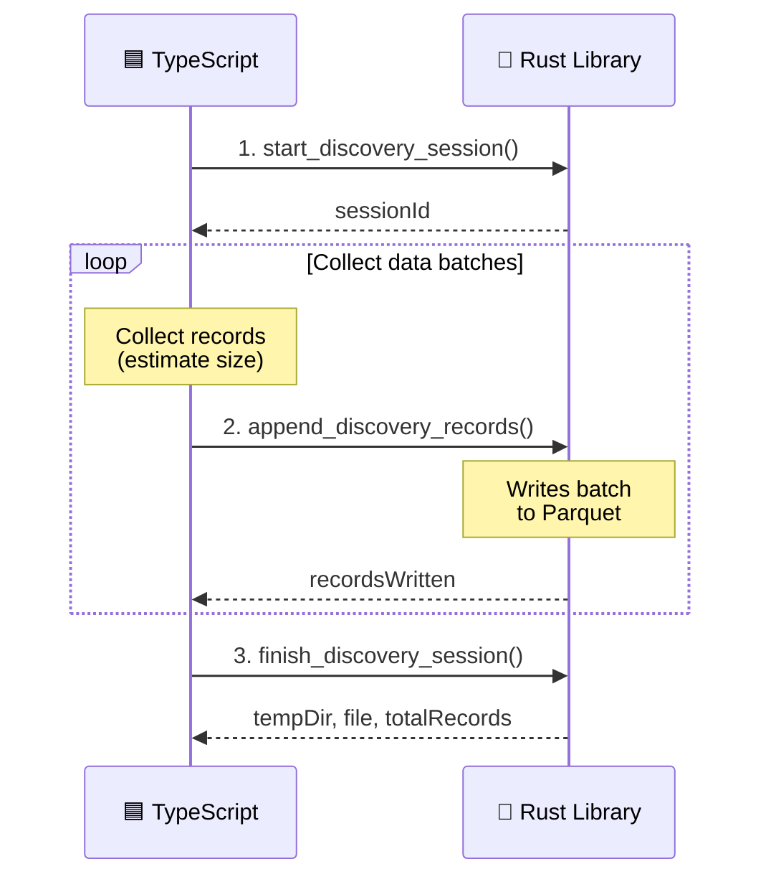

# 🔌 FFI API Reference

This document contains the detailed FFI API reference, JSON interface specifications,
and streaming recording API for NEAT-AI-Discovery. For a high-level overview, see
[README.md](../README.md).

---

## 📦 Exported Symbols

The library exposes a Deno FFI-friendly symbol set. The authoritative list of exported
symbols lives in `src/lib.rs` as `#[no_mangle] pub extern "C"` functions.

The most commonly used entry points are:

- **GPU probe**: `check_gpu_available()` (returns JSON)
- **Version probe**: `get_library_version()` (returns JSON)
- **Recording**:
  - Streaming: `start_discovery_session`, `append_discovery_records`, `finish_discovery_session`, `cancel_discovery_session`
  - Single-call: `record_discovery` (avoid for large runs; prefer streaming to prevent JS/V8 string limits)
- **Analysis**: `rank_focus_neurons`, `analyze_parallel`, `cancel_analysis`, `reset_cancellation`, `is_analysis_active`
- **Utilities**: `merge_discovery_parquet`, `read_discovery_records_ffi`, `export_visualisation_snapshot`
- **Memory usage**: `discovery_memory_usage_bytes()` (returns `u64`)
- **Memory management**: `free_discovery_result`

---

## 🧠 Rust-side Memory Usage (Issue #1027)

The Rust library allocates memory outside V8's heap, making it invisible to
Deno-side memory monitors. Use `discovery_memory_usage_bytes()` to query the
current Rust allocator usage and combine it with `Deno.memoryUsage().heapUsed`
for accurate total-process memory monitoring.

- **Symbol**: `discovery_memory_usage_bytes`
- **Input**: no arguments
- **Output**: `u64` — current Rust heap allocation in bytes
- **Overhead**: reads a single atomic counter; suitable for polling every 5–30 seconds
- **Panic safety**: catches panics and returns `0` on failure

### Example (Deno FFI)

```typescript
const lib = Deno.dlopen("libneat_ai_discovery.dylib", {
  discovery_memory_usage_bytes: { parameters: [], result: "u64" },
});

const rustBytes = lib.symbols.discovery_memory_usage_bytes();
const v8Bytes = Deno.memoryUsage().heapUsed;
const totalBytes = rustBytes + BigInt(v8Bytes);
```

---

## ⚡ Analysis Parameters (Issue #1028, #1029, #1020)

The `analyze_parallel` input accepts additional parameters to control resource
usage and candidate selection behaviour:

### Memory Budget (`max_analysis_memory_mb`)

Limits the Rust-side memory consumption during the analysis phase. When the
allocated memory exceeds the budget, analysis returns early with
`memory_budget_exceeded: true` in the output. For guidance on how this
interacts with cache tier selection, see
[CACHE_TUNING.md](CACHE_TUNING.md).

- **Field**: `max_analysis_memory_mb` (optional `u64`)
- **Default**: no limit
- **Checkpoints**: before GPU work submission and after parquet loading
- **Output field**: `memory_budget_exceeded` (`bool`) — `true` if analysis
  aborted due to exceeding the budget

### Analysis Deadline (`analysis_deadline_ms`)

Sets a wall-clock deadline for the analysis phase. Detection modules abort
early when the deadline is reached, returning whatever candidates have been
found so far. Coverage improves over repeated runs.

- **Field**: `analysis_deadline_ms` (optional `u64`)
- **Default**: no deadline
- **Behaviour**: deadline is passed to the record cache and detection dispatch

### Wall-Clock Cap (`maxDiscoveryWallClockMinutes`) — Issue #1098

Caps the total elapsed time from discovery start (recording + analysis),
regardless of how recording and analysis budgets are split. The analysis
deadline is clamped to `min(analysis_deadline, discovery_start + wall_clock_cap)`.

- **Field**: `maxDiscoveryWallClockMinutes` (optional `u64`, minutes)
- **Default**: no cap (backwards compatible)
- **Behaviour**: when set, `refreshAnalysisTimeout()` (TypeScript side) and
  the Rust analysis engine both respect the overall wall-clock limit,
  preventing total discovery time from exceeding the configured cap

### Temperature (`temperature`)

Controls the exploration-exploitation balance during candidate selection.
Higher temperatures encourage exploration of more diverse candidates; lower
temperatures focus on the highest-scoring candidates.

- **Field**: `temperature` (`f32`)
- **Default**: `1.0` (neutral — no effect on thresholds)
- **Range**: `0.01` to `5.0`
- **Cooling**: callers can implement cooling schedules (linear or exponential)
  by decreasing this value across generations

When `NEAT_AI_DISCOVERY_MH_TEMPERATURE` is also set, Metropolis-Hastings
probabilistic acceptance is applied to synapse candidates, allowing
occasionally weaker candidates through to maintain search diversity.

### Cancellation Signal (Issue #1047)

Allows the host process to request graceful shutdown of in-flight analysis
(e.g. when SIGTERM arrives due to `max-task-hours exceeded`).

- **Symbol**: `cancel_analysis` — sets a global `AtomicBool` flag
  - **Input**: no arguments
  - **Output**: no return value
  - **Thread safety**: safe to call from any thread at any time
- **Symbol**: `reset_cancellation` — clears the flag before a new analysis run
  - Called automatically at the start of `analyze_all`, but can also be
    called explicitly by the host
- **Behaviour**: the analysis pipeline checks the flag at every
  `deadline_passed()` call site and at parquet batch boundaries. When
  cancelled, the pipeline returns a partial result with
  `cancelled: true` instead of an error.
- **Output field**: `cancelled` (`bool`) — `true` when the host requested
  shutdown via `cancel_analysis()`; results are partial but valid.
  The `error_kind` is `"cancelled"` (not retryable).

### Analysis Lifecycle Guard (Issue #1048)

Prevents the host from deleting the parquet temp directory while analysis is
still reading from it.

- **Symbol**: `is_analysis_active` — returns `1` if any analysis invocation is
  in-flight, `0` otherwise
  - **Input**: no arguments
  - **Output**: `i32` (`1` = active, `0` = idle)
  - **Thread safety**: safe to call from any thread at any time
- **Recommended shutdown sequence**:
  1. Call `cancel_analysis()` when SIGTERM arrives
  2. Wait for `analyze_parallel` / `rank_focus_neurons` FFI call to return
  3. Optionally poll `is_analysis_active()` until it returns `0`
  4. Delete the `.discovery/<uuid>/` temp directory
- **Rust-side guard**: the `RecordCache`, `LruRecordCache`, and
  `CompressedLruRecordCache` hold an open file handle to the parquet file.
  On Unix, this keeps the inode alive even if the path is unlinked, so
  in-flight reads succeed even under a race condition.

---

## 🖥️ Checking for a Usable GPU

Discovery **requires a GPU** — there is no CPU fallback. On machines without a
suitable GPU, controllers must disable discovery entirely.

- **Symbol**: `check_gpu_available`
- **Input**: no arguments
- **Output**: JSON string:

  ```json
  {
    "success": true,
    "gpuAvailable": true,
    "reason": null
  }
  ```

  When GPU is unavailable:

  ```json
  {
    "success": true,
    "gpuAvailable": false,
    "reason": "No GPU adapter found. Discovery disabled on this machine..."
  }
  ```

- When `"gpuAvailable"` is `false`, controllers should treat discovery as disabled.
- When `"gpuAvailable"` is `true`, controllers may safely schedule discovery jobs.

### 🌏 Platform-specific GPU behaviour

- **macOS**: GPU (Metal) should always be available. If `gpuAvailable` is `false`,
  this is treated as an error (`success: false`).
- **Linux**: GPU may not be available on headless servers without GPU hardware
  or without proper permissions to access `/dev/dri` devices. If `gpuAvailable`
  is `false`, this is **not** an error (`success: true`) — discovery is simply
  disabled on that machine.

  **Note:** On Linux, the library only probes the Vulkan backend (not OpenGL/EGL)
  to avoid panics from EGL initialisation errors on systems without proper GPU
  drivers.

---

## 📋 JSON Interface

### Input Format (record_discovery)

```json
{
  "creature": {
    "neurons": [
      {
        "uuid": "hidden-1",
        "type": "hidden",
        "squash": "TANH",
        "bias": 0.0
      }
    ],
    "synapses": [
      {
        "from_uuid": "input-0",
        "to_uuid": "hidden-1",
        "weight": 0.5
      }
    ],
    "input": 20,
    "output": 2
  },
  "training_data": [
    {"input": [0.1, 0.2, "..."], "output": [0.5, 0.3]},
    "..."
  ],
  "temp_dir": ".discovery/abc123_456789",
  "binary_file_path": "/path/to/binary.bin",
  "record_indices": [0, 5, 10, "..."],
  "timeout_seconds": 300
}
```

### Output Format

All discovery responses include a `schemaVersion` field (Issue #952) so callers can
reject stale cached payloads instead of guessing compatibility.

Success:
```json
{
  "success": true,
  "schemaVersion": "2",
  "tempDir": ".discovery/abc123_456789",
  "file": "discovery_data.parquet"
}
```

Error:
```json
{
  "success": false,
  "schemaVersion": "2",
  "error": "Error message here",
  "errorKind": "data_validation",
  "retryable": false
}
```

### Neuron Identity Contract (Issue #952)

All neuron and synapse identity fields in FFI JSON payloads must use **stable UUID
strings**. Purely numeric integer IDs (e.g. `"0"`, `"42"`, `"999999"`) are rejected
at the FFI boundary with a `data_validation` error.

Accepted formats:
- RFC 4122 UUIDs: `"550e8400-e29b-41d4-a716-446655440000"`
- Input neuron identifiers: `"input-0"`, `"input-1"`
- Descriptive identifiers: `"hidden-layer1-node0"`, `"output-main"`

Numeric integer IDs are an internal optimisation detail and must never cross the
FFI boundary.

---

## 🔄 Streaming Recording API (v0.2.8+)

> **For a step-by-step guide** with TypeScript code examples, error handling
> patterns, and best practices, see
> [STREAMING_GUIDE.md](STREAMING_GUIDE.md).

The streaming API solves the JavaScript "Invalid string length" error that occurs when
trying to serialise large datasets (6+ minutes of recording) into a single JSON string.
Instead of one monolithic `record_discovery` call, data is streamed incrementally.

**Why this matters**: JavaScript/V8 has a maximum string length (~2^28 chars). When
TypeScript accumulated 6+ minutes of discovery data and tried to JSON.stringify it all
at once for the FFI call, it hit this limit. The streaming API keeps each FFI call small.

### 🛠️ Usage Pattern



### ⚙️ FFI Functions

**`start_discovery_session`** — Start a new recording session

Input:
```json
{
  "creature": { "neurons": ["..."], "synapses": ["..."], "input": 20, "output": 2 },
  "tempDir": ".discovery/abc123_456789"
}
```

Output:
```json
{
  "success": true,
  "sessionId": "550e8400-e29b-41d4-a716-446655440000"
}
```

**`append_discovery_records`** — Append records to an existing session

Input:
```json
{
  "sessionId": "550e8400-e29b-41d4-a716-446655440000",
  "observations": [
    {
      "obsIndex": 0,
      "neuronData": [
        { "neuronUuid": "hidden-1", "activation": 0.5, "value": 0.4, "errors": [0.1] }
      ],
      "inputs": [0.1, 0.2, 0.3]
    }
  ]
}
```

Output:
```json
{
  "success": true,
  "recordsWritten": 42
}
```

**`finish_discovery_session`** — Finalise and close the Parquet file

Input:
```json
{
  "sessionId": "550e8400-e29b-41d4-a716-446655440000"
}
```

Output:
```json
{
  "success": true,
  "tempDir": ".discovery/abc123_456789",
  "file": "discovery_data.parquet",
  "totalRecords": 12345
}
```

**`cancel_discovery_session`** — Cancel a session (cleanup without finalising)

Input:
```json
{
  "sessionId": "550e8400-e29b-41d4-a716-446655440000"
}
```

Output:
```json
{
  "success": true
}
```

### 📐 Size Estimation for TypeScript

To decide when to flush, estimate the JSON size before serialising:

```typescript
// Rough estimate: ~200 bytes per neuron record + input array
const estimatedBytes = observations.length * (
  200 * creature.neurons.length +
  4 * creature.input
);

// Flush when approaching 50MB (well under JS string limits)
const FLUSH_THRESHOLD = 50 * 1024 * 1024;
if (estimatedBytes > FLUSH_THRESHOLD) {
  await appendDiscoveryRecords(sessionId, observations);
  observations = []; // Reset batch
}
```

### ✅ Benefits

- **No string length limits**: Each batch is small enough to serialise
- **Unlimited sample sizes**: Can record for hours without memory issues
- **Fail-safe**: If process crashes, already-written data is preserved in the Parquet file
- **Reduced memory pressure**: TypeScript can discard batches after flushing

---

## 🚨 Critical Requirements

### ⚛️ Atomic Record Writes

**For each discovery record, all data (observations, activations, errors) MUST come from the same training record.** This is essential because:
- The analysis phase matches records by index
- When evaluating synapse candidates, records must align
- If observations, activations, and errors don't line up, analysis will be incorrect

**Implementation Requirements:**
- **Atomic writes**: For each training record, activate creature, collect ALL neuron data, then write ALL neuron rows together
- **Parallelisation allowed**: Since training dataset is already randomised, we CAN process different training records in parallel
- **Per-record atomicity**: Each parallel task must process one complete training record
- **Cross-neuron alignment**: Records with the same `obs_index` across different neurons correspond to the same training record
- **No mixing**: Never mix data from different training records within a single discovery record write
- **Matching by obs_index**: TypeScript matches records across neurons by `obs_index` (not by array position)

### ➡️ Forward-only Activation Order (no feedback)

Discovery assumes **forward-only** networks (no recurrent feedback). This is critical for both recording and for applying discovery candidates:

- **Evaluation order matters**: A neuron may only read activations from **earlier** neurons in the creature's evaluation order.
- **Synapse direction constraint**: For feed-forward creatures, synapses must point from an **earlier** neuron to a **later** neuron.
- **Discovered neurons must be inserted, not appended**: When applying an add-neuron candidate, the new neuron must be inserted at the correct index.
- **No "remembering" across samples**: Discovery explicitly does **not** support recurrent connections.

---

## 📁 File Format

### Single Parquet File

File location: `.discovery/{creature_uuid}_{random}/discovery_data.parquet`

Schema:
- `obs_index: u32` — Observation index (training record index) for ordering
- `neuron_uuid: string` — Neuron identifier
- `value: f32` — Neuron value (optional, can be null)
- `activation: f32` — Neuron activation
- `errors: list<f32>` — Array of error values

**Benefits:**
- Single file handle (eliminates small-file problems)
- Columnar format excellent for filtering by neuron during analysis
- Viewable with standard tools for debugging

### 🔍 Debugging Parquet Files

**Python:**
```python
import pandas as pd
df = pd.read_parquet('discovery_data.parquet')
print(df.head())
```

**DuckDB:**
```sql
SELECT * FROM 'discovery_data.parquet' LIMIT 10;
```

**Command-line:**
- `parquet-tools` (Java-based)
- `parquet-cli` (Rust-based)
