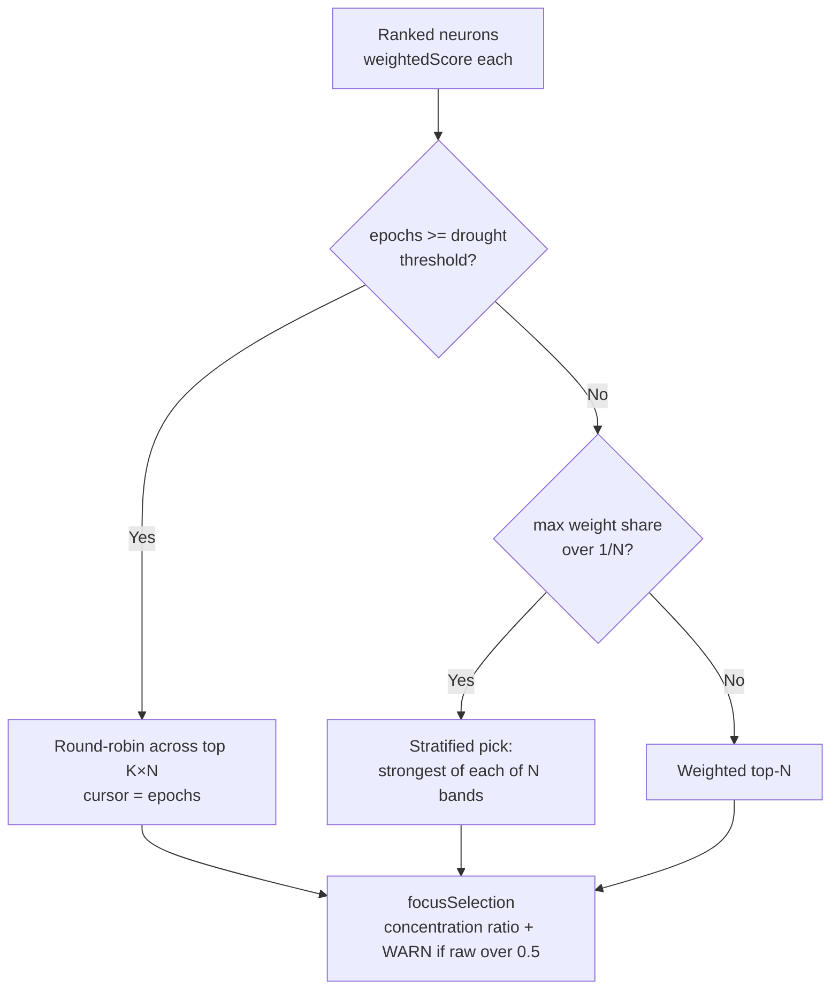
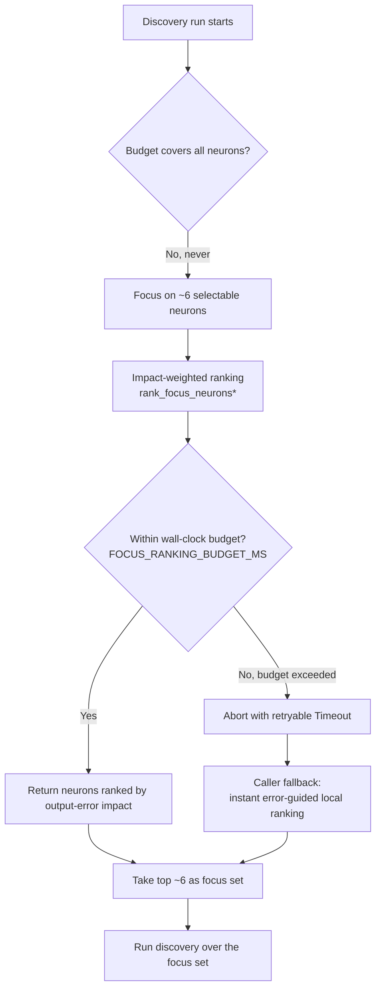

# Focus Selection

This document captures the **focus-selection design end-to-end** — why each
discovery run focuses on a small subset of neurons, how selection evolved from a
random pick to an impact-weighted ranking, the performance guard that bounds the
ranking, and the fallback the caller uses when the budget is exceeded.

It exists so the next "please confirm my understanding of the focus logic"
request is a single doc link rather than a code spelunk (Issue #1382, #1386).

---

## 1. Why a focus subset at all

Discovery cannot evaluate *every* neuron in a network within the per-run
evaluation budget — the cost grows with the number of candidate targets and the
size of the recorded discovery dataset. Each run therefore **focuses** on a
small set (about half a dozen, ~6) of *selectable* neurons and concentrates the
analysis budget there.

A "selectable" neuron is one that can usefully be tuned: input and constant
neurons are excluded (see `is_selectable_neuron_type` in
[`src/focus/ranking/mod.rs`](../src/focus/ranking/mod.rs)). Keeping the focus set
small is what makes a discovery pass complete inside its wall-clock budget.

## 2. Selection history — random → impact-weighted

The focus list was originally a **random** pick from the selectable neurons.
Random selection is fast, but it can land on neurons that have little effect on
the network's output(s), wasting the run's budget on targets that cannot move
the error.

Selection therefore moved to an **impact-weighted ranking**. The
`rank_focus_neurons*` family in [`src/focus/`](../src/focus/) scores each neuron
by its estimated effect on the output error (structural impact, gradient flow,
activation frequency, and recorded error) and returns the neurons ordered by
that score, so the caller can take the strongest ~6.

Relevant entry points (re-exported from `crate::focus::*`):

- `rank_focus_neurons` / `rank_focus_neurons_with_descriptor`
- `rank_focus_neurons_with_history` /
  `rank_focus_neurons_with_history_and_descriptor`

Impact scoring details live in
[docs/IMPACT_CALCULATION.md](IMPACT_CALCULATION.md).

## 3. The performance guard

Impact-weighted ranking is more expensive than a random pick, and a pathological
run can be *much* more expensive — incident #1373 measured a single ranking pass
at **1 h 11 m**, which blew the entire discovery wall-clock budget.

Ranking now runs under a layered performance guard:

| Guard | Mechanism | Issue |
|-------|-----------|-------|
| **Wall-clock budget** | `FocusDeadline` checks the deadline between passes and inside the per-neuron loops; on overrun it aborts with a structured retryable `Timeout`. Configured by `NEAT_AI_DISCOVERY_FOCUS_RANKING_BUDGET_MS` (default 120 s). The default is **scaled by loading mode + dataset size**: an eager run keeps 120 s, while a slower lazy fallback earns `4 × default + 20 ms/projected MB` (clamped to 1 h) so a legitimate lazy run finishes instead of aborting. An explicit env override wins verbatim and is never scaled. | #1375, #3172 |
| **Single-pass record loading** | Records are loaded once and reused across the ranking passes instead of re-read per neuron. | #1374 |
| **Eager vs lazy decision** | `decide_loading_mode_for_available_memory` / `decide_loading_mode_for_budget` choose an eager pre-load or a lazy per-neuron loader based on available memory and the projected dataset size (file × 3), capped by `NEAT_AI_DISCOVERY_FOCUS_RANKING_MEMORY_BUDGET_MB`. | #1376, #1172 |
| **Perf-cliff observability** | A lazy pass at or above `NEAT_AI_DISCOVERY_FOCUS_RANKING_PERF_CLIFF_MS` (default 60 s) emits one explicit perf-cliff `WARN` naming the neuron count and projected dataset size (`lazy_pass_exceeds_perf_cliff`). | #1377 |

## 4. The fallback — error-guided, not literal random

When the wall-clock budget is exceeded, the crate aborts the ranking with a
structured, **retryable** `DiscoveryError::Timeout { deadline_ms }`. The caller
(NEAT-AI) then falls back to its **instant local ranking path**.

> **Nuance worth stating plainly.** That fallback is **error-guided**: it ranks
> the viable neurons from their recorded errors. It is **not** a literal
> uniform-random pick. The original request was *"just do a random selection,"*
> and the implemented fallback is *at least as good as* random and *equally
> fast* (it is instant), so it satisfies the spirit of "fast, no extra budget"
> while avoiding random's habit of landing on low-impact neurons.

**Confirmation status (open):** whether *error-guided-and-instant* fully
satisfies the original intent, or whether a *literal* random fallback is
required, is a product decision for the issue author. This is recorded as an
open question on Issue #1386 — update this section with the author's answer once
confirmed. Until then, the behaviour described above (error-guided, instant) is
the implemented and documented design.

## 5. The environment knobs

All knobs are defined in the README
[Environment Variables](../README.md#-environment-variables) table:

| Variable | Default | Purpose |
|----------|---------|---------|
| `NEAT_AI_DISCOVERY_FOCUS_RANKING_BUDGET_MS` | `120000` (eager); scaled for lazy | Wall-clock budget for focus ranking; overrun aborts with a retryable `Timeout`. When **unset**, the default is scaled by loading mode + projected dataset size — eager keeps 120 s, lazy earns `4 × 120 s + 20 ms/projected MB` (clamped to `[1000, 3600000]`) so a legitimate lazy fallback finishes (#3172). An explicit value **wins verbatim** (never scaled); `0` disables; other values clamp to `[1000, 3600000]` (#1375, #1385). |
| `NEAT_AI_DISCOVERY_FOCUS_RANKING_MEMORY_BUDGET_MB` | unset | Cap the eager pre-load size; projected size (file × 3) above the cap forces lazy mode with a structured `info` log (#1172). |
| `NEAT_AI_DISCOVERY_FOCUS_RANKING_PERF_CLIFF_MS` | `60000` | Perf-cliff threshold for a *lazy* pass; at/above it emits one perf-cliff `WARN`. Preload never trips it. `0` disables (#1377). |

---

## 6. Diversity floor and drought rotation (Issue #1445)

Impact-weighted ranking only **orders** neurons; it does not enforce
**diversity** in the final focus set. On a plateaued mature network a single
high-impact neuron can hold the vast majority of the roulette weight — on the
production GRQ-3 creature one neuron held **~98.5%** of the weight, so the
weighted roulette collapsed to a **single target** and discovery revisited the
same neighbourhood every pass.

[`src/focus/selection.rs`](../src/focus/selection.rs) adds a deterministic
selection layer over the ranked list (`select_focus_neurons`). Each ranked
neuron now carries its combined `weighted_score` (surfaced as `weightedScore` on
each `neurons[]` entry), which is the roulette weight selection operates on.

The FFI surfaces a `focusSelection` block on the `rank_focus_neurons` response:

| Field | Meaning |
|-------|---------|
| `selected` | The chosen focus uuids, in order. |
| `rawWeightConcentrationRatio` | max weight ÷ sum over the ranked pool — the diagnostic that exposes single-target collapse (~0.985 on GRQ-3). |
| `weightConcentrationRatio` | Concentration **after** the diversity floor / rotation — below `0.5` for any focus set of 3+ targets. |
| `diversityFloorApplied` / `rotationApplied` | Which guard fired. |
| `poolSize` | Candidates considered (rotation pool under drought, else the full ranked count). |

When `rawWeightConcentrationRatio` exceeds `0.5` the crate emits a single
`focus_selection_weight_concentration_high` WARN naming both ratios and which
guard corrected it.

### Diversity floor

When one neuron exceeds its even `1/N` share of the roulette weight, the final
set is picked **stratified** across the ranked list: the list is divided into
`N` contiguous bands and the strongest neuron of each band is taken. Band 0
keeps the dominant neuron; later bands draw from progressively lower-ranked
regions, guaranteeing quartile-style coverage instead of "dominant + N−1 noise".

### Drought-aware rotation

Once the creature's `epochsSinceLastAcceptedCandidate` meets or exceeds the
drought threshold (`NEAT_AI_DISCOVERY_DROUGHT_LOG_THRESHOLD`, Issue #1202),
selection switches from weighted ranking to **round-robin** across the top
`K × N` ranked neurons (K = `DROUGHT_ROTATION_POOL_FACTOR` = 3). The epoch count
seeds the rotation cursor, so successive passes pick fresh targets and the
unexplored tail of the ranking finally gets analysis budget.

> **Caller contract.** The focus-set size `N` comes from `focusSetSize`
> (default 6, NEAT-AI's `discoveryMaxNeurons`); the candidate pool is the
> `maxResults` ranked neurons. For rotation to draw from unexplored targets,
> pass `maxResults >= K × N`.

---

## End-to-end flow

## See also

- [docs/IMPACT_CALCULATION.md](IMPACT_CALCULATION.md) — how neuron impact is
  estimated.
- [`src/focus/`](../src/focus/) — the ranking implementation
  (`ranking/mod.rs`, `impact.rs`, `gradient.rs`, `layers.rs`, `allocation.rs`,
  `selection.rs`).
- Issues: #1373 (incident), #1374, #1375, #1376, #1377, #1385 (guard work);
  #1382, #1386 (this confirmation); #1445 (diversity floor and drought
  rotation).
