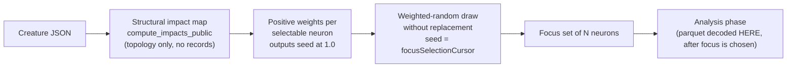

# Focus Selection

This document captures the **focus-selection design end-to-end** — why each
discovery run focuses on a small subset of neurons, how the focus set is now
chosen (a **structure-weighted random draw**, with **no parquet on the focus
path**), and why the **seconds bar** is a hard invariant.

It exists so the next "please confirm my understanding of the focus logic"
request is a single doc link rather than a code spelunk
(Issues #1382, #1386, #1766).

---

## 1. Why a focus subset at all

Discovery cannot evaluate *every* neuron in a network within the per-run
evaluation budget — the cost grows with the number of candidate targets. Each
run therefore **focuses** on a small set (about half a dozen, ~6) of *selectable*
neurons and concentrates the analysis budget there.

A "selectable" neuron is one that can usefully be tuned: **input** and
**constant** neurons are excluded (see `is_selectable_type` in
[`src/focus/ranking/mod.rs`](../src/focus/ranking/mod.rs)). Output neurons **are**
selectable — and, seeded at impact `1.0`, they are the highest-impact targets by
definition (`output-0` is the canonical example).

## 2. The product rule — structure-weighted random (Issue #1766)

**Choosing the focus set is derived from creature structure alone.** It never
opens or decodes the discovery parquet.

```text
Creature JSON → structural impact map → weighted-random by impact → focus set N
```

1. **Structural impact from topology only.** The impact map is computed with
   [`compute_impacts_public`](../src/focus/impact.rs) — path-weight products over
   the creature graph, with output neurons seeded at `1.0`. No discovery records
   are read.
2. **Weighted-random draw.** [`select_focus_by_structural_impact`](../src/focus/selection.rs)
   draws `min(N, pool)` selectable neurons **without replacement** by roulette
   over those impacts. Large creatures still explore beyond pure greed while
   mostly landing on high-impact neurons; output neurons dominate the weight mass
   naturally, so they are almost always chosen without a hard-coded "only
   output-0" policy.
3. **Deterministic and reproducible.** The draw is seeded by the caller's
   monotonic `focusSelectionCursor` (falling back to
   `epochsSinceLastAcceptedCandidate`, then `0`). A fixed cursor reproduces the
   same set; advancing the cursor reseeds the draw so successive passes sweep a
   fresh tail.
4. **Zero-weight fallback.** Neurons with zero / negative / non-finite impact
   carry zero weight; when the remaining pool is all-zero the draw falls back to
   a uniform pick so the focus set still fills.



## 3. The seconds bar — a hard invariant

**If choosing the focus set takes more than seconds, we have shot ourselves in
the foot.** The structural draw is `O(neurons + synapses)` and completes in
milliseconds even on a creature with a multi-GB recording — because the parquet
is never touched to pick the focus set.

This invariant exists because of the **focus-stall incident** that motivated
this issue: a trivial 16-hidden, `maxNeurons=6` creature accumulated ~12.5 GB of
discovery data, and the
then-current parquet-coupled ranking projected an 18.7 GB in-memory load, scaled
its own budget to ~14 min, and ran for **~2 h** in `build_lazy_provider` /
`read_all_records_grouped_by_neuron` before aborting — after which the instant
structure-only fallback finished in one shot (`6 candidates, 6 selected`). That
proved selection is cheap once parquet is out of the path; coupling focus choice
to multi-GB I/O burned the analysis budget before any useful work started.

The regression is locked by
[`tests/ffi/issue_1766_structural_focus_selection.rs`](../tests/ffi/issue_1766_structural_focus_selection.rs):
a reference-shaped creature (16 hidden feeding one output) selects successfully
in well under the seconds bar even when the `parquetFile` path **does not
exist**, proving no parquet is opened.

**Not the fix:** scaling `FOCUS_RANKING_BUDGET_MS` / lazy budgets, a multi-GB
warm pass, or "fail fast to a fallback while still attempting parquet-coupled
ranking as the happy path." The happy path is structure-only, full stop.

## 4. Parquet is for analysis, not for choosing focus

Parquet is still decoded — but **after** the focus set is chosen, by the
**analysis** phase (`analyze_parallel`) that scores concrete synapse/neuron
candidates on the chosen neurons. The record-derived removal-candidate and
constant-neuron detection that used to ride the focus call moves off the
focus-time parquet (companion issue); the focus FFI therefore omits
`removalCandidates`, `constantNeuronRemovals`, and the `loadingMode` /
`projectedMb` observability fields (no parquet was loaded).

## 5. What the FFI surfaces

The `rank_focus_neurons` FFI response carries a `focusSelection` block plus a
structure-only `neurons[]` ranked pool (impact-descending). Each ranked neuron's
`impact` and `weightedScore` both carry the structural impact used as the draw
weight; `totalError` / `meanActivation` are record-derived and are `0.0` on the
focus path.

| Field | Meaning |
|-------|---------|
| `selected` | The chosen focus uuids (impact-weighted draw). |
| `rawWeightConcentrationRatio` | max weight ÷ sum over the eligible pool — exposes single-target impact collapse. |
| `weightConcentrationRatio` | Concentration over the **selected** weights. |
| `exploitationCount` / `explorationCount` | Every slot is an impact-weighted draw, so `exploitationCount == selected.len()` and `explorationCount == 0` (the #1662 split no longer applies). |
| `explorationCursor` | The seed used for the draw (the monotonic per-creature cursor). |
| `eligiblePoolSize` / `poolSize` | Selectable neurons available for the draw. |
| `cumulativeCoverage` | Neurons drawn this pass. |
| `droughtActive` | Always `false` on the structure-only path. |

When `rawWeightConcentrationRatio` exceeds `0.5` the crate emits a single
`focus_selection_weight_concentration_high` WARN so a pathologically
single-target impact profile stays visible.

## 6. History — random → parquet-coupled ranking → structure-weighted random

The focus list began as a **uniform-random** pick, then moved to a
**parquet-coupled impact-weighted ranking** (`rank_focus_neurons*`, scoring
`error × impact^γ × gradient × frequency [+ signals]` over recorded discovery
data). That ranking is where the ~2h focus stall came from: it forced a parquet
decode before any neuron was picked. Issue #1766 replaces the focus-choosing path
with the structure-weighted random draw of §2 — keeping the "land mostly on
high-impact neurons, but still explore" intent while removing the multi-GB I/O.

The wall-clock guard (`FocusDeadline`, #1375/#3172), the eager-vs-lazy loader
(#1172/#1376), the perf-cliff WARN (#1377), and the #1662 exploit/explore
allocator were all mitigations for the *parquet-coupled* ranking. They no longer
bound the FFI focus path (there is nothing multi-GB left to bound). The
`rank_focus_neurons*` Rust functions and their record-derived signals (§7, §8)
are retained for **analysis-time** ranking, not for choosing the focus set.

## 7. Environment knobs

Every focus knob — with its default, valid range, and description — is documented
once in the single authoritative reference,
[docs/CONFIGURATION.md § Focus selection & ranking](CONFIGURATION.md#focus-selection--ranking).
The structure-only focus draw of §2 needs **none** of them: `focusSetSize` and
`focusSelectionCursor` are request fields, not env knobs. The remaining
`NEAT_AI_DISCOVERY_FOCUS_*` knobs (ranking budget, memory budget/margin,
perf-cliff, reconstruction mismatch, impact gate) govern the retained
record-derived ranking (§8, §9), not the focus path.

---

## 8. Reconstruction-mismatch focus signal (Issue #1634) — record-derived ranking

> Applies to the retained record-derived `rank_focus_neurons*` ranking, not the
> structure-only focus path of §2.

Impact-weighted ranking measures *how much a change would move the output* but
not *which neurons the current model of the creature fails to explain*. The
per-neuron **reconstruction mismatch** measures the latter: for each selectable
neuron we reconstruct its activation from its inbound synapses and compare it to
the recorded activation.

```text
reconstructedValue      = bias + Σ (from_activation × weight)   over inbound synapses
reconstructedActivation = squash(reconstructedValue)
reconstructionMismatch  = mean |recordedActivation − reconstructedActivation|
```

When enabled, the mismatch is folded into the record-derived score as an
**additive** term, applied *after* the multiplicative factors:

```text
weightedScore = error × (impact + ε)^γ × gradientFactor × frequencyFactor × historyMultiplier
              + weight × reconstructionMismatch          # Issue #1634, additive
```

The signal is **opt-in**
(`NEAT_AI_DISCOVERY_FOCUS_RECONSTRUCTION_MISMATCH=1`) with a tunable weight
(`…_WEIGHT`, default `0.1`); disabled it is byte-identical to the pre-#1634 path.

## 9. Impact-magnitude gate (Issue #1635) — record-derived ranking

> Applies to the retained record-derived `rank_focus_neurons*` ranking, not the
> structure-only focus path of §2 (which already draws by impact, so near-zero
> impact neurons are naturally almost never selected).

The constant-neuron filter (`NEAT_AI_DISCOVERY_FOCUS_EXCLUDE_CONSTANT_NEURONS`,
Issue #1624) removes only neurons whose activation *never varies*. Snapshot
mining on the production creature (Issue #1631) found a larger waste class:
neurons that **vary** yet carry a near-zero downstream impact (**31.6%** with
`|impact| < 1e-6`). The **impact-magnitude gate** drops any neuron whose
structural impact magnitude is strictly below the configured threshold:

```text
gated  ⟺  |impact| < NEAT_AI_DISCOVERY_FOCUS_IMPACT_GATE_THRESHOLD   # default 1e-6
```

- **Boundary rule — retain-on-equal.** A neuron *exactly* at the gate is kept.
- **Never silently dropped.** The gated count is logged
  (`focus_ineligible_low_impact`) and surfaced on `RankFocusStats`.
- **Opt-in.** Enabled via `NEAT_AI_DISCOVERY_FOCUS_IMPACT_GATE=1`.

---

## See also

- [docs/IMPACT_CALCULATION.md](IMPACT_CALCULATION.md) — how neuron impact is
  estimated (the structural map the focus draw weights by).
- [`src/focus/selection.rs`](../src/focus/selection.rs) — the structure-weighted
  random focus draw (`select_focus_by_structural_impact`) and the retained
  exploit/explore allocator (`select_focus_neurons`).
- [`src/focus/`](../src/focus/) — the ranking implementation
  (`ranking/mod.rs`, `impact.rs`, `gradient.rs`, `layers.rs`, `allocation.rs`,
  `selection.rs`).
- Issues: #1373 (a comparable parquet-stall incident), #1374–#1377, #3172 (parquet-coupled
  guard work, now off the focus path); #1445 / #1662 (record-derived
  exploit/explore, superseded for focus by #1766); **#1766** (structure-weighted
  random focus, no parquet, seconds-bar invariant).
```

