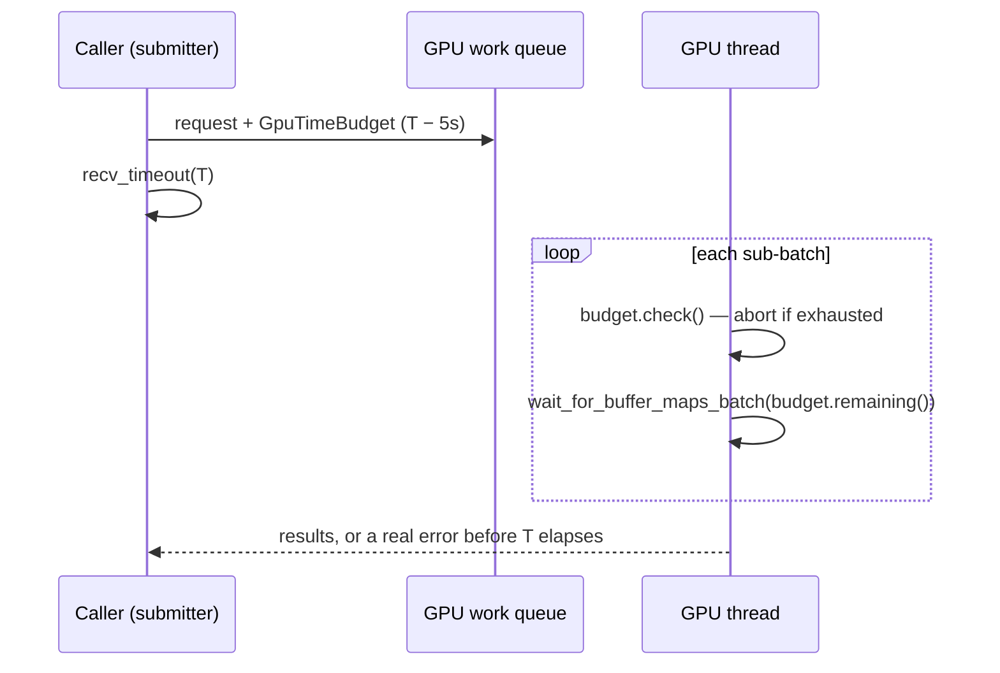
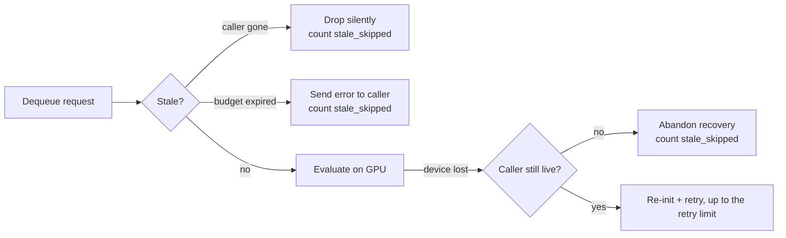
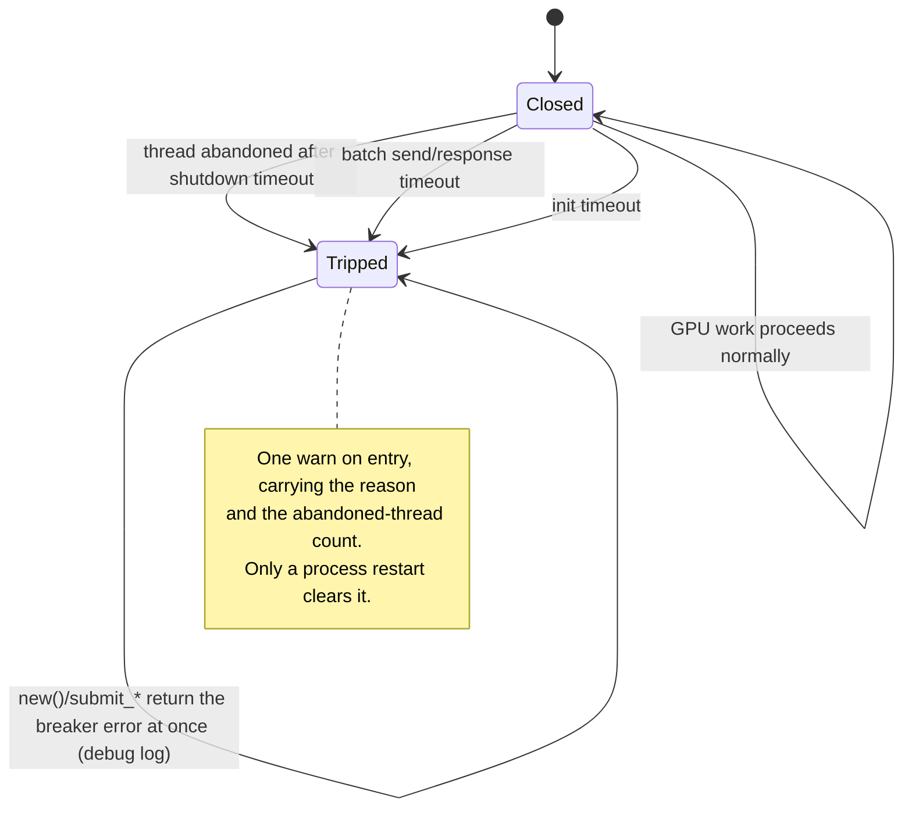

# 🎮 GPU Guide

This document covers GPU performance tuning, troubleshooting, and debugging for
NEAT-AI-Discovery. For a high-level overview, see [README.md](../README.md).

---

## 🧱 GPU stack: wgpu 30 (migration complete)

The GPU backend targets **wgpu 30 / naga 30 / pollster 1.0** (`Cargo.toml`). The
29 → 30 migration is **complete** (Issue #1594); this note records the API
breakages so a future major bump — which `bump-deps.sh`'s
`cargo upgrade --incompatible` discovery step will surface again — is not
re-derived from scratch (it was independently rediscovered in ~ten PRs before
landing):

- **`Buffer::get_mapped_range()` now returns `Result<BufferView, MapRangeError>`.**
  All six read-back paths in `src/analysis/gpu/*` unwrap it with `.context(...)?`
  **before** `bytemuck::cast_slice`, so a map failure surfaces loudly rather than
  being masked (Issue #3234).
- **`RequestAdapterOptions` gained `apply_limit_buckets: bool`** — set `false`
  for a trusted native app (limit bucketing only matters for fingerprint
  resistance when exposing wgpu to untrusted web content).
- **`AdapterInfo` test helper** — `transient_saves_memory` became
  `Option<bool>` and a `limit_bucket: Option<AdapterLimitBucketInfo>` field was
  added.

When the next major wgpu bump lands, migrate `src/analysis/gpu/*` in the same PR
(the #1613 dependency-bump flow) or revert the bump — never commit a
half-migrated GPU build.

---

## ⚡ GPU Performance Tuning

The library auto-detects GPU capabilities **and available system memory** to optimise
settings. On startup, it logs the detected configuration:

```
[NEAT-AI-Discovery] Memory: 12.3GB available / 24.0GB total | Tier: standard
[NEAT-AI-Discovery] GPU: Apple M4 (integrated metal) | Tier: high-performance | Batch size: 512
```

### 🤖 Automatic Adaptation

The library adapts to your machine's capabilities:

| System Memory | Memory Tier | Work Queue | Batch Size Adjustment |
|---------------|-------------|------------|----------------------|
| < 8GB available | Low | 4 | Reduced to 256 |
| 8-16GB available | Standard | 8 | Capped at 512 (v0.1.158) |
| > 16GB available | High | 16 | GPU tier default |

| GPU Type | GPU Tier | Default Batch Size |
|----------|----------|-------------------|
| M4, M4 Pro, M4 Max, M4 Ultra | High | 1024 (512 if standard memory, 256 if low) |
| M3 Pro, M3 Max, M2 Pro, M2 Max | High | 1024 (512 if standard memory, 256 if low) |
| M1, M2, M3 (base) | Standard | 512 (256 if low memory) |
| Discrete GPUs (NVIDIA, AMD) | High | 1024 (512 if standard memory, 256 if low) |
| Integrated GPUs (Intel, etc.) | Standard | 512 (256 if low memory) |

**Why memory matters**: GPU operations require staging buffers in system RAM.
On memory-constrained systems, smaller batches and fewer in-flight requests
prevent swap thrashing which can cause GPU driver hangs.

### 🔧 Manual Tuning

Override the batch size with an environment variable:

```bash
# For M4 Mac or high-end GPUs - larger batches for better utilisation
export NEAT_AI_DISCOVERY_GPU_BATCH_SIZE=1024

# For older machines or memory-constrained systems - smaller batches
export NEAT_AI_DISCOVERY_GPU_BATCH_SIZE=256

# Experimental: Very large batches for M4 Max/Ultra with lots of GPU memory
export NEAT_AI_DISCOVERY_GPU_BATCH_SIZE=2048
```

Valid range: 64 to 4096. Values outside this range are ignored.

### 📊 Understanding GPU Utilisation

Low GPU utilisation during analysis is typically caused by:

1. **CPU-bound sample building**: The library builds sample data on CPU before
   sending to GPU. This is intentional - it reduces GPU memory pressure and
   allows parallel processing. If your analysis is CPU-bound, you'll see bursts
   of GPU activity followed by idle periods.

2. **Small workloads**: If your creature has few neurons or samples, the GPU
   completes work faster than the CPU can prepare new batches.

3. **I/O bottlenecks**: Reading from Parquet files or slow storage can cause
   the GPU to wait for data.

### 🍎 Tuning for M4 Mac

M4 Macs have significantly more GPU cores than earlier Apple Silicon. The library
automatically detects M4 and uses larger batch sizes (1024 vs 512). For M4 Max
or Ultra, you may benefit from even larger batches:

```bash
# M4 Max/Ultra with 128GB+ RAM
export NEAT_AI_DISCOVERY_GPU_BATCH_SIZE=2048
```

### 🔄 Compatibility with Older Machines

All tuning options are backwards-compatible. Older machines will:
- Use smaller default batch sizes (512)
- Automatically fall back to safe values if specified batch size is too large
- Continue to work without any environment variables set

### 🔍 Verbose GPU Diagnostics

Enable verbose logging to see detailed GPU information:

```bash
export NEAT_AI_DISCOVERY_VERBOSE=1
```

This logs:
- GPU adapter name and type
- Detected performance tier
- Selected batch size
- Tuning hints

### ⏱️ GPU Kernel Profiling (Issue #195)

For performance diagnostics, the library can collect timing data for GPU operations.
This helps identify:
- Which shaders are slowest
- CPU vs GPU time breakdown
- Buffer transfer overhead

Enable GPU timing collection:

```bash
export NEAT_AI_DISCOVERY_GPU_TIMING=1
```

When enabled, the `synapseMetadata` (and `neuronMetadata`) in the JSON response
includes a `timing` object:

```json
{
  "synapseMetadata": {
    "candidatesFound": 150,
    "timing": {
      "totalAnalysisMs": 5678.5,
      "gpu": {
        "shaderExecutionMs": 2345.2,
        "bufferTransferMs": 1234.1,
        "shaderTimings": {
          "helpful": { "calls": 150, "totalMs": 234.5, "avgMs": 1.56 },
          "harmful": { "calls": 150, "totalMs": 189.2, "avgMs": 1.26 }
        }
      },
      "cpu": {
        "sampleBuildingMs": 1500.0,
        "resultProcessingMs": 599.2
      }
    }
  }
}
```

**Notes**:
- Timing collection adds approximately 5% overhead when enabled
- Disabled by default for production use
- Timing data is only present when the env var is set before analysis starts

---

## 🔧 Troubleshooting

### 📦 Library not found

Double-check the artefact path, file extension (e.g. `.dylib` on macOS, `.so` on Linux),
and `NEAT_AI_DISCOVERY_LIB_PATH`.

### 🔒 FFI permission errors

Ensure discovery workers launch with `--allow-ffi --allow-env --allow-read --allow-write`
and only point to trusted library locations.

### 📭 Empty Parquet output

Confirm the caller supplies the sampled discovery dataset and that each record bundles
observations, activations, and errors for the same training index.

### 🐧 XDG_RUNTIME_DIR warnings on Linux

The library sets `XDG_RUNTIME_DIR` to a temporary directory if it's not already set.
This is required by wgpu (WebGPU) on Linux systems using Wayland. On macOS, this
variable is not needed.

The write only happens while the process is still **single-threaded** (Issue #1873):
mutating the environment while another thread may call `getenv` is undefined
behaviour, so the library checks `/proc/self/task` first and skips the write when
other threads are already live, logging a warning instead. Because GPU
initialisation is lazy, a multi-threaded host (Deno, a rayon pool) usually reaches
it *after* threads exist — so **set `XDG_RUNTIME_DIR` in the host environment before
starting the process** if you see Wayland/Mesa warnings:

```bash
export XDG_RUNTIME_DIR=/run/user/$(id -u)
```

The same applies to the Mesa variables written for `NEAT_AI_DISCOVERY_QUIET_GPU=1`
(`EGL_LOG_LEVEL`, `MESA_GLSL_CACHE_DISABLE`, `MESA_DEBUG`) — export them yourself
when the process is already multi-threaded at first GPU use.

### 🔐 EGL/DRI permission denied warnings on Linux

If you see warnings like `libEGL warning: failed to open /dev/dri/renderD128: Permission denied`
or similar for `/dev/dri/card0`, the user running the process needs access to the GPU device
nodes.

**Solutions (choose one):**
1. **Add user to the render/video groups** (recommended for dedicated GPU access):
   ```bash
   sudo usermod -a -G render $USER
   sudo usermod -a -G video $USER
   # Log out and back in for group changes to take effect
   ```
2. **Set device permissions** (temporary fix):
   ```bash
   sudo chmod 666 /dev/dri/renderD128 /dev/dri/card0
   ```
3. **Suppress warnings** (if wgpu finds an alternative backend and discovery
   still works): Set `NEAT_AI_DISCOVERY_QUIET_GPU=1` to suppress Mesa/libEGL
   debug output. This sets `EGL_LOG_LEVEL=fatal` and `MESA_DEBUG=silent`
   internally before GPU initialisation.

**Diagnosing GPU access:**
```bash
# Check which groups own the DRI devices
ls -la /dev/dri/
# Check your current groups
groups
# Test GPU availability directly
vulkaninfo --summary 2>/dev/null || echo "Vulkan not available"
```

If the warnings appear but discovery still proceeds successfully (you see
"Training ... with N binary file" after the warnings), wgpu has found an
alternative GPU backend and the warnings can be safely ignored.

### 💾 Out of memory errors (exit code 137)

Exit code 137 indicates the process was killed by the Linux OOM (Out of Memory) killer
(128 + SIGKILL). This commonly occurs when `--max-old-space-size` exceeds available
system RAM.

**For heterogeneous environments** (old Linux servers to new Mac M4 Pro):

```bash
# Detect available memory and set V8 heap appropriately
# Linux: use 50-75% of available RAM
AVAILABLE_MB=$(free -m | awk '/^Mem:/{print int($7 * 0.6)}')
# macOS: use 50-75% of available RAM
AVAILABLE_MB=$(vm_stat | awk '/Pages free/{free=$3} /Pages inactive/{inactive=$3} END{print int((free+inactive)*4096/1024/1024*0.6)}')

# Set a sensible default if detection fails (2GB works on most machines)
HEAP_SIZE=${AVAILABLE_MB:-2048}

deno run --v8-flags=--max-old-space-size=${HEAP_SIZE} ...
```

**Common scenarios:**
- **Large machines** (32GB+ RAM): Use `--max-old-space-size=8192` or higher
- **Medium machines** (8-16GB RAM): Use `--max-old-space-size=4096`
- **Small/old machines** (4GB or less): Use `--max-old-space-size=2048`

**Note:** The Rust library itself is memory-efficient and streams data from
Parquet files. The TypeScript/Deno controller typically consumes more memory.

### ⏰ Analysis timeout

The analysis phase has a default 10-minute timeout when `analysis_deadline_ms` is not
provided. If a timeout is explicitly provided but is less than 3 seconds or greater than
1 hour, it will be clamped to the 10-minute default with a warning message.

**Design goal (coverage over time)**: Production runs are expected to be
**deadline-constrained** and repeated. The system is designed so that **all discovery
work is covered over time**, even when a single run times out:
- **All focus neurons** will be covered over time because focus ordering is
  randomised when a deadline is configured.
- **All eligible source neurons** will be covered over time because source ordering
  is also randomised under deadlines.
- **Synapse vs neuron analysis**: When a deadline is configured and both analyses
  are enabled, the library **randomises which analysis runs first** each invocation.

**Important**: With a hard timeout, a single invocation will often return
**partial results** by design. Coverage is achieved via repeated invocations.

### ⚠️ GPU timeout errors

The library includes automatic timeout protection for GPU operations. If the GPU becomes
unresponsive, you'll see an error like:

```
GPU helpful batch evaluation timed out after 150s. The GPU may be unresponsive.
Consider reducing batch size or restarting.
```

**Adaptive timeout architecture** (v0.1.166):
- **Minimum GPU batch timeout**: 60 seconds
- **Maximum GPU batch timeout**: 5 minutes
- **Deadline-aware**: When analysis has a deadline, uses up to half remaining time
- **Non-blocking work submission**: `send_timeout()` prevents deadlock if GPU hangs
- **Shutdown timeout**: 12 seconds max (2s send + 10s exit wait)

**Per-request time budget** (Issue #1928): each work request carries the
submitter's timeout into the GPU thread as a `GpuTimeBudget`. Every inner wait
(buffer mapping, device polling) is capped by the budget remaining at that
moment, recomputed for each sub-batch, and the budget expires 5 seconds
(`GPU_BUFFER_MAP_TIMEOUT_MARGIN_SECS`) before the caller's timeout does. So the
worker always errors out first and returns that error through the response
channel, instead of the caller giving up on a GPU thread still inside the
driver. Requests submitted without a deadline fall back to the fixed
`GPU_BUFFER_MAP_TIMEOUT_SECS` (295s) inner wait.



**Stale request skipping** (Issue #1929): a submitter that times out drops its
liveness guard, so the GPU thread can tell — before it starts work — that nobody
is left to receive the result. On dequeue the worker skips any request whose
caller has gone (dropped silently) or whose own `GpuTimeBudget` expired while it
queued (returned to the still-waiting caller as an error, rather than letting it
sit out its full timeout). The device-lost retry loop re-checks liveness before
every attempt, so an abandoned request never costs a `GpuAnalyzer`
re-initialisation or a back-off sleep. Skips are counted as `stale_skipped` in
`global_gpu_metrics()` and printed by `NEAT_AI_DISCOVERY_GPU_METRICS=1`; a
sustained rise alongside `GPU work queue full - send timed out` means the queue
is backing up with dead entries.



**Process-wide circuit breaker** (Issue #1930): the library used to have no
memory that the GPU had already wedged. Each analysis called
`GpuWorkQueue::new()`, spawning a fresh GPU thread — and therefore a fresh
`wgpu` device, buffer pool and command buffers — against the same dead hardware,
then sat out another 60–300s batch timeout before failing. One reported run
abandoned three GPU threads and burned ~30 minutes that way.

The first sign that the GPU is wedged now trips a one-way, process-wide breaker:

| Trip condition | Site |
|----------------|------|
| A GPU thread did not exit within `GPU_SHUTDOWN_TIMEOUT_SECS` and was abandoned | `Drop for GpuWorkQueue` |
| A batch submission timed out — the queue never accepted it, or the GPU never answered | every `submit_*`/`evaluate_*` entry point |
| GPU initialisation timed out after `GPU_INIT_TIMEOUT_SECS` | `GpuWorkQueue::new()` |

Once tripped, for the rest of the process: `GpuWorkQueue::new()` returns an error
instead of spawning another thread, and every submission returns that error
immediately instead of starting a new multi-minute wait. The error carries the
original trip reason and the abandoned-thread count. The trip is logged **once**
at `warn`; every suppressed call afterwards logs at `debug` only, so a wedged GPU
cannot flood the log.

The breaker keys off those explicit sites, never off error-message matching:
`is_device_lost_error()` matches "driver may be unresponsive" but not the
batch-timeout wording "The GPU may be unresponsive", so string matching would
miss the very failure this exists to stop.

Recovery is deliberately out of scope — nothing self-restarts. The abandoned
thread count is published as `abandoned_threads` in `global_gpu_metrics()`
(printed by `NEAT_AI_DISCOVERY_GPU_METRICS=1`); with the breaker in place it must
never exceed 1 per process. Two or more `GPU thread did not exit` warnings in one
run, or any GPU submission after the breaker warn, means the breaker regressed.



**Causes and solutions:**
- **GPU driver hang**: Restart the process. If persistent, restart the machine.
- **GPU memory exhaustion**: Reduce `NEAT_AI_DISCOVERY_GPU_BATCH_SIZE` (try 256 or 128).
- **System memory pressure**: Close other applications or reduce workload.
- **Hardware issue**: Check system logs (`dmesg` on Linux, Console.app on macOS).

### 📉 Low GPU utilisation

See the [GPU Performance Tuning](#gpu-performance-tuning) section above.

### 🔒 Deadlock or stuck process

See the [Debugging Deadlocks](#debugging-deadlocks) section below.

---

## 🐛 Debugging Deadlocks

The library includes built-in debugging tools for diagnosing stuck processes and
deadlocks, similar to Java's `kill -3` thread dump.

### 🤖 Automatic Deadlock Detection

The library automatically detects deadlocks every 10 seconds using `parking_lot`'s
deadlock detection feature. When a deadlock is detected, the process panics with
full backtrace information for all involved threads.

### 📡 Thread Dump on Signal (kill -USR1)

Send `SIGUSR1` to dump thread information without terminating the process:

```bash
# Find the process ID
ps aux | grep deno

# Send SIGUSR1 - prints full thread dump without exiting
kill -USR1 <pid>
```

**On macOS**, this automatically runs the `sample` command and prints:
- Deadlock detection results (mutex contention)
- **Full thread backtraces** for ALL threads (filtered to show relevant frames)

**On Linux**, this prints:
- Deadlock detection results
- Signal handler thread backtrace
- Instructions for using `gdb` to get full thread dumps

### 🐕 Hang Watchdog (unattended machines)

The library includes an optional stall watchdog that triggers a SIGUSR1 thread dump,
then aborts the process (so logs/crash reports are captured).

Enable it with:

```bash
# Abort if discovery makes no progress for 30 minutes
export NEAT_AI_DISCOVERY_WATCHDOG_STALL_SECS=1800

# Optional: delay between SIGUSR1 dump and abort (default: 2 seconds)
export NEAT_AI_DISCOVERY_WATCHDOG_ABORT_DELAY_SECS=2
```

### 🔬 Manual Thread Inspection

**macOS (LLDB):**
```bash
lldb -p <pid> -o 'thread backtrace all' -o 'quit'

# Or use the sample tool
sudo sample <pid> 1 -file /tmp/sample.txt
cat /tmp/sample.txt
```

**Linux (GDB):**
```bash
gdb -p <pid> -ex 'thread apply all bt' -ex 'quit'
```

---

## 💾 Parquet File Memory Check

Before loading a parquet file, the library checks whether there's enough
available memory. Parquet files are compressed, so they typically expand to
2–4× their file size when loaded. The conservative memory model behind this
check — the ×3 decompression estimate, the half-of-RAM cap, and the resulting
maximum file sizes by RAM — is documented once in
[docs/CACHE_TUNING.md § Tier Selection Logic](CACHE_TUNING.md#tier-selection-logic).

To reduce parquet file size:
- Lower `discoverySampleRate` (e.g., from 0.05 to 0.02)
- Reduce `discoveryRecordTimeOutMinutes`
- Use fewer training data files

### 🔄 Streaming Parquet Loading (Issue #193)

For very large datasets, the library supports streaming parquet loading with block-based
caching and prefetch.

**Configuration:** the streaming knobs (`NEAT_AI_DISCOVERY_MAX_CACHED_BLOCKS`,
`NEAT_AI_DISCOVERY_PREFETCH_DEPTH`, `NEAT_AI_DISCOVERY_PRELOAD_ALL`,
`NEAT_AI_DISCOVERY_BLOCK_SIZE`) — with their defaults and valid ranges — live in
the single authoritative reference,
[docs/CONFIGURATION.md § Streaming & Parquet](CONFIGURATION.md#streaming--parquet).

### 🧠 Memory-Constrained Streaming (Issue #420)

For systems with limited memory, the library provides additional adaptive behaviour:

#### 🌡️ Memory Pressure Detection

The library detects memory pressure at runtime and adapts accordingly:

| Available/Total Ratio | Pressure Level | Behaviour |
|----------------------|----------------|-----------|
| > 30% | None | Normal operation |
| 15-30% | Moderate | Reduced cache sizes, prefer compression |
| 5-15% | High | Aggressive eviction, smaller blocks |
| < 5% | Critical | Minimal caching, streaming only |

#### 📏 Adaptive Block Sizing

Block size is automatically tuned based on available memory when
`NEAT_AI_DISCOVERY_BLOCK_SIZE` is not explicitly set:

| Available Memory | Block Size |
|-----------------|------------|
| < 2GB | 1,000 records |
| 2-4GB | 2,500 records |
| 4-8GB | 5,000 records |
| 8-16GB | 10,000 records (default) |
| 16-32GB | 25,000 records |
| > 32GB | 50,000 records |

Smaller blocks reduce peak memory per cached block, allowing more blocks to be
held simultaneously.

#### 🗜️ Compressed In-Memory Cache (LZ4)

The library includes an LZ4-compressed LRU cache that trades CPU time for memory:

- Discovery records contain repetitive floating-point data that compresses well
- Typical compression ratios are 2-4x
- LZ4 decompression is fast (~4 GB/s on modern hardware)
- The compressed cache is selected automatically under memory pressure

This allows the library to handle 2x larger creatures within the same memory
budget by storing more neurons in cache before eviction.
