# 🧠 Neuron Impact Calculation

This document explains how neuron impact is calculated in NEAT-AI-Discovery. Impact
is a crucial metric that determines:

1. 🎯 **Focus neuron ranking**: Higher impact neurons are prioritised for discovery
2. 🗑️ **Removal candidate detection**: Low impact neurons can be safely removed
3. 📉 **Hidden neuron prediction discounting**: Impact affects confidence in predictions

## Table of Contents

- [What is Impact?](#what-is-impact)
- [Basic Impact Calculation](#basic-impact-calculation)
- [Visual Examples](#visual-examples)
- [Special Squash Function Handling](#special-squash-function-handling)
  - [STEP and BIPOLAR (Threshold Functions)](#step-and-bipolar-threshold-functions)
  - [MINIMUM and MAXIMUM (Selection Functions)](#minimum-and-maximum-selection-functions)
- [Activation-Weighted Impact](#activation-weighted-impact)
- [Implementation Status](#implementation-status-v01132)
- [Future Improvements](#future-improvements)

---

## ⚡ What is Impact?

**Impact** measures how much a neuron's activation affects the creature's final output
(and hence its score). The formula captures:

$$\text{impact} = \text{how much does changing this neuron's activation change the output?}$$

For **output neurons**, impact = 1.0 (they directly determine the score).

For **hidden neurons**, impact depends on:
1. The weights of synapses connecting them to outputs (directly or indirectly)
2. The squash functions of neurons they connect through
3. Their activation patterns

---

## 📊 Basic Impact Calculation

The current implementation uses a **normalised path weight** approach:

$$\text{impact}(n) = \sum_{\text{synapses}} \frac{|w|}{T} \times \text{impact}(\text{child})$$

Where:
- $w$ = the synapse weight from this neuron to its child
- $T$ = `total_inbound` = sum of |weights| of all synapses going INTO the child
- $\text{impact}(\text{child})$ = recursively computed impact of the child neuron 🔄
- Output neurons have `impact = 1.0`

### Example: Simple Chain

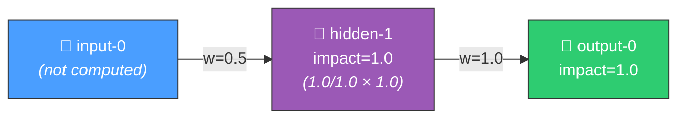

- **output-0** 🎯: impact = 1.0 (it's an output)
- **hidden-1** 🧠: impact = |1.0| / 1.0 × 1.0 = 1.0 (only synapse to output, 100% contribution)
- **input-0**: Not computed (input neurons are observation sources, not selectable for discovery)
  - *If we did calculate it*: |0.5| / 0.5 × 1.0 = 1.0 (only synapse to hidden-1, 100% contribution)

### Example: Branching Network

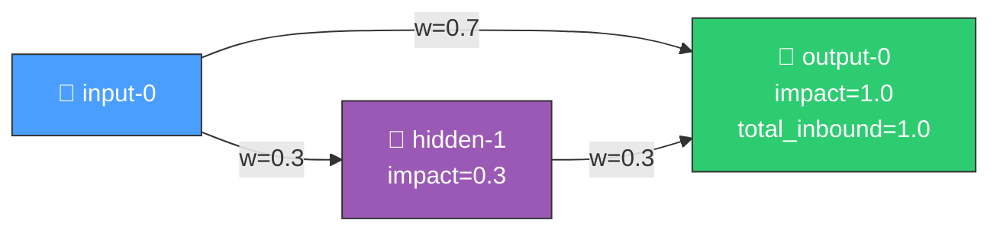

hidden-1 impact = |0.3| / 1.0 × 1.0 = 0.3

When both hidden-1 and input-0 connect to output-0:

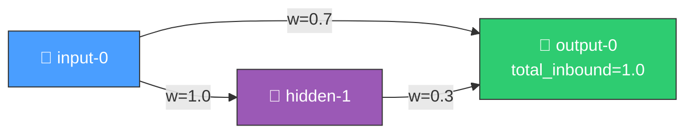

hidden-1 impact = |0.3| / |0.3+0.7| × 1.0 = 0.3

---

## 📈 Visual Examples

### Example 1: Multiple Outputs (Cumulative Impact) ➕

When a neuron connects to multiple outputs, its impact is the **SUM** of all paths:

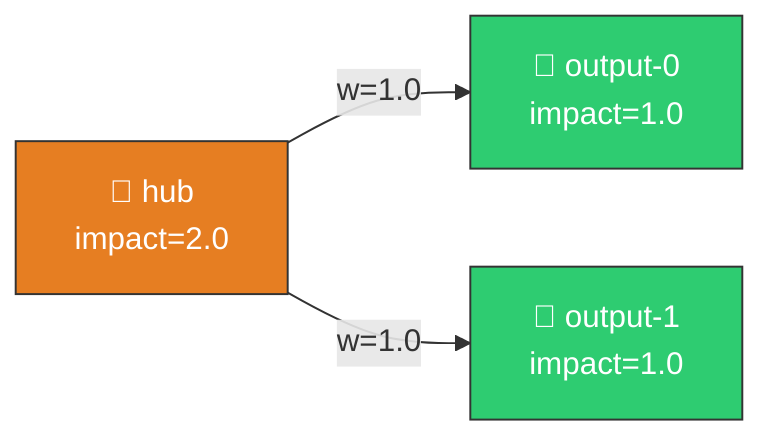

hub impact = (1.0/1.0 × 1.0) + (1.0/1.0 × 1.0) = 2.0

⚡⚡ This reflects that removing 'hub' affects TWO outputs!

### Example 2: Deep Network with Dilution 📉

Impact dilutes as you go deeper into the network:

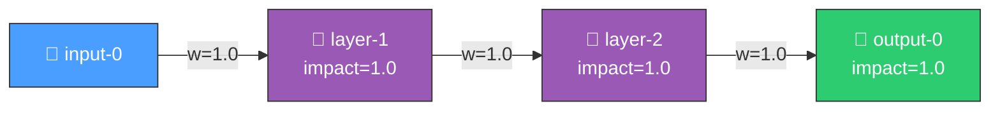

But if layer-2 has many inputs (99 other synapses):

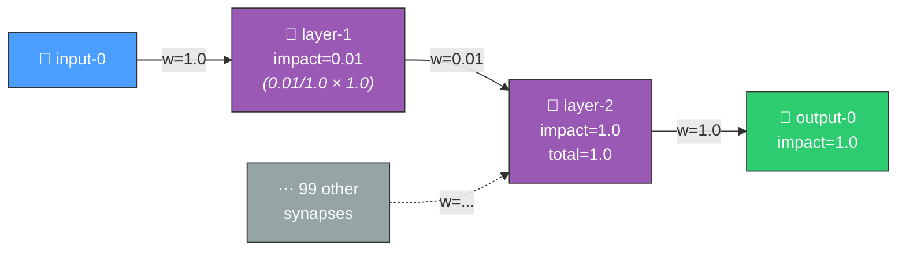

---

## ⚙️ Special Squash Function Handling

The impact calculation is **squash-aware** to handle special activation functions correctly.

### 🎚️ STEP and BIPOLAR (Threshold Functions)

**STEP** and **BIPOLAR** are threshold (binary) functions:

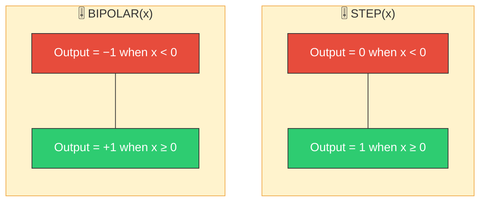

> **Key insight**: These are binary threshold functions — the output jumps discontinuously at threshold = 0.

#### ⚠️ The Problem

With threshold functions, **tiny signals can have HUGE effects**:

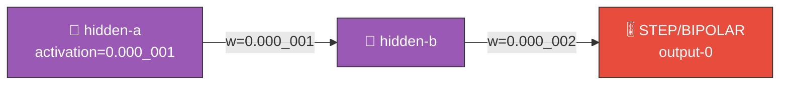

> **OLD impact calculation**: contribution = 0.000_001 × 0.000_002 ≈ 0 (negligible!)
>
> **BUT ACTUAL EFFECT**: If hidden-b's input sum is at −0.000_001 (just below threshold 0):
> - **Before**: output = 0 (or −1 for BIPOLAR)
> - **After adding synapse**: input ≈ 0 — could flip to output = 1!
> - **Impact on score**: Δoutput = 1.0 (or 2.0 for BIPOLAR −1 → 1)
> - **Calculated impact**: ≈ 0

🚨 **ERROR: Off by ~1,000,000x**

#### ✅ Implemented Solution (Issue #1300)

The original fix returned the full unnormalised `child_impact` for *every*
inbound synapse of a threshold target. That overstated influence by a factor of
`N` for `N` inbound synapses (the sum across inbound synapses was
`N × child_impact`). **Issue #1300 corrected this**: threshold squashes now
normalise by `total_inbound` weight — exactly like Linear bounded squashes — and
apply the squash emit-magnitude cap (see the **Squash emit magnitude (Issue #1300)** section below):

$$\text{contribution} = \frac{|w|}{T} \times \text{child\_impact}$$

**Rationale:**
- The "any synapse can flip the output" intent is preserved by the emit-magnitude
  cap — each synapse still receives its weighted share of the full,
  emit-bounded influence 🔀
- Normalisation keeps the sum of inbound contributions bounded (no `N ×`
  overstatement), matching the Linear-squash treatment
- The sum cannot exceed the downstream squash's emit magnitude `M` (`1.0` for
  STEP/BIPOLAR), even when the neuron feeds multiple outputs

#### 🔮 Future Enhancement

With activation data, we could compute the actual threshold-crossing probability:

$$\text{threshold\_impact} = P(\text{crossing}) \times \Delta\text{output}$$

Where:
- $P(\text{crossing})$ = fraction of samples where synapse pushes target across threshold 🎲
- $\Delta\text{output}$ = 1.0 for STEP, 2.0 for BIPOLAR

### 🏆 MINIMUM and MAXIMUM (Selection Functions)

**MINIMUM** and **MAXIMUM** are selection functions - they don't sum inputs, they
select one:

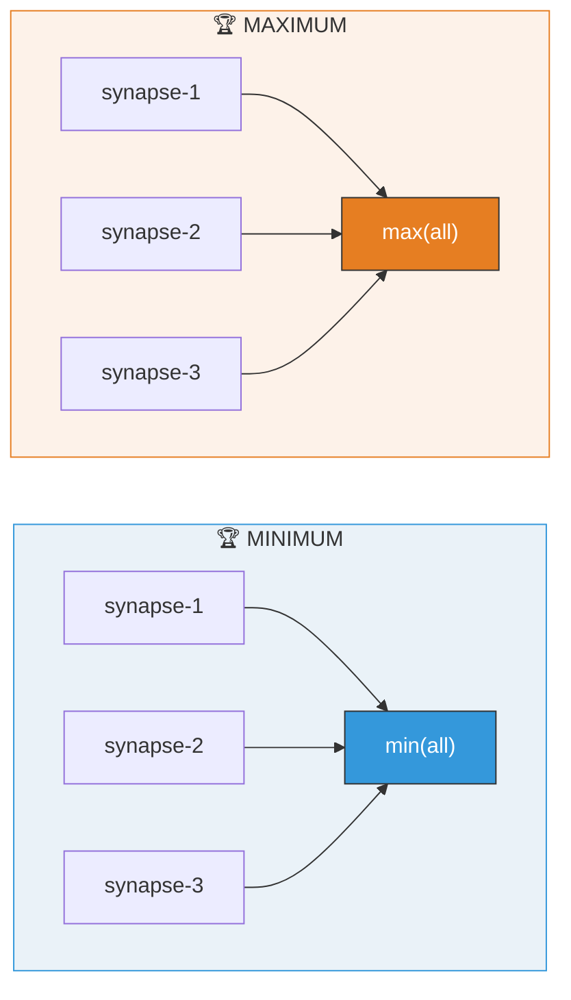

#### ⚠️ The Problem

The old impact calculation assumed **summing** of inputs and normalised by
total weight:

Old formula: `impact = |weight| / Σ|weights| × child_impact`

For MINIMUM/MAXIMUM, only ONE synapse "wins" at any time.
The others contribute NOTHING to the output!

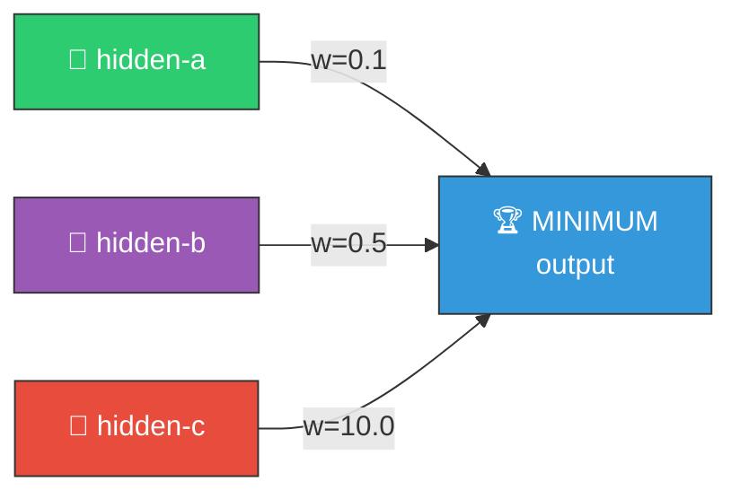

> **OLD calculation (WRONG for MINIMUM):**
> - hidden-a impact = 0.1 / (0.1+0.5+10.0) × 1.0 = 0.0094 (~1%)
> - hidden-b impact = 0.5 / 10.6 × 1.0 = 0.047 (~5%)
> - hidden-c impact = 10.0 / 10.6 × 1.0 = 0.94 (~94%)
>
> **ACTUAL behaviour (MINIMUM):**
> If hidden-a×0.1 = 0.01, hidden-b×0.5 = 0.25, hidden-c×10.0 = 5.0:
> - MINIMUM selects 0.01 (hidden-a's contribution)
> - Output = 0.01 — **hidden-a has 100% impact!**
> - hidden-b, hidden-c have **0% impact!**

🚨 **ERROR: Completely inverted!**

#### ✅ Implemented Solution (v0.1.132+)

For MINIMUM/MAXIMUM targets, use **equal probability** for each synapse:

$$\text{contribution} = \frac{\text{child\_impact}}{N}$$

Where:
- $N$ = number of incoming synapses to the target
- Each synapse has $\frac{1}{N}$ probability of "winning" the selection 🎲

**Rationale:**
- Without activation data, we can't know which synapse wins
- Equal probability is conservative: won't incorrectly flag neurons as "low impact"
- MUCH better than old sum-based approach which was completely wrong!

❌ **Old behaviour (BROKEN)**: sum-based normalisation gave large weights ~90% impact
in MINIMUM, but small weights are more likely to win!

✅ **New behaviour (v0.1.143+)**: When activation records are available, we compute
the **actual selection probability** for each synapse:

$$\text{selection\_impact} = P(\text{winning}) \times \text{child\_impact}$$

Where:
- $P(\text{winning})$ = fraction of samples where this synapse has min/max value 🎲
- For MINIMUM: the synapse with smallest weighted contribution wins
- For MAXIMUM: the synapse with largest weighted contribution wins

**Example**: If hidden-small wins MINIMUM 90% of the time, it gets 90% impact.

When activation records are **not** available (e.g., using `compute_impacts_public`),
we fall back to the conservative 1/N equal probability approach.

---

## ⚖️ Activation-Weighted Impact

The final impact metric used for removal candidates is **activation-weighted impact**:

$$\text{activation\_weighted\_impact} = \text{structural\_impact} \times \text{mean\_absolute\_activation}$$

This captures that a neuron with:
- High structural impact but zero activation → no contribution → can remove 🗑️
- Low structural impact but huge activation → still contributes → don't remove ⛔

### Example

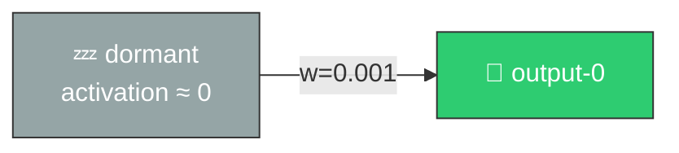

> **structural_impact** = 0.001 | **mean_activation** = 0.0001
> **activation_weighted_impact** = 0.001 × 0.0001 = **1e-7**

✅ **REMOVAL CANDIDATE** (💤 dormant neuron)

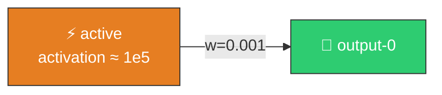

> **structural_impact** = 0.001 | **mean_activation** = 1e5
> **activation_weighted_impact** = 0.001 × 1e5 = **100**

❌ **NOT A REMOVAL CANDIDATE** (⚡ active neuron)

### Removal Threshold (`costOfGrowth`)

Neurons with `activation_weighted_impact < costOfGrowth` are flagged as removal
candidates. The `costOfGrowth` parameter is configurable (default: `1e-7`) and
matches NEAT-AI's `Score.ts` complexity penalty per neuron.

| `costOfGrowth` Value | Purpose |
|----------------------|---------|
| `1e-7` | Default — standard complexity penalty per neuron |
| `1e-9` or lower | Encourages creature expansion for evolution on new neurons |
| Higher values | More aggressive pruning (use with caution) |

Removal candidates are sorted by `activation_weighted_impact` ascending (lowest
first = safest to remove). Each candidate also includes `removalSavings`
calculated from NEAT-AI's complexity formula:

```
savings = costOfGrowth × (1 + (incomingSynapses + outgoingSynapses) / 10)
```

> **Note**: Non-finite activation values (NaN, Infinity) are filtered out when
> computing `mean_absolute_activation` to prevent corruption of the removal
> candidate ranking.

### ⏱️ Phase split — structural triage now, activation weighting later (Issue #1767)

`mean_absolute_activation` is **record-derived**, so the activation-weighted
view above needs a discovery-parquet decode. That must never gate *focus*
selection: on a production deployment the shared parquet warm burned ~2 h
before any useful discovery work started.

Removal is therefore split across two phases over the **same** impact map:

| Phase | Metric | Records |
|-------|--------|---------|
| **Triage** (focus time) | `boostedSavings > \|structural_impact\|` | none — topology only |
| **Gating** (analysis, after focus is fixed) | `boostedSavings > activation_weighted_impact`, plus the mean-activation and constant-variance gates | required |

The triage phase is `focus::triage_removal_candidates`; the activation-weighted
phase remains `identify_removal_candidates` inside the ranking pipeline. See
[docs/FOCUS_SELECTION.md § 9](FOCUS_SELECTION.md#9-removal-triage--the-opposite-axis-issue-1767)
for the opposite-axes rule that governs both.

---

## ♻️ Remove-Neuron Weight-Redistribution Compensation (Issue #1559)

A hygiene-forced `removeNeuron` is usually **regressive**: NEAT-AI's
mean-preserving **bias** compensation cancels only the *mean* of the removed
neuron's downstream contribution, leaving its genuine **per-sample (variance)**
signal as residual cost. The #1558 counterfactual study found that the only
lever able to recover that residual — and make the removal non-regressive — is
**(d): folding the removed neuron's per-sample contribution into a correlated
survivor's downstream weight** rather than only its bias. Of the five strategies
studied, only (d) has a ceiling that reaches a non-regressive removal.

Evaluating (d) needs the candidate's per-sample activation distribution and its
correlation with surviving neurons. Persisting full per-sample vectors per
candidate is prohibitive, so the `remove_neuron_compensation` module
(`src/analysis/remove_neuron_compensation.rs`) persists a compact **sufficient
statistic** — the per-pair mean/variance/covariance of the candidate against
each survivor sharing a downstream target (`ActivationCovariance`, `O(1)` in the
sample count, accumulated in a single numerically stable pass via the
two-variable extension of Welford's algorithm). From that it computes the
optimal least-squares weight bump and the residual per-sample variance it leaves:

```
Δw       = w_c · cov(a_c, a_s) / var(a_s)
residual = w_c² · var(a_c) · (1 − ρ²)
```

where `a_c`/`a_s` are the candidate's and survivor's per-sample activations,
`w_c` is the removed neuron's downstream weight, and `ρ` is their correlation. A
perfectly correlated survivor (`ρ = 1`) drives the residual to zero — the
removal becomes fully compensable and non-regressive, which the mean-only bias
lever can never achieve; an uncorrelated survivor (`ρ = 0`) recovers nothing and
the removal stays regressive.

`shared_downstream_targets` enumerates survivors sharing a downstream target,
`aligned_activations` joins two neurons' per-sample `DiscoverRecord`s on
`obs_index`, and `best_weight_redistribution` picks the survivor whose
redistribution recovers the most variance — returning `None` (no fabricated
compensation) when no shared-target survivor has aligned samples.

### Live-path wiring (Issue #1689)

Milestone #1559 **built** the compensation API but nothing in the live pipeline
invoked it, so emitted `RemoveNeuron` candidates carried no remedy and the
applier fell back to the mean-only bias fold — reproducing the #1558/#1686
regression class. `apply_remove_neuron_compensation`
(`src/analysis/discovery_dispatch.rs`) closes that gap, mirroring the
`apply_honest_remove_neuron_gain` wiring (#1516/#1523). After the honest-gain
override, `analyze_all` gathers the candidate's and its shared-target survivors'
per-sample records from the record cache and, for each candidate whose **sole**
operation is a `RemoveNeuron`, attaches a `removeNeuronCompensation` block to the
emitted candidate JSON: the optimal `deltaWeight`, the compact covariance
statistic (`sampleCount`, variances, covariance, correlation), the bias-only and
redistributed residual variances, and the `fullyCompensable` flag. Routing is by
**measured** constancy (Issue #1779) — a neuron whose recorded activations are
constant within the #1623 fold gate carries no per-sample variance to
redistribute and is left untouched for the bias-fold remedy, not duplicated here.
Routing on the *declared* `neuron_type == "constant"` class instead (the
original #1689 gate) made the fold unreachable: every producer of a sole-op
`RemoveNeuron`
emits **hidden** neurons, so a functionally-constant hidden neuron — the
realistic case — was deleted with no fold and picked up a zero-valued
redistribution remedy carrying no bias information. Consistent with
propose-and-evaluate, provably-regressive removals are **not** gated at proposal
time: the remedy is attached and evaluation decides. Candidates with no
shared-target survivor or no aligned records are emitted with the field absent —
no remedy is fabricated, and the applier flags such variance-carrying removals
rather than folding the mean.

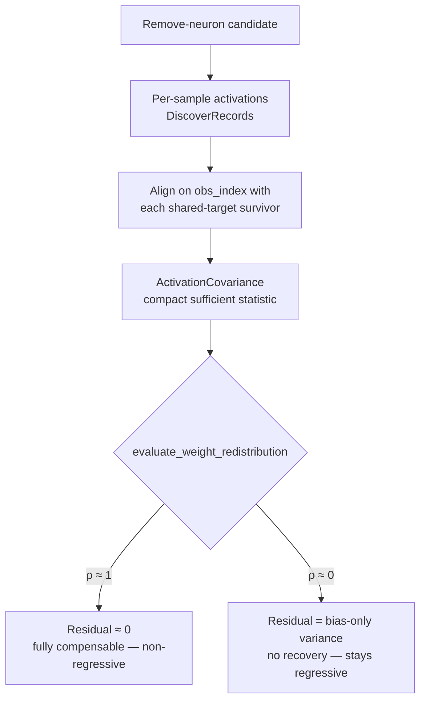

---

## 📋 Implementation Status (v0.2.1+)

The impact calculation is now **squash-aware** and uses **activation-based statistics**
when available. Different squash functions use different impact formulas:

> **Issue #130 fix (v0.2.1)**: The Linear squash formula now correctly uses normalised
> weights (`|w|/T × child_impact`) as documented. Previously, it incorrectly used
> absolute weights (`|w| × child_impact`), causing hidden neurons to get impact >= 1.0.

> **Issue #1300 fix (mirrors `NEAT-AI-Explore#266`)**: Two further correctness gaps
> have been addressed:
>
> 1. **Squash-bounded contribution.** The sum of inbound contributions to a neuron
>    cannot exceed the downstream squash's *emit magnitude* (`M`). For bounded
>    squashes (TANH, LOGISTIC, HARD_TANH, STEP, BIPOLAR, RELU6, ...), the sum is
>    capped at `M` even when the neuron feeds multiple outputs (so `child_impact > 1`).
>    Threshold squashes (STEP/BIPOLAR) previously returned the full `child_impact`
>    for *every* inbound synapse — overstating influence by a factor of `N` for
>    `N` inbound synapses. They now normalise by total inbound weight and apply
>    the same emit-magnitude cap as Linear bounded squashes.
> 2. **Downstream consumer gates.** A new `ConsumerContract` API lets callers
>    declare external `min(output, constant)` / `max(output, constant)` gates so
>    impact attribution is scaled by the gate's pass-through probability. Outputs
>    not in the contract default to a fully-open gate (no change in behaviour).
>    A helper `derive_regime_threshold_from_records` picks a percentile from the
>    recorded activation distribution when no external constant is known.

### 🛡️ Squash emit magnitude (Issue #1300)

| Squash | Output range | `squash_emit_magnitude` |
|--------|--------------|-------------------------|
| `TANH`, `LOGISTIC`, `HARD_TANH`, `SOFTSIGN`, `BIPOLAR_SIGMOID`, `ISRU` | bounded `±1` | `Some(1.0)` |
| `STEP`, `BIPOLAR`, `GAUSSIAN` | `{0, 1}` / `{-1, 1}` / `(0, 1]` | `Some(1.0)` |
| `ARCTAN` | `(-π/2, π/2)` | `Some(π/2)` |
| `RELU6` | `[0, 6]` | `Some(6.0)` |
| `IDENTITY`, `RELU`, `LEAKYRELU`, `ELU`, `SELU`, `CUBE`, `SQUARE`, ... | unbounded | `None` |
| `MINIMUM`, `MAXIMUM`, `IF`, `HYPOT`, `MEAN` | aggregate (selection stats handle these) | `None` |

The bounding formula for a per-synapse contribution `c` into a child neuron with
emit magnitude `M` and currently-accumulated `child_impact`:

$$
c_{\text{bounded}} = \begin{cases}
c & \text{if } M = \infty \text{ or } \text{child\_impact} \le M \\
c \cdot \dfrac{M}{\text{child\_impact}} & \text{otherwise}
\end{cases}
$$

This preserves the relative shares of inbound synapses while ensuring the
total influence respects the squash's saturation ceiling.

### 🔁 Consumer contracts (Issue #1300)

```rust
use neat_ai_discovery::focus::{
    ConsumerContract, OutputGate, compute_impacts_with_contract,
};

let contract = ConsumerContract::new()
    .with_gate("volume-output", OutputGate::MinAgainstConstant(0.25));
let impacts = compute_impacts_with_contract(&creature, Some(&records), Some(&contract))?;
```

When the gate is `MinAgainstConstant(t)`, the network output only drives the
downstream consumer in the regime where `output < t`. The impact attribution is
scaled by the fraction of recorded observations satisfying that condition.
`MaxAgainstConstant(t)` is the symmetric case (gate fires when `output > t`).
`Identity` is the no-op gate (equivalent to omitting the output from the
contract). The above flow is depicted below.

```mermaid
flowchart LR
    A[Recorded output<br/>activations] --> B{Gate?}
    B -- "Identity" --> C[Factor = 1.0]
    B -- "min(out, t)" --> D[Factor = P(out < t)]
    B -- "max(out, t)" --> E[Factor = P(out > t)]
    C --> F[Scale output<br/>initial impact]
    D --> F
    E --> F
    F --> G[Backward propagate<br/>through network]
```

| Squash Function | Impact Model | Accuracy | Notes |
|-----------------|--------------|----------|-------|
| **IDENTITY** | Linear (normalised) | ✅ Accurate | Mathematically exact |
| **TANH/LOGISTIC** | Linear (normalised) | ⚠️ Approx | Saturation not modelled |
| **HARD_TANH** | Linear (normalised) | ⚠️ Approx | Clamping not modelled |
| **STEP** | Threshold (normalised + emit cap) | ✅ Bounded | Normalised by total inbound, capped at emit magnitude 🎚️ (Issue #1300) |
| **BIPOLAR** | Threshold (normalised + emit cap) | ✅ Bounded | Normalised by total inbound, capped at emit magnitude 🎚️ (Issue #1300) |
| **MINIMUM** | Activation-based | ✅ Accurate | Actual win probability from samples 🏆 |
| **MAXIMUM** | Activation-based | ✅ Accurate | Actual win probability from samples 🏆 |
| **IF** | Synapse-type-aware | ✅ Accurate | Condition/positive/negative branches |
| **ReLU** | Linear (normalised) | ⚠️ Approx | Zero region not modelled |

### 🏷️ Squash Categories

The implementation categorises squash functions into three types:

```rust
enum SquashCategory {
    Linear,     // IDENTITY, TANH, LOGISTIC, HARD_TANH, ReLU, etc.
    Threshold,  // STEP, BIPOLAR
    Selection,  // MINIMUM, MAXIMUM, IF
}
```

### 📊 Impact Formulas by Category

**Linear squashes** (default):

$$\text{contribution} = \frac{|w|}{T} \times \text{child\_impact}$$

**Threshold squashes** (STEP/BIPOLAR) 🎚️:

$$\text{contribution} = \frac{|w|}{T} \times \text{child\_impact} \quad\text{(then capped at emit magnitude } M\text{)}$$

Normalised by total inbound weight and capped at the squash emit magnitude
(Issue #1300) — identical to Linear bounded squashes. The "any synapse can flip
the output" intent is preserved by the emit-magnitude cap rather than by
returning the full unnormalised `child_impact`.

**Selection squashes** (MINIMUM/MAXIMUM/IF) 🏆:

When activation records are available:

$$\text{contribution} = P(\text{winning}) \times \text{child\_impact}$$

Where $P(\text{winning})$ is computed from actual activation data.

Without activation records (fallback):

$$\text{contribution} = \frac{\text{child\_impact}}{N}$$

Equal probability for N incoming synapses.

**IF neurons** use synapse type information:
- `"condition"` synapses: $P = 1.0$ (always active)
- `"positive"` synapses: $P =$ fraction where condition sum > 0
- `"negative"` synapses: $P =$ fraction where condition sum ≤ 0

---

## 🔍 Aggregation-Squash Audit (Issue #1738)

Issue #1738 (parent #1736 — *Discovery finds very few successful candidates on a
large production aggregation-heavy network*) audited focus-selection and
impact/contribution propagation through the three aggregation squashes on the
**production-shaped** topologies that the earlier two-branch dominated-branch
fixtures (#1706, #1707, #1712) did not exercise: multi-branch aggregates, IF
condition sign-flips, and chained aggregates.

**Result — no fault found.** The impact math through MAX/MIN/IF is sound on these
shapes. Every expected value in
`tests/issue_1738_aggregation_squash_impact_characterisation.rs` is computed
independently by hand from a committed observation window and matches the engine
exactly, including:

- **Multi-branch attribution & conservation.** For a four-branch MINIMUM, each
  branch's impact equals its empirical win fraction and the branch impacts sum
  to the aggregate's impact — no high-impact branch is starved, none is inflated.
- **IF condition sign-flip (F1 mixed regime).** When the condition changes sign
  across the window, both branches stay live; the always-active condition synapse
  carries full impact and the positive/negative branch impacts equal their
  selection fractions and sum to the aggregate impact.
- **Chained MAX → MAX.** Contribution propagates as a product of per-hop win
  fractions with conservation at every hop. Where the inner winner is
  deterministic, the product-of-marginals equals the true joint exactly.
- **No-records fallback.** Without activation records the walk still splits impact
  `1/N` across branches — the flattening the empirical selection-stats path
  corrects.
- **Focus ranking.** A high-impact aggregate branch embedded in a large
  low-impact pool (the production needle-in-haystack) lands in the exploit/explore
  **exploitation head**, not the exploration tail — even under drought.

This audit is a prerequisite for concluding a plateau on the parent (#1736): the
focus/impact calculations through aggregation squashes are **not** the cause of
the low successful-candidate rate on the production network.

---

## 🔮 Future Improvements

### ✅ Completed

- [x] Document the problem (this document)
- [x] Track squash functions in impact calculation
- [x] Add squash-aware impact functions
- [x] STEP/BIPOLAR support (normalised + emit-magnitude cap, Issue #1300) 🎚️
- [x] MINIMUM/MAXIMUM support (equal-probability approach) 🏆
- [x] **MINIMUM/MAXIMUM: Compute actual selection probability from samples** 🎲 (v0.1.143)
- [x] **IF: Synapse-type-aware impact (condition/positive/negative)** (v0.1.143)
- [x] Integration with removal candidate detection
- [x] Add tests for new edge cases

### 📋 Future Enhancements

These could further improve accuracy:

- [ ] STEP/BIPOLAR: Compute actual threshold-crossing probability from samples 🎲
- [ ] TANH/LOGISTIC: Model saturation using activation values
- [ ] ReLU: Model zero region using activation values

---

## 💻 Related Code

| File | Function | Purpose |
|------|----------|---------|
| `src/focus/impact.rs` | `compute_impacts_internal()` | Core impact calculation 🔄 |
| `src/focus/impact.rs` | `compute_impact_recursive()` | Recursive path traversal |
| `src/focus/ranking/mod.rs` | `rank_focus_neurons()` | Uses impact for ranking 📊 |
| `src/focus/impact.rs` | `compute_impacts_public()` | Public API for analysis |
| `tests/focus/` | Various | Impact calculation tests ✅ |

---

## 📐 Appendix: Mathematical Formulas

### Current Formula (Normalised Path Weight)

$$
\text{impact}(n) = \begin{cases}
1.0 & \text{if } n \text{ is output} \\
\sum_i \frac{|w_i|}{T_i} \times \text{impact}(\text{child}_i) & \text{otherwise}
\end{cases}
$$

Where:
- $w_i$ = weight of synapse from $n$ to $\text{child}_i$
- $T_i$ = $\sum|w|$ for all synapses INTO $\text{child}_i$

### Squash-Aware Formula

$$
\text{impact}(n) = \begin{cases}
1.0 & \text{if } n \text{ is output} \\
\sum_i f_{\text{squash}}(n, \text{child}_i) & \text{otherwise}
\end{cases}
$$

Where $f_{\text{squash}}$ depends on child's squash function:

**Linear** (IDENTITY, etc.):

$$f = \frac{|w|}{T} \times \text{impact}(\text{child})$$

**Threshold** (STEP, BIPOLAR) 🎚️ — normalised and emit-capped (Issue #1300):

$$f = \frac{|w|}{T} \times \text{impact}(\text{child}) \quad\text{(capped at emit magnitude } M\text{)}$$

**Selection** (MINIMUM, MAXIMUM) 🏆:

$$f = \frac{\text{impact}(\text{child})}{N}$$
