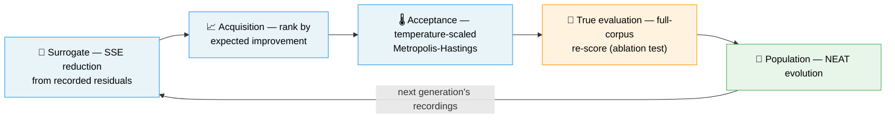

# 📚 Prior Art — Discovery Mapped Onto the Published Work

NEAT-AI-Discovery is described everywhere else in this repository in **house
vocabulary**: detectors, impact, candidates, discounting. Nearly every one of
those pieces has a name in the literature. This document is the map between the
two, so a reader can tell that the architecture is grounded in published work
rather than fifty independent heuristics (Issue #2025).

Two ground rules:

- **No detector is renamed.** The names in
  [DISCOVERY_TYPES.md](DISCOVERY_TYPES.md) are the caller-facing contract and
  stay exactly as they are. This document adds a reference, never a rename.
- **Independent arrival is still worth citing.** Several of these ideas were
  reached here without knowing the paper. Where that happened it is said so
  plainly — the citation records the precedent, not the provenance.

Where a detector genuinely has no close published precedent, its row in
DISCOVERY_TYPES.md says **"No close precedent found"** rather than being
stretched onto the nearest famous paper.

## 📑 Contents

- [1. The pipeline is a surrogate-assisted evolutionary algorithm](#1-the-pipeline-is-a-surrogate-assisted-evolutionary-algorithm)
- [2. Impact is an attribution measure](#2-impact-is-an-attribution-measure)
- [3. Growing capacity](#3-growing-capacity)
- [4. Pruning, merging, and compensating](#4-pruning-merging-and-compensating)
- [5. Activation and neuron pathologies](#5-activation-and-neuron-pathologies)
- [6. Sample weighting and input relevance](#6-sample-weighting-and-input-relevance)
- [7. Search control — memory, exploration, acceptance](#7-search-control--memory-exploration-acceptance)
- [8. Statistical exposure](#8-statistical-exposure)
- [Bibliography](#-bibliography)

---

## 1. The pipeline is a surrogate-assisted evolutionary algorithm

The whole Rust → TypeScript → evolution loop is one named thing: a
**surrogate-assisted evolutionary algorithm** (Jin 2011). A cheap surrogate
proposes and ranks candidates, an expensive true evaluator accepts them, and
the accepted individuals re-enter an evolving population.

| Our vocabulary | The published name |
|----------------|--------------------|
| SSE reduction derived from recorded residuals | the **surrogate** (cheap approximate fitness) |
| The controller's full-corpus re-score / ablation test | the **true evaluation** (expensive, authoritative) |
| "Expected improvement" ranking of candidates | the **acquisition function** — expected improvement, Jones et al. 1998 |
| Temperature-scaled acceptance of a non-improving candidate | Metropolis–Hastings acceptance, Metropolis et al. 1953 and Hastings 1970, annealed as in Kirkpatrick et al. 1983 |
| NEAT-AI's population, selection, and mutation | the **evolutionary algorithm** the surrogate assists |

**"Expected improvement" was arrived at here independently**, from the plain
English meaning of the words. It is also the standard acquisition function of
efficient global optimisation (Jones et al. 1998), and the correspondence is
real: both rank an unevaluated point by a cheap model's prediction of how much
it would improve the incumbent, then spend the expensive evaluation budget on
the top of that ranking. The difference is that discovery's surrogate is
**analytic** (SSE arithmetic over recorded residuals) rather than a fitted
Gaussian process, so it carries no posterior variance and the ranking is a
predicted mean gain, not a probability-weighted integral.

The batch behaviour has a name too: proposing many candidates per round and
suppressing near-duplicates before spending evaluations on them is **batch
Bayesian optimisation with a diversity penalty** (González et al. 2016), which
is what candidate clustering for redundancy reduction does.

See [ANALYSIS_DEEP_DIVE.md](ANALYSIS_DEEP_DIVE.md) for the mechanics and
[CANDIDATE_PIPELINE_MCMC_AUDIT.md](CANDIDATE_PIPELINE_MCMC_AUDIT.md) for the
audit of which pipeline stages are genuinely MCMC and which only resemble it.

## 2. Impact is an attribution measure

[IMPACT_CALCULATION.md](IMPACT_CALCULATION.md) computes a neuron's influence on
the output by propagating **normalised path weights** backwards from the output
neurons. That is the same move as **layer-wise relevance propagation** (Bach et
al. 2015) and **DeepLIFT** (Shrikumar et al. 2017): a conserved quantity starts
at the output and is redistributed to upstream units in proportion to their
share of the inbound signal.

Deciding to *remove* the lowest-scoring units on that basis is
**Optimal Brain Damage** (LeCun et al. 1989) and its second-order successor
**Optimal Brain Surgeon** (Hassibi & Stork 1993), and the first-order,
activation-times-sensitivity form used in practice is **Taylor-criterion
pruning** (Molchanov et al. 2017, refined in Molchanov et al. 2019).

**Impact discounting** exists because per-unit attributions do not sum to the
whole-network effect: two units that each look worth 0.4 are not jointly worth
0.8 when they overlap. The principled treatment of that allocation problem is
**Shapley value** attribution (Lundberg & Lee 2017), which is exact but prices
in an exponential number of coalitions. Discounting is the cheap stand-in — see
[IMPACT_CALCULATION.md § Prior Art](IMPACT_CALCULATION.md#-prior-art--impact-as-an-attribution-measure)
for the trade-off in full.

The controller's validation step — clone the creature, disable or remove the
unit, re-score — is a **unit-ablation study** (Zhou et al. 2018).

## 3. Growing capacity

| Our vocabulary | The published name |
|----------------|--------------------|
| Correlated Error Pattern → Add Neuron | **Cascade-Correlation** (Fahlman & Lebiere 1990) — a new unit is chosen to maximise correlation with the residual error. Published in 1990, rediscovered here |
| Add Neurons, sensible parameter ranges | Function-preserving growth, **Net2Net** (Chen et al. 2016) |
| Symmetry Breaking, Bimodal Neuron, Fan-in Polarity Conflict → split a neuron | **Firefly neural architecture descent** (Wu et al. 2020) splits neurons for exactly this reason |
| Add Synapses, Fan-in Candidates | **GradMax** (Evci et al. 2022) — new connections initialised from the gradient signal they would carry |
| Skip Connection Detection | Residual/skip connections, **ResNet** (He et al. 2016) |
| Topology Diversification | Novelty-driven search (Lehman & Stanley 2011) |
| Topology-Aware Structure Analysis | Neural architecture search (Elsken et al. 2019) |

The Cascade-Correlation correspondence is the sharpest one in this document:
the detector's whole premise — find the residual error pattern no existing unit
explains, then add a unit correlated with it — is the 1990 algorithm, arrived
at again from the recorded-residual data.

## 4. Pruning, merging, and compensating

| Our vocabulary | The published name |
|----------------|--------------------|
| Low-Impact Neuron, Remove Low-Impact, Noise-to-Signal | Magnitude/saliency pruning — LeCun et al. 1989, Han et al. 2015, Molchanov et al. 2017 |
| Remove Harmful Synapse | Second-order saliency pruning (Hassibi & Stork 1993) |
| Merge Redundant Neuron | **Data-free parameter pruning** (Srinivas & Babu 2015) — similar-neuron merging |
| Redundant Path Pruning with renormalisation | Lossless path merging plus reconstruction — Srinivas & Babu 2015, **ThiNet** (Luo et al. 2017) |
| Remove-neuron bias compensation, Output Bias Drift | Bias correction after a structural change (Nagel et al. 2019), reconstruction-error compensation (Luo et al. 2017) |
| Weight Magnitude Reset | Re-initialisation of surviving weights, **lottery-ticket** style (Frankle & Carbin 2019) |
| Bias Perturbation | Perturbation/occlusion sensitivity (Zeiler & Fergus 2014) |

## 5. Activation and neuron pathologies

| Our vocabulary | The published name |
|----------------|--------------------|
| Dead Neuron Detection | The **dying ReLU** problem (Lu et al. 2019) |
| Saturated Neuron, Restricted Range, Operating Point | Saturation analysis of bounded activations (Glorot & Bengio 2010), input/operating-point conditioning (LeCun et al. 1998) |
| Output Range Compression | Activation rescaling, batch normalisation (Ioffe & Szegedy 2015) |
| Unbounded Capping | Deliberately bounded activations, ReLU6 (Howard et al. 2017) |
| Activation Recommendation, Activation Mismatch, Output Squash Mismatch | Searched activation functions (Ramachandran et al. 2017), learned rectifiers — PReLU (He et al. 2015), APL (Agostinelli et al. 2015) |
| Co-Adaptation Detection | Co-adaptation of feature detectors, the framing behind dropout (Hinton et al. 2012) |
| Gradient Discovery | Gradient-directed weight adjustment (Rumelhart et al. 1986, LeCun et al. 1998) |
| Weight Polarity Flip | Sign-based weight updates, **RPROP** (Riedmiller & Braun 1993) |
| Monotonicity Detection | Monotonic networks (Sill 1997) |
| Output Conflict Detection | Conflicting per-task gradients on a shared unit — gradient surgery (Yu et al. 2020) |

## 6. Sample weighting and input relevance

| Our vocabulary | The published name |
|----------------|--------------------|
| Hard Sample Cluster, Sample-Weighted Discovery | Reweighting hard examples — boosting (Freund & Schapire 1997), **OHEM** (Shrivastava et al. 2016), **focal loss** (Lin et al. 2017) |
| Observation Utilisation | Feature selection and relevance (Guyon & Elisseeff 2003) |
| Input Sensitivity | Gradient saliency (Simonyan et al. 2014) |
| Sentinel Gating | Missing-data indicator variables (Little & Rubin 2002) |
| Bounded Range | Input conditioning and scaling (LeCun et al. 1998) |
| Multi-Hop Candidate Analysis | Multi-step path credit assignment, as in relevance propagation (Bach et al. 2015) |

## 7. Search control — memory, exploration, acceptance

| Our vocabulary | The published name |
|----------------|--------------------|
| Epistatic Neuron Pair, Combo Successful, Coordinated Structural Discovery | **Linkage learning** in evolutionary algorithms — variables that must change together (Harik & Goldberg 1997, LTGA in Thierens 2010) |
| Cross-Detection Synthesis, Batch-Successful Grouping | Linkage-model-driven grouping of edits (Thierens 2010) |
| Candidate Clustering for Redundancy Reduction | Batch acquisition with a diversity penalty (González et al. 2016) |
| Randomise within top-K under deadlines | ε-greedy / UCB exploration (Auer et al. 2002) |
| Success and failure caches | **Tabu search** memory (Glover 1986), adaptive operator selection with credit assignment (Fialho et al. 2010) |
| Temperature-scaled MH acceptance | Metropolis et al. 1953, Hastings 1970, simulated annealing (Kirkpatrick et al. 1983) |

## 8. Statistical exposure

Around fifty detectors propose against **one** recorded corpus, and every
admitted candidate was admitted on a measured improvement against that same
corpus. That is a large multiple-comparisons surface, and repeated selection
against a reused holdout is the failure mode analysed in **the reusable
holdout** (Dwork et al. 2015) and **the Ladder** (Blum & Hardt 2015).

The mitigation discovery relies on today, and the honest limits of it, are
documented beside the existing cost-function caveat in
[COST_FUNCTION_NOTES.md § 9](COST_FUNCTION_NOTES.md#9-repeated-selection-on-one-corpus--the-multiple-comparisons-exposure).

---

## 📖 Bibliography

| Citation | Work | Where it shows up |
|----------|------|-------------------|
| Agostinelli et al. 2015 | [Learning Activation Functions to Improve Deep Neural Networks](https://arxiv.org/abs/1412.6830) | Activation recommendation, squash mismatch |
| Auer et al. 2002 | [Finite-time Analysis of the Multiarmed Bandit Problem](https://doi.org/10.1023/A:1013689704352) | Randomise within top-K, exploration under deadlines |
| Bach et al. 2015 | [On Pixel-Wise Explanations for Non-Linear Classifier Decisions by Layer-Wise Relevance Propagation](https://doi.org/10.1371/journal.pone.0130140) | Impact as attribution, multi-hop paths |
| Blum & Hardt 2015 | [The Ladder: A Reliable Leaderboard for Machine Learning Competitions](https://arxiv.org/abs/1502.04585) | Repeated selection on one corpus |
| Chen et al. 2016 | [Net2Net: Accelerating Learning via Knowledge Transfer](https://arxiv.org/abs/1511.05641) | Add neurons, bottleneck widening, squash + weight rescale |
| Dwork et al. 2015 | [The reusable holdout: Preserving validity in adaptive data analysis](https://doi.org/10.1126/science.aaa9375) | Repeated selection on one corpus |
| Elsken et al. 2019 | [Neural Architecture Search: A Survey](https://arxiv.org/abs/1808.05377) | Topology-aware structure analysis |
| Evci et al. 2022 | [GradMax: Growing Neural Networks using Gradient Information](https://arxiv.org/abs/2201.05125) | Add synapses, fan-in candidates, bottleneck growth |
| Fahlman & Lebiere 1990 | [The Cascade-Correlation Learning Architecture](https://proceedings.neurips.cc/paper_files/paper/1989/hash/69adc1e107f7f7d035d7baf04342e1ca-Abstract.html) | Correlated error → add neuron |
| Fialho et al. 2010 | [Analyzing bandit-based adaptive operator selection mechanisms](https://doi.org/10.1007/s10472-010-9213-y) | Success and failure caches, credit assignment |
| Frankle & Carbin 2019 | [The Lottery Ticket Hypothesis: Finding Sparse, Trainable Neural Networks](https://arxiv.org/abs/1803.03635) | Weight magnitude reset |
| Freund & Schapire 1997 | [A Decision-Theoretic Generalization of On-Line Learning and an Application to Boosting](https://doi.org/10.1006/jcss.1997.1504) | Hard sample cluster, sample-weighted discovery |
| Glorot & Bengio 2010 | [Understanding the difficulty of training deep feedforward neural networks](https://proceedings.mlr.press/v9/glorot10a.html) | Saturation, restricted range, operating point |
| Glover 1986 | [Future paths for integer programming and links to artificial intelligence](https://doi.org/10.1016/0305-0548(86)90048-1) | Success and failure caches (tabu memory) |
| González et al. 2016 | [Batch Bayesian Optimization via Local Penalization](https://arxiv.org/abs/1505.08052) | Candidate clustering for redundancy reduction |
| Guyon & Elisseeff 2003 | [An Introduction to Variable and Feature Selection](https://www.jmlr.org/papers/v3/guyon03a.html) | Observation utilisation |
| Han et al. 2015 | [Learning both Weights and Connections for Efficient Neural Networks](https://arxiv.org/abs/1506.02626) | Dormant/opposing synapses, noise-to-signal pruning |
| Harik & Goldberg 1997 | Learning Linkage (FOGA 4) — journal statement: [Linkage learning through probabilistic expression](https://doi.org/10.1016/S0045-7825(99)00388-6) | Epistatic pairs, coordinated structural discovery |
| Hassibi & Stork 1993 | [Second order derivatives for network pruning: Optimal Brain Surgeon](https://proceedings.neurips.cc/paper_files/paper/1992/hash/303ed4c69846ab36c2904d3ba8573050-Abstract.html) | Remove harmful synapse |
| Hastings 1970 | [Monte Carlo Sampling Methods Using Markov Chains and Their Applications](https://doi.org/10.1093/biomet/57.1.97) | Temperature-scaled acceptance |
| He et al. 2015 | [Delving Deep into Rectifiers: Surpassing Human-Level Performance on ImageNet Classification](https://arxiv.org/abs/1502.01852) | Activation recommendation (PReLU) |
| He et al. 2016 | [Deep Residual Learning for Image Recognition](https://arxiv.org/abs/1512.03385) | Skip connection detection |
| Hinton et al. 2012 | [Improving neural networks by preventing co-adaptation of feature detectors](https://arxiv.org/abs/1207.0580) | Co-adaptation detection |
| Howard et al. 2017 | [MobileNets: Efficient Convolutional Neural Networks for Mobile Vision Applications](https://arxiv.org/abs/1704.04861) | Unbounded capping (ReLU6) |
| Ioffe & Szegedy 2015 | [Batch Normalization: Accelerating Deep Network Training by Reducing Internal Covariate Shift](https://arxiv.org/abs/1502.03167) | Output range compression, saturation remedies |
| Jin 2011 | [Surrogate-assisted evolutionary computation: Recent advances and future challenges](https://doi.org/10.1016/j.swevo.2011.05.001) | The pipeline as a whole |
| Jones et al. 1998 | [Efficient Global Optimization of Expensive Black-Box Functions](https://doi.org/10.1023/A:1008306431147) | Expected improvement as the acquisition function |
| Kirkpatrick et al. 1983 | [Optimization by Simulated Annealing](https://doi.org/10.1126/science.220.4598.671) | Temperature-scaled acceptance |
| LeCun et al. 1989 | [Optimal Brain Damage](https://proceedings.neurips.cc/paper_files/paper/1989/hash/6c9882bbac1c7093bd25041881277658-Abstract.html) | Low-impact neuron removal |
| LeCun et al. 1998 | [Efficient BackProp](https://doi.org/10.1007/3-540-49430-8_2) | Input conditioning, operating point, gradient discovery |
| Lehman & Stanley 2011 | [Abandoning Objectives: Evolution Through the Search for Novelty Alone](https://doi.org/10.1162/EVCO_a_00025) | Topology diversification |
| Lin et al. 2017 | [Focal Loss for Dense Object Detection](https://arxiv.org/abs/1708.02002) | Hard sample cluster, sample-weighted discovery |
| Little & Rubin 2002 | [Statistical Analysis with Missing Data](https://doi.org/10.1002/9781119013563) | Sentinel gating |
| Lu et al. 2019 | [Dying ReLU and Initialization: Theory and Numerical Examples](https://arxiv.org/abs/1903.06733) | Dead neuron detection |
| Luo et al. 2017 | [ThiNet: A Filter Level Pruning Method for Deep Neural Network Compression](https://arxiv.org/abs/1707.06342) | Redundant path pruning, removal compensation |
| Lundberg & Lee 2017 | [A Unified Approach to Interpreting Model Predictions](https://arxiv.org/abs/1705.07874) | Impact discounting versus exact Shapley allocation |
| Metropolis et al. 1953 | [Equation of State Calculations by Fast Computing Machines](https://doi.org/10.1063/1.1699114) | Temperature-scaled acceptance |
| Molchanov et al. 2017 | [Pruning Convolutional Neural Networks for Resource Efficient Inference](https://arxiv.org/abs/1611.06440) | Taylor-criterion removal decisions |
| Molchanov et al. 2019 | [Importance Estimation for Neural Network Pruning](https://openaccess.thecvf.com/content_CVPR_2019/html/Molchanov_Importance_Estimation_for_Neural_Network_Pruning_CVPR_2019_paper.html) | Weight coherence, refined importance estimation |
| Nagel et al. 2019 | [Data-Free Quantization Through Weight Equalization and Bias Correction](https://arxiv.org/abs/1906.04721) | Bias compensation after a structural change |
| Ramachandran et al. 2017 | [Searching for Activation Functions](https://arxiv.org/abs/1710.05941) | Activation recommendation, squash exploration |
| Riedmiller & Braun 1993 | [A direct adaptive method for faster backpropagation learning: the RPROP algorithm](https://doi.org/10.1109/ICNN.1993.298623) | Weight polarity flip |
| Rumelhart et al. 1986 | [Learning representations by back-propagating errors](https://doi.org/10.1038/323533a0) | Gradient-based synapse adjustment |
| Shrikumar et al. 2017 | [Learning Important Features Through Propagating Activation Differences](https://arxiv.org/abs/1704.02685) | Impact as attribution (DeepLIFT) |
| Shrivastava et al. 2016 | [Training Region-based Object Detectors with Online Hard Example Mining](https://arxiv.org/abs/1604.03540) | Hard sample cluster |
| Sill 1997 | [Monotonic Networks](https://proceedings.neurips.cc/paper_files/paper/1997/hash/83adc9225e4deb67d7ce42d58fe5157c-Abstract.html) | Monotonicity detection |
| Simonyan et al. 2014 | [Deep Inside Convolutional Networks: Visualising Image Classification Models and Saliency Maps](https://arxiv.org/abs/1312.6034) | Input sensitivity |
| Srinivas & Babu 2015 | [Data-free parameter pruning for Deep Neural Networks](https://arxiv.org/abs/1507.06149) | Merge redundant neuron, redundant path pruning |
| Thierens 2010 | [The Linkage Tree Genetic Algorithm](https://doi.org/10.1007/978-3-642-15844-5_27) | Coordinated structural discovery, cross-detection synthesis |
| Wu et al. 2020 | [Firefly Neural Architecture Descent: a General Approach for Growing Neural Networks](https://arxiv.org/abs/2102.08574) | Symmetry breaking, bimodal split, fan-in conflict |
| Yu et al. 2020 | [Gradient Surgery for Multi-Task Learning](https://arxiv.org/abs/2001.06782) | Output conflict detection |
| Zeiler & Fergus 2014 | [Visualizing and Understanding Convolutional Networks](https://arxiv.org/abs/1311.2901) | Bias perturbation (occlusion sensitivity) |
| Zhou et al. 2018 | [Revisiting the Importance of Individual Units in CNNs via Ablation](https://arxiv.org/abs/1806.02891) | The controller's ablation-test validation |

---

## 🔗 Related Documentation

| Document | Why |
|----------|-----|
| [DISCOVERY_TYPES.md](DISCOVERY_TYPES.md) | Per-detector `Prior art` column citing into the bibliography above |
| [IMPACT_CALCULATION.md](IMPACT_CALCULATION.md) | Attribution framing and the Shapley-versus-discounting trade-off |
| [COST_FUNCTION_NOTES.md](COST_FUNCTION_NOTES.md) | SSE-proxy caveat and the multiple-comparisons exposure |
| [ANALYSIS_DEEP_DIVE.md](ANALYSIS_DEEP_DIVE.md) | The mechanics the framings above describe |
| [CANDIDATE_PIPELINE_MCMC_AUDIT.md](CANDIDATE_PIPELINE_MCMC_AUDIT.md) | Which pipeline stages are genuinely MCMC |
