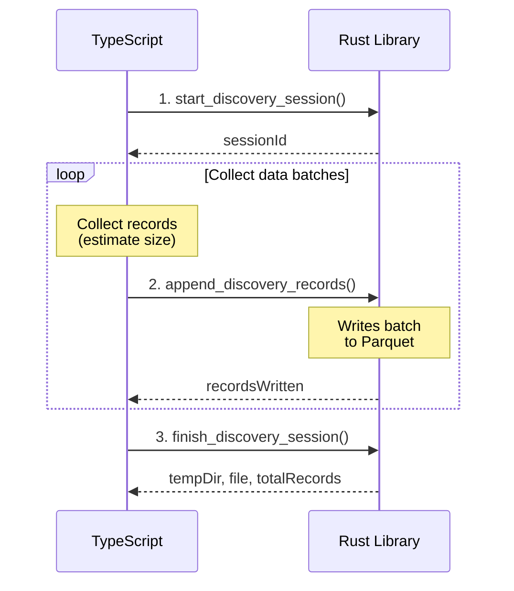
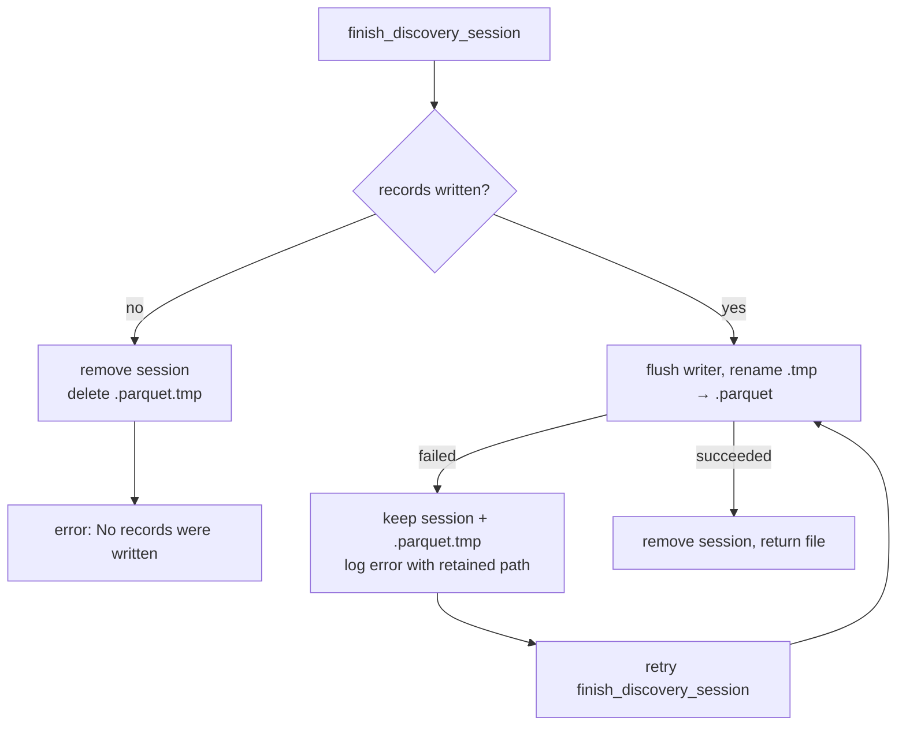

# Streaming API Guide

This guide walks through the streaming recording API for TypeScript/Deno
consumers. The streaming API replaces the single-call `record_discovery`
function for large datasets, avoiding JavaScript/V8 string length limits.

For the full FFI API reference and JSON schemas, see
[FFI_API.md](FFI_API.md).

---

## Why Streaming?

JavaScript/V8 has a maximum string length of approximately 2^28 characters.
When a discovery run accumulates 6+ minutes of training data and attempts to
`JSON.stringify` it all at once for a single FFI call, V8 throws an
`Invalid string length` error. The streaming API keeps each FFI call small by
sending data in batches.

**Benefits:**

- **No string length limits** — each batch is small enough to serialise
- **Unlimited sample sizes** — can record for hours without memory issues
- **Fail-safe** — already-written data is preserved in the Parquet file if the
  process crashes mid-recording
- **Reduced memory pressure** — TypeScript can discard batches after flushing

---

## Workflow Overview

The streaming workflow has three phases:

```
1. start_discovery_session()    →  Creates session + Parquet file
2. append_discovery_records()   →  Writes batches (repeat as needed)
3. finish_discovery_session()   →  Finalises Parquet file
```



---

## Step 1 — Start a Session

Open the library and call `start_discovery_session` with the creature
definition and a temporary directory path.

```typescript
// Load the native library
const lib = Deno.dlopen("libneat_ai_discovery.dylib", {
  start_discovery_session: { parameters: ["buffer"], result: "pointer" },
  append_discovery_records: { parameters: ["buffer"], result: "pointer" },
  finish_discovery_session: { parameters: ["buffer"], result: "pointer" },
  cancel_discovery_session: { parameters: ["buffer"], result: "pointer" },
  free_discovery_result: { parameters: ["pointer"], result: "void" },
});

// Prepare the session request
const startRequest = JSON.stringify({
  creature: {
    neurons: [
      { uuid: "input-0", type: "input", squash: "IDENTITY", bias: 0.0 },
      { uuid: "hidden-1", type: "hidden", squash: "TANH", bias: 0.1 },
      { uuid: "output-0", type: "output", squash: "IDENTITY", bias: 0.0 },
    ],
    synapses: [
      { from_uuid: "input-0", to_uuid: "hidden-1", weight: 0.5 },
      { from_uuid: "hidden-1", to_uuid: "output-0", weight: 0.8 },
    ],
    input: 1,
    output: 1,
  },
  tempDir: ".discovery/abc123_456789",
});

// Call the FFI function
const startPtr = lib.symbols.start_discovery_session(
  new TextEncoder().encode(startRequest + "\0"),
);
const startResult = JSON.parse(
  new Deno.UnsafePointerView(startPtr).getCString(),
);
lib.symbols.free_discovery_result(startPtr);

if (!startResult.success) {
  throw new Error(`Session start failed: ${startResult.error}`);
}

const sessionId: string = startResult.sessionId;
```

### Start Session Input/Output

**Input:**
```json
{
  "creature": {
    "neurons": [{ "uuid": "hidden-1", "type": "hidden", "squash": "TANH", "bias": 0.0 }],
    "synapses": [{ "from_uuid": "input-0", "to_uuid": "hidden-1", "weight": 0.5 }],
    "input": 20,
    "output": 2
  },
  "tempDir": ".discovery/abc123_456789"
}
```

**Output:**
```json
{
  "success": true,
  "sessionId": "550e8400-e29b-41d4-a716-446655440000"
}
```

---

## Step 2 — Append Record Batches

During training, collect neuron activation data and flush it to the Rust
library periodically. Each batch should be well under V8's string limit —
flushing at approximately 50 MB is a safe default.

```typescript
const FLUSH_THRESHOLD = 50 * 1024 * 1024; // 50 MB

let pendingObservations: Observation[] = [];

for (const trainingRecord of trainingData) {
  // Activate the creature and collect neuron data
  const neuronData = creature.activate(trainingRecord.input);

  pendingObservations.push({
    obsIndex: trainingRecord.index,
    neuronData: neuronData.map((item) => ({
      neuronUuid: item.uuid,
      activation: item.activation,
      value: item.value,
      errors: item.errors,
    })),
    inputs: trainingRecord.input,
  });

  // Estimate the JSON size and flush when approaching the threshold
  const estimatedBytes = pendingObservations.length * (
    200 * creature.neurons.length + 4 * creature.input
  );

  if (estimatedBytes > FLUSH_THRESHOLD) {
    await flushBatch(sessionId, pendingObservations);
    pendingObservations = []; // Reset for next batch
  }
}

// Flush any remaining records
if (pendingObservations.length > 0) {
  await flushBatch(sessionId, pendingObservations);
}
```

The `flushBatch` helper serialises and sends a batch:

```typescript
function flushBatch(
  sessionId: string,
  observations: Observation[],
): void {
  const appendRequest = JSON.stringify({
    sessionId,
    observations,
  });

  const appendPtr = lib.symbols.append_discovery_records(
    new TextEncoder().encode(appendRequest + "\0"),
  );
  const appendResult = JSON.parse(
    new Deno.UnsafePointerView(appendPtr).getCString(),
  );
  lib.symbols.free_discovery_result(appendPtr);

  if (!appendResult.success) {
    throw new Error(`Append failed: ${appendResult.error}`);
  }
}
```

### Append Input/Output

**Input:**
```json
{
  "sessionId": "550e8400-e29b-41d4-a716-446655440000",
  "observations": [
    {
      "obsIndex": 0,
      "neuronData": [
        { "neuronUuid": "hidden-1", "activation": 0.5, "value": 0.4, "errors": [0.1] }
      ],
      "inputs": [0.1, 0.2, 0.3]
    }
  ]
}
```

**Output:**
```json
{
  "success": true,
  "recordsWritten": 42
}
```

---

## Step 3 — Finish the Session

After all batches have been appended, finalise the session. This closes the
Parquet file and returns the file location for subsequent analysis.

```typescript
const finishRequest = JSON.stringify({ sessionId });
const finishPtr = lib.symbols.finish_discovery_session(
  new TextEncoder().encode(finishRequest + "\0"),
);
const finishResult = JSON.parse(
  new Deno.UnsafePointerView(finishPtr).getCString(),
);
lib.symbols.free_discovery_result(finishPtr);

if (!finishResult.success) {
  throw new Error(`Finish failed: ${finishResult.error}`);
}

console.log(`Wrote ${finishResult.totalRecords} records`);
console.log(`Parquet file: ${finishResult.tempDir}/${finishResult.file}`);
```

### Finish Output

```json
{
  "success": true,
  "tempDir": ".discovery/abc123_456789",
  "file": "discovery_data.parquet",
  "totalRecords": 12345
}
```

---

## Error Handling and Recovery

### Append Failures

If `append_discovery_records` returns `success: false`, the session remains
open and valid. You can retry the failed batch or cancel the session:

```typescript
const result = appendBatch(sessionId, observations);
if (!result.success) {
  // Option 1: Retry the batch
  const retry = appendBatch(sessionId, observations);
  if (!retry.success) {
    // Option 2: Cancel the session and start fresh
    cancelSession(sessionId);
    throw new Error(`Append failed after retry: ${retry.error}`);
  }
}
```

### Session Cancellation

Use `cancel_discovery_session` to clean up without finalising. This removes
the session and deletes any partially-written temporary files:

```typescript
function cancelSession(sessionId: string): void {
  const cancelRequest = JSON.stringify({ sessionId });
  const cancelPtr = lib.symbols.cancel_discovery_session(
    new TextEncoder().encode(cancelRequest + "\0"),
  );
  const cancelResult = JSON.parse(
    new Deno.UnsafePointerView(cancelPtr).getCString(),
  );
  lib.symbols.free_discovery_result(cancelPtr);

  if (!cancelResult.success) {
    console.warn(`Cancel failed: ${cancelResult.error}`);
  }
}
```

Cancellation is final. Once a session is cancelled — or removed by the TTL sweep
— every subsequent `append_discovery_records` call for it returns
`success: false`, even one already in flight on another thread (Issue #1876). A
batch whose records are about to be discarded with the `.parquet.tmp` file is
never acknowledged as written:

```json
{
  "success": false,
  "error": "Session cancelled: <sessionId>"
}
```

### Process Crash Recovery

If the process crashes mid-recording:

- The Rust library writes to a `.parquet.tmp` file during the session.
- On `finish_discovery_session`, the temporary file is atomically renamed to
  `discovery_data.parquet`.
- If the session is never finished (crash or panic), the `Drop` implementation
  automatically cleans up the incomplete `.parquet.tmp` file.
- Already-written batches are preserved in the temporary file until cleanup
  occurs.

### Failed Finalisation Is Retryable

A `finish_discovery_session` that fails while flushing or renaming — a transient
`ENOSPC`, `EXDEV`, or `EACCES` — keeps the complete `.parquet.tmp` file on disk
and leaves the session registered, so calling `finish_discovery_session` again
with the same session ID retries the rename (Issue #1902). The failure is logged
at `error` level naming the retained path. Only an abandoned session — one
cancelled, TTL-swept, or dropped without a finish attempt — has its
`.parquet.tmp` deleted, as does the empty-session guard below.



### Empty Session Guard

Calling `finish_discovery_session` without appending any records returns an
error. Always append at least one batch before finishing:

```json
{
  "success": false,
  "error": "No records were written to the session"
}
```

### Invalid Session ID

Using a non-existent or already-finished session ID returns an error:

```json
{
  "success": false,
  "error": "Session not found: <session_id>"
}
```

---

## Best Practices

### Batch Sizing

- **Target 50 MB per batch** — well under V8's ~256 MB string limit, leaving
  headroom for JSON encoding overhead.
- **Estimate size before serialising** — use the rough formula:
  `observations.length * (200 * neuronCount + 4 * inputCount)` bytes.
- **Avoid very small batches** — each FFI call has overhead. Batches under
  1 MB are inefficient.
- **Avoid very large batches** — batches over 100 MB risk approaching string
  limits and increase memory pressure.

### Session Lifecycle

- **One session per creature per discovery run** — do not reuse session IDs.
- **Always finish or cancel** — leaving sessions open leaks memory in the
  global session storage.
- **Use try/finally** — wrap the session lifecycle to ensure cleanup:

```typescript
const sessionId = startSession(creature, tempDir);
try {
  for (const batch of collectBatches(trainingData)) {
    appendBatch(sessionId, batch);
  }
  const result = finishSession(sessionId);
  return result;
} catch (error) {
  cancelSession(sessionId);
  throw error;
}
```

### Memory Management

- **Free every FFI result** — every pointer returned by `start_discovery_session`,
  `append_discovery_records`, `finish_discovery_session`, and
  `cancel_discovery_session` must be freed with `free_discovery_result()`.
  Failure to do so leaks memory.
- **Discard batches after flushing** — set the batch array to `[]` after each
  successful append to allow garbage collection.
- **Monitor Rust-side memory** — use `discovery_memory_usage_bytes()` to track
  Rust allocator usage alongside `Deno.memoryUsage().heapUsed` for total
  process memory monitoring.

### Atomic Record Writes

Each observation must contain data from a single training record. Never mix
activations or errors from different training records within the same
observation. The analysis phase matches records by `obsIndex` — misaligned
data produces incorrect analysis results.

---

## When to Use Streaming vs Single-Call

| Scenario | Recommended API |
|----------|----------------|
| Small datasets (< 1 minute recording) | `record_discovery` (single-call) |
| Large datasets (> 1 minute recording) | Streaming API |
| Unknown dataset size | Streaming API (always safe) |
| Memory-constrained environments | Streaming API |

The streaming API is the **preferred** approach for all new integrations. The
single-call `record_discovery` function remains available for backward
compatibility but should be avoided for large runs.

---

## Related Documentation

- [FFI_API.md](FFI_API.md) — Full FFI API reference and JSON schemas
- [CACHE_TUNING.md](CACHE_TUNING.md) — Cache tier tuning for the analysis phase
- [GPU_GUIDE.md](GPU_GUIDE.md) — GPU performance tuning and troubleshooting
- [README.md](../README.md) — Project overview and quick start
