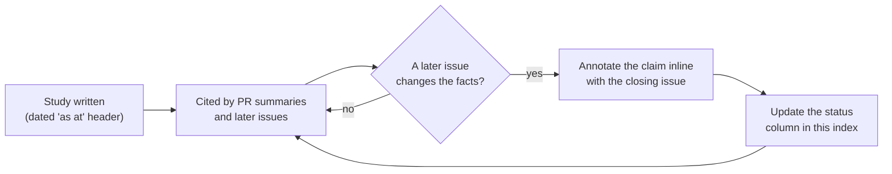

# Point-in-Time Studies — Index

Every document in this directory is a **point-in-time study**: a diagnosis or
measurement as at one commit, written once and cited afterwards. Per
[`docs/archive/README.md`](../archive/README.md) § *What goes where*, a study is
**not rewritten** when the facts change — it carries a dated "as at" header, and
each superseded claim is annotated inline with the issue that closed it.

This index exists so a reader can tell, before opening a study, whether it still
describes shipped behaviour. It is enforced by
`tests/issue_1990_analysis_docs_contract.rs`, which asserts every study carries a
dated header and appears in the table below.

## Status vocabulary

| Status | Meaning |
| --- | --- |
| **Current** | No claim in the study is known to be superseded. |
| **Partly superseded** | Named claims are annotated inline; the rest still holds. |
| **Superseded** | The study's headline verdict no longer describes shipped behaviour. Read it as history. |

## Studies

| Study | Issue | As at | Status |
| --- | --- | --- | --- |
| [`snapshot-mining-1631.md`](snapshot-mining-1631.md) — snapshot mining for new candidate types and focus selection | #1631 | 2026-07-18 | **Partly superseded** — the dormant-synapse weight-magnitude skip was replaced by contribution-first detection (#1632) |
| [`rejection-diagnosis-1737.md`](rejection-diagnosis-1737.md) — why almost every candidate is rejected | #1737 | 2026-07-25 | **Partly superseded** — `below_improved_ratio` was wired into the breakdown (#1802); the threshold verdict was settled by #1778/#1812. The `interference_filtered` half still holds |
| [`candidate-generation-gating-1739.md`](candidate-generation-gating-1739.md) — candidate-generation widening, gated by starvation diagnosis | #1739 | 2026-07-25 | **Partly superseded** — the "HOLD" verdict was flipped by the #1800 classifier fold |
| [`threshold-review-1740.md`](threshold-review-1740.md) — coordinated gain-floor review | #1740 | 2026-07-25 | **Superseded** — "no floor change" was overtaken by the #1778 rescale and the #1812 sole-op `RemoveNeuron` carve-out |
| [`discovery-regression-harness-1741.md`](discovery-regression-harness-1741.md) — accepted-improvement regression harness baseline | #1741 | 2026-07-25 | **Partly superseded** — the method is current; the baseline numbers pre-date the #1777–#1818 campaign |
| [`candidate-rate-diagnosis-1777.md`](candidate-rate-diagnosis-1777.md) — why the successful-candidate rate is still very low | #1777 | 2026-07-29 | **Partly superseded** — most of the campaign it launched has shipped (#1781, #1792, #1800, #1813); each claim is annotated inline |
| [`gain-floor-rescale-1778.md`](gain-floor-rescale-1778.md) — re-deriving the expected-gain floor against the post-calibration scale | #1778 | 2026-07-31 | **Current** — this is the shipped rescale, and it supersedes #1740 |
| [`remove-neuron-reachability-1785.md`](remove-neuron-reachability-1785.md) — measured remove-neuron reachability reference table | #1810 | 2026-07-31 | **Partly superseded** — a characterisation pin; the gates it pinned were changed by #1812/#1814. Re-run the test |
| [`remove-neuron-gain-scale-1785.md`](remove-neuron-gain-scale-1785.md) — what scale a removal's `expectedCreatureScoreGain` is denominated in | #1811 | 2026-07-31 | **Current** — decision record; Gate 1 shipped as #1812, Gate 2 as #1814 |
| [`candidate-reconciliation-1802.md`](candidate-reconciliation-1802.md) — the candidate fail-loud invariant | #1802 | 2026-07-31 | **Current** |
| [`candidates-cache-study-1920.md`](candidates-cache-study-1920.md) — production candidates-cache study | #1920 | 2026-08-02 | **Superseded** — all three follow-ups (#1923, #1924, #1925) have shipped |
| [`neuron-ranking-score-1924.md`](neuron-ranking-score-1924.md) — the reliability-weighted add-neuron rank score | #1924 | 2026-08-02 | **Current** |
| [`module-skip-attribution-1925.md`](module-skip-attribution-1925.md) — why a barren run proposed nothing | #1925 | 2026-08-02 | **Current** |

## Related `docs/`-level audits

These two live at `docs/` root for historical reasons but carry the same
point-in-time obligation, and the same enforcement test covers them:

| Audit | Issue | As at | Status |
| --- | --- | --- | --- |
| [`docs/CANDIDATE_PIPELINE_MCMC_AUDIT.md`](../CANDIDATE_PIPELINE_MCMC_AUDIT.md) — MCMC applicability audit | #1017 | 2026-04-07 | **Partly superseded** — #1018/#1019/#1020/#1021 landed MH acceptance, an adaptive proposal distribution, a temperature schedule and diagnostics; three calibration constants have been re-tuned |
| [`docs/DOMINATED_BRANCH_COLLAPSE_EXTENT.md`](../DOMINATED_BRANCH_COLLAPSE_EXTENT.md) — dominated-branch collapse extent report | #1708 | 2026-07-21 | **Partly superseded** — #1711 delivered MAX/MIN dominance detection and collapse, #1713 the contribution-propagation gate; the IF case (G2, #1712) is still open |

## Adding a study

1. Write it here as `topic-NNNN.md`, where `NNNN` is the issue number.
2. Open with a dated header — `> **Point-in-time study, as at YYYY-MM-DD …**`.
   The enforcement test requires the date before the first `##` heading.
3. Cite code as `file.rs::symbol`, not `file.rs:123` — line numbers rot, symbol
   names survive a refactor and are greppable.
4. Add a row to the table above.
5. When a later issue supersedes a claim, annotate that claim inline **on the
   change that supersedes it** and update this index's status column. Do not
   rewrite the study.
