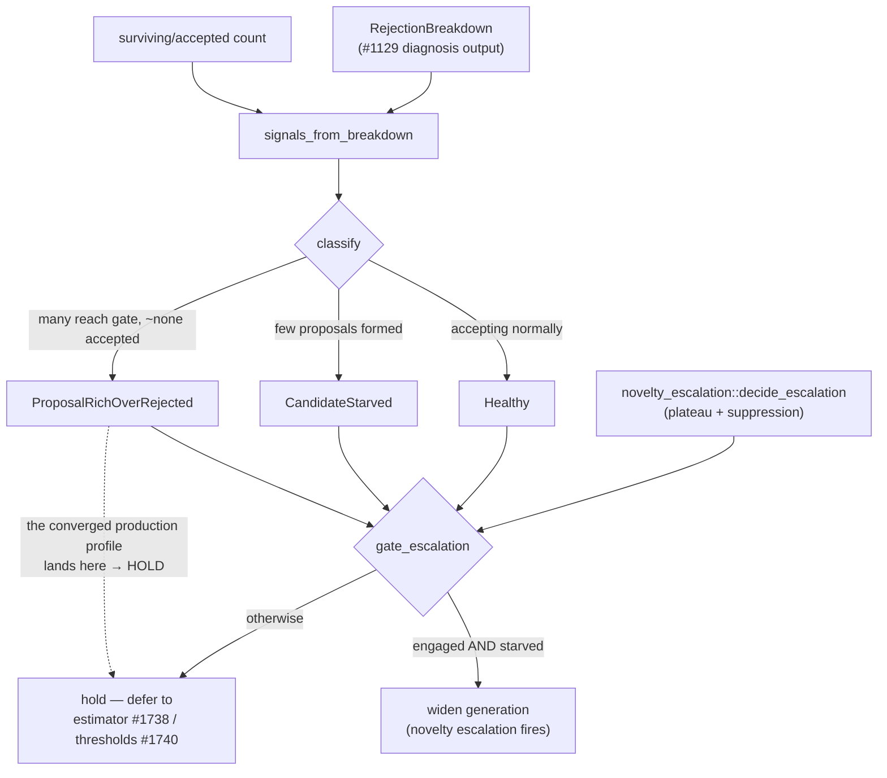

# Candidate-Generation Widening, Gated by Starvation Diagnosis (Issue #1739)

Part of milestone #1736 — *Discovery finds very few successful candidates for
the large converged production network*.

> **Point-in-time study, as at 2026-07-25 — partly superseded by #1800.** Two
> claims below no longer describe shipped behaviour:
>
> - **The "HOLD" verdict** (the summary at the top and the flowchart's
>   `O -.-> HOLD` edge) recorded the converged production profile landing in
>   `ProposalRichOverRejected`. **Superseded:** #1800 folds failure-cache
>   suppression into the classifier input and lets a dominant-upstream majority
>   override the formed-proposal floor, so the same pass now classifies
>   `CandidateStarved` and widening *is* recommended — see
>   [`pr-summary-1800.md`](../archive/pr-summaries/pr-summary-1800.md).
> - **The wiring** described under *Where it is wired* is now
>   `starvation_classifier_breakdown`, which merges both surfaces, the pass-level
>   breakdown and failure-cache suppression before classifying.
>
> The three-bucket partition and the gating *decision* itself are unchanged. For
> the current reason set and classification see
> [`docs/FFI_API.md`](../FFI_API.md).

## Why this is a *decision*, not a blind widening

The sibling diagnosis (`docs/analysis/rejection-diagnosis-1737.md`, Issue #1737)
settled the milestone's open question about candidate generation:

> Candidate **generation is not the bottleneck** for this rejection profile —
> the cache shows the generators emitting `change-squash` (including coordinated
> multi-op chains) and `remove-neuron` candidates. They are produced, then
> discarded at the gain gate.

In other words the large converged production network is **proposal-rich but
over-rejected**, not **candidate-starved**. The accepted rate is held down by the
expected-gain estimator collapse (#1738) and the acceptance floors (#1740) — not
by a shortage of proposals. Widening *generation* on that profile cannot lift the
accepted rate, and firing the existing novelty/diversification escalation there
would waste host effort and risk noise on the wider discovery corpus.

Yet the escalation gate (`novelty_escalation::decide_escalation`) engages on
`low rolling success rate + high cache-suppression` alone — both true on a
converged, over-rejected creature. Left ungated it would widen generation on
exactly the profile the diagnosis says does not need it.

## What this issue adds

A pure decision module, `src/analysis/candidate_starvation.rs`, that answers the
scope's first question — *is this run candidate-starved or proposal-rich but
over-rejected?* — directly from the diagnosis output (the `RejectionBreakdown`
already emitted on analysis metadata, Issue #1129). Generation widening is then
**gated to the starved case only**.

Every stable rejection reason is partitioned into exactly one of three buckets
(pinned exhaustively against `ALL_REJECTION_REASONS` by a unit test so a
newly-added reason cannot silently escape classification):

| Bucket | Meaning | Evidence of |
| --- | --- | --- |
| **Gate-side** | Candidate reached the expected-gain / acceptance gate and was rejected *there* | over-rejection |
| **Upstream** | Candidate never reached the gate (too little data, no eligible source, structural pre-check, saturated target, stale-proposal suppression) | starvation |
| **Abundance** | Candidate *was* generated but capped/truncated as surplus | proposal-richness |

From these: `reaching_gate = accepted + gate_side` and
`proposals_formed = reaching_gate + abundance`. A run whose accept rate has
collapsed is **over-rejected** when it still formed many proposals, and
**starved** when it formed almost none.

## Safety — no change to the accept path

`gate_escalation` only ever *withholds* a generation-widening hint; it never
accepts a candidate. The #1623 evaluate-before-accept gate is entirely
independent of this decision, so no unsafe candidate can be accepted as a result
of this change. The only production behaviour change is that a converged,
over-rejected creature no longer fires novelty escalation — which is precisely
the wasted widening the diagnosis identified.

## Where it is wired

`src/ffi_internal/analysis.rs` computes the classification from the combined
synapse+neuron `RejectionBreakdown` and surviving-candidate count for the pass,
then gates `handshake.novelty_escalation_active` through it before surfacing the
signal to the host.

**Superseded by #1800** — that combined breakdown is now built by
`starvation_classifier_breakdown`, which additionally folds in the pass-level
breakdown and the failure-cache suppression count before `classify` runs.
