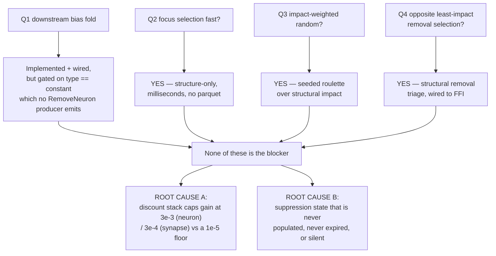

# Diagnosis — Why the Successful-Candidate Rate Is Still Very Low (Issue #1777)

This report answers the four behaviour questions in Issue #1777 against **latest
`Develop`** (which includes the "Focus selection" milestone #1774, merged
2026-07-28 04:36Z) and then names what is *actually* holding the
successful-candidate rate down.

It is **diagnostic only** — no production behaviour is changed. Every fault
named here is handed to a follow-up issue.

## Headline

**Three of the four behaviours the issue asks about are now correct.**
Milestone #1774 landed them hours before the issue was filed, so the failing
runs the issue describes almost certainly pre-date it. The remaining behaviour
(downstream bias adjustment on removal) is implemented and wired but sits behind
a gate that **never fires in production**.

None of the four, however, is the reason the rate is low. The rate is low
because of a **scale mismatch between the expected-gain discount stack and the
acceptance floor it must clear**: the shipped calibration constants shrink every
estimate by 3–4 orders of magnitude *before* a fixed `1e-5` floor is applied, so
the floor is unreachable for any change a converged network can actually
deliver. That reproduces the `~1e-10` persisted gains #1737 observed, and it
explains GRQ-teams too — it is a property of the scoring pipeline, not of
network convergence, so it does **not** require a plateau.



---

## Q1 — When removing a harmful candidate, are the downstream biases adjusted?

**Partly — the mechanism exists and is on the wire, but its gate is unreachable
for the neurons discovery actually proposes removing.**

The fold itself is correct. `evaluate_constant_neuron_bias_fold`
(`src/analysis/remove_neuron_bias_fold.rs:98`) computes exactly the expected
quantity — `bias_delta = outgoing_weight × mean_activation` — per downstream
target (`:117-128`), and it is genuinely delivered to the consumer:

| Stage | Location |
| --- | --- |
| Applied during `analyze_all` | `src/analysis/orchestration.rs:1084-1088` |
| Attached to the candidate | `src/analysis/discovery_dispatch.rs:364-377` |
| Serialised field | `coordinatedStructuralCandidates[].constantNeuronBiasFold.foldedTargets[].biasDelta` (`src/ffi_types/candidates.rs:246-311`) |

The problem is the gate at `src/analysis/discovery_dispatch.rs:343`:
`is_constant_neuron` requires `neuron_type == "constant"` (`:174-179`). But
**every** producer of a sole-op `RemoveNeuron` restricts itself to hidden
neurons — `detection/dead_neuron.rs:107`, `detection/low_impact_neuron.rs:121`,
`detection/noise_signal.rs:121`, `detection/co_adaptation.rs:82`,
`focus/ranking/removal_candidates.rs:348`. `"constant"` is the NEAT-AI
input-side bias type, and `detection/topology_cache.rs:48-60` does not even
classify it. So the gate is essentially never true for an emitted candidate.

A functionally-constant *hidden* neuron — the realistic case — therefore gets no
fold. It falls through to `apply_remove_neuron_compensation`, where
`evaluate_weight_redistribution` short-circuits at
`src/analysis/remove_neuron_compensation.rs:206-215` returning
`delta_weight: 0.0, fully_compensable: true` — a remedy carrying **zero bias
information**. The removal is still emitted, so the consumer deletes the neuron
and folds only its own mean. The candidate is not rejected; the *remedy* is
silently omitted as an absent optional field.

Two further suppressors on this path:

- `functionally_constant_neuron_uuids`
  (`src/analysis/remove_neuron_constant_promotion.rs:112-114`) returns an empty
  `HashSet` **unconditionally** (a documented dependency stub), so the #1622
  priority promotion (`CONSTANT_NEURON_PRIORITY_GAIN`) is a no-op and constant
  removals keep an honest gain of ≈0.
- Three different variance thresholds govern nominally the same decision:
  `VARIANCE_EPSILON = 1e-12`, `BIAS_FOLD_GATE_TOLERANCE = 1e-6`
  (`remove_neuron_bias_fold.rs`), and `CONSTANT_VARIANCE_THRESHOLD = 1e-10`
  (`focus/ranking/removal_candidates.rs:435`).

**Test-coverage gap:** `tests/analysis/issue_1690_constant_bias_fold_wiring.rs`
asserts on the in-memory struct field, and all its fixtures use
`"type": "constant"` — i.e. the tests are built around the very gate that never
fires. No test drives `analyze_all` end-to-end and asserts the serialised
`constantNeuronBiasFold` / `biasDelta` reaches the FFI JSON, so a serde rename
would pass CI.

→ follow-up: **#1779 — bias fold never fires for hidden neurons**.

## Q2 — Is focus neuron selection fast (no more than a few seconds)?

**Yes — milliseconds, and structurally incapable of the old 2-hour stall.**

Milestone #1774 (Issue #1766) made the FFI focus path **structure-only**. It
never opens the parquet, does no GPU work, and has no per-sample loops
(`src/ffi_internal/analysis.rs:593-724`). Cost per call is `O(V+E)` graph work
(JSON parse, forward-only validation, memoised impact DFS), `O(V log V)` for the
presentation sort, and an `O(N × pool)` roulette draw with `N = 6`.

`tests/ffi/issue_1766_structural_focus_selection.rs:68` locks it in: it passes a
deliberately non-existent parquet path, asserts `success == true`, and hard-fails
past 5 s ("aim milliseconds").

Two residual observations, neither a correctness problem:

- `analysisDeadlineMs`, `parquetFile` and `taskDescriptor` are still accepted by
  `RankFocusNeuronsInput` but are now **silently ignored** on this path — a
  no-op for hosts that still send them.
- `compute_impacts_public` runs twice per call (focus draw at
  `src/focus/selection.rs:322`, removal triage at
  `src/ffi_internal/analysis.rs:666`) — a cheap `O(V+E)` saving, harmless today.

## Q3 — Are focus neurons randomly selected, weighted by impact?

**Yes.** `select_focus_by_structural_impact`
(`src/focus/selection.rs:317`) draws via
`weighted_draw_without_replacement` (`:391-428`) — a seeded roulette over
structural impact using `StdRng::seed_from_u64`. It is *not* deterministic
top-N; the impact-descending `ranked[]` list it returns is presentation order
only (`:343-349`).

Weights are structural impact alone (`compute_impacts_public`,
`src/focus/impact.rs:447`): outputs seed at 1.0, hidden contributions are
path-weight products normalised by total inbound weight. No error, gradient, or
record-derived term — deliberately, so the path stays parquet-free. The seed is
`focusSelectionCursor → epochsSinceLastAcceptedCandidate → 0`, so a stalled run
advances the cursor and sweeps a fresh tail.

Proven probabilistically by `src/focus/selection.rs:797`
(`weighted_draw_respects_relative_weights`: weights `[100,1,1,1]` over 200 seeds,
heavy index wins > 180/200).

## Q4 — Is there the opposite focus selection for removal candidates?

**Yes, and it is wired.** `identify_structural_removal_candidates`
(`src/focus/ranking/removal_candidates.rs:306-429`) is called from the same FFI
entry point as the high-impact draw
(`src/ffi_internal/analysis.rs:604-605` high, `:665-667` low) and returned
alongside it as `removalCandidates`. The criterion is the *near*-opposite axis
documented at `src/focus/ranking/removal_triage.rs:1-29` — low structural
contribution weighed against pruning savings, deliberately **not** a negated
focus score. `tests/focus/issue_1767_structural_removal_triage.rs:163` asserts
the highest-impact neuron is never offered for removal.

One residual fault: there are **two near-duplicate implementations** of this
criterion, and they disagree. `removal_triage.rs:150-154` maps a non-finite
impact to `INFINITY` (never prune); `removal_candidates.rs:361-365` maps
non-finite **or negative** impact to `0.0` (maximally prunable). Same input,
opposite verdict. Only `removal_candidates.rs` is on the live path;
`removal_triage.rs` is public API exercised only by tests.

→ follow-up: **#1783 — duplicate removal-triage implementations disagree on
non-finite impact**.

---

## Root cause A — the acceptance floor is unreachable by construction

`#1737` found production candidates carrying `expectedCreatureScoreGain` of
`~1e-10` or exactly `0` against a `1e-5` floor and named the *estimator* as the
primary root cause. `#1738` then audited impact/contribution through MAX/MIN/IF
and found no fault — but that audit covers only the aggregate special case
(12 of 1660 neurons), exactly the narrowing #1737 warned against. `#1740`
reviewed the *floor* in isolation and confirmed it correct.

Neither audit measured the two **together**. Doing so shows the mismatch is not
in either half but in the scale between them.

The shipped add-neuron discount stack
(`src/analysis/neuron/post_processing.rs:255-330`) applies, in order:

```text
gain = raw_creature_error_reduction
     × impact                            ≤ 1.0
     × neuron_pessimism_discount         ≤ 1.0   (floor 0.08, scaled by magnitude ratio)
     × saturation_discount               ≤ 1.0   (down to 0.15 at full saturation)
     × NEURON_PREDICTION_CALIBRATION     = 0.003          ← fixed constant
     × calibration_correction            ∈ [0.001, 1.0]   ← from the failure cache
     × logistic_modulator                ∈ [0.1, 1.0]
```

Every factor is `≤ 1.0`, so the **maximum achievable multiplier is the
calibration constant itself**: `3e-3` for neurons
(`NEURON_PREDICTION_CALIBRATION`), `3e-4` for synapses
(`SYNAPSE_PREDICTION_CALIBRATION`), both in
`src/analysis/constants/candidate_scoring.rs:1523,1537`.

Against `MIN_EXPECTED_CREATURE_SCORE_GAIN = 1e-5` (`:985`) that gives a
**break-even raw gain** — the raw creature error reduction a candidate must
carry to survive the floor:

| Candidate type | Conditions | Max multiplier | Break-even raw gain |
| --- | --- | --- | --- |
| add-neuron | perfect (100 % samples improved, full magnitude, no saturation, neutral correction) | `2.9e-3` | **`3.5e-3`** (0.35 %) |
| add-neuron | typical (70 % improved, 0.33 magnitude, impact 0.8) | `~9.8e-4` | **`~1.0e-2`** (1 %) |
| add-synapse | perfect | `2.9e-4` | **`3.5e-2`** (3.5 %) |
| add-neuron | failure-cache correction clamped to `0.001` | `2.9e-6` | **`3.5`** (350 %) |

The realised deltas observed in the production cache (#1737) are `~1e-7` for
accepted changes and up to `~1e-3` in magnitude for rejected ones. **A perfect
single structural change would need to beat the entire observed realised band by
an order of magnitude just to reach the floor.** With the failure-cache
correction at its `MIN_CALIBRATION_CORRECTION = 0.001` clamp
(`src/analysis/scoring/calibration_correction.rs:119`) the floor requires a
raw gain above 100 % — unreachable at any network size or convergence state.

This is measured, not argued: `tests/issue_1777_gain_floor_reachability.rs`
drives the **shipped** discount functions and pins each figure above.

Two properties make it the best explanation for the reported symptom:

1. **It does not require a plateau.** The mismatch is a property of the scoring
   pipeline, so it suppresses GRQ-teams — which has not plateaued — exactly as
   it suppresses the converged GRQ network. That is precisely the observation
   the issue says rules the plateau explanation out.
2. **It ratchets.** The failure-cache correction only ever discounts, never
   inflates (`NEUTRAL_CORRECTION = 1.0` is the upper clamp,
   `calibration_correction.rs:126`), and it is fed by the realised outcomes of
   *accepted* changes. Fewer acceptances means fewer corrective entries, so a
   correction driven low by a run of over-estimates has no path back up.

The #1740 review did consider the calibration *correction* (the EWMA), but not
the fixed `0.003` / `0.0003` base constants that sit in front of it. That is the
gap between "the floor is correctly scaled" and "the floor is reachable".

→ follow-up: **#1778 — re-derive the gain floor against the post-calibration
scale**
(and confirm whether the calibration constants belong upstream or downstream of
the floor at all). Note that the fix is *not* simply to lower the floor — the
false-positive guard test from #1740 is right that lowering it against a
broken scale admits noise. The floor and the calibration constants have to move
together, on evidence.

## Root cause B — suppression state that is dead, unexpirable, or silent

A separate audit of the candidate/failure caches found three classes of fault
that each reduce the observable successful-candidate rate.

### B1 — Suppression state that is never populated (so its escape hatches cannot fire)

| Component | Status |
| --- | --- |
| `CandidateOutcomeCache` (`candidate_cache.rs`) | Never constructed outside tests; `drought_diagnostic` receives `candidate_cache: None` (`orchestration.rs:1319`) |
| `TargetFailureTracker` (`target_failure_tracker.rs:436`) | Filters *read* it (`neuron/preparation.rs:161`, `synapse/orchestration.rs:65`) but nothing in `src/` ever calls `record_failure` / `record_success` / `advance_epoch` |
| `ModuleStarvationTracker` | `prepare_and_detect_discovery_modules` hard-codes `starvation_tracker = None, current_epoch = 0` (`module_dispatch_specs/mod.rs:107-118`) |

The consequence lands on the escape hatch. `maybe_perform_drought_reset` is
invoked at `orchestration.rs:1350-1358` as
`maybe_perform_drought_reset(None, Some(&mut *guard), …)` — the candidate cache
is **always `None`**, so `clear_failed_entries` never runs, and the tracker it
does clear is the permanently-empty global one. **In production the drought
reset clears nothing.**

Two latent bugs sit behind the same dead state: `advance_epoch()` has no caller,
so `current_epoch` is permanently `0` and `is_in_cooldown` (`:224`) evaluates
`0 < failure_epoch + cooldown` → always true; cooldowns would never expire if
the tracker were ever populated.

### B2 — Persisted state with no expiry

- **`previous_neuron_fingerprints`** (host-supplied across runs,
  `ffi_types/requests.rs:115`) is the one genuinely self-reinforcing suppressor.
  `orchestration.rs:333-359` drops every focus neuron whose fingerprint is
  unchanged; `:376-392` returns `synapse: None, neuron: None` when *all* are
  unchanged — no candidates, no rejection breakdown, no drought diagnostic, no
  alarm (only `fingerprint_cache_hits` survives). The fingerprint covers
  structure only, and during a drought the topology by definition does not
  change, so the cache says "skip" **regardless of new recorded data**, with no
  escape hatch on that path. Milestone #1774 partially mitigates this by
  accident: the focus draw is reseeded from
  `epochsSinceLastAcceptedCandidate`, which increments during a drought, so the
  set rotates and rarely comes back *entirely* unchanged. That is luck, not
  design — the whole-pass drop remains reachable and remains silent.
- **`FailureCacheEntry`** (`scoring/calibration_correction.rs:196-249`) carries
  no timestamp, epoch, or age field, so Rust cannot expire it. Worse,
  `failure_cache_handshake.rs:84-93` treats `None` fields as **wildcards**, so a
  single target-agnostic `coordinated-structural` entry suppresses every
  coordinated candidate indefinitely.

### B3 — Silent drops invisible to the rejection breakdown

Every one of these discards a candidate without incrementing a
`RejectionBreakdown` counter, which matters doubly because
`candidate_starvation::classify` reads *only* the breakdown to decide whether to
un-suppress:

| Drop | Location |
| --- | --- |
| Whole-pass drop on fingerprint cache hit | `orchestration.rs:376-392` |
| Within-batch same-target short-circuit (`WITHIN_BATCH_TARGET_FAILURE_LIMIT = 1` — one failure kills every remaining same-target candidate) | `neuron/evaluation.rs:85-88`, `synapse/target_analysis/evaluation.rs:88-92`; no reason constant exists |
| Target-cooldown skips | count discarded at `synapse/orchestration.rs:65`, logged only at `neuron/mod.rs:203-206`, hard-coded `target_cooldown_skipped: 0` at `orchestration.rs:1326` |
| Empty samples / zero source variance | `neuron/evaluation.rs:79-81`, `:101-104`, `synapse/target_analysis/evaluation.rs:115-118` — despite `REJECTION_NO_SAMPLES` existing |
| Quality-based module skipping | `discovery_dispatch.rs:755-761` |

There is also an ordering fault in the escalation gate: the breakdown fed to
`classify` (`ffi_internal/analysis.rs:198-213`) is built **before**
`breakdown_with_failure_cache` adds `duplicate_of_failure_cache` (`:481-494`),
so failure-cache suppression — the very evidence of starvation — is invisible to
the classifier that decides whether to bypass it. Combined with
`DEFAULT_MIN_FORMED_PROPOSALS = 4`, essentially any pass with ≥ 4 gate-side
rejections permanently disables the bypass.

Finally, `discovery_mode.rs:292-294` reverts Conservative to Normal after 20
consecutive failures, which clears `tiering_escalation_active`
(`orchestration.rs:778`) and drops the 7 expensive discovery modules on
creatures over 1000 hidden neurons — **the module set narrows exactly when the
drought is worst.**

→ follow-ups: **#1780** (dead suppression trackers make the drought reset a
no-op), **#1781** (failure-cache entries never expire; fingerprint skip has no
escape hatch), **#1782** (silent candidate drops bias the starvation
classifier).

---

## Answering the issue's framing question

The issue notes that GRQ-teams "absolutely hasn't plateaued so that excuse is
out". That is consistent with everything above. Root cause A is a fixed-scale
property of the scoring pipeline and root cause B is state-machine behaviour;
neither depends on the network being converged. The plateau conclusion recorded
in `production_discovery_regression.rs` (`PLATEAU_ACCEPTED_RUN_RATE = 0.05`)
should be read as a *measurement* of the current pipeline, not as evidence that
the networks are saturated.

## Scope note

Purely diagnostic, per the issue's accepted scope. No estimator, floor, gate, or
cache behaviour is changed here. The only code added is the characterisation
suite `tests/issue_1777_gain_floor_reachability.rs`, which pins the measured
break-even figures so that a later change to either the calibration constants or
the floor shows up as a test diff.
