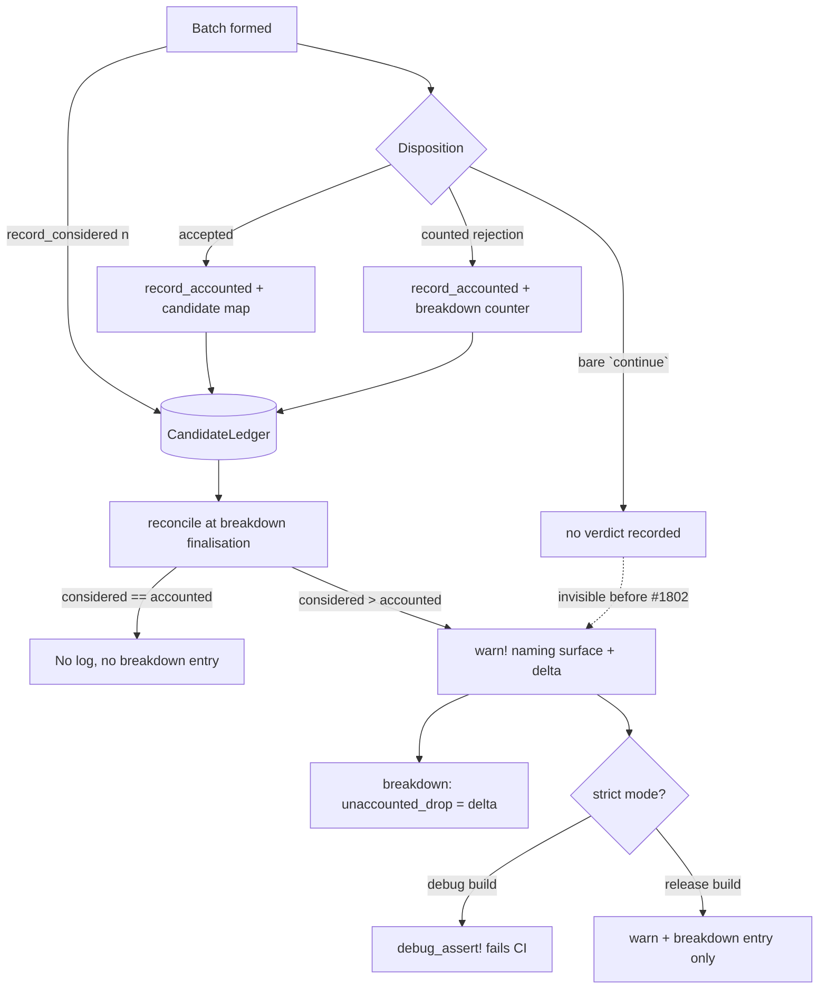

# Candidate reconciliation — the fail-loud invariant (Issue #1802)

The #1782 diagnosis found six places where a discovery pass dropped a candidate
with a bare `continue`. Each compiled, passed tests, and shipped. Issues #1796
through #1801 wired each of those six paths into `RejectionBreakdown`, but that
left the class of bug intact: nothing stopped the **seventh** from being added
the same way.

This page documents the enforced invariant that replaces that convention.

## The invariant

Each analysis surface owns a per-pass `CandidateLedger`
(`src/analysis/candidate_reconciliation.rs`) with two relaxed atomic counters:

| Counter      | Incremented                                                                |
| ------------ | -------------------------------------------------------------------------- |
| `considered` | once where a batch of candidate proposals is **formed** (one site / batch)  |
| `accounted`  | once per candidate whose **verdict** is recorded — an accept, or a rejection that reaches the breakdown |

At the point the surface's metadata breakdown is finalised, `reconcile` asserts

```text
considered == accounted
```

Because `accounted` is only ever incremented alongside a breakdown-bound counter
or an accept, this is the surface-scoped form of the identity the issue asks for:
`candidates_considered == candidates_returned + sum(rejection_breakdown)`.

The counting sites are deliberately asymmetric — `considered` is incremented
*once per formed batch*, never at a drop site. A drop path therefore cannot
satisfy the invariant by incrementing both sides.

## What happens on a mismatch



Three things happen, in that order, so no layer can mask the fault:

1. **The residual is recorded** on the breakdown under the stable reason
   `unaccounted_drop`. This is the durable evidence on a release build, where
   assertions are compiled out. A clean pass never records it.
2. **One `tracing::warn!`** naming the surface and the unaccounted delta —
   greppable in production logs.
3. **Under strict mode a `debug_assert!` fires.** Strict mode defaults to *on*
   for debug builds, so `cargo test` in CI fails the PR that introduces the
   unaccounted path; it defaults to off for release builds. Override with
   `NEAT_AI_DISCOVERY_STRICT_CANDIDATE_RECONCILIATION`.

An **over-count** (`accounted > considered`) is the mirror defect — a verdict
recorded twice, or without a matching batch-formation increment. It cannot hide a
lost candidate, so nothing is added to the breakdown, but it is warned about and
fails strict mode all the same.

Callers can confirm the invariant **positively** rather than by the absence of a
failure marker: `SynapseAnalysisMetadata::candidate_reconciliation` and
`NeuronAnalysisMetadata::candidate_reconciliation` carry the counts and the delta
for the pass.

## Surface scope

| Surface   | Unit of `considered`                                        | Batch-formation site |
| --------- | ----------------------------------------------------------- | -------------------- |
| `neuron`  | add-neuron candidates formed by the GPU evaluators           | `analysis::neuron::evaluation` (ReLU split + activation specs) |
| `synapse` | helpful-synapse work items entering result collection        | `analysis::synapse::target_analysis::evaluation` |

Deliberately outside the ledger:

- **Harmful (synapse-removal) candidates** — a separate population with its own
  diagnostics, and none of the #1782 drop paths lived there.
- **Pre-formation, work-item-level drops** (no overlapping samples, a constant
  source, the within-batch same-target short-circuit) on the neuron surface —
  they happen before any candidate object exists, and are already counted by
  #1798 / #1796.
- **Post-processing** truncation and de-duplication, already counted under
  `budget_truncated` / `same_target_squash_duplicate`.

## Drop paths this invariant exposed

Wiring the ledger immediately surfaced six further bare `continue`s beyond the
six #1782 found. Each now records a verdict:

| Site                                            | Condition                                        | Reason recorded              |
| ----------------------------------------------- | ------------------------------------------------ | ---------------------------- |
| `neuron::evaluation` (ReLU split, both signs)   | improved-sample ratio below the floor            | `below_improved_ratio`       |
| `neuron::evaluation` (activation specs)         | improved-sample ratio below the floor            | `below_improved_ratio`       |
| `neuron::evaluation` (activation specs)         | candidate squash compounds a near-saturated target | `target_saturated`         |
| `synapse::…::evaluation`                        | no usable outgoing weight could be fitted        | `cpu_pre_reject_no_signal`   |
| `synapse::…::evaluation`                        | post-evaluation improvement non-positive         | `zero_improvement`           |
| `synapse::…::evaluation` (two sites)            | clamped weight-update delta is a no-op           | `degenerate_weight_update`   |

`degenerate_weight_update` is a new stable reason; the others reuse existing
ones whose documented meaning already matched the condition.

## Cost

A balanced pass costs two relaxed atomic loads per surface and emits nothing.
The per-candidate increments are single relaxed `fetch_add`s with no allocation,
no lock, and no `String` — the same hot-loop discipline as
`EvaluationDropCounters` (#1798) and `WithinBatchFailureTracker` (#1164).

## Tests

`tests/issue_1802_candidate_reconciliation.rs` drives `analyze_all` — the real
dispatch path — with a seeded creature in both a converged (all-rejected) and an
improvable (partly-accepted) configuration, and asserts each surface reconciled
with zero unaccounted candidates and a non-zero `considered` count, so the
invariant cannot hold vacuously. Companion cases guard the guard: an injected
un-counted drop must fail with a message naming the surface and the delta, and
must panic under strict mode.
