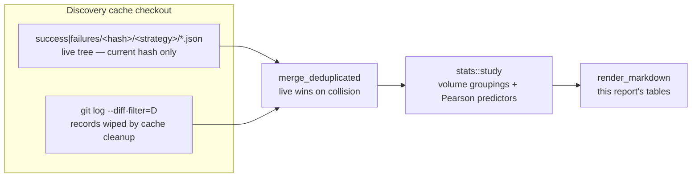

# Study — Production Candidates Cache (Issue #1920)

Findings from the first run of the repeatable cache study
(`cargo run --example study_candidates_cache`) against the production discovery
cache on 2026-08-02.

This report is **diagnostic only** — no production behaviour is changed here.
Every improvement it names is handed to a follow-up issue, as the issue's
accepted scope requires.

> **Point-in-time study, as at 2026-08-02 — superseded by #1923, #1924 and
> #1925.** All three follow-ups this study filed have since shipped, so its
> three headline measurements describe a pipeline that no longer exists. The
> prose is left as written; each superseded claim carries an inline
> **Superseded** annotation naming the issue that closed it. For current
> behaviour read [`docs/FOCUS_SELECTION.md`](../FOCUS_SELECTION.md),
> [`neuron-ranking-score-1924.md`](neuron-ranking-score-1924.md) and
> [`module-skip-attribution-1925.md`](module-skip-attribution-1925.md).

## Headline

Both questions the issue asks have an answer, and they turn out to be the same
answer viewed twice.

1. **Volume is low because one strategy carries the fleet.** `remove-low-impact`
   is 53% of the whole corpus and 79% of the live model hash; four of the seven
   strategies contribute **twelve records between them across 47 days**. Fleet
   throughput is ~1.8 cached candidates per machine per day, and **57% of runs
   cache nothing at all**.
2. **Gain is small because the field that ranks the dominant strategy carries no
   gain signal.** `removalCandidate.impact` correlates with realised gain at
   **r = −0.04** (n = 21) — statistically nothing. Its companion field
   `meanActivation` is **hard-coded to `0.0`**
   (`removal_candidates.rs::identify_structural_removal_candidates`), so the
   documented activation-weighted ranking is dead on the path that produces
   most candidates. Discovery is not choosing *bad* removals; it is choosing
   *arbitrary* ones from a pool it cannot rank.

> **Superseded — the dead `meanActivation` field (point 2).** **#1923** shipped
> the gate resolver: `src/focus/ranking/activation_weighting.rs` measures each
> candidate's mean absolute activation in one projected streaming pass and
> writes it back (`activation_weighting.rs::resolve_activation_weighted_gate`),
> so the structure-only path now ranks on `activation_weighted_impact` exactly
> as the record-derived path does. The *measurement* below stands as the
> evidence that motivated the fix; the behaviour it describes does not.

The one strategy that *does* carry a prediction — `add-neurons` — predicts
backwards: `expectedCreatureScoreGain` correlates with **success at r = −0.61**.
The more confident the estimate, the more likely the candidate fails.

## Reproducing

```bash
cargo run --example study_candidates_cache -- /path/to/discovery-cache-checkout
```

The corpus is widened from git history by default; pass `--no-history` for the
working tree alone.



## Corpus

| Measure | Value |
| --- | --- |
| Records | 127 |
| From working tree | 85 |
| Recovered from git history | 42 |
| Model hashes | 6 |
| Record span | 2026-06-16 → 2026-08-01 |
| Successes / failures | 29 / 98 (22.8% success) |

History recovery is worth **+49%** corpus on its own, and it is the only way to
see the four superseded model hashes — the live tree holds `c1885aa6` alone.

## Part 1 — Volume

### Runs mostly cache nothing

Cache-repo commits are a direct proxy for discovery runs that reached the
controller:

| Commit kind | Count | Share |
| --- | ---: | ---: |
| 🛍️ "failed to find any improvements, storing failure cache" | 44 | 57% |
| "Discovery cache sync" (a change was accepted) | 27 | 35% |
| "Clean up OLD discovery caches" | 5 | 6% |
| Bootstrap | 1 | 1% |

A majority of runs across a **12-machine fleet** end with zero evaluated
candidates worth caching. The cache only ever sees candidates the controller
actually scored, so this is a gating problem upstream of evaluation, not an
evaluation problem.

### One strategy carries everything

| Strategy | Records | Success | Failure | Success rate | Total gain |
| --- | ---: | ---: | ---: | ---: | ---: |
| `remove-low-impact` | 67 | 21 | 46 | 31.3% | 7.054e-5 |
| `remove-neuron` (retired) | 35 | 2 | 33 | 5.7% | 3.121e-7 |
| `add-neurons` | 13 | 4 | 9 | 30.8% | 5.802e-6 |
| `change-squash` | 8 | 1 | 7 | 12.5% | 7.111e-6 |
| `cache-informed-removal` | 2 | 1 | 1 | 50.0% | 5.561e-6 |
| `combo-successful` | 1 | 0 | 1 | 0.0% | 0 |
| `coordinated-structural` | 1 | 0 | 1 | 0.0% | 0 |

`remove-low-impact` supplies 53% of records and **79% of all realised gain**.
The starved tail is the interesting part: `cache-informed-removal` has the
**highest success rate in the corpus (50%)** and the second-largest mean gain,
on two records. `change-squash` landed the third-largest single gain
(7.111e-6) on eight records. Neither is being asked for often enough to know
whether those rates hold — but neither is being asked at all, either.

The retired `remove-neuron` strategy justifies its retirement: 35 records at a
5.7% success rate for 0.3% of total gain.

### Throughput

The live hash accumulated 85 records over four days across twelve machines —
about **1.8 cached candidates per machine per day**. Over the full 47-day
corpus the median calendar day holds **2 records**; only three days exceed ten.

## Part 2 — Gain size

Successes are real but tiny: mean `scoreDelta` 3.08e-6, median 1.02e-6, best
2.35e-5. **14 of 29 successes are at or below 1e-6.** Summed across the entire
47-day corpus the accepted changes are worth **+8.9e-5** against a creature
score of ~0.32 — a cumulative **+0.028%**.

### Predictors

Pearson `r` of each field (log-scaled where it spans orders of magnitude)
against `log10(scoreDelta)` over successes, and against the success indicator
over all records:

| Field | Gain n | r vs log gain | Outcome n | r vs success |
| --- | ---: | ---: | ---: | ---: |
| `removalCandidate.impact` | 21 | −0.036 | 67 | −0.286 |
| `removalCandidate.meanActivation` | 21 | n/a (zero variance) | 67 | n/a |
| `neuronCandidate.expectedCreatureScoreGain` | 4 | +0.781 | 13 | −0.608 |
| `neuronCandidate.targetNeuronImpact` | 4 | −0.402 | 13 | −0.049 |
| `neuronCandidate.improvedShare` | 4 | −0.871 | 13 | **+0.466** |
| `expectedErrorReduction` | 0 | n/a | 29 | n/a |
| `sampleSize` | 0 | n/a | 42 | n/a |
| `originalScore` | 29 | −0.327 | 127 | −0.280 |

Four findings fall out.

**A. The dominant strategy has no gain ranking.** `impact` is the value
`remove-low-impact` sorts on, and it explains ~0.1% of the variance in realised
gain. `meanActivation` — which `RemovalCandidateJson` documents as feeding
`activation_weighted_impact = impact × mean_activation` — is `0` in all 67
records, because the structural-removal path constructs the candidate with
`mean_activation: 0.0, activation_weighted_impact: 0.0`
(`removal_candidates.rs::identify_structural_removal_candidates`). The
candidate's own `reason` string admits it: *"activation-weighted gate deferred
to analysis"*. The deferral never resolves, so the gate never runs.

> **Superseded by #1923.** The deferral now resolves. After the structural
> triage picks its candidate set,
> `activation_weighting.rs::resolve_activation_weighted_gate` measures mean
> absolute activation from the discovery parquet, re-gates on
> `impact × mean_activation`, and sets `candidate.mean_activation` — the field
> is no longer `0` and the two removal paths apply the same criterion. The
> `r = −0.04` correlation for `impact` remains the historical measurement that
> justified the change; re-run the study to measure the ranking that replaced
> it. The retired construction site is
> `removal_candidates.rs::identify_structural_removal_candidates`, which still
> seeds `mean_activation: 0.0` as *not-yet-measured* (reason string
> `ACTIVATION_GATE_PENDING`) for the resolver to fill in.

**B. `add-neurons` confidence is inverted.** Sorted by predicted gain, the
largest predictions are exactly the ones that fail:

| `expectedCreatureScoreGain` | Actual `scoreDelta` | Outcome |
| ---: | ---: | --- |
| 1.063e-2 | −2.040e-5 | failure |
| 3.977e-3 | −7.371e-6 | failure |
| 3.897e-3 | −8.367e-6 | failure |
| 1.018e-3 | +2.250e-6 | success (452× over-predicted) |
| 9.526e-4 | −1.733e-5 | failure |
| 1.909e-5 | +2.921e-6 | success (6.5× over) |
| 1.760e-7 | +8.250e-8 | success (2.1× over) |
| 1.576e-7 | +5.485e-7 | success (0.29× — **under**) |

Accuracy improves monotonically as the prediction shrinks; the only
under-prediction in the corpus is the smallest estimate. This is the same
scale mismatch #1777/#1778 identified, seen from the other end — the estimator
is not merely mis-scaled, it is *anti-correlated with success* over the range
it actually proposes.

**C. `improvedShare` is the one honest signal.** The fraction of samples a
candidate improves (`improvedCount / totalCount`) is the only field that
correlates positively with success (r = +0.466). It correlates *negatively*
with gain size among successes (−0.871, n = 4), which reads as: broadly-helpful
candidates land reliably but small. That is a usable trade-off knob; nothing
else in the corpus offers one.

**D. Prediction fields are recorded on the losing path only.** All 27 live
successes omit `expectedErrorReduction` and `sampleSize`; every record carrying
them is a failure. Prediction accuracy therefore cannot be measured on the path
that matters, and the `r vs log gain` column above is blank for both. This is a
controller-side (NEAT-AI) record-writing asymmetry, not a discovery-engine bug,
so it is recorded here as a caveat rather than filed against this repo.

`originalScore`'s mild negative correlation with both gain and success is the
expected convergence effect: fitter creatures yield smaller, rarer wins.

## Caveats

- **Small n on the tail.** Findings A and D rest on 67 and 127 records
  respectively and are solid. Findings B and C rest on 13 `add-neurons` records
  (4 successes) — directionally clear, but re-run the study before treating the
  coefficients as calibrated.
- **Failure records are incomplete.** The cache stores candidates the controller
  *evaluated*. Candidates rejected inside discovery never appear, so this corpus
  cannot say why a run proposed nothing — only that 57% of them did.
- **Gain correlations use successes only**, because `log10` needs a positive
  delta. The success/failure column uses every record.

## Follow-ups

| Finding | Follow-up | Status as at 2026-08-04 |
| --- | --- | --- |
| A — dead activation-weighted ranking on `remove-low-impact` | #1923 | **closed** — gate resolver shipped in `src/focus/ranking/activation_weighting.rs` |
| B — `expectedCreatureScoreGain` anti-correlates with success | #1924 | **closed** — reliability-weighted rank score shipped (`src/analysis/neuron/ranking_score.rs`); see [`neuron-ranking-score-1924.md`](neuron-ranking-score-1924.md) |
| Volume — 57% barren runs, starved high-success strategies | #1925 | **closed** — module-skip attribution shipped; see [`module-skip-attribution-1925.md`](module-skip-attribution-1925.md) |

Finding C is folded into #1924; finding D is a caveat, not a defect in this
repository.
