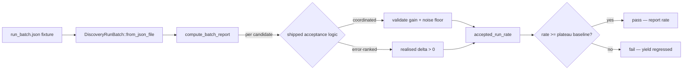

# Discovery Accepted-Improvement Regression Harness (Issue #1741)

Part of milestone #1736 — *Discovery finds very few successful candidates for
the large converged production network*.

This note records the **baseline** the repeatable regression harness measures,
and the reasoning that fixes its asserted threshold. It is the objective close
evidence the parent's criterion needs.

> Naming: the deployed network has a private deployment name that the
> shipped-source and documentation private-name guards (Issues #1723–#1726)
> keep out of the public tree. This note uses the concept-level term
> "production network".

## What the harness measures

The parent's success criterion is *"at least one accepted improvement in most
discovery runs"*. The harness expresses that as an **accepted-run rate**: the
fraction of runs in a batch that accept at least one candidate.

It runs the **shipped** acceptance logic over a committed
production-representative run batch, so a regression in discovery yield changes
the measured rate:

- Coordinated-structural candidates go through
  `validate_coordinated_candidate_gain` (#732) **and** the per-op-count
  post-discount noise floor `coordinated_post_discount_noise_floor`
  (#1128/#1272).
- Error-ranked harmful-neuron removals (whose expected-gain estimate collapses
  to `0` on this network) are accepted only on a **positive realised delta**,
  per evaluate-before-accept (#1623).



## Baseline

| Metric | Value | Source |
| --- | --- | --- |
| Discovery runs in window | 40 | production discovery window 2026-06-16 → 2026-07-23 (#1737) |
| Runs with ≥1 accepted improvement | 2 | both harmful-neuron removals, realised `+1.95e-7` |
| **Accepted-run rate (baseline)** | **0.05** | `PLATEAU_ACCEPTED_RUN_RATE` |
| Parent success threshold | > 0.50 | `SUCCESS_ACCEPTED_RUN_RATE` |

The committed fixture
(`tests/fixtures/production_discovery_regression/run_batch.json`) reproduces this
window: 38 empty runs and 2 accepting runs, each carrying the over-rejected
proposal profile the diagnosis recorded (coordinated `change-squash` at
`~4e-10`, single-op `change-squash` in the `~1e-7` achievable band, both below
their floors).

## Why the threshold is the plateau, not the > 50% success criterion

The milestone audits concluded the low rate is a **well-evidenced plateau**, not
a fixable calculation fault:

- **#1737 (diagnosis):** the network is *proposal-rich but over-rejected* — the
  generators emit candidates in quantity; nearly all are discarded at the
  expected-gain gate because the estimate has collapsed to `~1e-10`/`0`.
- **#1738 (focus/impact audit):** the contribution math through MAX/MIN/IF
  aggregation squashes is **sound** — no fault found.
- **#1740 (threshold review):** the acceptance gain floors are **correctly
  scaled** and must not be lowered; the achievable `~1e-7` band is genuinely at
  noise level for this converged creature.

With the lead calculation hypothesis refuted and the floors confirmed, the
achievable accepted rate on this saturated network is the recorded `0.05`. The
harness therefore asserts the rate has **not regressed below** that baseline
(and reports it) rather than asserting the not-yet-met success criterion.

## Post-fix result

No discovery-yield code changed in this issue; the harness records the plateau
and guards it. Running the harness on the current engine:

```
accepted-improvement rate: 2/40 runs = 0.0500 (2 accepted / 200 total candidates)
```

- `accepted_improvement_rate_meets_threshold` — **passes** (rate `0.05` ≥
  baseline `0.05`; success criterion correctly reported as not-yet-met).
- A modelled yield collapse (acceptance broken) drops the rate below the
  baseline and **fails** — see `yield_collapse_is_flagged_below_baseline`.
- A modelled lifted-yield batch flips the same harness to the parent's success
  criterion — see `majority_accepted_batch_meets_success`.

## Re-running and future use

```bash
cargo test --test production_discovery_regression < /dev/null
```

The test runs under `cargo test` in CI on every PR, so a future discovery-yield
regression on the production topology fails the merge rather than surfacing in
live discovery. The runtime backstops remain in place for regressions that slip
past the fixture: sustained zero-success batches still trigger the
`zero_success_batch` counters (#1194) and the creature-drought alarm (#1424).

## Companion guard — suppression wiring (Issue #1795)

This harness measures **acceptance yield** from a committed fixture batch; it
does not exercise `analyze_all`, so it cannot see a suppression store that is
read but never written — the #1780 bug class. That gap is covered by the
companion guard in `tests/suppression_wiring_regression_1795.rs`, which drives
the **real orchestration entry point** and asserts the process-global
`TargetFailureTracker` is genuinely populated, its epoch advances once per pass
(#1790), the cooldown filter drops a target, and the drought reset clears a
non-zero count. Each failure message names the suppression store that went
dead.

```bash
cargo test --test suppression_wiring_regression_1795 < /dev/null
```

The two are complementary and should stay separate: this one is a fixture
replay of shipped acceptance logic, the other is a live-pass wiring guard.
