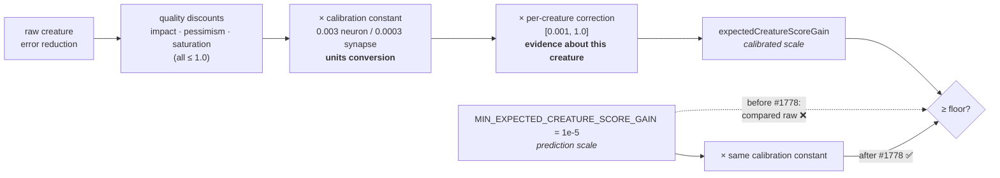

# Re-deriving the Expected-Gain Floor Against the Post-Calibration Scale (Issue #1778)

Issue #1777 measured the add-neuron / add-synapse discount stack against the
acceptance floor and found the floor **unreachable by construction**. This
document records the re-derivation the issue asked for — floor and calibration
constants together, on evidence — and the boundary it settles.

## The fault in one line

`expectedCreatureScoreGain` reaches the floor filter **after** the fixed
per-type calibration constant has rescaled it; `MIN_EXPECTED_CREATURE_SCORE_GAIN`
is denominated **before** that rescale. The two were compared across scales.



## Which scale is `expectedCreatureScoreGain` denominated in?

**The realised creature-score-delta scale.** The calibration constants were
derived from production outcomes (`candidate_scoring.rs`, Issue #891/#1056):
predicted gains of `0.003–0.01` against realised gains of `1e-7`–`3e-6`. Their
whole purpose is to convert a neuron-level prediction into an estimate of the
creature-level delta the change will actually realise. A gain that has passed
through them is therefore a *realised-scale* quantity, and the realised band on
the production network is `~1.95e-7` (smallest accepted) to `~1e-3` (largest
rejected magnitude) per the #1737 diagnosis.

## Where does the noise screen belong?

**Upstream of the calibration constant**, i.e. on the prediction scale.

The screen's stated purpose (Issue #1191) is that below it "the predicted
improvement is dominated by floating-point round-off in the downstream
evaluator". That is a statement about the *prediction* — it does not become a
different number because a downstream constant rescales the prediction into
different units. Applying an absolute floor after a fixed rescale silently
multiplies the screen's strictness by `1 / calibration`: 333× for add-neuron,
3333× for add-synapse. Nobody chose those multipliers; they are an accident of
composition, and they are the entire fault.

Two independent confirmations that the screen is pre-calibration:

- **The calibration constant is not evidence about a candidate.** It is 10×
  smaller for synapses than for neurons purely because of candidate *type*. With
  the screen downstream, an add-synapse candidate had to be 10× better than an
  identical-quality add-neuron candidate to clear the same floor — a selectivity
  gradient with no connection to merit. That is the 0.35 % vs 3.5 % row in the
  issue's break-even table.
- **The floor tracked the calibration.** Re-measuring the calibration constants
  against fresh production data — a pure measurement task — silently changed
  acceptance selectivity, which is policy. That coupling is what let #1740
  review the floor and find it sound while #1738 reviewed the estimator and
  found it sound, with the fault living only in the scale between them.

## What stays on the candidate side, and why

The per-creature **calibration correction** (`calibration_correction.rs`,
Issue #1131) is *not* divided out. The line is:

| Factor | Side | Reason |
| --- | --- | --- |
| `NEURON_/SYNAPSE_PREDICTION_CALIBRATION` | floor | Fixed, type-level units conversion. Identical for every candidate of a type; carries no information about any individual candidate. |
| `calibration_correction` (EWMA, `[0.001, 1.0]`) | candidate | Evidence that *this creature's* predictions over-shoot. Tightening acceptance in response is the intended behaviour of #1131 — dividing it out would cancel the mechanism entirely. |
| impact, pessimism, saturation, logistic modulator | candidate | Quality and uncertainty discounts — the estimate itself. |

The **ratchet** the issue names (the correction only ever discounts, and a
drought starves the corrective entries that would lift it) is therefore not
removed, but it is no longer fatal. At the `0.001` clamp the break-even raw gain
falls from **350 %** — arithmetically unreachable — to **~1 %**: hard, and
deliberately so, because the evidence says this creature's predictions are
1000× over-estimates.

## The re-derived floors

```text
effective_floor(type) = max(MIN_EXPECTED_CREATURE_SCORE_GAIN × calibration(type),
                            GAIN_FLOOR_NOISE_BACKSTOP)
```

| | Screen (prediction scale) | Calibration | Effective floor (realised scale) |
| --- | --- | --- | --- |
| add-neuron | `1e-5` | `3e-3` | **`3e-8`** |
| add-synapse | `1e-5` | `3e-4` | **`3e-9`** |

`GAIN_FLOOR_NOISE_BACKSTOP = 1e-9` stops the conversion from ever opening the
screen into the band where the estimate is uncorrelated with the outcome. It is
derived from the same evidence #1740 used: the production coordinated
`change-squash` that estimated `4.17e-10` and realised `-8.65e-4`. `1e-9` sits
above that whole collapsed band and two orders below the smallest realised
*accepted* delta (`1.95e-7`), so it rejects noise without touching the
achievable band.

Both effective floors sit **below** `1.95e-7`, which is the property the old
floor lacked — and the reason the issue insists the fix is not simply lowering
the floor. A bare lowering picks a number; this derives one, and keeps it
attached to the calibration it must track.

## Break-even raw gain — before and after

The raw creature error reduction a candidate must carry for its post-discount
gain to survive the floor. Driven through the **shipped** discount functions by
`tests/issue_1778_gain_floor_reachability_fix.rs`.

| Candidate | Conditions | Break-even before | Break-even after |
| --- | --- | --- | --- |
| add-neuron | perfect | `3.5e-3` (0.35 %) | **`1.0e-5`** (0.001 %) |
| add-neuron | typical (70 % improved, 0.33 magnitude, impact 0.8) | `~1.0e-2` (1 %) | **`3.1e-5`** |
| add-synapse | perfect | `3.5e-2` (3.5 %) | **`1.0e-5`** |
| add-neuron | correction at its `0.001` clamp | `3.5` (350 %) | **`~1.0e-2`** (1 %) |

Every "after" figure sits below the `1e-3` realised-delta ceiling observed in
production, so a genuinely good single structural change can now clear the
floor. The type bias is gone: a perfect add-neuron and a perfect add-synapse now
demand the same `~1e-5` raw gain.

## Guarding the #1740 false-positive contract

Lowering the floor against the broken scale would have admitted noise — #1740's
guard test is right about that, and it is unchanged and still passing. The
rescale is guarded from the same direction:

- `production_noise_estimate_is_still_rejected_by_the_synapse_floor` drives the
  shipped filter with the exact `4.17e-10` estimate that realised `-8.65e-4`,
  and asserts it is still dropped while a candidate at the achievable `1.95e-7`
  survives.
- `floor_never_opens_below_the_noise_backstop` pins the backstop above that
  estimate for any calibration value.
- `non_conversion_calibration_falls_back_to_the_unconverted_screen` asserts a
  calibration outside `(0.0, 1.0]` fails safe to the unconverted screen rather
  than silently widening it.

No coordinated-structural floor is changed. That path has its own floors, which
Issue #1740 reviewed and pinned on realised evidence, and the issue's break-even
evidence covers add-neuron and add-synapse only.

## Scope note

Two filter call sites are rescaled and three constants-module helpers added. No
calibration constant, no `MIN_EXPECTED_CREATURE_SCORE_GAIN` value, no estimator,
and no coordinated floor changes value — what changes is the scale at which the
screen is applied.
