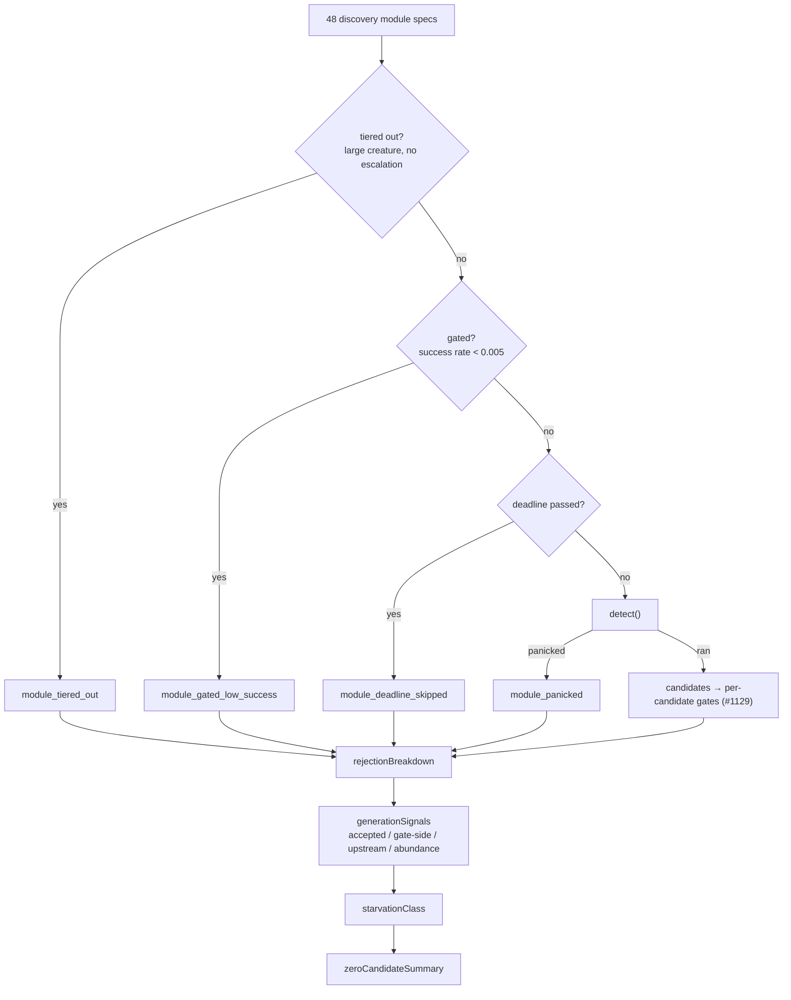
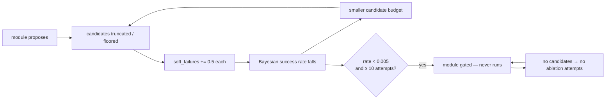

# Module-Skip Attribution — why a barren run proposed nothing (Issue #1925)

Follow-up to the #1920 cache study
([docs/analysis/candidates-cache-study-1920.md](candidates-cache-study-1920.md),
Part 1), which found that **57% of production runs cache nothing** and that four
discovery strategies contribute **twelve records between them across 47 days**.

## The gap this closes

The study named its own blind spot:

> **Failure records are incomplete.** The cache stores candidates the controller
> *evaluated*. Candidates rejected inside discovery never appear, so this corpus
> cannot say why a run proposed nothing — only that 57% of them did.

Discovery already counts every *candidate*-level rejection under a stable reason
(#1129, extended by #1781, #1796–#1802). But four gates suppress a **whole
discovery module**, and a suppressed module produces no candidate for those
counters to see. All four were log-only:

| Gate | Introduced | Effect |
| --- | --- | --- |
| Historical success-rate module gate | #1060 | Detection closure never runs. |
| Deadline skip | #1029 | Remaining modules never run. |
| Caught detection panic | #1087 | Converted to an empty result. |
| Creature-scale tiering | #1547 | 7 expensive modules dropped before dispatch. |

So a barren pass looked identical whether its strategies had been tried and
lost, or never asked at all — the precise distinction the issue's first question
needs.

## What changed

Four stable rejection reasons, one count per suppressed module
(`module_gated_low_success`, `module_deadline_skipped`, `module_panicked`,
`module_tiered_out`), all classified as **upstream** evidence — a module that
never proposed cannot be evidence that the accept gate over-rejected. Each
skipped module also names its own reason in `discoveryModuleStats.skipped`.

Alongside them, `zeroCandidateSummary` now reports the starvation
classification and the counts behind it. That verdict has been computed on every
pass since #1739 to gate novelty escalation, and was thrown away — an operator
could see *which reason* dominated a barren run without being told *which of the
two failure modes* it meant.



Nothing about gating, tiering, deadline handling or panic recovery changed. The
candidate set a pass returns is byte-for-byte what it was — this is
observability only.

## Reading a barren run

`proposalsFormed` is the number to look at first:

| Reading | Meaning |
| --- | --- |
| `proposalsFormed: 0`, `upstreamRejections` dominated by `module_*` | The strategies were never asked. Widening or re-admitting modules is the lever. |
| `proposalsFormed: 0`, `upstreamRejections` dominated by data reasons (`no_samples`, `insufficient_recording`, `fingerprint_unchanged`) | The recording phase, not the module set, is the bottleneck. |
| `proposalsFormed` large, `gateSideRejections` large | The #1737 converged profile — proposal-rich but over-rejected. The gain floors and the estimator are the lever, not generation. |

## The ratchet worth watching

`module_gated_low_success` deserves particular attention, because the gate is
self-sealing:



Once gated, a module generates nothing, so it earns no new ablation attempts, so
its rate cannot recover: the suppression is permanent for the life of the
tracker. That is a mechanism for exactly what the issue describes — *"their rates
are unproven precisely because they are never asked for"*. Whether it is firing
in production was previously unknowable; `module_gated_low_success` is what makes
it measurable.

## Acceptance measure

The issue's acceptance measure is a re-run of the #1920 study:

```bash
cargo run --example study_candidates_cache -- /path/to/discovery-cache-checkout
```

That measures the **controller's** cache, which only ever holds candidates that
were evaluated, so it cannot move until discovery's proposal mix does. The
sequence is therefore: land this attribution, observe `zeroCandidateSummary` and
`discoveryModuleStats.skipped` across the fleet's barren runs, and let the
dominant `module_*` reason decide which starvation mechanism (if any) is worth a
behaviour change. Changing the module set first would be guesswork — the study's
own caveat is that a two-record 50% success rate is "worth measuring properly",
not a proven win.

## Tests

- `tests/issue_1925_module_skip_attribution.rs` — each gate's count, the
  documented/upstream classification, the "ran and found nothing is not a skip"
  counterpart, and the `zeroCandidateSummary` shape.
- `src/analysis/module_dispatch_specs/mod.rs::tiering_returns_the_specs_it_removed`
  — tiering hands back the specs it dropped instead of discarding them.
