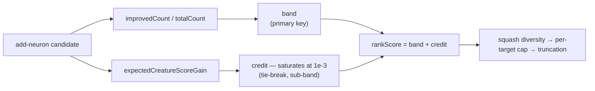

# Add-Neuron Rank Score (Issue #1924)

The Issue #1920 candidates-cache study
([`candidates-cache-study-1920.md`](candidates-cache-study-1920.md), findings B
and C) measured the field `add-neurons` candidates were ranked on —
`rustRequest.neuronCandidate.expectedCreatureScoreGain` — at **r = −0.608**
against the success indicator. The engine's own confidence predicted failure,
so sorting on it descending put the losers at the top of every batch.

This document records what replaced it and the measurement that accepts the
change.

> **Point-in-time study, as at 2026-08-02 — current.** This is the #1924
> follow-up to the #1920 cache study. The rank score it records is shipped in
> `src/analysis/neuron/ranking_score.rs`; the before/after correlations are a
> point-in-time measurement, so re-run the study before quoting them as
> today's numbers.

## What changed

Ranking no longer sorts on the estimate. It sorts on a **rank score** that puts
reliability first and lets the estimate break ties only inside a reliability
band:

```text
band   = min(floor(improved_share × bands), bands - 1) / bands
credit = min(gain / gain_reference, 1) / (bands + 1)
score  = band + credit
```

- `improved_share` is `improvedCount / totalCount` — the share of samples the
  candidate improves, and the only field in the corpus that tracks success
  positively (**r = +0.466**).
- `credit` is by construction narrower than one band, so a larger prediction can
  never lift a candidate past a more reliable one.
- `gain_reference` (`1e-3`) is where the credit saturates. Every realised
  `scoreDelta` in the corpus is at or below `2.35e-5`; above `1e-3` the
  estimates are pure over-confidence, so they earn no further credit.
- `bands` (`NEAT_AI_DISCOVERY_NEURON_RANKING_BANDS`, default 10) is the
  gain-versus-reliability knob. `1` collapses the order back to
  gain-descending — the pre-#1924 behaviour, kept as an escape hatch.



Source: [`src/analysis/neuron/ranking_score.rs`](../../src/analysis/neuron/ranking_score.rs),
applied at the three ordering points in
[`src/analysis/neuron/post_processing.rs`](../../src/analysis/neuron/post_processing.rs).

## Measurement

The issue names the acceptance measure: `r vs success` for the field the
ranking sorts on. The study now scores `rankScore` with the production scorer,
so re-running it measures exactly that:

```bash
cargo run --example study_candidates_cache -- /path/to/discovery-cache-checkout
```

Run against the production cache on 2026-08-02 (130 records; 13 `add-neurons`,
4 of them successes):

| Field | Gain n | r vs log gain | Outcome n | r vs success |
| --- | ---: | ---: | ---: | ---: |
| `neuronCandidate.expectedCreatureScoreGain` | 4 | +0.781 | 13 | **−0.608** |
| `neuronCandidate.improvedShare` | 4 | −0.871 | 13 | +0.466 |
| `neuronCandidate.rankScore` | 4 | −0.869 | 13 | **+0.465** |

The ranking field's correlation with success moves from **−0.608 to +0.465** —
sign flipped, and within 0.001 of the best signal the corpus offers, while
keeping the gain tie-break the pure `improvedShare` ordering throws away.

### Ordering

Re-ranking the same 13 records moves the successes from mean position 10.0 of
13 to mean position 4.5:

| Rank | `rankScore` | `improvedShare` | `expectedCreatureScoreGain` | `scoreDelta` | Outcome |
| ---: | ---: | ---: | ---: | ---: | --- |
| 1 | 0.9327 | 1.000 | 3.598e-4 | −5.636e-8 | failure |
| 2 | 0.9000 | 1.000 | 1.760e-7 | +8.250e-8 | success |
| 3 | 0.9000 | 1.000 | 1.576e-7 | +5.485e-7 | success |
| 4 | 0.6909 | 0.631 | 1.018e-3 | +2.250e-6 | success |
| 5 | 0.6866 | 0.626 | 9.526e-4 | −1.733e-5 | failure |
| 6 | 0.6024 | 0.660 | 2.638e-5 | −5.825e-6 | failure |
| 7 | 0.6023 | 0.694 | 2.565e-5 | −3.244e-6 | failure |
| 8 | 0.6023 | 0.699 | 2.517e-5 | −2.724e-6 | failure |
| 9 | 0.6017 | 0.668 | 1.909e-5 | +2.921e-6 | success |
| 10 | 0.5909 | 0.552 | 3.977e-3 | −7.371e-6 | failure |
| 11 | 0.5909 | 0.552 | 3.897e-3 | −8.367e-6 | failure |
| 12 | 0.5909 | 0.552 | 1.063e-2 | −2.040e-5 | failure |
| 13 | 0.5863 | 0.563 | 9.492e-4 | −1.242e-5 | failure |

Under the old key the successes sat at positions 4, 11, 12 and 13, and the
worst loss in the corpus (−2.040e-5) ranked first. It now ranks twelfth.

## What this does not fix

- **The estimate is still mis-scaled.** #1924 stops discovery *ranking* on a
  broken predictor; it does not recalibrate it. `expectedCreatureScoreGain`
  still over-predicts by up to 452× and is still what the gain floor
  (#1191/#1778) screens on.
- **Reliable candidates land small.** `improvedShare` correlates with realised
  gain at −0.871 among successes, and the rank score inherits that at −0.869.
  Ranking reliability-first deliberately buys hit rate with gain size; the band
  count is the dial if that trade proves wrong.
- **The top slot is not guaranteed.** The highest-ranked record in the corpus is
  still a failure — though at −5.6e-8 it is a wash, not the −2.0e-5 loss the old
  ordering promoted.
- **13 records, 4 successes.** The direction is clear; the coefficients are not
  calibrated. Re-run the study as the corpus grows before tuning
  `NEAT_AI_DISCOVERY_NEURON_RANKING_BANDS` or the gain reference.
