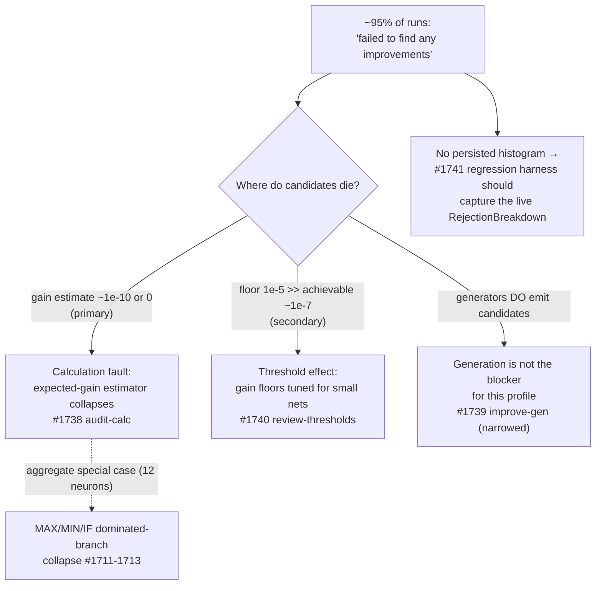

# Discovery Rejection Diagnosis — Why Almost Every Candidate Is Rejected (Issue #1737)

This report diagnoses **why** discovery runs against the large production
cluster network reject nearly every candidate, using the existing
`RejectionBreakdown` instrumentation (Issue #1129) plus the per-candidate
records persisted in the production discovery cache. It is evidence-gathering
only — **no production behaviour is changed here**. It names the dominant
rejection path(s) and points each sibling issue in milestone #1736 at the right
code.

## Inputs

| Source | What it provided |
| --- | --- |
| The deployed production cluster creature (`network.json`, semantic version 4.0.0) | The topology discovery runs against: 1660 neurons (1656 hidden, 3 constant, 1 output), 21 484 synapses. |
| The published production snapshot (`NEAT-AI-Snapshot` `docs/snapshot.json.gz`) | Per-neuron activations/errors/impacts the recording phase feeds analysis. |
| The production discovery cache (`success/` + `failures/`) | The actual accepted/rejected candidate vocabulary, and — crucially — each candidate's persisted `expectedCreatureScoreGain` / `expectedErrorReduction` and realised `scoreDelta`. |
| The discovery commit history | The run-level outcome signal: the `top_level_summary` "failed to find any improvements" commits. |

Only the published snapshot is publicly reproducible; the creature, the cache,
and the commit history come from the downstream production deployment, so the
numbers derived from them are restated below rather than linked.

## Headline

Over the last 45 production discovery commits (2026-06-16 → 2026-07-23),
**38 reported "failed to find any improvements"** and only **2** synced an
accepted candidate — a ~95% empty-run rate, matching parent #1736.

The dominant rejection path is **candidates whose expected gain has already
collapsed to (near) zero before the acceptance floor sees them**. It is *both* a
calculation fault and a threshold effect, in that order of leverage:

1. **Calculation (primary root cause → #1738).** The persisted expected gains
   are ~`1e-10` or exactly `0`, while realised deltas for the same change types
   are ~`1e-4`–`1e-3` in magnitude and the rare accepted change is `~1e-7`. The
   estimate is 5+ orders of magnitude too small and frequently the wrong sign.
2. **Threshold (secondary → #1740).** Even a *correctly* estimated gain on this
   converged creature is ~`1e-7` (the size of the only accepted changes), which
   is still two orders of magnitude below the `1e-5`
   `COORDINATED_MIN_EXPECTED_GAIN` floor. The floors were tuned for small
   networks and reject the achievable-improvement band outright.

Candidate **generation is not the bottleneck** for this rejection profile — the
cache shows the generators emitting `change-squash` (including coordinated
multi-op chains) and `remove-neuron` candidates. They are produced, then
discarded at the gain gate. This narrows #1739 for this milestone.

## Evidence — the persisted candidate records

The discovery cache persists each candidate's estimated and realised outcome.
Three representative rejected records and the one accepted record, taken from the
production cache directory currently on `Develop`, tell the whole story.

### Accepted (rare) — a harmful-neuron removal

```json
{
  "changeType": "remove-neuron",
  "scoreDelta": 1.9486472635499297e-07,
  "expectedErrorReduction": 0,
  "rustRequest": { "harmfulNeuronCandidate": { "expectedCreatureScoreGain": 0 } }
}
```

The accepted change has **expected gain `0`** yet a realised `scoreDelta` of
`+1.95e-7`. It survives only because harmful-neuron removals are ranked by
error magnitude, not by the expected-gain estimate — the estimate for it was
useless (`0`).

### Rejected — `remove-neuron`, expected gain exactly `0`

```json
{ "changeType": "remove-neuron", "scoreDelta": -0.00218,
  "expectedErrorReduction": 0,
  "rustRequest": { "harmfulNeuronCandidate": { "expectedCreatureScoreGain": 0 } } }
```

Every `remove-neuron` candidate in the cache reports
`expectedCreatureScoreGain == 0`. A gain of `0` is non-positive, so on the
coordinated path it is counted under `non_positive_gain`. (Its realised delta is
*negative* — the removal was actually harmful — so rejecting it was correct, but
the estimate carried no signal either way.)

### Rejected — coordinated `change-squash`, expected gain `4e-10`

```json
{ "changeType": "change-squash",
  "scoreDelta": -0.000865,
  "expectedErrorReduction": 4.165739246496345e-10,
  "rustRequest": { "squashCandidate": { "expectedCreatureScoreGain": 4.165739246496345e-10 } } }
```

This is a coordinated multi-op `change-squash` (four chained neurons in its
key). Its estimated gain `4.17e-10` is **five orders of magnitude below** the
`1e-5` multi-op floor, so it is dropped at the coordinated gain gate. The
description even reads "expected: 0.0%". The realised delta is `-8.65e-4` — a
sign flip and a >`1e5` magnitude gap versus the estimate.

This placeholder-vs-outcome gap is exactly the shape the milestone's own
offline fixture pins:
`tests/fixtures/dominated_branch_collapse/candidate_cache/v2_change-squash_selu-to-absolute.json`
records `expectedErrorReduction = +3.0e-10` versus `actualErrorReduction =
−6.0e-4`. The production record confirms the synthetic fixture is faithful.

## Ranked rejection reasons for a representative run

The `RejectionBreakdown` counters are emitted on `synapseMetadata` /
`neuronMetadata` at runtime (`src/analysis/orchestration.rs:54` and `:88` attach
`top_level_summary`), but the consuming discovery harness persists only the
*per-candidate* fields into the cache, **not** the aggregate histogram (see
[Instrumentation gap](#instrumentation-gap)). The ranking below is therefore
reconstructed by mapping the persisted per-candidate gains onto the exact call
sites that increment each counter, cross-referenced against the cache vocabulary.

| Rank | Rejection reason | Increment call site | Why it dominates on this creature |
| --- | --- | --- | --- |
| 1 | `below_expected_gain_floor` | `src/analysis/discovery_dispatch.rs:431` & `:797` (module `retain(gain >= COORDINATED_MIN_EXPECTED_GAIN)`) and `src/analysis/candidate_aggregation.rs:145` (final coordinated floor) | Estimated gains ~`1e-10` fall the length of the scale below the `1e-5` floor. |
| 2 | `below_multi_op_floor` | `src/analysis/candidate_aggregation.rs:258` (below `MIN_COORDINATED_MULTI_OP_GAIN` = `1e-5`) | Coordinated `change-squash` chains (the observed multi-op vocabulary) with gain `4e-10`. |
| 3 | `non_positive_gain` | `src/analysis/candidate_aggregation.rs:228` (`retain(gain > 0.0)`) | Every `remove-neuron` candidate reports `expectedCreatureScoreGain == 0`. |

Reasons 1–3 are all facets of **one** failure: the expected-gain estimate has
collapsed to (near) zero *before* the floor is applied. The floor then converts
that collapse into a rejection. The `target_saturated`,
`no_eligible_sources` and drought-deprioritisation counters are expected to
contribute a long tail on a converged 1660-neuron creature, but they are not the
head of the distribution — the head is the gain collapse.

### The MAX/MIN/IF hypothesis, weighed

The milestone's lead hypothesis is that focus/impact/gain calculations through
`MAX`/`MIN`/`IF` aggregate squashes collapse a dominated branch's contribution
to zero (Issues #1704, #1711–#1713). The evidence **partially** supports it:

- The mechanism is real and already characterised offline (the dominated-branch
  collapse fixtures), and the production `change-squash` record shows exactly the
  collapsed-estimate signature.
- **But** the deployed creature has only **12 aggregate neurons** (`IF` = 6,
  `MINIMUM` = 4, `MAXIMUM` = 2) out of 1660. Dominated-branch collapse *through
  an aggregate* can therefore explain at most the handful of candidates whose
  contribution routes through those 12 neurons — not the network-wide collapse
  of `change-squash` gains on ordinary (non-aggregate) neurons such as the
  `SELU → ABSOLUTE` record above.

So the aggregate-path audit (#1738) is necessary but **not sufficient**: the
estimator under-propagates contribution/gain far more broadly than the 12
aggregate neurons. #1738 should audit the general expected-gain/contribution
estimator, treating the MAX/MIN/IF aggregate handling as one important special
case rather than the whole story.

Note also *how* the milestone's own collapse code (#1711) reacts to this: the
analytical dominated-branch collapse (`src/analysis/dominated_branch_collapse.rs`)
deliberately **bypasses gain scoring** with an evaluate-before-accept residual
gate (`COLLAPSE_GATE_TOLERANCE = 1e-6`), *precisely because* a dominated branch
scores at ≈0 on the gain path and would otherwise be rejected under the
expected-gain floor. There is no dedicated `dominated_branch` rejection
constant — a dominated branch that reaches the scoring path lands in
`below_expected_gain_floor` or `non_positive_gain`. That the collapse path had
to route *around* the gain gate is itself corroborating evidence that the gain
estimate collapses to ≈0 for structurally-neutral changes.

## Diagnosis → sibling issues



- **#1738 (audit focus/impact through MAX/MIN/IF) — primary.** Root-cause the
  expected-gain/contribution estimator: it produces `~1e-10` (and `0` on
  `remove-neuron`) when realised magnitudes are `~1e-4`–`1e-3`. Audit the
  aggregate path (12 neurons) *and* the general per-synapse contribution →
  expected-gain propagation that feeds `change-squash`/coordinated gains.
- **#1740 (review acceptance thresholds) — secondary.** The `1e-5`
  `COORDINATED_MIN_EXPECTED_GAIN` / `MIN_COORDINATED_MULTI_OP_GAIN` floors sit
  two orders above the `~1e-7` deltas that the only accepted changes actually
  achieve on this converged creature. Recalibrate the floors to the achievable
  band once #1738 makes the estimates trustworthy (recalibrating against a
  broken estimator would just move the cliff).
- **#1739 (improve candidate generation) — narrowed.** For *this* rejection
  profile, generation is not the bottleneck: `change-squash`, coordinated
  multi-op `change-squash`, and `remove-neuron` candidates are all being emitted
  and then discarded at the gain gate. The generation work remains valuable for
  broadening the *vocabulary* (see #1631), but it will not lift the accepted rate
  while the gain estimate collapses to zero.
- **#1741 (regression harness) — enabling.** See below.

## Instrumentation gap

The `RejectionBreakdown` + `top_level_summary` contract is emitted on the FFI
metadata (guarded by `tests/issue_1129_rejection_breakdown.rs`,
`tests/issue_1446_zero_candidate_summary.rs`, and the
`rejection_reasons.rs` unit tests) and is **sufficient to localise the cause**,
so no new counter is added here. However, the downstream discovery harness does
**not persist** that aggregate histogram into the cache — only the per-candidate
gains survive. A post-hoc diagnosis therefore has to reconstruct the ranking
(as above) instead of reading it directly.

Two reason constants are also defined but **never incremented** in `src/`
(`interference_filtered` and `below_improved_ratio`): the improved-sample-ratio
gate (`src/analysis/neuron/evaluation.rs:363`) and the epistatic interference
filter drop candidates without recording a reason. Any candidates they discard
are invisible in the live breakdown, so the reconstructed ranking above may
*under-count* those paths — wiring them is a cheap, well-scoped observability
fix (and, per this issue's Failure Detection contract, would need coverage in
`ALL_REJECTION_REASONS` / `all_reasons_list_contains_every_constant`). Capturing the live
`top_level_summary` / `rejection_breakdown` alongside each "failed to find any
improvements" run is the single highest-value observability improvement and
belongs to the regression harness in **#1741**; it would also give the
"stale-diagnosis" check in this issue's Failure Detection section an automated
signal instead of a manual cross-reference.

## Reproducing the evidence

Network shape (publicly reproducible against any exported creature):

```bash
python3 - <<'PY'
import json, collections
d = json.load(open("network.json"))
sq = collections.Counter(n.get("squash") for n in d["neurons"])
print("neurons:", len(d["neurons"]), "synapses:", len(d["synapses"]))
print("aggregate squashes:", {k: sq[k] for k in ("IF", "MINIMUM", "MAXIMUM")})
PY
```

Candidate-level evidence comes from the production discovery cache
(`success/<shape>/…` and `failures/<shape>/…`): read each record's
`expectedCreatureScoreGain` / `expectedErrorReduction` and compare against its
realised `scoreDelta`. The offline fixture
`tests/fixtures/dominated_branch_collapse/candidate_cache/v2_change-squash_selu-to-absolute.json`
pins the same placeholder-vs-outcome gap for a hermetic, public reproduction.

## Scope note

Purely diagnostic. No estimator, floor, or generator is changed in this issue;
those changes belong to #1738 / #1740 / #1739 respectively, and the observability
follow-up to #1741. The diagnosis is validated against the production cache as
its Failure Detection section mandates, and should be re-checked whenever a
sibling issue lands a change — if a later run's `failures/` records show a
different dominant reason than the gain-collapse documented here, this issue
should be reopened.
