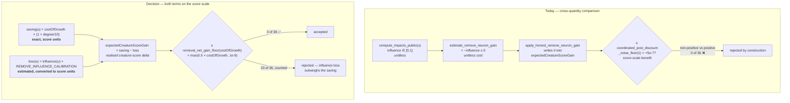

# What Scale a Removal's `expectedCreatureScoreGain` Is Denominated In (Issue #1811)

Sub-issue of #1785 — the "decide, on evidence" step, mirroring what #1778 did for
the add-neuron / add-synapse stack in
[`gain-floor-rescale-1778.md`](gain-floor-rescale-1778.md).

This is a **decision record**. Code changes are out of scope; #1812 implements
Gate 1 from the formula in [The rule](#the-rule), #1814 implements Gate 2 in the
denomination this document fixes.

Every number below is measured on the #1810 characterisation fixture
(`tests/fixtures/remove_neuron_reachability/network.json`), whose reference table
is [`remove-neuron-reachability-1785.md`](remove-neuron-reachability-1785.md).

## The fault in one line

`estimate_remove_neuron_gain` emits a **unitless influence fraction, negated** —
a cost term with no units — and it is written straight into
`expectedCreatureScoreGain`, a field the shared floor screens as a **creature-score
benefit**. There is no conversion and no benefit term, so the comparison is not
merely mis-tuned: it is between two different quantities.

## The decision

**`expectedCreatureScoreGain` for a sole-op `RemoveNeuron` is a net benefit on the
realised creature-score-delta scale** — the same scale #1778 established for the
add paths. It is the complexity saving the host's own score formula will realise,
minus the calibrated influence the removal costs.

Of the three readings #1811 put up, readings 1 and 3 are both correct and
describe two different missing pieces of the same conversion; reading 2 is
rejected.

| Reading | Verdict | Why |
|---|---|---|
| 1 — the gain is a benefit and the estimator is misnamed; the complexity-saving term is missing | **Accepted** | The field is consumed as a benefit by the shared floor *and* by the shared `total_cmp` ranking sort, and by NEAT-AI's controller when it spends ablation budget. A benefit is what the field must carry. The saving term is genuinely absent. |
| 3 — the estimator's output is not on the calibrated scale | **Accepted** | `compute_impacts_public` returns a dimensionless fraction of output sensitivity in `[0, 1]`. #1778 already established that a neuron-level prediction becomes a creature-level delta only after a calibration constant. The removal path has none. |
| 2 — the gain is a cost; sole-op removals get a magnitude screen `\|gain\| <= tolerance` | **Rejected** | It makes one field mean the opposite thing for one candidate type, silently breaking the shared descending sort and the host's reading of the number. It also cannot express *worth*: a magnitude screen scores a zero-influence orphan and a zero-influence 600-synapse hub identically, when the second is worth 60× more score. The correct part of reading 2 — that the estimator emits a cost — is kept: it stays a cost, it is just no longer the whole gain. |

### Why the saving term needs no calibration

This is the load-bearing evidence, and it is not a measurement — it is an
identity. `costOfGrowth` is NEAT-AI's own `Score.ts` complexity penalty per
hidden neuron (`calculate_removal_savings`,
`src/focus/ranking/removal_candidates.rs:73`, documenting the host formula):

```text
complexityPenalty = hiddenNeurons × growthCost + synapses × growthCost / 10 + …
saving(u)         = costOfGrowth × (1 + degree(u) / 10)
```

So the saving is **already denominated in creature-score units, exactly**. The
host will realise precisely that much score the instant the neuron is gone —
there is nothing to predict and nothing to calibrate. It is the only exactly-known
quantity anywhere in the discovery pipeline, and it is the anchor this decision
hangs on: the removal gain is denominated in whatever units `costOfGrowth` is
denominated in, because one of its two terms *is* `costOfGrowth`.

The influence term is the estimated one, and it is the only part that needs a
calibration or a noise screen.

## The path, before and after



## The rule

An implementer can code this without further interpretation.

```text
degree(u)   = incoming_synapses(u) + outgoing_synapses(u)
saving(u)   = calculate_removal_savings(incoming, outgoing, costOfGrowth)
            = costOfGrowth × (1 + degree(u) / 10)
loss(u)     = |estimate_remove_neuron_gain(creature, u)| × REMOVE_INFLUENCE_CALIBRATION

expectedCreatureScoreGain(u) = saving(u) − loss(u)

removal_net_gain_floor(costOfGrowth)
            = max(REMOVAL_NET_GAIN_FLOOR_UNITS × costOfGrowth,
                  GAIN_FLOOR_NOISE_BACKSTOP)

accept(u)  ⟺  expectedCreatureScoreGain(u) ≥ removal_net_gain_floor(costOfGrowth)
```

with

| Symbol | Value | Provenance |
|---|---|---|
| `REMOVE_INFLUENCE_CALIBRATION` | `3e-3` (= `NEURON_PREDICTION_CALIBRATION`) | Interim. See [The calibration](#the-calibration-and-why-the-decision-does-not-rest-on-it). |
| `REMOVAL_NET_GAIN_FLOOR_UNITS` | `0.5` | Dimensionless, in units of `costOfGrowth`. See [The tolerance](#the-tolerance-and-where-it-comes-from). |
| `GAIN_FLOOR_NOISE_BACKSTOP` | `1e-9` | Unchanged from #1778 (`candidate_scoring.rs:962`); reused, not redefined. |
| `costOfGrowth` | host value, else `DEFAULT_COST_OF_GROWTH = 1e-7` | Resolved through the #1807 single-definition seam. |

Substituting `saving(u)` shows what the rule actually asks, and it is a sentence
rather than a threshold: **a removal must pay for its influence loss out of the
synapses it takes with it.**

```text
accept(u) ⟺ influence(u) ≤ (costOfGrowth × (1 + degree(u)/10) − removal_net_gain_floor)
                            / REMOVE_INFLUENCE_CALIBRATION
```

A genuinely harmful removal is rejected because `loss(u)` grows linearly with the
neuron's propagation-aware influence while `saving(u)` is bounded by the
neuron's degree times a `1e-7` constant. On the fixture the two terms are
separated by three to four orders of magnitude for every neuron carrying real
influence — the rule does not squeak them past, it rejects them outright.

### Scope

Sole-op `RemoveNeuron` only, exactly as `apply_honest_remove_neuron_gain` already
scopes itself. Multi-op coordinated candidates keep
`coordinated_post_discount_noise_floor(op_count)` unchanged: their gain reflects
the whole atomic group, not a bare neuron removal.

### The `costOfGrowth` seam on the analysis path

`costOfGrowth` reaches the focus path on `RankFocusNeuronsInput`
(`src/ffi_types/requests.rs:361`) but **not** `AnalyzeParallelInput`, so Gate 1
has no host value today. #1812 must resolve it through the same
`DEFAULT_COST_OF_GROWTH` definition the focus path uses (`src/focus/ranking/mod.rs:354`,
the #1807 single-definition rule) so the two gates cannot drift, and reuse
`calculate_removal_savings` rather than restating the formula. Threading the host
value onto `AnalyzeParallelInput` is follow-on plumbing, not a prerequisite: at
the default the rule is already reachable, as the worked example shows.

## The tolerance, and where it comes from

`REMOVAL_NET_GAIN_FLOOR_UNITS = 0.5`, i.e. **half of one hidden neuron's
complexity cost**. It is bracketed, not picked:

- **Upper bound `< 1.0 × costOfGrowth`.** A zero-influence orphan nets exactly
  `1.0 × costOfGrowth` (degree 0) — the smallest unambiguously free removal that
  exists. Any floor at or above one neuron's cost rejects it, and a rule that
  cannot prune a dead neuron has failed at its only certain case.
- **Lower bound `> 0`.** At zero, a removal whose estimated loss exactly cancels
  its saving is accepted, spending the controller's ablation budget on a
  break-even change with no margin for estimator error.
- **`0.5` within that bracket** leaves the most certain removal in the population
  clearing the floor by a factor of two rather than by f32 epsilon. Placing it at
  `1.0` would make the orphan case an exact-equality comparison in `f32`.

`GAIN_FLOOR_NOISE_BACKSTOP = 1e-9` clamps the floor from below so a host sending a
tiny `costOfGrowth` cannot open the screen into the band where the estimate is
uncorrelated with the outcome. That is exactly the role #1778 gave it, on the
same scale, so it is reused rather than re-derived. At the production
`costOfGrowth = 1e-7` the backstop is not binding (`5e-8 > 1e-9`); it binds only
below `costOfGrowth = 2e-9`.

## The calibration, and why the decision does not rest on it

`REMOVE_INFLUENCE_CALIBRATION` converts a unitless influence fraction into a
creature-score delta. It **cannot be measured from removal outcomes today**: the
production discovery cache contains no realised removal, because — per #1810 —
zero removals have ever survived either gate. That is the honest state of the
evidence, and it is why an interim value is named rather than fitted.

The interim is `NEURON_PREDICTION_CALIBRATION = 3e-3`
(`candidate_scoring.rs:1536`), on two grounds:

- It is the only measured neuron-level → creature-level conversion in the repo
  (#891/#1056), derived from the same production population, and the removal
  estimator's output is a neuron-level quantity on the same network.
- Of the two measured calibrations it is the **larger**, and a larger calibration
  makes the rule *stricter*. #1785's constraint is asymmetric — accepting a
  harmful removal is worse than rejecting a harmless one — so the conservative
  end is the correct default under uncertainty.

**The fixture verdicts are invariant to it over the whole plausible band.** The
nearest-to-acceptance neuron carrying any influence at all is `h-b-08`
(degree 5, influence `9.72e-2`); it stays rejected for every
`REMOVE_INFLUENCE_CALIBRATION > 1.03e-6`, and the three orphans stay accepted for
*every* value because their influence is exactly `0`. Both the add-path
calibrations (`3e-4`, `3e-3`) sit two to three orders above `1.03e-6`, so the
choice between them changes no verdict. The decision rests on the sign and the
scale, not on the constant.

Once #1815's end-to-end guard lets removals reach the controller, the first
realised removal outcomes replace the interim by the same fitting procedure that
produced the add-path constants. #1518 records the one prior data point of this
shape — `neuron-1802938338`, empirically measured effect `−1.94e-4` — and the
refitted constant must reproduce it as `influence × calibration ≈ 1.94e-4`; that
neuron's topology is not in this repository, so it is a check to apply at
refit time, not evidence available now.

## Worked example — one accepted, one rejected

Measured on the #1810 fixture at `costOfGrowth = 1e-7`, `REMOVE_INFLUENCE_CALIBRATION = 3e-3`,
`removal_net_gain_floor = max(0.5 × 1e-7, 1e-9) = 5e-8`.

| | **Must be accepted** — `h-x-0` (orphan) | **Must be rejected** — `h-b-08` (least-influential connected neuron) |
|---|---|---|
| degree | 2 (2 in, 0 out) | 5 |
| `influence(u)` | `0.0` | `9.722222e-2` |
| `estimate_remove_neuron_gain` (unchanged) | `−0.0` | `−9.722222e-2` |
| `saving(u)` | `1e-7 × 1.2` = **`1.2e-7`** | `1e-7 × 1.5` = **`1.5e-7`** |
| `loss(u)` | `0.0 × 3e-3` = **`0.0`** | `9.722222e-2 × 3e-3` = **`2.9167e-4`** |
| `expectedCreatureScoreGain` | **`+1.2e-7`** | **`−2.9152e-4`** |
| vs floor `5e-8` | `+1.2e-7 ≥ 5e-8` → **accept** (2.4× clear) | `−2.9152e-4 < 5e-8` → **reject** (short by ~3.5 orders) |

`h-b-08` is the strongest possible rejection case: no connected neuron on the
fixture is closer to acceptance. The worst case is `h-d-01` (influence `1.0`,
degree 4): `saving 1.4e-7 − loss 3e-3 = −2.99986e-3`, rejected by four orders.
The degree-12 hub `h-b-00` (influence `4.444e-1`) nets `−1.3331e-3` — its
best-in-fixture saving of `2.2e-7` buys it nothing, which is the correct outcome
and the direct answer to #1785's "a removal that genuinely loses accuracy must
still be rejected".

Break-even influence, for reference: `2.33e-5` at degree 2, `3.33e-5` at degree
5, `5.67e-5` at degree 12. The fixture's smallest non-zero influence is
`9.72e-2` — **4 170×** above the degree-5 break-even. Only a neuron attenuated to
near-nothing is prunable, which is the intended population.

## Reconciling the constants

| Constant | Today | Under this decision | Changes value? |
|---|---|---|---|
| `estimate_remove_neuron_gain` sign convention (`remove_neuron_gain.rs:131`) | Returns `−influence`, documented `<= 0.0`; written directly into `expectedCreatureScoreGain` | **Sign and value unchanged.** Re-documented as the **cost term only**, on the *unitless influence* scale. It is no longer the gain; it is one of the gain's two inputs. | No |
| `coordinated_post_discount_noise_floor(1)` = `5e-7` (`candidate_scoring.rs:1193`) | Applied to every candidate including sole-op `RemoveNeuron` | **Value unchanged, and still applies to every other candidate type and every multi-op group.** Sole-op `RemoveNeuron` routes to `removal_net_gain_floor(costOfGrowth)` instead. The floor is not dropped — it is replaced, for one candidate type, by a screen denominated in the units that type's gain actually lives in. | No |
| `REMOVE_LOW_IMPACT_NOISE_FLOOR` = `1e-5` (`candidate_scoring.rs:1469`) vs host `costOfGrowth` = `1e-7` | Gate 2: an absolute `f32` screening `boostedSavings − contribution`, a term **linear in `costOfGrowth`**; unreachable below 657 synapses on one neuron | Same category error as Gate 1's, on the other path. This document fixes only the **shared denomination — units of `costOfGrowth`** — which is the property that stops the two gates contradicting each other. #1814 sets Gate 2's multiplier and preserves the #1142 numerical-noise guarantee and the `NEAT_AI_DISCOVERY_REMOVE_LOW_IMPACT_NOISE_FLOOR` override; this document does not preempt that value. | #1814 decides |
| `NEURON_PREDICTION_CALIBRATION` = `3e-3` (`candidate_scoring.rs:1536`) | Add-neuron prediction → realised delta (#1778) | Reused unchanged as the interim `REMOVE_INFLUENCE_CALIBRATION`. Its add-path role is untouched. | No |
| `GAIN_FLOOR_NOISE_BACKSTOP` = `1e-9` (`candidate_scoring.rs:962`) | #1778 absolute lower clamp on the rescaled add-path floor | Reused unchanged as the lower clamp on `removal_net_gain_floor`. Same constant, same scale, same purpose. | No |
| `CONSTANT_NEURON_PRIORITY_GAIN` = `1.0` (`remove_neuron_constant_promotion.rs:61`) | The only route past Gate 1 today | Unchanged. `1.0` clears any `removal_net_gain_floor`, so promotion keeps working — it just stops being the *only* route. | No |
| `REMOVAL_CANDIDATE_BOOST` = `1.5` (`candidate_scoring.rs:1440`) | Gate 2 only | Not used by Gate 1. Gate 1 has no boost: the saving term is exact, so inflating it would only manufacture acceptances. | No |
| `MIN_EXPECTED_CREATURE_SCORE_GAIN` = `1e-5` (`candidate_scoring.rs:909`) | Add-path prediction-scale screen, rescaled by #1778 | Not applicable to removals — there is no prediction-scale stage on the removal path to screen. | No |

**New constants introduced by #1812:** `REMOVE_INFLUENCE_CALIBRATION` (`3e-3`,
interim), `REMOVAL_NET_GAIN_FLOOR_UNITS` (`0.5`), and the helper
`removal_net_gain_floor(cost_of_growth)`. Nothing else.

## The boundary

**Keeps its current value:** `coordinated_post_discount_noise_floor` (all tiers),
`REMOVE_LOW_IMPACT_NOISE_FLOOR` (this document; #1814 owns it),
`REMOVAL_CANDIDATE_BOOST`, `NEURON_PREDICTION_CALIBRATION`,
`SYNAPSE_PREDICTION_CALIBRATION`, `GAIN_FLOOR_NOISE_BACKSTOP`,
`MIN_EXPECTED_CREATURE_SCORE_GAIN`, `CONSTANT_NEURON_PRIORITY_GAIN`,
`DEFAULT_COST_OF_GROWTH`, and the sign of `estimate_remove_neuron_gain`.

**Changes:** what `apply_honest_remove_neuron_gain` writes into
`expected_creature_score_gain` (a net benefit, not a bare cost), and which floor
a sole-op `RemoveNeuron` is screened against.

### Expected candidate yield

| | Today | Under this decision |
|---|---|---|
| Sole-op `RemoveNeuron` candidates on the fixture | 36 | 36 |
| Surviving Gate 1 | **0** | **3** (`h-x-0`, `h-x-1`, `h-x-2` — the zero-influence orphans) |
| Rejected | 36, counted under the shared `REJECTION_BELOW_EXPECTED_GAIN_FLOOR` | **33**, under a removal-specific reason (`loss > saving`) |

Three of thirty-six is the intended shape, not a shortfall: the fixture contains
exactly three neurons with no downstream influence, and those are exactly the
neurons a pruner should take. In production the yield is whatever fraction of the
population has attenuated to below the break-even influence — the rule sets no
quota.

Two consequences #1812 must carry:

- The #1810 characterisation pin **will** break, by design. Its own closing note
  says so; update `remove-neuron-reachability-1785.md` Block 1 and the pin
  together.
- Every one of the 33 rejections must keep incrementing a reason in
  `metadata.rejection_breakdown` (#1812 constraint 3). They are counted today,
  but under `REJECTION_BELOW_EXPECTED_GAIN_FLOOR`
  (`apply_final_coordinated_gain_floor`, `candidate_aggregation.rs:138-142`),
  shared with every add candidate. Once the screen is a different comparison
  against a different floor, that reason no longer describes them — the fact to
  report is that the influence loss outweighed the complexity saving, which
  wants its own constant in `rejection_reasons.rs`. Losing the count entirely in
  the rewrite would reproduce the exact fail-loud violation #1785 raised against
  Gate 2's 33 uncounted drops.

## Cross-references

| Issue | Relationship |
|---|---|
| [#1785](https://github.com/stSoftwareAU/NEAT-AI-Discovery/issues/1785) | Parent. Its two constraints — do not flip the sign, do not drop the floor — are both honoured: the sign is unchanged and the floor is re-denominated, not removed. |
| [#1778](https://github.com/stSoftwareAU/NEAT-AI-Discovery/issues/1778) | Add-path precedent, [`gain-floor-rescale-1778.md`](gain-floor-rescale-1778.md). Same fault class — a screen and a value compared across scales — and this document reuses its scale (realised creature-score delta), its backstop (`GAIN_FLOOR_NOISE_BACKSTOP`) and its calibration constant rather than inventing parallel ones. The difference: #1778's mismatch was a *rescale*, this one is a *missing term plus a missing conversion*. |
| [#1810](https://github.com/stSoftwareAU/NEAT-AI-Discovery/issues/1810) | Evidence base, [`remove-neuron-reachability-1785.md`](remove-neuron-reachability-1785.md). Every measurement above comes from its fixture. Its Block 1 pin must be updated by #1812. |
| [#1812](https://github.com/stSoftwareAU/NEAT-AI-Discovery/issues/1812) | Implements [The rule](#the-rule) for Gate 1. Its tests must encode the worked example above: `h-x-0` accepted, `h-b-08` and `h-d-01` rejected. |
| [#1779](https://github.com/stSoftwareAU/NEAT-AI-Discovery/issues/1779) | Bias-fold gate, downstream of this decision. A measured functionally-constant neuron has influence ≈ 0, so under this rule it is accepted on its own merits and no longer *depends* on promotion to `CONSTANT_NEURON_PRIORITY_GAIN`. Promotion survives as a ranking priority, which is what #1622 wanted it for; #1779's gate stops being load-bearing for reachability. |
| [#1783](https://github.com/stSoftwareAU/NEAT-AI-Discovery/issues/1783) / [#1805](https://github.com/stSoftwareAU/NEAT-AI-Discovery/issues/1805) | Triage duplication. Both entry points now resolve through one criterion over `calculate_removal_savings` and one `effective_cost_of_growth` seam. This decision adds no third copy: Gate 1 reuses `calculate_removal_savings` rather than restating `costOfGrowth × (1 + degree/10)`, so the duplication those issues closed cannot reopen through the analysis path. |
| [#1814](https://github.com/stSoftwareAU/NEAT-AI-Discovery/issues/1814) | Gate 2. Shares this document's denomination (units of `costOfGrowth`) and owns `REMOVE_LOW_IMPACT_NOISE_FLOOR`'s replacement value. |
| [#1815](https://github.com/stSoftwareAU/NEAT-AI-Discovery/issues/1815) | End-to-end guard. Its first realised removal outcomes are what refits `REMOVE_INFLUENCE_CALIBRATION` off its interim value. |
