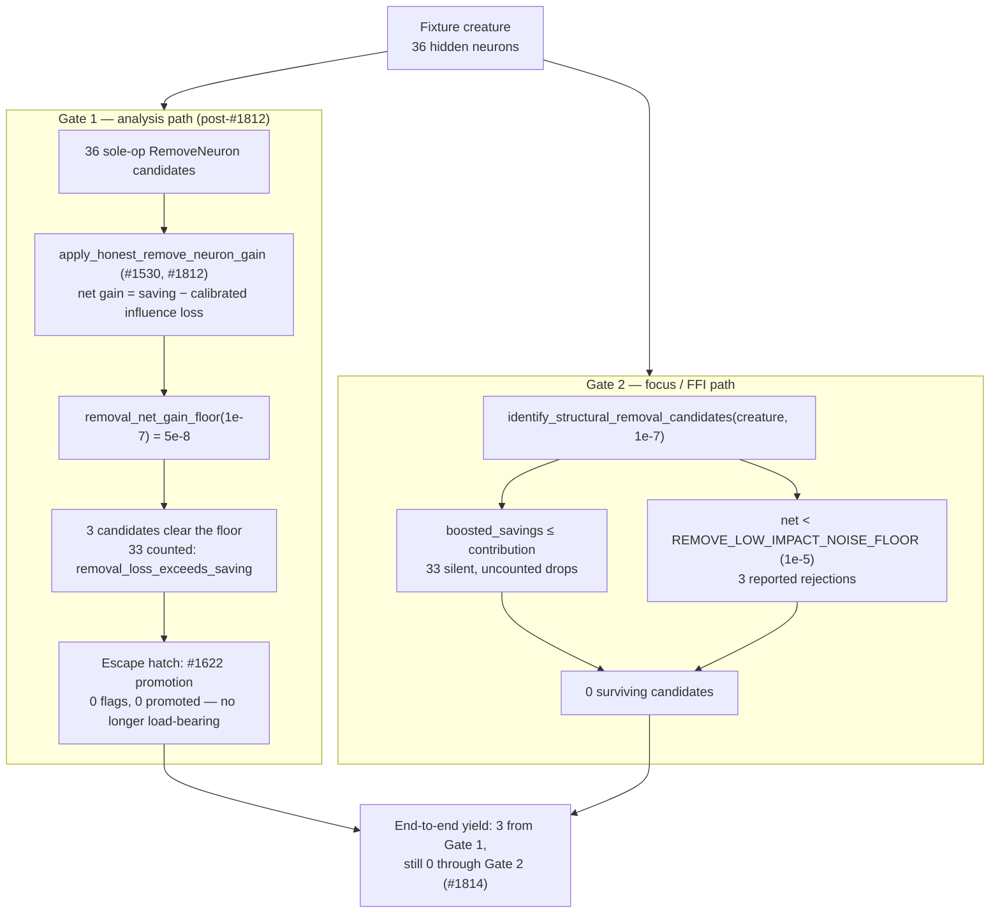
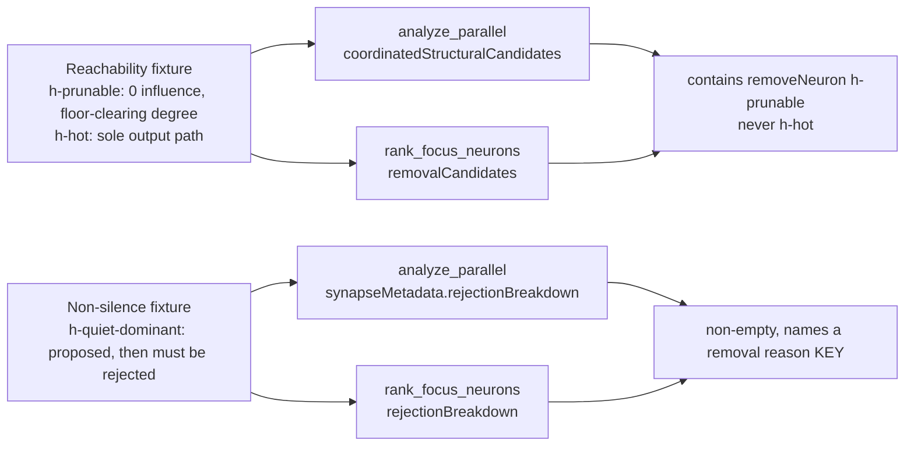

# Remove-neuron reachability — measured reference table (Issue #1810)

Sub-issue of the #1785 milestone: the evidence base every other sub-issue is
measured against.

Issue #1785 cites a reproduction that does not exist on `Develop` —
`tests/issue_1777_discovery_diagnostic.rs` is not a file in this repository, and
[`candidate-rate-diagnosis-1777.md`](candidate-rate-diagnosis-1777.md) has no
"Fresh-run evidence" section. The numbers it quotes were therefore not
re-derivable, and nothing pinned the end-to-end zero yield the milestone is
trying to change.

This document is that evidence base. Every number below is **produced by a
committed test**, not quoted:

```bash
cargo test --test issue_1785_remove_neuron_reachability -- --nocapture --test-threads=1
```

The test is a **characterisation pin, not an invariant**. A fix to either gate is
expected to break it loudly; when that happens, update the pin *and* this table
together.

## Measurement fixture

`tests/fixtures/remove_neuron_reachability/network.json` — hand-authored and
synthetic (see its
[README](../../tests/fixtures/remove_neuron_reachability/README.md) for the
construction rule). 6 inputs, **36 hidden** neurons (12/10/8/3 across four
feed-forward layers plus 3 orphans), 2 outputs, 102 synapses, maximum hidden
degree **12**, all weights `1.0`, all squashes `IDENTITY`, `costOfGrowth = 1e-7`
(the production default, `DEFAULT_COST_OF_GROWTH`).

## The two gates



## Block 1 — Gate 1, analysis path

`apply_honest_remove_neuron_gain` (`src/analysis/discovery_dispatch.rs`) over one
sole-op `RemoveNeuron` candidate per hidden neuron, then the FFI-facing
`apply_final_coordinated_gain_floor`.

**Updated by #1812** — this block previously pinned a zero yield. The gain was
`−impact` (`estimate_remove_neuron_gain`), non-positive by construction, screened
against a strictly-positive `coordinated_post_discount_noise_floor(1) = 5e-7`, so
no candidate could clear Gate 1 on this fixture or any other. #1812 implemented
the rule decided in
[`remove-neuron-gain-scale-1785.md`](remove-neuron-gain-scale-1785.md): the
emitted gain gained its missing benefit term and unit conversion
(`saving − |influence| × REMOVE_INFLUENCE_CALIBRATION`), and sole-op removals are
screened against `removal_net_gain_floor(costOfGrowth)` instead. The estimator's
sign is unchanged and the floor is replaced for one candidate type, not dropped.

| Measurement | Before #1812 | After #1812 |
|---|---|---|
| Removable neurons (candidate set size) | 36 | **36** |
| Neurons whose gain the override replaced | 36 | 36 |
| Emitted gain — min | `−1.000000e0` | `−2.999860e-3` |
| Emitted gain — median | `−1.666667e-1` | `−4.998600e-4` |
| Emitted gain — max (best) | `−0e0` | **`+1.200000e-7`** |
| Floor applied to a sole-op removal | `5e-7` (shared) | `5e-8` (`removal_net_gain_floor`) |
| Candidates reaching the FFI response | **0** | **3** (`h-x-0`, `h-x-1`, `h-x-2`) |
| Rejections counted under `removal_loss_exceeds_saving` | n/a | **33** |
| Rejections counted under `below_expected_gain_floor` | 36 | **0** |

The three survivors are exactly the fixture's zero-influence orphans, and they
survive **without** promotion — Block 2 still measures zero promotions, so
the #1622 escape hatch is no longer the only route past Gate 1. Every one of
the 33 rejections is counted under its own reason: nothing leaves the pass
silently.

A synthetic hidden neuron wired straight into `out-1` with a dominant weight
(influence `−9.99e-1`, net gain `−2.997e-3`) is still rejected and counted, which
is the direct check that the fix did not become "accept everything".

## Block 2 — the promotion escape hatch

| Measurement | Value |
|---|---|
| `functionally_constant_neuron_uuids(&creature)` | **empty** for this fixture (the seam is wired by #1813; no hidden neuron here is structurally constant) |
| Candidates carrying a `constant_neuron_bias_fold` | **0** |
| `bias_folded_constant_neuron_uuids(&candidates)` | **empty** |
| Candidates promoted to `CONSTANT_NEURON_PRIORITY_GAIN` | **0** |

The only route past Gate 1 is #1622 promotion. Its structural flag source is
wired (#1813) but flags only neurons whose output cannot vary given the topology
— none in this fixture, where every hidden neuron has a non-zero-weight path from
a live input — and its measured #1779 source needs a candidate carrying an
*accepted* bias fold, which the structure-only candidate set never attaches. The
escape hatch therefore yields zero **for this creature**, matching #1785's "0
promotion entries"; a creature carrying a structurally-constant hidden neuron now
promotes it.

## Block 3 — Gate 2, focus / FFI path

`identify_structural_removal_candidates(&creature, 1e-7)`
(`src/focus/ranking/removal_candidates.rs:462`), reached through the shipped FFI
entry point `rank_focus_neurons_internal` (`src/ffi_internal/analysis.rs:707`)
because the function is `pub(crate)` (the Issue #1806 convention).

| Measurement | Value |
|---|---|
| Hidden neurons considered | 36 |
| Surviving candidates | **0** |
| `noise_floor_rejections` (reported under `rejectionBreakdown`) | **3** |
| Silent `boosted_savings <= contribution` drops (uncounted) | **33** |
| Best boosted savings across the fixture | **`3.3e-7`** |
| `REMOVE_LOW_IMPACT_NOISE_FLOOR` | `1e-5` |

The two drop paths split cleanly by structure: the 33 connected hidden neurons
carry a structural contribution orders of magnitude above their boosted savings,
so they hit the bare `return None` at
`src/focus/ranking/removal_candidates.rs:387` — counted **nowhere**, which is why
the test measures it as the residue. The 3 orphans have contribution `0.0`, so
they reach the noise-floor gate and are reported. Even they fall short by a
factor of ~30 (`3.3e-7` at best, against `1e-5`).

## Block 4 — the 657-synapse break-even

Searched over the shipped `calculate_removal_savings`
(`src/focus/ranking/removal_candidates.rs:73`) rather than quoted.

| Measurement | Value |
|---|---|
| `costOfGrowth` | `1e-7` |
| `REMOVAL_CANDIDATE_BOOST` | `1.5` |
| `REMOVE_LOW_IMPACT_NOISE_FLOOR` | `1e-5` |
| Smallest synapse count clearing the floor | **657** |
| Boosted savings at 657 synapses | `1.0005e-5` |
| Boosted savings at 656 synapses | `9.99e-6` |

A zero-contribution neuron needs `1.5 × 1e-7 × (1 + n/10) >= 1e-5`, i.e.
`n >= 656.7` — **657 synapses** on a single neuron before pruning it is worth
reporting. Confirmed.

## Reconciliation with the numbers quoted in #1785

| #1785 quotes | Status here | Value on `Develop` (`a36e9ba`) |
|---|---|---|
| 36 removable neurons | Reproduced (fixture sized to match) | 36 |
| Best honest gain `−1.84e-2` | **Not reproducible** — it is a property of the unavailable production creature, not of the pipeline. The signed, non-positive shape is reproduced. | best `−0e0`, median `−1.67e-1` on this fixture (pre-#1812) |
| 0 neurons clearing the floor | Reproduced, and shown to be structural — **fixed by #1812** | 0 before, **3** after |
| 0 promotion entries | Reproduced | 0 |
| Best boosted savings `3.30e-7` | Reproduced (degree-12 hub) | `3.3e-7` |
| 657 synapses needed | Reproduced by construction | 657 |

### Corrected source references

Verified against `Develop` at `a36e9ba`. #1785's table was written against
`06403d7`; several line numbers have since moved, and two pointed at the wrong
code.

| #1785 says | Correct on `a36e9ba` |
|---|---|
| `remove_neuron_constant_promotion.rs:112-114` | `functionally_constant_neuron_uuids` returned an empty `HashSet` unconditionally; Issue #1813 replaced it with the structural detector |
| `candidate_scoring.rs:1470` (`REMOVE_LOW_IMPACT_NOISE_FLOOR`) | `candidate_scoring.rs:1469`; `REMOVAL_CANDIDATE_BOOST` at `candidate_scoring.rs:1440` |
| `removal_candidates.rs:160-170` (silent drop site) | that range is `RemovalCandidateOutcome::rejection_breakdown` (`:161-171`); the silent `boosted_savings <= contribution` drop is at `removal_candidates.rs:387-389` |
| triage lives in `removal_triage.rs` | the shipped copy is `removal_candidates.rs::identify_structural_removal_candidates` (`:462`), called from `ffi_internal/analysis.rs:707`. `removal_triage.rs` retains only the thin `triage_removal_candidates` adapter over the same criterion (#1805) |
| `discovery_dispatch.rs:142` (honest-gain override) | `discovery_dispatch.rs:141` |

Line numbers move. The function and constant names above are the durable
references; treat the numbers as a snapshot of `a36e9ba`.

## What a fix has to change

For a remove-neuron candidate to reach NEAT-AI, **both** gates must yield:

- **Gate 1** — **done (#1812).** The emitted gain now carries the complexity
  saving and the unit conversion the estimator's cost term was missing, and
  sole-op removals are screened against `removal_net_gain_floor(costOfGrowth)`
  rather than the add-path floor. Yield on this fixture: 3 of 36.
- **Gate 2** needs the savings scale to reach the `1e-5` floor — today that takes
  657 synapses on one neuron — and needs the `boosted_savings <= contribution`
  drop to be counted, since 33 of 36 neurons currently vanish there with no
  diagnostic at all.

Both are out of scope for #1810, which only measures and pins. They belong to
the other sub-issues of #1785, and each should re-run the command at the top of this
document and update this table as part of its closing checklist.

## The standing end-to-end guard (Issue #1815)

Everything above is a **pin**: it records today's numbers and is meant to break
when a gate is recalibrated. The composition itself needs a guard that does
**not** move, because #1785's failure mode was precisely that every unit passed
while the composition yielded nothing:

```bash
cargo test --test issue_1785_remove_neuron_end_to_end -- --nocapture --test-threads=1
```

Two invariants, both asserted on the **FFI response shape** so no
intermediate-vector refactor can keep them green while the candidate is deleted
downstream:



- **Reachability.** A `removeNeuron` candidate for a neuron that is genuinely
  worth pruning must appear in both responses; the high-influence neuron in the
  same creature must not, so the guard cannot be satisfied by loosening a gate
  into accepting everything.
- **Non-silence.** A zero-yield removal pass must return a rejection breakdown
  naming one of `removal_savings_below_impact`, `removal_below_noise_floor`,
  `removal_active_neuron` or `removal_loss_exceeds_saving`. The assertion checks
  the **key**, so a mis-keyed or renamed reason is caught — this is the direct
  guard on the `rejectionBreakdown: null` #1785 observed.

The fixtures are built in code, and the prunable neuron's synapse degree is
**derived** from `remove_low_impact_noise_floor()` and
`calculate_removal_savings` rather than hard-coded. When #1814 lowers Gate 2's
absolute floor, the fixture shrinks with it and the invariant still holds — the
guard tracks the calibration instead of pinning it.

Verified against `Develop` at `06403d7` (the commit #1785 was written against):
three of the four cases fail there, including `rejectionBreakdown: null` on the
focus path and an empty `coordinatedStructuralCandidates` on the analysis path.
The focus-path reachability case already passed at `06403d7` — an extreme-degree
orphan could always clear the `1e-5` floor; what that commit lacked was the
*reason* (#1808) and survival through Gate 1 (#1812).
