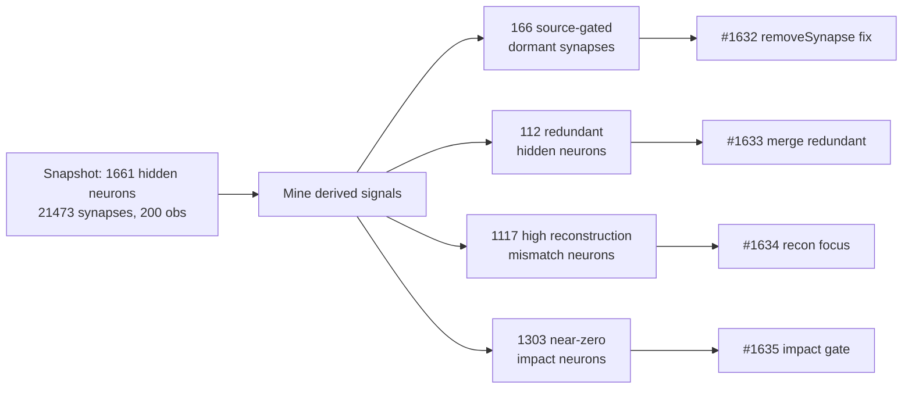

# Snapshot Mining — New Candidate Types and Better Neuron-Focus Selection (Issue #1631)

This report mines the published production snapshot to explain why the
successful-candidate rate has nearly halted, and proposes evidence-backed
improvements. Each proposal is raised as its own child issue with a TDD proof
plan; this document is the shared evidence base and cross-link.

## Inputs

| Source | What it provided |
| --- | --- |
| `stSoftwareAU/NEAT-AI-Snapshot` `docs/snapshot.json.gz` | Production creature topology, 200 recorded observations, per-neuron activations/errors/stats, per-synapse contributions, per-neuron impacts, and reconstruction checks. |
| The live production creature (`network.json`, semantic version 4.0.0) | The deployed topology the snapshot was captured from. |
| The production discovery cache | The actual accepted/rejected candidate vocabulary. |
| The production discovery launcher script | How discovery is launched. |

Only the first row is publicly reproducible; the remaining three come from the
downstream production deployment, so the numbers derived from them are restated
below rather than linked.

### Creature scale

- 1665 neurons total: **1661 hidden**, 3 constant, 1 output.
- **21 473 synapses**, 2461 inputs.
- **200** recorded observations in the snapshot.

## Why the rate has stalled

The production discovery cache contains only two candidate `changeType` values —
`remove-neuron` and `change-squash` — and the only recent successes are
harmful-neuron removals with score deltas around `1e-7`:

```json
{
  "changeType": "remove-neuron",
  "description": "Removed harmful neuron ff853728 (error: 2.19e+11)",
  "scoreDelta": 1.17e-07
}
```

The codebase already *defines* richer operations — `removeSynapse`, `setBias`,
`setWeight`, `addNeuron`, `addSynapse` — and detectors for dormant synapses,
co-adaptation, saturation and more. **The problem is not missing generators; it
is that these generators emit nothing on this creature.** Their thresholds were
tuned for small networks and exclude exactly the structure the production
creature is full of.



## Findings and proposals

### Finding 1 — Source-gated dormant synapses are invisible (→ #1632)

The dormant-synapse detector skips any synapse whose `|weight| > 1e-4` **before**
it ever looks at contribution. But a synapse with a large weight contributes
nothing when its source neuron is gated to `0` across every observation.

| Signal (from `derived.synapses[].contribution`) | Count |
| --- | --- |
| Fully-dormant (`max|contribution| < 1e-9` over all 200 obs) with `|weight| > 1e-4` — **missed** | **166** |
| Fully-dormant with `|weight| ≤ 1e-4` — caught today | 18 |
| Zero contribution in ≥95% of obs with `|weight| > 1e-4` | 255 |

~90% of the truly-dormant synapses are missed purely because their weight is not
small. Fix: make **contribution** the dormancy criterion (with a
max-contribution guard against single-sample spikes). This unlocks a whole class
of `removeSynapse` candidates that currently never reach production. See
**#1632**.

### Finding 2 — Redundant hidden neurons are never consolidated (→ #1633)

| Signal (from `recording.neurons[].activation`) | Count |
| --- | --- |
| Non-constant hidden neurons analysed | 1630 |
| Near-duplicate groups (scale-normalised signature) | 32 |
| Neurons participating in a duplicate group | 112 |
| Pairs with `|Pearson r| > 0.999` in a 500-neuron sample | 24 |
| Anti-correlated pairs (`r < -0.999`) | 0 |

Redundant neurons are pure width. A **merge-redundant-neuron** candidate that
folds one neuron into its twin (behind the evaluate-before-accept gate, as the
bias-fold in #1623 does) removes structure current discovery never targets. See
**#1633**.

### Finding 3 — Reconstruction mismatch is unused for focus (→ #1634)

`derived.reconstructionChecks` already measures how well each neuron's recorded
activation can be reconstructed from its inputs — a direct "where is the model
wrong?" signal that focus selection ignores.

| Signal (from `derived.reconstructionChecks[]`) | Count (of 1661 hidden) |
| --- | --- |
| `maxActivationDelta > 0.1` | 1117 |
| `meanActivationDelta > 0.05` | 386 |

High-mismatch neurons are the highest-leverage targets for squash/bias/structural
change. Adding a reconstruction-mismatch term to focus ranking steers budget
toward them. See **#1634**.

### Finding 4 — Focus budget wasted on near-zero-impact neurons (→ #1635)

| Signal (from `derived.impactsByNeuronUuid`) | Value |
| --- | --- |
| Entries with `|impact| < 1e-6` | 1303 / 4126 (**31.6%**) |
| Impact p50 / p90 / p99 | 5.4e-6 / 1.4e-4 / 1.1e-3 |

Many low-impact neurons are non-constant, so the #1622–#1624 dead/constant
filters leave them in the pool. An **impact-magnitude gate** (complementary to
closed #1624) concentrates the focus budget on neurons that can actually move the
output. See **#1635**.

## Reproducing the evidence

The numbers above are derived directly from the published snapshot:

```bash
curl -sSL -o snapshot.json.gz \
  https://raw.githubusercontent.com/stSoftwareAU/NEAT-AI-Snapshot/Develop/docs/snapshot.json.gz
gunzip -k snapshot.json.gz
# derived.synapses[].contribution      → Findings 1
# recording.neurons[].activation       → Finding 2
# derived.reconstructionChecks[]       → Finding 3
# derived.impactsByNeuronUuid          → Finding 4
```

Each child issue restates the specific query it depends on so the evidence is
independently checkable.

## Scope note

Constant/harmful-neuron pruning (#1620–#1624, merged) is treated as baseline; all
four proposals deliberately target a different vein. Each child issue carries the
proof gate from #1631: a synthetic creature modelled on the production structure,
exercising the new generator/selector end-to-end, with a failing-test-first TDD
plan. The real success measure — new accepted candidates (or an improved rate) in
production — is judged on the child issues over the following days and weeks.
