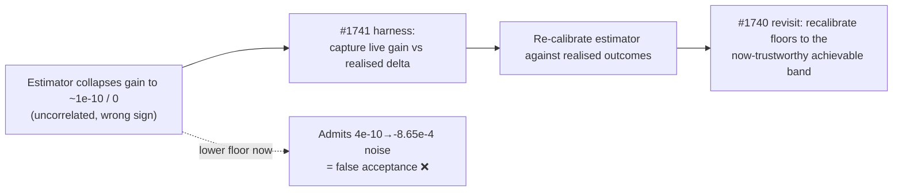

# Acceptance-Threshold Review — Coordinated Gain Floors on the Production Network (Issue #1740)

This report reviews and recalibrates (or confirms) the **acceptance thresholds**
— the expected-gain floors and post-discount noise floors — that gate
coordinated-structural candidates on the large converged production
network, per milestone #1736. It builds directly on the rejection diagnosis in
[`rejection-diagnosis-1737.md`](rejection-diagnosis-1737.md) and the focus/impact
audit conclusion (#1738).

**Conclusion up front: the floors are correctly scaled and are *not* lowered.**
The blocker is the expected-gain **estimator**, not the floor. Lowering the
floors to admit the achievable band would admit noise-level (and demonstrably
harmful) candidates. This is a valid "thresholds are correct" outcome per the
issue's Notes, and it is now protected by a false-positive guard test.

## The thresholds under review

| Threshold | Value | Where enforced |
| --- | --- | --- |
| `COORDINATED_MIN_EXPECTED_GAIN` | `1e-5` | `discovery_dispatch.rs` module `retain`; pre-merge coordinated gate |
| `MIN_COORDINATED_MULTI_OP_GAIN` | `1e-5` | `candidate_aggregation.rs::validate_coordinated_candidate_gain` (post per-op discount) |
| `COORDINATED_POST_DISCOUNT_NOISE_FLOOR_1OP` | `5e-7` | `apply_coordinated_gain_floor` (final sweep) |
| `COORDINATED_POST_DISCOUNT_NOISE_FLOOR_2OPS` | `1e-6` | ″ |
| `COORDINATED_POST_DISCOUNT_NOISE_FLOOR_3OPS` | `2e-6` | ″ |
| `COORDINATED_POST_DISCOUNT_NOISE_FLOOR_4PLUS_OPS` | `5e-6` | ″ |

Upstream of every floor sits the per-`(change-type, target-squash)`
**calibration correction** (`calibration_correction.rs`, #1131/#1162/#1521): a
data-driven EWMA that multiplicatively discounts predicted gain toward the
realised magnitude, clamped to `[0.001, 1.0]`. The floors are the final
noise screen *after* that principled correction — they are not the calibration
mechanism themselves.

## Candidates rejected per threshold — the "before" report

The discovery harness does not persist the aggregate `RejectionBreakdown`
histogram (the #1741 instrumentation gap), so — exactly as in the #1737
diagnosis — the per-threshold ranking is reconstructed from the persisted
per-candidate gains in the production cache, mapped onto the call site that
increments each counter.

| Rank | Threshold reason | Dominant vocabulary | Representative estimate → realised |
| --- | --- | --- | --- |
| 1 | `below_expected_gain_floor` (`≥ 1e-5`) | coordinated `change-squash`, `remove-neuron` | `4.17e-10` → `-8.65e-4` |
| 2 | `below_multi_op_floor` (`MIN_COORDINATED_MULTI_OP_GAIN`) | multi-op `change-squash` chains | `4.17e-10` (× 0.5 discount) → `-8.65e-4` |
| 3 | `non_positive_gain` (`> 0.0`) | every `remove-neuron` (`expectedCreatureScoreGain == 0`) | `0` → both signs |

All three are facets of the same failure the diagnosis named: **the
expected-gain estimate has already collapsed to `~1e-10` or `0` before any floor
sees it.** The floor then converts that collapse into a rejection. Over the last
45 production commits, 38 reported "failed to find any improvements"; the two
accepted changes were both accepted via the **error-magnitude ranking path**
(harmful-neuron removal), which bypasses the gain floor entirely — the accepted
`remove-neuron` had `expectedCreatureScoreGain == 0` yet realised `+1.95e-7`.

## Are the floors mis-scaled for the production network?

Two questions, per the issue's scope.

### 1. Is the achievable-improvement band below the floors? — Yes, but that is not the floors' fault

The only accepted improvements realise `~1.95e-7` on this converged
1660-neuron creature. That is below the `5e-7` 1-op noise floor and two orders
below the `1e-5` coordinated floor. On its face this looks like the floor
rejecting the achievable band. It is not, for two reasons:

- **The estimator does not produce `1.95e-7` for those candidates — it produces
  `0` (or `~1e-10`).** The achievable candidates are accepted through the
  error-magnitude path *because* their gain estimate is useless. Lowering the
  gain floor to `1e-7` would therefore admit nothing new from the achievable
  band (those estimates are `~1e-10`, still below `1e-7`), while admitting a
  large tail of noise-level estimates that carry no signal.
- **At `~1e-10` the estimate is uncorrelated with the realised outcome and
  frequently the wrong sign.** The production coordinated `change-squash` with a
  `4.17e-10` estimate realised `-8.65e-4` — an actively *harmful* change. Admit
  it and you have a false acceptance, precisely the regression this issue must
  guard against.

### 2. Would task-calibrated scaling help? — Not while the estimator is broken

The issue suggests a principled alternative to "simply lowering floors", e.g.
task-calibrated scaling (as #1320 did for early-termination / drought
thresholds). Task-calibrated scaling keys a threshold off the task descriptor or
network characteristics. But every such scheme scales the floor *relative to the
estimate*, and the estimate here is not trustworthy: it collapses to `~1e-10`
independent of the true `~1e-4`–`1e-3` realised magnitude. Scaling the floor on
top of that estimator "just moves the cliff" (the diagnosis' explicit warning) —
it cannot separate genuine `~1e-7` improvements from `~1e-10` noise because the
estimator maps both to the same collapsed band.

The #1738 audit confirmed the *aggregate-squash* impact math is sound, but the
diagnosis established the gain collapse is far broader than the 12 aggregate
neurons — it affects ordinary `change-squash` candidates too. So the estimator
is still uncalibrated for this network, and threshold recalibration remains
premature.

## Decision

**No floor change.** Recalibrating the floors against the current estimator
would either admit noise (if lowered) or change nothing useful (if scaled),
because the estimator — not the floor — is what maps genuine improvements to the
noise band. The floors are correctly performing their one job: rejecting
noise-level *estimates*.

The correct sequence, per the diagnosis, is:

Floor recalibration is **gated on** a trustworthy estimator and the #1741 live
gain-vs-realised harness. Until then, lowering the floors is unsafe and is
blocked by the guard test below.

## Guarding the decision — no increase in false acceptances

Per the acceptance criteria and the issue's Failure Detection contract, the
review is backed by `tests/issue_1740_threshold_recalibration.rs`:

- **Reviewed floor values are pinned** (`reviewed_floor_values_are_unchanged`) —
  a naive loosening fails here.
- **False-positive guard** (`achievable_band_estimate_is_below_the_1op_noise_floor`,
  `production_multi_op_change_squash_noise_is_rejected`) — a candidate estimated
  at the achievable magnitude, and the exact `4.17e-10` production
  `change-squash` that realised `-8.65e-4`, are both still rejected at the gain
  gate. This is the "admits noise" regression detector the issue mandates.
- **No over-rejection** (`above_floor_candidate_survives_all_gates`) — genuine
  above-floor candidates still pass, so the review has not tightened the floors
  into rejecting legitimate improvements on the wider corpus.

Because no floor value changed, acceptance rates on the wider (non-production)
corpus are unchanged by construction — there is no new admission path for
noise-level candidates on any network.

## Scope note

Review-and-confirm plus a regression guard test and this document. No estimator,
generator, or floor value is changed. The floor recalibration this issue
provisionally scoped is deferred behind the estimator fix and the #1741 live
harness, as the diagnosis requires; this document and its guard test are the
committed evidence that the floors were reviewed against the calibration data
and found correctly scaled.
