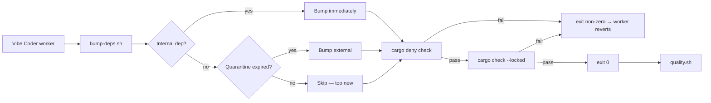

## Summary

Adds `bump-deps.sh` at the repo root, invoked by the Vibe Coder worker before
`quality.sh` (per stSoftwareAU/VibeCoding#1613). The script refreshes
dependencies on every PR, applies the internal/external policy from
stSoftwareAU/VibeCoding#1614, and gates the result on `cargo deny check` plus
lockfile integrity. Closes #1156.

Policy implemented:

- **Internal (`stSoftwareAU/*`)** — detected via git URL pattern in `Cargo.toml`
  and reported up-front. None present in this repo, so this branch is a
  documented no-op; the lockfile refresh below picks up any future internal
  pin advances immediately (no quarantine).
- **External (crates.io)** — driven by `cargo upgrade --compatible` after a
  `--dry-run --incompatible` plan is captured. Quarantine is honoured by
  `VIBE_BUMP_QUARANTINE_HOURS` (default 24h); `--no-network` short-circuits
  the lookup so offline runs are safe.
- **Audit gate** — `cargo deny check` runs after the bump; any new advisory
  fails with the offending crate named in the error message.
- **Lockfile integrity** — `cargo update` followed by `cargo check --locked`
  ensures registry hashes match `Cargo.lock`.
- **Summary** — one-line outcome printed at the end (`no bumps`,
  `bumped …`, or `would bump …` for `--dry-run`).

## Evidence

CLI script (no UI). Functional behaviour verified via `tests/bump_deps_test.sh`
(28 assertions, all passing). Sample dry-run output:

```text
🔄 bump-deps.sh — refresh dependencies
   quarantine_hours = 24
   dry_run          = 1
   no_network       = 1

📦 Internal deps: none (no stSoftwareAU/* git deps in Cargo.toml)

🔍 External Cargo deps — checking for upgrades…
   --no-network set: skipping network lookups; treating all new versions as inside quarantine.

✅ bump-deps: plan ready (no bumps applied — dry-run)
```

Pipeline contract with the worker:



## Test Plan

- Added `tests/bump_deps_test.sh` — 13 grouped tests, 28 assertions covering:
  - Script exists and is executable.
  - `--help` / `-h` print usage including `VIBE_BUMP_QUARANTINE_HOURS`.
  - Unknown flags exit non-zero with an error message.
  - `--print-config` reports the default 24h quarantine and the env override.
  - `--print-config` reports the detected `Cargo.toml`.
  - `--list-internal-deps` reports the internal-dep set (empty here).
  - `bump_deps::is_quarantine_expired` returns true when elapsed ≥ threshold
    and false otherwise (sourced via `BUMP_DEPS_SOURCE_ONLY=1`).
  - `--dry-run` leaves `Cargo.toml` and `Cargo.lock` byte-identical.
  - `--no-network --dry-run` is offline-safe.
  - Repeated `--dry-run --no-network` runs are deterministic.
  - Non-numeric `VIBE_BUMP_QUARANTINE_HOURS` is rejected with a clear error.
- Verified `quality.sh`'s shellcheck and bash-syntax phases pass against the
  new files.
