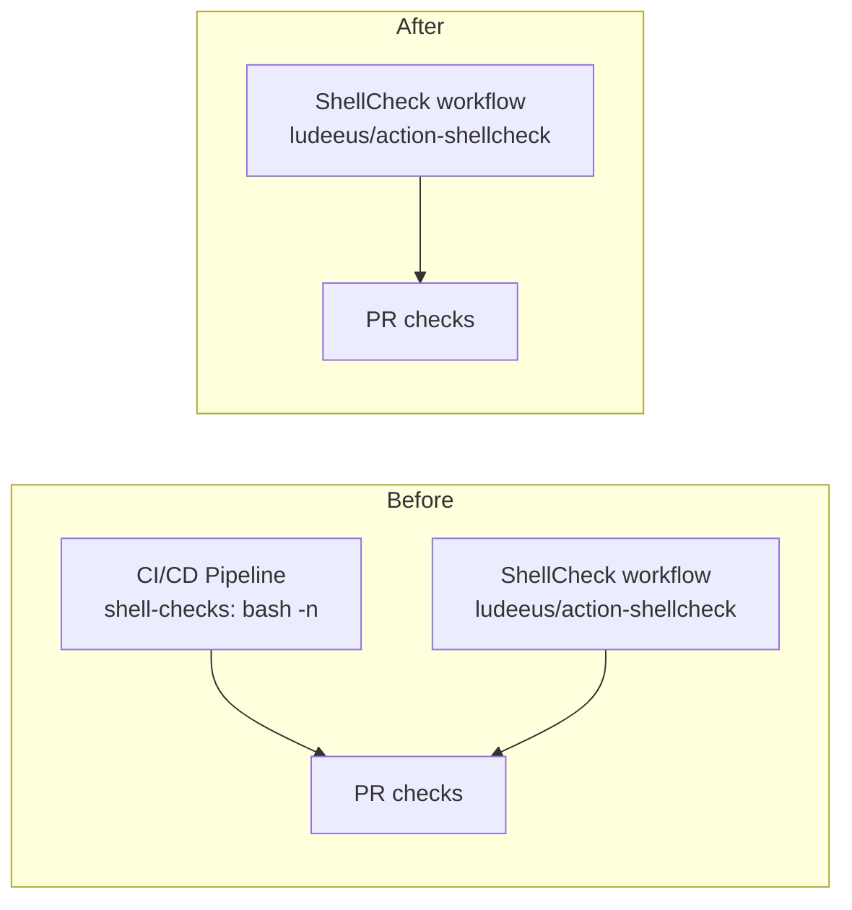

## Summary

The PR checks tab showed two effectively-duplicate shell-script jobs running on every PR:

1. `CI/CD Pipeline / Shell Script Quality` (the `shell-checks` job in `.github/workflows/ci.yml`) — ran `bash -n` over every `*.sh` file (syntax check only).
2. `ShellCheck / shellcheck` (`.github/workflows/shellcheck.yml`) — ran the full `ludeeus/action-shellcheck` linter, which is a strict superset of `bash -n`.

Anything `bash -n` would catch, ShellCheck also catches (and more). The `shell-checks` job was therefore redundant. Removed it from `ci.yml` and updated the CI pipeline reference in `AGENTS.md`. Kept the dedicated ShellCheck workflow as the single source of shell-script linting in CI.

Closes #1158.

## Evidence

Screenshot from the issue showing both checks running side-by-side on a PR (`Shell Script Quality` and `ShellCheck / shellcheck`):


Workflow file change (CLI):

```diff
-  shell-checks:
-    name: Shell Script Quality
-    runs-on: ubuntu-latest
-    if: github.event_name == 'pull_request'
-    needs: [version-increment]
-    steps:
-    - name: Checkout code ...
-    - name: Check bash script syntax
-      run: |
-        ... bash -n "$script" ...
+  # Shell script linting is handled by .github/workflows/shellcheck.yml
+  # (ludeeus/action-shellcheck), which is a strict superset of `bash -n`
+  # syntax checking. The previous `shell-checks` job duplicated that work
+  # and was removed in #1158.
```

After this PR, the PR checks tab will show a single shell-script check (`ShellCheck / shellcheck`) instead of two.



Validation performed:

- `python3 -c 'import yaml; yaml.safe_load(open(...))'` — confirms `ci.yml` still parses cleanly after removing the job.
- Verified no other CI job lists `shell-checks` in its `needs:` block (`grep -n shell-checks .github/`), so removing it cannot break job ordering.
- `quality.sh` continues to run `bash -n` and `shellcheck` locally for developers, so local pre-commit coverage is unchanged.

This is a CI-only configuration change — no Rust source was modified, so there is nothing for `cargo test` to exercise. The CI itself is the runtime test: when this PR runs, only the `ShellCheck / shellcheck` job should appear under shell-related checks.

## Test Plan

- [x] `ci.yml` parses as valid YAML after the change.
- [x] No other workflow job depends on `shell-checks` (verified via `grep`).
- [x] `shellcheck.yml` remains in place and still configures `ludeeus/action-shellcheck@master`.
- [x] `AGENTS.md` CI pipeline list updated to reflect the consolidated shell-script check.
- [ ] On the resulting PR, confirm the checks tab shows `ShellCheck / shellcheck` exactly once and no `Shell Script Quality` entry.
