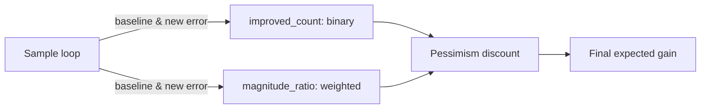

# Magnitude-weighted improvement metric for candidate scoring

## Summary

Adds a magnitude-weighted improvement signal to the synapse/neuron candidate
scoring pipeline so that 76% of samples improving by noise-level amounts no
longer score like 76% of samples improving meaningfully. Closes #1161.

The change extends the three core improvement functions
(`compute_relu_improvement_*`, `compute_activation_improvement_*`,
`compute_synapse_improvement_*`) to also return

```text
magnitude_ratio = sum(|baseline_error| - |new_error|) over improved samples
                / sum(|baseline_error|) over all samples
```

The ratio is plumbed through to `apply_neuron_pessimism_discount` and
`apply_synapse_pessimism_discount` via a new internal
`improvement_magnitude_ratio: Option<f32>` field on `CandidateNeuronJson`
and `CandidateSynapseJson` (`#[serde(skip)]`, so the FFI/JSON wire schema is
unchanged).

The discount functions combine the binary improved-ratio with the magnitude
ratio via geometric mean, and additionally scale the legacy pessimism floor
by the magnitude ratio so noise-level candidates can be discounted below
the legacy floor. `None` magnitude preserves the legacy behaviour exactly.

## Why

Issue #1160 documented add-neuron candidates with
`improvedCount = 324–325 / 426` (76%) and
`expectedCreatureErrorReduction ≈ 3 × 10⁻³`, while the actual error
reduction was ≈ −10⁻⁶ (3000× off). The root cause was that the pessimism
discount only saw whether a sample improved, not by how much. A population of
tiny noise-level reductions therefore scored almost identically to a
population of substantial reductions.

## Evidence

This is a backend/scoring-pipeline change with no UI surface. Behaviour is
verified with five new unit tests in
`src/analysis/synapse/scoring/tests.rs`:

- `test_magnitude_ratio_noise_level_improvements_collapse_neuron_gain`
  — reproduces the issue #1160 failure pattern (76% binary, ≈ 0% magnitude)
  and asserts the discounted gain is below 1% of the input gain for both the
  neuron and synapse pessimism discount paths.
- `test_magnitude_ratio_substantial_improvements_preserve_gain` — every
  sample improves by 50% of its baseline; combined discount must retain
  > 50% of the legacy binary-only discount.
- `test_magnitude_ratio_mixed_improvements_intermediate_discount` — half
  substantial / half noise; combined discount must fall between the
  noise-only and substantial-only discounts.
- `test_magnitude_ratio_none_falls_back_to_binary_only` — `None` magnitude
  matches the legacy 3-arg formula bit-for-bit.
- `test_magnitude_ratio_invalid_inputs_remain_finite` — negative and NaN
  magnitudes never produce non-finite discounts.



## Test Plan

- New unit tests in `src/analysis/synapse/scoring/tests.rs` (listed above).
- All 876 existing library tests still pass (`cargo test --lib --all-features`).
- Wire schema unchanged — existing FFI/JSON consumers see no new fields
  (`improvement_magnitude_ratio` is `#[serde(skip)]`).
