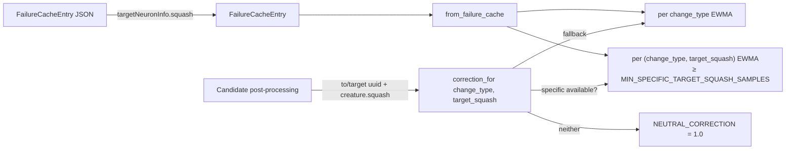

## Summary

Extends the calibration-correction pipeline (Issue #1131) to track failures
per `(change_type, target_squash)` in addition to the existing per
`change_type` layer. When the failure-cache JSON includes
`targetNeuronInfo.squash`, the pipeline now learns activation-specific
corrections — e.g. `add-neurons` against `SELU` targets gets a much smaller
multiplier than the generic `add-neurons` group, matching the production discovery-cache
evidence where every recent failure clustered on a single SELU target.

Closes #1162.

## Evidence

This is a backend / scoring change with no UI surface. Coverage is via
`cargo test`:

- `cargo test --lib calibration_correction` — 16 unit tests pass, including
  the seven new tests for the per-(change_type, target_squash) layer.
- `cargo test --test analysis issue_1162` — 6 integration tests pass.
- `./quality.sh` — full quality gate (fmt, clippy, deny, doc, release
  build, all unit + integration tests) passes cleanly.

## Changes

- `src/analysis/scoring/calibration_correction.rs`
  - `FailureCacheEntry` gains `target_squash: Option<String>`. JSON parsing
    accepts the upstream `targetNeuronInfo.squash` shape via a private
    `FailureCacheEntryRaw` helper, with a top-level `targetSquash` fallback.
    Legacy entries without target metadata still parse — backward
    compatible at the FFI boundary.
  - `CalibrationCorrection` now carries two layers: the existing
    per-`change_type` map plus a per-(`change_type`, `target_squash`) map
    that is only populated for groups with at least
    `MIN_SPECIFIC_TARGET_SQUASH_SAMPLES` (= 3) usable entries.
  - New `correction_for(change_type, target_squash) -> f32` returns the
    specific value when available, otherwise the per-`change_type`
    fallback, otherwise `NEUTRAL_CORRECTION` (= 1.0).
  - `specific_as_map()` exposes the new layer for diagnostic tests; the
    public FFI metadata still emits the per-`change_type` map only.
- `src/analysis/neuron/post_processing.rs` and
  `src/analysis/synapse/post_processing.rs` build a `uuid -> squash` map
  from the input creature and call `correction_for(...)` — replacing every
  `get_correction(change_type)` call site for `add-neurons`,
  `add-synapses`, and `coordinated-structural`.

## Test Plan

New unit tests (`src/analysis/scoring/calibration_correction.rs`):

- `only_change_type_data_is_used_as_fallback` — no specific data → lookups
  match the per-`change_type` EWMA.
- `specific_data_is_preferred_when_threshold_is_met` — SELU-specific group
  with ≥ threshold entries returns its own EWMA, smaller than the fallback.
- `insufficient_specific_samples_fall_back_to_change_type` — below the
  threshold the specific bucket is dropped; lookup falls back.
- `nan_and_zero_divisor_specific_entries_are_skipped` — non-finite ratios
  do not count toward the sample threshold.
- `target_squash_parsed_from_target_neuron_info` — JSON round-trip from
  `targetNeuronInfo.squash` populates `target_squash`.
- `target_squash_optional_for_legacy_entries` — entries without target
  metadata still parse as `None`.
- `correction_for_returns_neutral_when_nothing_known` — empty cache
  lookups return 1.0.

New integration tests
(`tests/analysis/issue_1162_calibration_per_target_squash.rs`):

- `change_type_only_data_falls_back_for_any_squash`
- `specific_correction_is_distinct_from_change_type_fallback`
- `below_threshold_specific_entries_are_ignored`
- `nan_and_zero_divisor_specific_entries_skipped`
- `json_target_neuron_info_round_trip`
- `empty_cache_lookup_returns_neutral`

Existing `issue_1131_calibration_correction.rs` tests still pass — the
struct-literal call sites were updated with `target_squash: None` to keep
the previous behaviour exactly.
