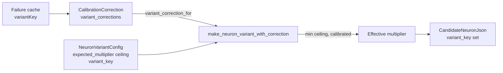

## Summary

Per-variant calibration for `variant_generation` `expected_multiplier`. Failure-cache entries now carry an optional `variantKey`; the calibrator groups by `(change_type, variant_key)` and `make_neuron_variant` / `make_synapse_variant` apply `min(static_multiplier, calibrated_correction)` so a variant whose recent history shows persistent over-estimation is automatically demoted, while the static multiplier remains a ceiling. Closes #1163.

## What Changed

- `FailureCacheEntry` gains `variant_key: Option<String>` (top-level `variantKey` or nested `variantInfo.key`; missing field tolerated for backward compatibility).
- `CalibrationCorrection` gains `variant_corrections: HashMap<(String, String), f32>` and a `variant_correction_for(change_type, variant_key) -> f32` lookup. Specific corrections are only retained once `MIN_SPECIFIC_VARIANT_KEY_SAMPLES` (= 3) usable entries exist for the bucket; otherwise the lookup returns `NEUTRAL_CORRECTION` so the static multiplier wins.
- `NeuronVariantConfig` and `SynapseVariantConfig` gain `variant_key: &'static str`. Each static config (`CONSERVATIVE`, `GENTLE_NUDGE`, `MICRO_NUDGE`, `FEATHER_TOUCH`, `WHISPER`) is now identified by a stable machine-readable key — the canonical identifier the calibrator groups by; the comment string is human-readable only.
- `CandidateNeuronJson` and `CandidateSynapseJson` gain `variant_key: Option<String>` (skipped from the wire schema when absent — additive, no `wireSchemaVersion` bump).
- `make_neuron_variant_with_correction` / `make_synapse_variant_with_correction`: new entry points that consult the calibration. The original two-arg `make_*_variant` functions delegate to them with `None` for backward compatibility but still populate `variant_key`.
- `pair_extreme_candidates_with_conservative_variants_calibrated` / `pair_synapse_candidates_with_weight_variants_calibrated`: calibrated pair functions used by `neuron::post_processing` and `synapse::post_processing`.

## Evidence

CLI / library change — no UI to screenshot. The new behaviour is exercised by 8 lib tests in `analysis::utils::variant_generation::calibrated_variant_tests` and 6 lib tests in `analysis::scoring::calibration_correction::tests` covering the three acceptance regimes plus parsing and isolation between variant buckets. `./quality.sh` passes cleanly.

## Test Plan

New tests (all passing):

- `analysis::utils::variant_generation::calibrated_variant_tests::neuron_variant_uses_static_multiplier_when_history_insufficient` — fewer than 3 entries → static `expected_multiplier` used.
- `analysis::utils::variant_generation::calibrated_variant_tests::neuron_variant_uses_calibrated_multiplier_when_history_indicates_failure` — long failure history drives the multiplier toward the floor.
- `analysis::utils::variant_generation::calibrated_variant_tests::neuron_variant_static_multiplier_acts_as_ceiling_for_long_success_history` — long success history clamps to neutral so static value remains a ceiling.
- Mirror tests for synapse variants (`synapse_variant_uses_*`).
- `synapse_variant_populates_key_without_calibration` / `neuron_variant_populates_key_without_calibration` — `variant_key` is set even when no calibration is supplied.
- `analysis::scoring::calibration_correction::tests::variant_key_parsed_from_top_level_field` / `..._nested_variant_info` / `..._optional_for_legacy_entries` — JSON wire-format parsing.
- `analysis::scoring::calibration_correction::tests::insufficient_variant_history_falls_back_to_neutral` / `long_variant_failure_history_drives_calibrated_value` / `long_variant_success_history_clamps_at_neutral` / `variant_key_buckets_are_independent` — calibration regimes.

Existing tests still pass (`./quality.sh`).
