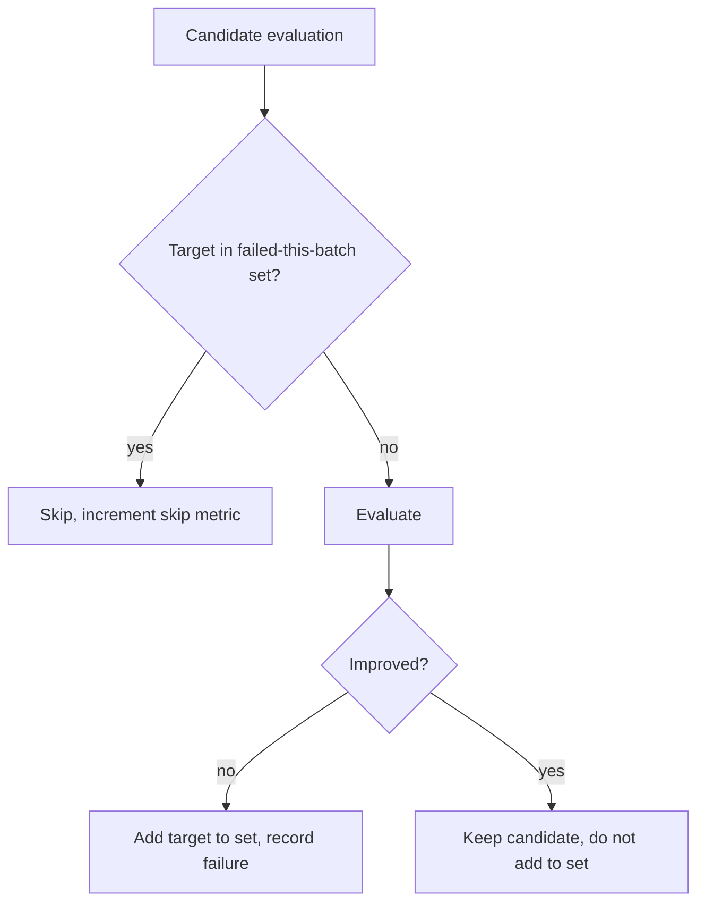

## Summary

Within-batch target-failure short-circuit during candidate evaluation.
Closes #1164.

A new `WithinBatchFailureTracker` is created per orchestration call and shared
across the per-target rayon workers. When a candidate targeting neuron T fails
post-evaluation (the local model concludes no improvement), the tracker
records the failure for T. Subsequent same-target candidates in the same
batch consult the tracker and short-circuit when T's failure count reaches
the configured threshold. Complements the cross-batch cooldown (#1130) by
closing the within-batch gap that allowed several failing candidates per
target to be emitted from one batch.

The threshold is env-var overridable via
`NEAT_AI_DISCOVERY_BATCH_TARGET_FAILURE_LIMIT` (default `1`). Diagnostic
counters are surfaced via a single `tracing::info!` line per phase
(synapse / neuron) so the operator can see budget being saved.

### Scope decisions

- **Helpful (additive) candidates only.** The synapse helpful path and the
  neuron evaluation path consult and update the tracker. The synapse
  **harmful** (synapse-removal) path was deliberately left independent — a
  failed addition for T does not predict that a removal targeting T will
  also fail; they explore different structural moves and tying them together
  broke `issue_927_remove_harmful_synapse` coverage.
- **Cross-batch cooldown unaffected.** The global
  `TargetFailureTracker` (Issue #1130) keeps its existing semantics; the
  new within-batch tracker is per-call and discarded at the end of each
  orchestration call.

## Evidence

Backend / CLI change — no UI to screenshot. Verified via:

- New unit tests (`src/analysis/within_batch_failures.rs::tests`) covering
  default threshold, first-failure short-circuit, success path, threshold
  > 1 path, skip-count accumulation, unrelated-target isolation, and the
  zero-threshold clamp.
- New integration tests in
  `tests/issue_1164_within_batch_failures.rs` covering the production
  scenario from the issue (3 same-target add-neuron candidates → 1
  evaluated, 2 short-circuited).
- Existing per-target cooldown coverage (`issue_1130_target_cooldown`) still
  passes; cross-batch behaviour is unchanged.
- Full library + integration suite passes (890 lib tests, 579 analysis
  integration tests, all other suites green) — see PR CI.

### Behaviour change recorded in tests

`tests/analysis/issue_221_sample_locality.rs` — three locality-batching
tests submit 100 sources for a single target and expected at least one
candidate. With the default within-batch limit of 1, an early-failing
source short-circuits the rest. These tests are not exercising the
short-circuit, so they now wrap their `analyze_synapses` call in a
`WithinBatchLimitGuard` (sets the env var to a high number,
`#[serial]`-protected, restored on drop). No assertions removed.

## Test Plan

- `cargo test --lib within_batch_failures` — new unit tests pass.
- `cargo test --test issue_1164_within_batch_failures` — 7 acceptance
  tests pass.
- `cargo test --test issue_1130_target_cooldown` — cross-batch cooldown
  unaffected.
- `cargo test --test analysis -- --test-threads=2` — all 579 analysis
  integration tests pass (locality tests now use the env-var guard).
- `cargo test --test synapse issue_927_remove_harmful_synapse` —
  remove-harmful-synapse coverage preserved by keeping the harmful path
  independent of the tracker.
- `cargo clippy --all-targets --all-features -- -D warnings` — clean.
- `cargo fmt --all -- --check` — clean.
- `RUSTDOCFLAGS="-D warnings" cargo doc --no-deps` — clean.
