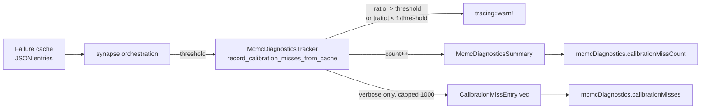

## Summary

Adds structured prediction-vs-actual calibration mismatch logging so the
team can tune the constants in `analysis::constants::candidate_scoring`
from data instead of one-off failure JSON files (Issue #1160's "Gentle
Nudge against SELU" was over-predicting by ~3000×). Closes #1165.

When a failure-cache entry's `actual / expected` ratio falls outside
`[1/threshold, threshold]` (default 10×, overridable via
`NEAT_AI_DISCOVERY_CALIBRATION_MISS_THRESHOLD`), the synapse pipeline:

1. Emits a `tracing::warn!` with the structured tuple
   `(change_type, target_squash, variant_key, expected, actual, ratio)`
   on the existing `neat_ai_discovery::observability` target.
2. Increments `mcmc_diagnostics.calibration_miss_count` (always tracked
   so the rate is visible in non-verbose runs).
3. In verbose mode (`NEAT_AI_DISCOVERY_VERBOSE=1`), appends a
   `CalibrationMissEntry` to a 1000-entry capped vector that is
   surfaced in the analysis JSON output as
   `mcmcDiagnostics.calibrationMisses`.

The hook lives at the synapse orchestration layer (where the MCMC
tracker is already created) so each failure-cache entry is processed
exactly once per analysis run.

## Evidence

CLI/library change — no UI screenshots. Verified by:

- `cargo test --lib mcmc_diagnostics` — 7 new unit tests pass (in
  tolerance, above threshold, below reciprocal, zero/non-finite skipped,
  non-verbose count-only, vec cap at 1000, threshold clamp).
- `cargo test --test analysis issue_1165` — env-var integration test
  passes.
- `./quality.sh` — full gate (`fmt`, `clippy -D warnings`, `cargo
  check`, `cargo test`, doc build, release build) passes.

## Test Plan

- [x] `src/analysis/diagnostics/mcmc_diagnostics.rs::tests::calibration_miss_in_tolerance_records_nothing`
- [x] `…calibration_miss_above_threshold_is_recorded`
- [x] `…calibration_miss_below_reciprocal_threshold_is_recorded`
- [x] `…calibration_miss_skips_zero_or_non_finite_entries`
- [x] `…calibration_miss_non_verbose_mode_skips_vec_but_counts`
- [x] `…calibration_miss_vec_capped_at_max_size`
- [x] `…calibration_miss_threshold_clamps_invalid_inputs`
- [x] `tests/analysis/issue_1165_calibration_miss_logging.rs::calibration_miss_threshold_env_var_overrides_default`

## Acceptance Criteria

- [x] Calibration mismatch logging gated by an env-var threshold and
      emitted via existing `tracing` infrastructure
- [x] Verbose MCMC diagnostics include a bounded
      `Vec<CalibrationMissEntry>` and surface a count
      (`calibrationMissCount` always; `calibrationMisses` verbose only)
- [x] Unit tests cover threshold behaviour, verbose vs non-verbose,
      capping
- [x] No PII / large payloads logged; only the structured tuple
- [x] Documentation in `src/observability/mod.rs` and
      `src/config/mod.rs` describes the new field/env var
