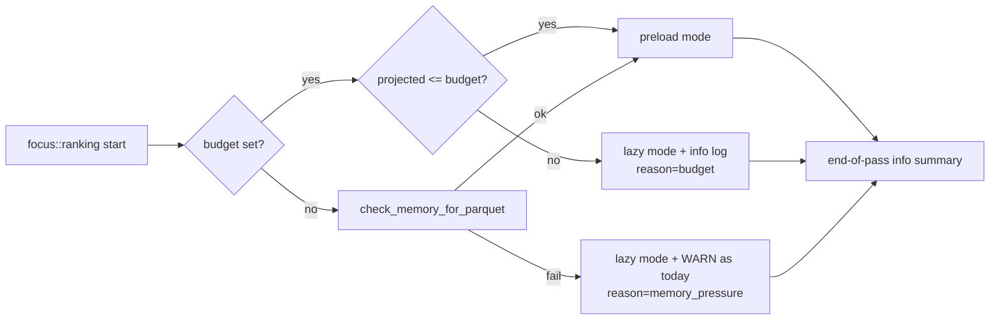

# Configurable focus-ranking memory budget (Issue #1172)

## Summary

`focus::ranking` previously sampled host memory and silently downgraded to
lazy-loading mode under pressure. Callers had no way to predict, configure,
or observe the downgrade — and on low-memory hosts (e.g. GRQ-13's 6 GB) the
eager pre-load itself was a non-trivial driver of the heap pressure that led
to the WARN.

This change adds a deterministic, configurable cap and surfaces the chosen
mode through the existing `RankFocusStats` / `RankFocusNeuronsOutput` so
operators can tune low-memory hosts without scraping log lines.

Closes #1172.

### Behaviour matrix

| `NEAT_AI_DISCOVERY_FOCUS_RANKING_MEMORY_BUDGET_MB` | projected (file × 3) | mode chosen | log line |
|----|----|----|----|
| set, projection ≤ budget | any | `preload` | `info focus::ranking pass complete mode=preload …` |
| set, projection > budget | any | `lazy` (reason `budget`) | `info focus::ranking selected lazy mode … budget_mb=… projected_mb=…` + end-of-pass `info` summary |
| unset, system has memory | any | `preload` | end-of-pass `info` summary |
| unset, system memory check fails | any | `lazy` (reason `memory_pressure`) | existing `WARN` (preserved) + end-of-pass `info` summary |

The unset branch keeps today's `check_memory_for_parquet` heuristic and the
existing `WARN` so behaviour on big hosts is unchanged.

### Decision flow



### What's new

- `NEAT_AI_DISCOVERY_FOCUS_RANKING_MEMORY_BUDGET_MB` env var
  (`u64` MB, `0`/empty/non-numeric values treated as unset) — documented in
  `src/config/mod.rs`, AGENTS.md, and README.md.
- `crate::focus::FocusLoadingMode` and `crate::focus::FocusLazyReason` enums.
- `RankFocusStats` gains `loading_mode`, `lazy_reason`, `budget_mb`,
  `projected_mb` fields; `RankFocusNeuronsOutput` mirrors them as
  `loadingMode`, `lazyReason`, `budgetMb`, `projectedMb` JSON fields so
  GRQ can include them in run summaries.
- `crate::focus::decide_loading_mode_for_budget(projected_bytes, budget_mb)`
  pure helper exposed for unit testing the budget logic without needing a
  parquet file large enough to exceed the 3× decompression multiplier.
- Structured `info` end-of-pass summary on every focus-ranking run:
  - preload: `mode=preload entries=N elapsed_ms=…`
  - lazy:    `mode=lazy reason=… budget_mb=… projected_mb=… entries=N elapsed_ms=…`

## Evidence

CLI/library change — no UI to screenshot. The behaviour is verified by the
new unit + integration tests in
`tests/focus/issue_1172_focus_ranking_memory_budget.rs`.

```text
$ cargo test --test focus issue_1172 -- --test-threads=2 < /dev/null
running 7 tests
test issue_1172_focus_ranking_memory_budget::generous_budget_selects_preload ... ok
test issue_1172_focus_ranking_memory_budget::invalid_budget_value_is_ignored ... ok
test issue_1172_focus_ranking_memory_budget::projection_equal_to_budget_keeps_preload ... ok
test issue_1172_focus_ranking_memory_budget::tiny_budget_forces_lazy_mode ... ok
test issue_1172_focus_ranking_memory_budget::generous_budget_end_to_end_selects_preload_mode ... ok
test issue_1172_focus_ranking_memory_budget::unset_budget_falls_back_to_auto_detect ... ok
test issue_1172_focus_ranking_memory_budget::zero_budget_is_treated_as_unset ... ok
test result: ok. 7 passed; 0 failed; 0 ignored; 0 measured; 119 filtered out
```

`./quality.sh` passes end-to-end (deny check, fmt, clippy with
`-D warnings`, `cargo check`, full unit/integration test suite, doc build,
and the release library build).

## Test Plan

New tests in `tests/focus/issue_1172_focus_ranking_memory_budget.rs`:

- `tiny_budget_forces_lazy_mode` — AC: forces a tiny budget and asserts
  lazy mode is chosen via the pure helper (avoids a flaky 1 MB+ parquet
  fixture).
- `generous_budget_selects_preload` — AC: generous budget asserts pre-load
  mode is chosen.
- `projection_equal_to_budget_keeps_preload` — equal projections do not
  trigger the fallback (strict `>` semantics).
- `generous_budget_end_to_end_selects_preload_mode` — verifies
  `RankFocusStats.loading_mode`/`lazy_reason`/`budget_mb` are populated
  end-to-end through `rank_focus_neurons`.
- `unset_budget_falls_back_to_auto_detect` — confirms the prior
  auto-detect heuristic is preserved when no budget is set, and asserts the
  mode/reason pair is internally consistent.
- `invalid_budget_value_is_ignored` — non-numeric values are treated as
  unset (no panic, no abort).
- `zero_budget_is_treated_as_unset` — `=0` does not silently disable
  pre-load entirely.

Updated test:

- `tests/analysis/issue_337_candidate_type_contract.rs::rank_focus_neurons_output_contains_removal_candidate_fields`
  — extended literal to include the four new `RankFocusNeuronsOutput`
  fields. The existing assertions on `removalCandidates` /
  `constantNeuronRemovals` are preserved.
