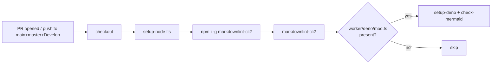

## Summary

Adds the **Markdown Lint** GitHub Actions workflow plus a permissive
`.markdownlint-cli2.jsonc` config so the gate passes against the
existing docs without forcing a sweeping prose-cleanup PR. Closes #1177.

The workflow runs `markdownlint-cli2` on every pull request and on
pushes to `main`, `master`, and `Develop`. Action versions are pinned
to commit SHAs (per supply-chain guidance), and an optional
`check-mermaid` step is gated on the presence of `worker/deno/mod.ts`
so the same workflow can be reused unchanged on repos that ship the
Vibe Coder Deno worker (Issue #1683); on this repo it skips.

## Changes

- `.github/workflows/markdown-lint.yml` — new workflow.
- `.markdownlint-cli2.jsonc` — repo config: globs, ignores, and the
  rule subset described in the file's header comment.
- `docs/DISCOVERY_TYPES.md` — fix MD004 false positive where prose
  continuation began with `+`; rewrote as a single sentence.



## Evidence

Local run of `markdownlint-cli2` against the new config:

```text
markdownlint-cli2 v0.22.1 (markdownlint v0.40.0)
Finding: **/*.md !target/** !node_modules/** !**/CHANGELOG.md
         !docs/pr-summary-*.md !docs/archive/**
Linting: 57 file(s)
Summary: 0 error(s)
```

`./quality.sh` passes cleanly (fmt, clippy, check, all tests, doc
build, release build).

This is a CI-config change with no UI surface; no Playwright
screenshot applies.

## Test Plan

- [x] `markdownlint-cli2` runs locally with zero errors against the
      committed config.
- [x] `python3 -c "import yaml; yaml.safe_load(...)"` confirms the
      workflow YAML parses.
- [x] `./quality.sh` passes (Rust source untouched aside from one
      doc-only edit in `docs/DISCOVERY_TYPES.md`).
- [x] Workflow reuses the same template across repos: the
      `Detect Deno worker module` step gates the optional
      `check-mermaid` job, so this repo (no `worker/deno/mod.ts`)
      skips it cleanly.
