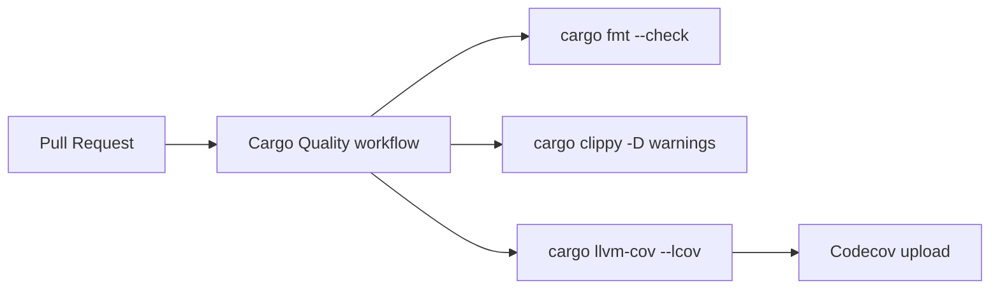

# PR Summary — Issue #1180: Add Cargo Format and Clippy workflow

## Summary

Adds a dedicated GitHub Actions workflow at `.github/workflows/cargo-quality.yml`
that runs `cargo fmt --check`, `cargo clippy -- -D warnings`, and uploads
test coverage to Codecov via `cargo-llvm-cov`. Although the existing
`ci.yml` quality job already runs fmt and clippy, this standalone
workflow provides a focused, fast PR signal expected by the Vibe Coder
workflow sync and adds Codecov coverage upload (Issue #1636).

Closes #1180.

## Evidence

This is a CI configuration change with no UI surface. The new workflow
runs only on GitHub-hosted runners during PR builds. Local verification:

- `bash tests/test_cargo_quality_workflow.sh` → `Results: 10 passed, 0 failed`
- `shellcheck -s bash tests/test_cargo_quality_workflow.sh` → clean
- `bash -n tests/test_cargo_quality_workflow.sh` → clean

## Test Plan

- Added `tests/test_cargo_quality_workflow.sh` — asserts the new workflow
  file exists and contains the required triggers, action references,
  toolchain components, and Codecov upload step.
- Test follows the same pattern used by
  `tests/test_security_workflow_validation.sh` (Issue #1122) for
  validating workflow YAML completeness.
- Test fails (red) when the workflow file is missing or any required
  step is removed; passes (green) once the workflow is in place.
