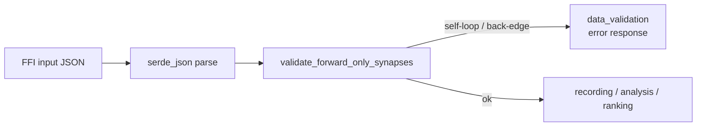

## Summary

Adds a defence-in-depth gate at the FFI boundary that rejects creatures
carrying recurrent synapses (self-loops or back-edges) before they enter
the discovery pipeline. Mirrors the production corruption sweep tracked in
`stSoftwareAU/NEAT-AI#2511`, where 28 `output-0 -> output-0` self-loops
survived the upstream NEAT-AI `loadFrom` strip (which was warn-and-continue)
and would otherwise have entered analysis silently. Closes #1184.

The discovery library does **not** mutate the synapse list of incoming
creatures — confirmed by audit of all `synapses.push/insert/retain/remove`
sites: every mutation is in tests, benches, or local fixture builders, never
on the FFI input. So the corruption originates upstream. This change is
defence-in-depth: instead of relying on `target_analysis` silently dropping
back-edges (`neuron.index < target_index`), we fail fast at the FFI
boundary with a structured `data_validation` error so corrupt creatures
cannot taint discovery results and the upstream producer is easier to
diagnose.

## Evidence

Backend/FFI change with no UI to screenshot. Coverage:

- 7 unit tests in `src/ffi_types/forward_only_validation.rs` exercise
  forward-only acceptance, output self-loop rejection, back-edges between
  distinct neurons, dangling-reference tolerance, the `MAX_REPORTED_VIOLATIONS`
  truncation suffix, empty synapse lists, and the
  `DiscoveryErrorKind::DataValidation` classification.
- 6 integration tests in `tests/ffi/issue_1184_recurrent_synapse_rejection.rs`
  drive the validation through every FFI entry point that accepts a
  `CreatureJson` (`record_discovery_internal`, `analyze_parallel_internal`,
  `rank_focus_neurons_internal`) and assert the response carries
  `success: false`, `errorKind: "data_validation"`, `retryable: false`,
  and a message naming the violation.
- Full library + integration suite (`cargo test --lib --tests
  --all-features -- --test-threads=2`): **3,621 passed, 0 failed**, including
  the existing `analyze_parallel_internal_returns_combined_payload` test.

## Test Plan

- `src/ffi_types/forward_only_validation.rs` — added module with
  `validate_forward_only_synapses` and 7 unit tests covering accept,
  self-loop, back-edge, unknown-UUID tolerance, truncation, empty synapses,
  and error-kind classification.
- `tests/ffi/issue_1184_recurrent_synapse_rejection.rs` — new integration
  test file with 6 tests asserting forward-only acceptance, self-loop
  rejection, dangling-reference tolerance, and structured error responses
  from `record_discovery_internal`, `analyze_parallel_internal`, and
  `rank_focus_neurons_internal`.
- `tests/ffi/main.rs` — registers the new test module.
- `src/ffi_types/mod.rs` — declares the new module and re-exports
  `validate_forward_only_synapses` at the crate root.
- `src/ffi_internal/recording.rs`, `src/ffi_internal/analysis.rs` —
  invoke the validation immediately after JSON deserialisation, returning
  a populated error response struct (matching the existing parse-error
  pattern) when the gate rejects the creature.
- `Cargo.toml` — patch version bump `0.74.33 -> 0.74.34` so unattended
  hosts pick up the new compiled library.

The validation is intentionally narrow: it only flags forward-only
violations between **resolvable** endpoints. Synapses pointing at neuron
UUIDs that are not in the creature are left to the existing pipeline's
silent filtering — keeping that behaviour out of scope preserves a number
of existing tests (e.g. `analyze_parallel_internal_returns_combined_payload`)
that omit explicit input neuron entries.
