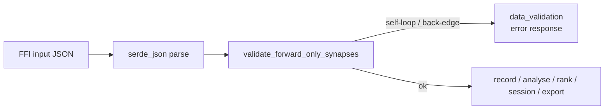

## Summary

Closes #1188.

Audited every public FFI entry point that accepts a `CreatureJson` to confirm
`validate_forward_only_synapses` runs before any business logic touches the
input, then closed the two paths that were previously bypassing the gate:

- `start_discovery_session` (streaming recording session) now validates the
  creature in the FFI handler before delegating to `streaming::start_session`.
  The streaming session retains the creature for the lifetime of subsequent
  append/finish calls, so a back-edge there would have tainted every record
  written through the session.
- `export_visualisation_snapshot_internal` (debug snapshot exporter) now
  validates the creature before walking the topology to compute impacts and
  reconstruction checks.

Added an end-to-end regression test (`tests/ffi/issue_1188_strip_pattern_rejection.rs`)
that replays the three strip patterns observed in
the production corruption log (depth-0 self-loop, depth-1 back-edge, depth-2
cross-layer back-edge) against every validated FFI surface and asserts
`success: false` with `error_kind: "data_validation"`.

Documented the validated FFI surface explicitly in `AGENTS.md` so future
entry points cannot quietly skip the gate.

## Evidence

| FFI entry point | Accepts `CreatureJson` | Validates | Test |
|-----------------|------------------------|-----------|------|
| `record_discovery` | yes | yes (existing) | `record_discovery_rejects_*` |
| `start_discovery_session` | yes | **yes (new)** | `start_discovery_session_rejects_*` |
| `analyze_parallel` | yes | yes (existing) | `analyze_parallel_rejects_*` |
| `rank_focus_neurons` | yes | yes (existing) | `rank_focus_neurons_rejects_*` |
| `export_visualisation_snapshot` | yes | **yes (new)** | `export_visualisation_snapshot_rejects_*` |
| `append_/finish_/cancel_discovery_session`, `merge_discovery_parquet`, `read_discovery_records_ffi`, `get_calibration_summary`, `cleanup_discovery_dir`, `clean_orphaned_discovery_dirs`, `discovery_memory_usage_bytes`, `cleanup_discovery_lib`, `get_library_version`, `check_gpu_available`, `cancel_/reset_/is_*` | no | n/a | not applicable |

`./quality.sh < /dev/null` passes locally:

- 18 new tests in `issue_1188_strip_pattern_rejection` all pass.
- All existing `cargo test --lib --tests --all-features -- --test-threads=2`
  suites pass.
- `cargo clippy --all-targets --all-features -- -D warnings` is clean.
- `RUSTDOCFLAGS="-D warnings" cargo doc --no-deps` is clean (also fixed a
  pre-existing rustdoc warning in
  `src/ffi_types/forward_only_validation.rs` where the public docs linked
  to the private `MAX_REPORTED_VIOLATIONS` constant).
- `cargo build --release --lib` succeeds.

## Test Plan

New tests in `tests/ffi/issue_1188_strip_pattern_rejection.rs`:

- `validator_rejects_depth0_self_loop_pattern` — validator unit-level check
  for the depth-0 corruption (creature `10598e7e`).
- `validator_rejects_depth1_backedge_pattern` — validator unit-level check
  for the depth-1 corruption (creature `bcc06579`).
- `validator_rejects_depth2_backedge_pattern` — validator unit-level check
  for the depth-2 corruption (creature `751f7217`).
- `record_discovery_rejects_depth{0,1,2}*` — three tests asserting the
  recording entry point returns `data_validation`.
- `analyze_parallel_rejects_depth{0,1,2}*` — three tests asserting the
  analysis entry point returns `data_validation`.
- `rank_focus_neurons_rejects_depth{0,1,2}*` — three tests asserting
  the focus-ranking entry point returns `data_validation`.
- `export_visualisation_snapshot_rejects_depth{0,1,2}*` — three tests
  asserting the snapshot exporter returns `data_validation`.
- `start_discovery_session_rejects_depth{0,1,2}*` — three tests
  asserting the streaming session opener returns `data_validation`. These
  exercise the `#[no_mangle]` C symbol via raw `CString` to mirror how
  NEAT-AI calls the dylib.

Modified files:

- `src/ffi/recording.rs` — wire `validate_forward_only_synapses` into
  `start_discovery_session` after JSON parse.
- `src/ffi_internal/utilities.rs` — wire `validate_forward_only_synapses`
  into `export_visualisation_snapshot_internal` after JSON parse.
- `src/ffi_types/forward_only_validation.rs` — fix rustdoc private
  intra-doc link warning so `./quality.sh` passes under
  `RUSTDOCFLAGS="-D warnings"`.
- `AGENTS.md` — document the validated FFI surface explicitly under
  "Forward-only Activation Order".
- `tests/ffi/main.rs` — register the new test module.

## Out of scope (follow-up)

The final acceptance step from the issue description ("rebuild the dylib
against the patched `neat-ai` once stSoftwareAU/NEAT-AI#2514 lands and
re-run the regression suite with the load-side throw enabled") depends on
that upstream PR being merged and released. It is independent of the
audit and regression coverage delivered here, and remains tracked under
NEAT-AI#2514.
