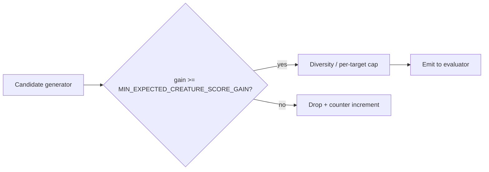

# Issue #1191 — absolute minimum expected-gain floor for candidate emission

## Summary

Adds an absolute floor (`MIN_EXPECTED_CREATURE_SCORE_GAIN = 1e-5`,
overridable via `NEAT_AI_DISCOVERY_MIN_EXPECTED_GAIN`) for the
`expected_creature_score_gain` of emitted add-neuron and add-synapse
candidates. Predictions below the floor are dominated by floating-point
round-off in the downstream evaluator (Issue #1189 captured failure-cache
candidates at 6.6e-7–3.1e-6 that all returned negative `actualErrorReduction`),
so testing them is wasted budget. Drops are recorded against a new
`candidates_below_gain_floor_total` counter under `src/observability/`.
Closes #1191.

## Changes

- `src/analysis/constants/candidate_scoring.rs` — new
  `MIN_EXPECTED_CREATURE_SCORE_GAIN` constant plus
  `min_expected_creature_score_gain()` accessor that reads
  `NEAT_AI_DISCOVERY_MIN_EXPECTED_GAIN`, validates finiteness, and
  clamps to `[0.0, 1e-2]`.
- `src/observability/gain_floor_metrics.rs` — new `GainFloorMetrics`
  struct and `global_gain_floor_metrics()` instance exposing
  `candidates_below_gain_floor_total`.
- `src/analysis/neuron/post_processing.rs` — extracted
  `apply_min_expected_gain_floor_for_neurons()`, applied in
  `build_neuron_results()` before the per-target / per-squash diversity
  filters so noise-level proposals do not consume the cap budget.
- `src/analysis/synapse/post_processing.rs` — extracted
  `apply_min_expected_gain_floor_for_synapses()`, applied to the helpful
  and harmful synapse paths in `apply_post_processing()` (replacing the
  prior `> 0.0` retain). Coordinated-structural results retain their
  existing `> 0.0` filter; the production noise floor for the
  coordinated path is enforced downstream by
  `COORDINATED_POST_DISCOUNT_NOISE_FLOOR`.
- `src/analysis/implementation_tests/gain_floor_tests.rs` — new tests
  covering mixed-gain neuron and synapse pools, empty input, env-var
  override, ceiling clamping, and counter increment.
- `tests/common/mod.rs` — new `GainFloorDisableGuard` RAII helper for
  integration tests whose synthetic fixtures intentionally exercise
  near-zero gains.
- Per-test floor opt-out via the guard or direct env-var manipulation
  applied to a small set of integration tests whose synthetic fixtures
  produce gains below 1e-5 (regression scenarios for impact discounting,
  determinism, async pipeline, target-map optimisation, split-error
  fallback, dynamic constant-source threshold, focus-unused-observations,
  GPU queue deadline, IDENTITY-target sanity check, combo-successful
  filtering, residual / epistatic detection, sample matching, and
  candidate-index population). These tests opt out so the contract under
  test (not the floor itself) remains observable; production behaviour is
  unchanged.

## Evidence

This is a backend / scoring change with no UI surface. Verification:

- New unit tests assert that mixed-gain pools retain only candidates at
  or above the floor and that the counter increments by the expected
  number of drops.
- `./quality.sh` passes cleanly: fmt, clippy (`-D warnings`),
  `cargo deny`, `cargo check`, full test suite (lib + integration), doc
  build, release build.
- The gain-floor tests in `src/analysis/implementation_tests/gain_floor_tests.rs`
  verify the observable behaviour: neuron and synapse helper functions
  drop only sub-floor candidates, env-var overrides are honoured, and
  ceiling clamping is enforced.

## Test Plan

- [x] `cargo test --lib gain_floor` — 10 new tests pass.
- [x] Regression scenario in
  `src/analysis/implementation_tests/gain_floor_tests.rs::neuron_floor_drops_only_below_threshold_candidates`
  reproduces the Issue #1189 noise pattern (gains at 6.6e-7, 6.8e-7,
  3.1e-6) and confirms only at-or-above-floor candidates survive.
- [x] `./quality.sh` passes (fmt, clippy `-D warnings`, deny, full test
  suite, doc build, release build).
