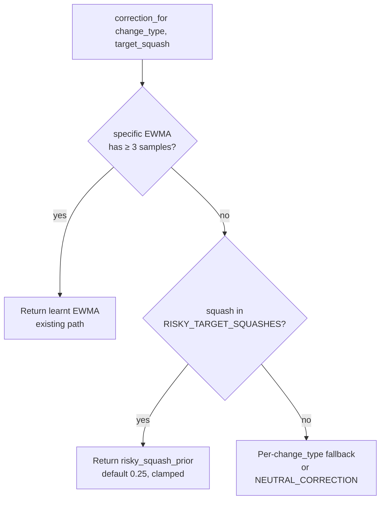

## Summary

Added a conservative cold-start calibration prior for candidates targeting
non-invertible / periodic activations (SINE, COSINE, GAUSSIAN, SQUARE,
ABSOLUTE). Before this change, the per-(`change_type`, `target_squash`)
calibration introduced in Issue #1162 fell back to the global default of `1.0`
until at least three failure-cache entries existed for the bucket — meaning
the *first* three failures against a periodic target could not be demoted in
advance. The prior now discounts those candidates immediately at cold start,
and the learnt EWMA takes over once the warmup threshold is reached.

Closes #1192.

## Evidence

CLI / library change with no UI surface, so the verification artefact is the
new unit-test suite (`src/analysis/scoring/calibration_correction.rs`) and the
clean run of `./quality.sh` (advisories, lint, full test suite, doc build,
release build).

Behaviour for the cold-start path (default prior `0.25`):

| Target squash | Specific samples | Returned correction |
|---------------|------------------|---------------------|
| SINE          | 0                | `0.25` (prior)       |
| SINE          | 2                | `0.25` (prior)       |
| SINE          | 3+               | learnt EWMA          |
| ReLU          | 0                | `1.0` (neutral)      |

## Test Plan

New unit tests in
`src/analysis/scoring/calibration_correction.rs::tests` (all `#[serial]` where
they touch the env var):

- `risky_target_squashes_cover_documented_non_invertibles` — asserts the new
  set lists exactly SINE, COSINE, GAUSSIAN, SQUARE, ABSOLUTE and excludes the
  monotone activations.
- `sine_target_with_zero_samples_receives_conservative_prior` — confirms the
  first acceptance criterion (cold-start prior fires).
- `sine_target_with_enough_samples_uses_learnt_ewma` — confirms the second
  acceptance criterion (≥3 samples → EWMA wins).
- `sine_target_below_threshold_still_uses_prior` — covers the 1–2-sample gap
  where the EWMA is not yet retained.
- `relu_target_with_zero_samples_uses_global_default` — confirms the third
  acceptance criterion (non-risky targets unchanged).
- `every_risky_squash_receives_prior_at_cold_start` — exhaustive coverage of
  all five risky squashes.
- `missing_target_squash_skips_risky_prior` — guards against false positives
  when the target squash is unknown.
- `env_var_overrides_and_clamps_risky_prior` — exercises the
  `NEAT_AI_DISCOVERY_RISKY_SQUASH_PRIOR` override path including clamping at
  both bounds and the unparsable fallback.

All 32 tests in the calibration module pass, and the full `./quality.sh`
gate (advisories, fmt, clippy `-D warnings`, full test suite, rustdoc with
`-D warnings`, release build) is clean.
