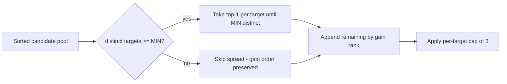

## Summary

Cross-target diversity selection in candidate batch emission. The per-target
cap from Issue #1140 only fires after three slots have already been consumed
by one target, so a single problematic neuron can still monopolise an
add-neuron batch when the top of the gain-sorted list clusters on it. This
change reorders the gain-sorted candidate pool inside `apply_per_target_cap`
so the front of the batch covers at least `MIN_DISTINCT_TARGETS_PER_BATCH`
distinct target neurons before the cap is applied — when the pool supports
it. Closes #1193.

## Changes

- New constants in `src/analysis/constants/candidate_scoring.rs`:
  `MIN_DISTINCT_TARGETS_PER_BATCH` (default `3`),
  `MIN_DISTINCT_TARGETS_PER_BATCH_FLOOR`,
  `MIN_DISTINCT_TARGETS_PER_BATCH_CEILING`, and a
  `min_distinct_targets_per_batch()` accessor reading
  `NEAT_AI_DISCOVERY_MIN_DISTINCT_TARGETS_PER_BATCH` with `[1, 32]` clamping.
- New `apply_distinct_target_spread()` helper in
  `src/analysis/neuron/post_processing.rs` reorders a gain-sorted candidate
  list so the front covers at least the configured number of distinct target
  neurons. It assumes the input is already gain-sorted and is a stable
  partition: spread bucket carries the highest-gain entry per first-seen
  target, the rest follows in gain order.
- `apply_per_target_cap()` now calls the spread immediately after sorting and
  before the per-target retain. The per-target cap of three is preserved; a
  single very productive target can still receive its full quota when fewer
  alternatives exist.
- AGENTS.md updated to document the new env-var override.

## Evidence

CLI / library change — no UI surface to screenshot. Behaviour is verified by
unit tests; see Test Plan below.

## Test Plan

Inline unit tests added in `src/analysis/neuron/post_processing.rs`:

- `distinct_target_spread_reorders_when_pool_supports_min` — six
  highest-gain candidates against `target-A` plus one each against B/C/D;
  asserts the front three positions cover three distinct targets and the
  tail remains in gain-descending order.
- `distinct_target_spread_falls_through_when_pool_too_narrow` — two
  distinct targets, MIN=3; asserts the spread is a no-op.
- `per_target_cap_emits_distinct_targets_when_top_dominated_by_one_target`
  — acceptance test: top six all on one target plus three other targets;
  after `apply_per_target_cap`, asserts at least
  `MIN_DISTINCT_TARGETS_PER_BATCH` distinct targets remain and the front
  three slots each hit a distinct target.
- `per_target_cap_preserves_full_quota_when_no_alternatives` — only one
  target in the pool; cap retains the full quota of three.
- `distinct_target_spread_env_override_controls_min` (#[serial]) — sets
  `NEAT_AI_DISCOVERY_MIN_DISTINCT_TARGETS_PER_BATCH=1` and asserts the
  spread becomes a no-op.

Additional acceptance test in
`src/analysis/implementation_tests/distinct_target_spread_tests.rs`:

- `emitted_batch_covers_min_distinct_targets_when_pool_supports_it` —
  reproduces the failure-cache pattern from Issue #1189 (top six all hit
  `neuron-1978541840`) and asserts the emitted batch has at least
  `MIN_DISTINCT_TARGETS_PER_BATCH` distinct targets.
- `fall_through_preserves_per_target_cap_when_only_one_target` — only
  `only-target` exists; cap retains the full quota of three.

Existing regression coverage retained:

- `per_target_cap_truncates_target_over_limit` (Issue #1140)
- `per_target_cap_leaves_targets_under_limit_unchanged` (Issue #1140)
- `per_target_cap_breakdown_reports_drop` (Issue #1140)
- `per_target_cap_env_override_controls_limit` (Issue #1140)
- `squash_diversity_*` (Issue #1141)

`./quality.sh` passes locally (cargo deny, fmt, clippy, check, all unit and
integration tests, doc build, release build).
