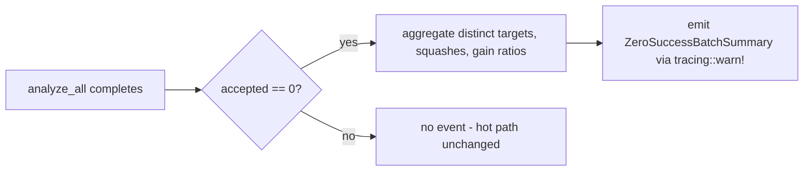

# PR Summary — Issue #1194

## Summary

Adds a structured `ZeroSuccessBatchSummary` observability event so failure
clusters in the input failure cache (e.g. three failures targeting the same
neuron with the same change type, as captured in #1189) are visible without
manual inspection of the cache. Closes #1194.

The summary aggregates over the supplied failure cache when an `analyze_all`
batch finishes with zero accepted candidates, recording the candidate count,
distinct target UUIDs / squashes / change types / variant keys, the
min/median/max of `expectedErrorReduction` and `actualErrorReduction`, and
the `median(actual) / median(expected)` ratio. It is emitted via
`tracing::warn!` with `event = "zero_success_batch"` so downstream tooling
can filter on the event tag without scanning by message text.

## Evidence

This is a backend / observability change with no UI surface — there is
nothing to screenshot. The behaviour is verified end-to-end by the
integration tests listed in **Test Plan**.

The implementation aggregates with fixed-size accumulators (`HashSet`s for
the distinct counts and `Vec`s sized to the cache length for the
medians); no per-`FailureCacheEntry` cloning is performed. Successful
batches skip the aggregation entirely — the orchestration gate
(`maybe_emit_zero_success_batch_summary`) returns immediately when
`accepted_candidates > 0`.

## Test Plan

New integration tests in `tests/issue_1194_zero_success_batch_summary.rs`:

- `zero_success_batch_summary_captures_failure_cluster` — three failures
  against the same neuron / squash / variant collapse to distinct counts of
  `1` and the median ratio reflects the over-estimate (the canonical
  cluster from #1189).
- `zero_success_batch_summary_handles_missing_uuids` — entries lacking
  optional fields contribute to `candidate_count` but not the distinct
  counts.
- `emit_helper_returns_none_for_empty_cache` — empty cache yields no
  event.
- `emit_helper_returns_summary_for_non_empty_cache` — non-empty cache
  yields a summary.
- `no_event_when_at_least_one_candidate_accepted` — gate returns `None`
  when accepted > 0 even if the cache is non-empty.
- `event_emitted_when_zero_accepted_and_cache_non_empty` — gate emits
  when accepted == 0 and cache has entries.
- `summary_serialises_with_camel_case_fields` — JSON serialisation
  produces the documented camelCase field names.
- `target_uuid_parsed_from_target_neuron_info_uuid` and
  `target_uuid_parsed_from_top_level_field` — failure-cache JSON parses the
  new `target_uuid` from either `targetNeuronInfo.uuid` or a top-level
  `targetUuid` field.

Inline unit tests in `src/observability/zero_success_batch.rs` cover the
median computation, non-finite-value skipping, the zero-expected ratio
edge case, and the gating behaviour of `maybe_emit_zero_success_batch_summary`.

`./quality.sh` passes (fmt, clippy, check, test, doc, release build).
