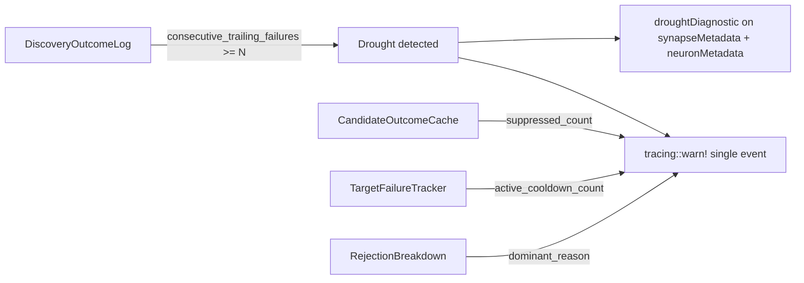

# Drought Diagnostic Log + FFI Metadata (Issue #1202)

## Summary

Adds a structured drought warning that fires when the rolling discovery
outcome log shows N consecutive empty passes. The same payload is attached
to both `synapseMetadata.droughtDiagnostic` and
`neuronMetadata.droughtDiagnostic` in the FFI response so the NEAT-AI
controller can root-cause "no successful candidates for a while" without
re-running analysis under elevated logging.

Closes #1202.

## What changed

- `NEAT_AI_DISCOVERY_DROUGHT_LOG_THRESHOLD` (default `5`) added to
  `src/config/user_facing.rs` with parsing tests covering positive integers,
  zero, negatives, and non-numeric input.
- `CandidateOutcomeCache::suppressed_count(current_epoch)` returns the count
  of failed cache entries still inside the staleness window.
- `TargetFailureTracker::active_cooldown_count(current_epoch)` returns the
  number of targets currently in cooldown.
- New `analysis::drought_diagnostic` module exposes a `DroughtDiagnostic`
  struct (camelCase JSON) and an `emit_drought_diagnostic` helper that
  builds the payload and emits a single structured `tracing::warn!` event.
- `analysis::orchestration::analyze_all` calls the helper once per
  invocation after the discovery mode is decided. The warn fires at most
  once per pass; the payload is attached to both metadata surfaces.
- `SynapseAnalysisMetadata`, `NeuronAnalysisMetadata`, and the matching
  `*Json` FFI types gained an optional `droughtDiagnostic` field
  (`#[serde(skip_serializing_if = "Option::is_none")]`).
- Documentation updated: `docs/FFI_API.md`, `src/config/mod.rs`, and
  `AGENTS.md`.

## Evidence

### Mermaid — drought emission flow

### Test results

- Unit tests for `suppressed_count` and `active_cooldown_count` —
  `tests/issue_1202_drought_diagnostic_helpers.rs` (8 tests, all passing).
- Drought emission helper tests — inline in
  `src/analysis/drought_diagnostic.rs::tests` (3 tests, all passing).
- Config parsing tests — `src/config/mod.rs::tests::drought_log_threshold_*`
  (4 tests, all passing).
- Integration test — `tests/analysis/issue_1202_drought_diagnostic.rs`
  (2 tests):
  - 6 forced-empty passes ⇒ `droughtDiagnostic` populated on both metadata
    surfaces and the structured warn fires exactly once.
  - 4 forced-empty passes ⇒ `droughtDiagnostic` is `None` and no warn
    fires.

`./quality.sh` passes cleanly (fmt, clippy `-D warnings`, build, tests, doc
build, release build).

This is a backend/CLI change with no UI surface — no Playwright screenshot
applies.

## Test Plan

- [x] Unit tests for the two new helpers cover happy path, empty
      cache/tracker, and mixed expired/active entries.
- [x] Inline tests verify `emit_drought_diagnostic` returns `None` below
      threshold, populates fields correctly above threshold, and aggregates
      cache/tracker counts.
- [x] Integration test drives `analyze_all` through 6 forced-empty passes,
      asserting the warn log fires once and the payload is on both metadata
      surfaces.
- [x] Negative integration test confirms 4 trailing failures keeps the
      payload `None`.
- [x] `./quality.sh` passes (lint, type, doc, tests, release build).
