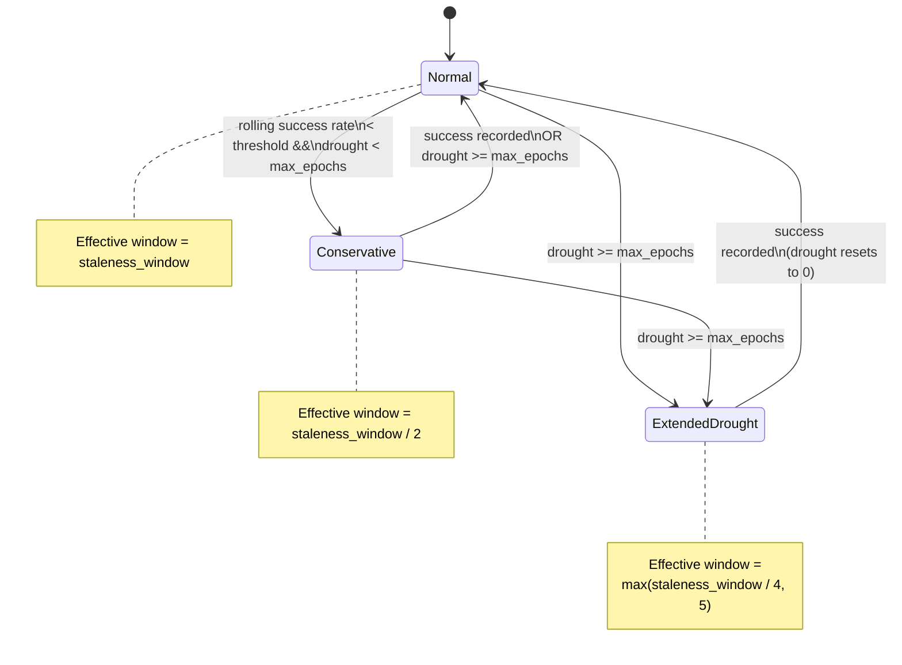

# Issue #1203 — Adaptive candidate-cache staleness window during drought

## Summary

Auto-shrink `CandidateOutcomeCache::staleness_window` when the rolling outcome
log signals a drought, so previously-failed candidates become re-eligible
sooner instead of staying suppressed for the full 100-epoch default while the
pipeline struggles to find any improvement. Closes #1203.

The change is purely on the suppression side of the candidate cache — record,
prune, source-type boost, and serialisation are untouched.

### Effective-window table

| Mode + drought                                      | Effective window                |
|-----------------------------------------------------|---------------------------------|
| `Normal` (or drought below the conservative cap)    | `staleness_window` (100)        |
| `Conservative`, `drought_failures < max_epochs`     | `staleness_window / 2` (50)     |
| `drought_failures >= max_epochs` (extended drought) | `max(staleness_window / 4, 5)` (25) |

### Configuration

Two new env-var-overridable constants in
`src/analysis/constants/candidate_scoring.rs`:

- `STALENESS_CONSERVATIVE_DIVISOR` (default `2`,
  override: `NEAT_AI_DISCOVERY_STALENESS_CONSERVATIVE_DIVISOR`)
- `STALENESS_EXTENDED_DROUGHT_DIVISOR` (default `4`,
  override: `NEAT_AI_DISCOVERY_STALENESS_EXTENDED_DROUGHT_DIVISOR`)

Both divisors are clamped to `[1, 64]` to prevent division-by-zero and
absurd values. An effective window is additionally clamped to a hard floor
of 5 epochs (`STALENESS_WINDOW_FLOOR`).

## Evidence

This is a pure-CLI / backend change with no UI to screenshot.

- Targeted test run: `cargo test --test scoring issue_1203` → **11/11 pass**
- Regression run for the existing Issue #465 suite (whose API call sites
  were updated): `cargo test --test scoring issue_465_candidate` →
  **14/14 pass**
- Full quality gate: `./quality.sh` → **passes cleanly** (shellcheck, deny,
  build, fmt, clippy `-D warnings`, type check, full test suite,
  `cargo doc -D warnings`, release build).

### State diagram

## Test Plan

New tests in `tests/scoring/issue_1203_adaptive_staleness_window.rs`:

- `normal_mode_keeps_full_window` — Normal mode returns the configured 100.
- `conservative_mode_halves_window` — Conservative mode returns 50.
- `conservative_mode_re_enables_failed_candidate_earlier_than_normal_mode` —
  candidate failed at epoch 0 is suppressed at epoch 60 in Normal but
  re-eligible at epoch 60 in Conservative.
- `extended_drought_quarters_window` — drought ≥ `max_epochs` returns 25.
- `extended_drought_honours_floor_of_five` — tiny base window divided below
  5 is clamped to 5.
- `successful_pass_restores_full_window_on_next_call` — drought regime
  returns the quartered window; a follow-up call with `Normal, 0` returns
  the full window.
- `env_var_overrides_conservative_divisor` — env override produces
  `staleness_window / 5`.
- `env_var_overrides_extended_drought_divisor` — env override produces
  `staleness_window / 10`.
- `unparsable_env_vars_fall_back_to_defaults` — junk values do not corrupt
  the divisor.
- `env_var_zero_clamped_to_floor` — `0` is clamped to `1` so we never
  divide by zero.
- `integration_candidate_failed_at_epoch_zero_re_eligible_in_conservative_at_epoch_thirty`
  — explicit acceptance-criteria scenario from the issue.

Updated existing tests in
`tests/scoring/issue_465_candidate_outcome_cache.rs` to thread
`(DiscoveryMode::Normal, 0)` through `is_suppressed`, preserving their
original semantics — they exercise the Normal-mode "full window" branch of
the new adaptive logic.

### API change

`CandidateOutcomeCache::is_suppressed` gained two parameters
(`mode: DiscoveryMode`, `drought_failures: u32`). Callers must supply the
current pipeline mode and drought count so the adaptive window can be
resolved. The only existing call sites were tests, which were updated.
