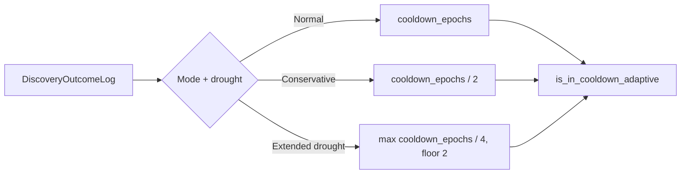

## Summary

Relax `TargetFailureTracker` cooldown thresholds when the rolling outcome log
signals a drought so previously-failing targets re-enter the focus list
sooner. Mirrors the candidate-cache staleness window relaxation (Issue #1203)
so the two adaptive controls compose during a drought instead of locking the
pipeline out of its own search space. Closes #1204.

### What changed

- New methods on `TargetFailureTracker`
  (`src/analysis/target_failure_tracker.rs`):
  - `effective_cooldown_epochs(mode, drought_failures) -> u64` — returns the
    configured window in Normal mode, half the window in Conservative mode,
    and a quarter of the window with a floor of 2 under extended drought
    (`drought_failures >= conservative_mode_max_epochs`).
  - `effective_consecutive_failures(mode, drought_failures) -> u32` — raises
    the trigger threshold by `+1` per regime step under drought (`+1` in
    Conservative, `+2` in extended drought), so fewer targets enter cooldown
    in the first place.
  - `is_in_cooldown_adaptive` and the free-function
    `filter_cooldown_targets_adaptive` plumb mode/drought through the
    existing predicate. Static-threshold call sites (tests, callers without
    mode info) keep working via the original `is_in_cooldown` /
    `filter_cooldown_targets` entry points.
  - Logs a single `tracing::info!` on regime transitions naming the old and
    new effective cooldown.
- New constants and env-var overrides in
  `src/analysis/constants/detection_thresholds.rs`:
  - `COOLDOWN_CONSERVATIVE_DIVISOR = 2`, env override
    `NEAT_AI_DISCOVERY_COOLDOWN_CONSERVATIVE_DIVISOR`.
  - `COOLDOWN_EXTENDED_DROUGHT_DIVISOR = 4`, env override
    `NEAT_AI_DISCOVERY_COOLDOWN_EXTENDED_DROUGHT_DIVISOR`.
  - `COOLDOWN_EPOCHS_FLOOR = 2` (post-divisor floor) and
    `[COOLDOWN_DIVISOR_FLOOR, COOLDOWN_DIVISOR_CEILING] = [1, 64]` clamping
    for the divisor env vars.
- `AnalyzeNeuronsInput` and `AnalyzeSynapsesInput` (in
  `src/ffi_types/requests.rs`) gain an optional
  `discovery_outcome_log: Option<DiscoveryOutcomeLog>` (camelCase, serde
  `default`). Threaded down from `AnalyzeAllInput` in
  `src/analysis/orchestration.rs` so the per-phase cooldown filter can
  consult mode/drought.
- Per-phase cooldown helpers (`apply_target_cooldown` in
  `src/analysis/neuron/preparation.rs` and
  `src/analysis/synapse/orchestration.rs`) now derive mode and
  trailing-failure drought from the threaded outcome log and call the
  adaptive filter. When the log is absent or empty, the static-threshold
  filter is used.
- Env-var documentation table in `src/config/mod.rs` extended with the two
  new variables.

### Adaptive regime table

| Mode + drought                                    | Effective cooldown            | Effective trigger          |
|---------------------------------------------------|-------------------------------|----------------------------|
| `Normal` (or drought below the conservative cap)  | `cooldown_epochs`             | `cooldown_consecutive_failures` |
| `Conservative`, drought `< conservative_mode_max` | `cooldown_epochs / 2`         | `+1`                       |
| drought `>= conservative_mode_max` (extended)     | `max(cooldown_epochs / 4, 2)` | `+2`                       |

## Evidence

- `cargo test --test analysis issue_1204` — 15/15 tests pass covering the
  three regimes, env-var overrides, the integration acceptance criterion
  (target with 3 failures at epoch 0 in cooldown at epoch 15 under Normal,
  released at epoch 15 under Conservative), and the borderline trigger case.
- `cargo test --lib target_failure_tracker` — 10/10 tests pass; new
  `effective_*` unit tests sit alongside the existing 8 cooldown tests.
- `./quality.sh` runs green (fmt, clippy, check, full test suite, doc build,
  release build).

This is a backend/CLI change with no web interface to screenshot.

## Test Plan

- [x] Unit tests for `effective_cooldown_epochs` covering Normal,
      Conservative, extended drought, and the floor-of-2 clamp in
      `tests/analysis/issue_1204_adaptive_target_cooldown.rs`.
- [x] Unit tests for `effective_consecutive_failures` covering Normal,
      Conservative (+1), extended drought (+2), and `u32::MAX` saturation.
- [x] Env-var override tests for both
      `NEAT_AI_DISCOVERY_COOLDOWN_CONSERVATIVE_DIVISOR` and
      `NEAT_AI_DISCOVERY_COOLDOWN_EXTENDED_DROUGHT_DIVISOR`, including
      unparsable values, zero, and the clamping behaviour.
- [x] Integration test confirming a target with three consecutive failures
      at epoch 0 is in cooldown at epoch 15 under Normal but released in
      Conservative mode at the same epoch.
- [x] Unit tests under `src/analysis/target_failure_tracker.rs::tests`
      ensuring the adaptive thresholds match the static values in Normal
      mode and relax in Conservative mode.
- [x] `./quality.sh` passes cleanly.
